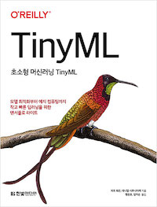
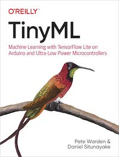
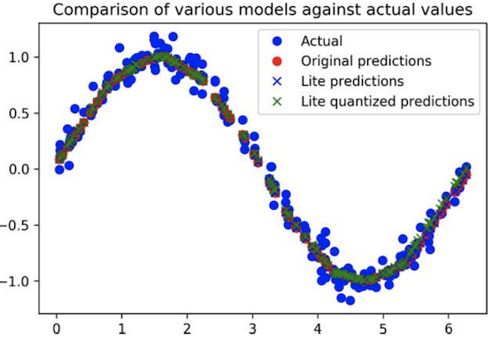
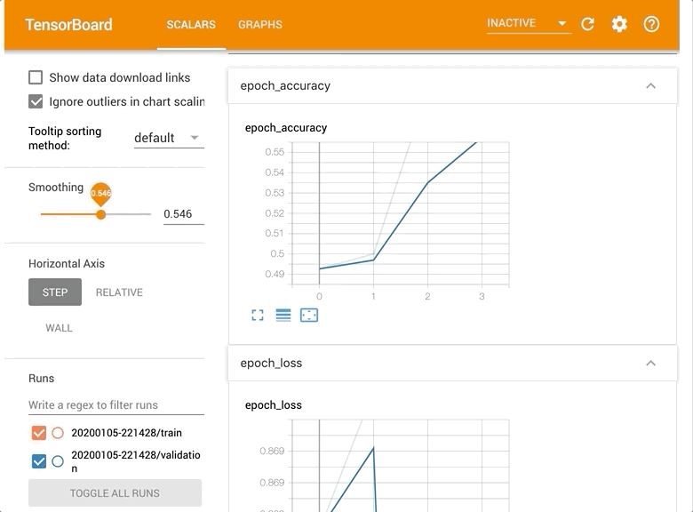
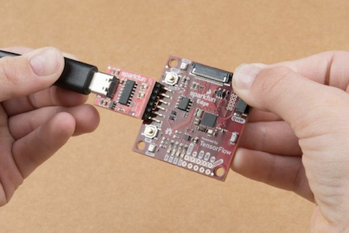

# TinyML: Tensorflow lite for microcontroller

[](https://www.yes24.com/Product/Goods/91879171)

<!--
[](https://learning.oreilly.com/library/view/tinyml/9781492052036/)
-->

TinyML 번역서의 한국 독자들을 위한 한글 소스코드 저장소를 개설하게 되었습니다. 책에서도 명시하고 있지만, 텐서플로우 프로젝트는 업데이트가 활발히 진행되고 있는 프로젝트입니다. 가장 최신 코드는 아래의 영어 원문 코드를 참조하시기 바랍니다.

- TinyML(Tensorflow Lite) <https://oreil.ly/TQ4CC>

## 실습소스코드

### Google Colab 통한 실습
아래의 Jupyter Notebook 파일은 Google Colab과 연결되도록 만들어두었습니다. 이를 통해 책의 주요 딥러닝 모델 학습 코드를 간편하게 실행해 볼 수 있습니다.

- __Ch04: 사인파 예측하는 모델 만들기__ [create_sine_model_ko.ipynb ](https://colab.research.google.com/github/yunho0130/tensorflow-lite/blob/master/tensorflow/lite/micro/examples/hello_world/create_sine_model_ko.ipynb)

    

- __Ch08: 음성 인식 모델 만들기__ [train_speech_model.ipynb](https://colab.research.google.com/github/yunho0130/tensorflow-lite/blob/master/tensorflow/lite/micro/examples/micro_speech/train_speech_model_ko.ipynb)

    
    

- __Ch12: 마술 지팡이 제스쳐 인식하기__ [train_magic_wand_model.ipynb](https://colab.research.google.com/github/yunho0130/tensorflow-lite/blob/master/tensorflow/lite/micro/examples/magic_wand/train/train_magic_wand_model_kor.ipynb)

    
    


### 마이크로컨트롤러 기기를 통한 실습  
기기에서 동작하게 될 소스코드는 본 소스코드 저장소를 직접 다운로드 받은 후 압축을 푼 뒤 아두이노와 같은 마이크로컨트롤러 기기에 업로드 하여 사용할 수 있습니다. 자세한 실습 방법은 책 혹은 아래의 공식개발문서를 참고하세요.

- __소스코드 저장소 다운받기__ [tensorflow-lite-kor-master.zip](https://github.com/yunho0130/tensorflow-lite/archive/master.zip)

    

### 마이크로컨트롤러용 텐서플로우 라이트 (TensorFlow Lite for Microcontrollers)

`마이크로 컨트롤러용 텐서플로우 라이트 (TensorFlow Lite for Microcontrollers)`는 아주 작은 메모리(KB)를 사용하는 기기에서 머신러닝모델을 실행하도록 텐서플로우 라이트(TensorFlow Lite)를 이식한 프레임워크입니다.
- 이 프레임워크에 대해 더 자세히 배우고 싶다면 공식개발문서를 확인하세요. [tensorflow.org/lite/microcontrollers](https://www.tensorflow.org/lite/microcontrollers).

### Project Showcase

### Watch Out Mobile 팀


### 프로젝트 배경 (프로젝트 선정이유, 키워드 및 선정이유)

Watch-out 은 Tensorflow Lite 모델을 이용해 인터넷에 접속이 안되는 상황에서도 작동할 수 있는 아이폰 & 애플워치 어플리케이션입니다. 인식할 수 있는 키워드에는 2020년 9월 기준 "불이야" 와 "수지"가 있습니다. 

"불이야" - 청각장애인들이 화재상황에서 "불이야!"라는 소리를 듣지 못하여 대처가 늦거나 위험에 빠질 수도 있다는 기사 내용을 바탕으로 키워드를 선정하였습니다. 

"수지" -  주변 사람들이 자신의 이름을 부르는 것도 듣지 못한다는 것 또한 불편사항이 될 수도 있다는 생각을 바탕으로 watch-out이 대신 사용자의 이름을 듣도록 하였습니다. 발음하기 쉽고 다른 이름과 헷갈리지 않는 대표적인 이름으로 '수지'를 선택하였습니다.

소스코드는 [여기](https://github.com/yoonseok312/watch-out)를 참고해주세요. 

### Tensorflow-lite Model

- **데이터 준비, 데이터 형식**
    - 기존 모델에 들어있던 데이터를 바탕으로 데이터의 형식과 데이터의 개수를 정하였습니다.  데이터 개수는 한 키워드당 2000개를 목표로 하였고, 데이터 형식은 1초 미만의 wav 파일을 준비하도록 하였습니다. 한 사람당 키워드 별로 200개씩 총 400개의 녹음파일을 준비하였고, 모델이 오버피팅이 되지 않도록 최대한 다양한 사람의 목소리, 다양한 어조와 톤, 빠르기로 녹음을 진행 하였습니다.
- **트레이닝 방식 및 커맨드**
    - 훈련

        train.py를 실행시킬 때 플래그값들을 조절해서 모델을 커스텀화 할 수 있습니다. 여기서 중요한 부분은 다음과 같습니다.

        1. `—model_architecture` 어떤 네트워크를 사용할 것인지 지정하는 플래그. CNN을 기반으로한 여러 변형형태 중 하나를 선택할 수 있다. 본 프로젝트에서는 iOS 예제에서 사용하고 있는 모델인 "conv"모델을 사용하였습니다.
        2. `—wanted_words` 스크립트 상에서 이 인자를 사용해서 우리가 인식하고자 하는 단어를 정의할 수 있습니다. 저희는 bulyiya, suzy를 설정했습니다.
        3. `—data_dir` 훈련에 사용할 데이터가 저장되어 있는 디렉토리. —wanted_words에서 인식하고자 한 단어들은 —data_dir에서 지정한 경로 안에 같은 이름으로 된 디렉토리를 만들고 그 안에 훈련에 사용할 파일들을 저장해야 합니다. 훈련데이터는 16bit-wav의 형식을 따라야 합니다.
        4. `—train_dir` 훈련결과를 저장할 디렉토리. checkpoint 파일이 여기서 지정한 경로에 저장됩니다. 
        5. `—how_many_training_steps` epoch. 데이터를 몇 바퀴 돌려서 학습할 것인지 설정합니다.
    - freeze
        - interpreter 생성에 필요한 .pb파일을 생성합니다.
    - interpreter compile
        - .pb파일을 .tflite파일로 변환합니다. 입출력에 사용하는 array를 지정할 때 주의해야 합니다.
    - inference
        - iOS 앱과 연동하기에 앞서 훈련한 모델의 인식 성능을 python 스크립트를 사용하여 확인할 수 있습니다.
        1. pb: .pb를 로드하면 "tensorflow 그래프를 거쳐서 inference합니다. tensorflow 그래프는 훈련 단계에서 데이터가 흐르는 방식과 동일한 입출력구조를 갖습니다. 데이터 입력시 네트워크의 각 노드에서의 동작을 확인하고자 할 때 유리합니다.
        2. tflite: .tflite를 로드하면 컴파일된 interpreter를 거쳐서 inference합니다. 실제 어플 또는 장비에 배포했을 때 데이터가 흐르는 방식과 동일한 입출력구조를 갖습니다. 실제 목표로 하는 구동환경에서의 연동성을 확인하고자 할 때 유리합니다. 
- **Issue**
    - Tensorflow version issue

        2.x version부터는 tflite_converter에서 saved_model의 변환만을 지원하기 때문에 기존 모델 생성에서 문제가 발생하였습니다.

        speech_commands 예제는 1.x tensorflow에 맞춰서 개발되었습니다. 따라서 speech_commands 예제에서 사용하는 모델 훈련결과 저장방식은 checkpoint입니다. 

        현재(2020.09) tensorflow 설치시 특별한 설정을 하지 않으면 2.x version tensorflow가 설치됩니다. 따라서 교재에서 사용하는 명령어들이 일부 작동하지 않을 수 있습니다.

        - SOLUTION 1: checkpoint를 saved_model형식으로 변환
        - **SOLUTION 2: tensorflow 1.x대로 다운그레이드 (채택)**
    - Input format issue (data count, rank)
        - iOS 예제에서는 길이 16000의 array와 스칼라로 구성된 rank2 tensor를 input으로 사용하기 때문에 interpreter 생성단계에서 주의해야 함

        훈련시킨 모델을 tflite로 변환하는데까지는 문제가 없었지만, iOS handler와 문제가 있었습니다. iOS의 ModelDataHandler.swift가 요구하는 data count는 64000으로, 이 값은 바꿀 수 없는 값임을 확인하였습니다. 따라서 저희는 모델을 생성하는 코드를 변경하여, models.py에 있는 create_conv_model(fingerprint_input, model_settings, is_training) 함수 일부분을 다음과 같이 수정하였습니다.

        ```python
        max_pool = tf.nn.max_pool2d(input=first_dropout,
                                      ksize=[1, 1, 4, 1],
                                      strides=[1, 1, 4, 1],
                                      padding='SAME')
        ```

    - Recognition error & Rank issue

### Application

아이폰 앱과 워치 앱을 구동시키면 스플래시 화면 이후 메인 화면이 나타나게 됩니다. 메인 화면에서 토글을 키면 입력되는 소리가 텐서플로우 모델로 들어가 inference 과정을 거칩니다. inference 후 아이폰과 워치에 각각 인식한 단어를 전해주는 알림이 전해지고, 알림은 5초 후에 꺼지거나 사용자가 탭하면 꺼집니다. 위험한 소리의 경우, 사용자가 곧바로 119에 전화할 수도 있습니다. 또한, 설정 페이지에서 인식하고 싶은 단어와 무시하고 싶은 단어를 설정할 수 있습니다. 

- iOS → Watch 간의 데이터 전송
    - MainViewModel → WCSession → WatchEnvironment
    - iOS의 MainViewModel에서 tensorflow 모델을 구동하고, 그 결과값을 WCSession을 이용해 watch에게 넘겨줍니다. Watch는 WCSession에서 받은 텍스트를 WatchEnvironment라는 Watch 전체에서 쓸 수 있는 변수로 선언하여 WatchView 화면에 나타날 수 있게 했습니다.
- viewcontroller → viewmodel / swiftUI 리펙터링
    - 기존 tensorflowlite-ios 어플리케이션 및 타 레퍼런스의 경우 대부분 view controller 와 UIKit 을 이용하는 방식으로 되어 있기에, 최신 UI/UX 적용을 위해 SwiftUI 와 MVVM 아키텍쳐로 코드 리펙터링을 진행하였습니다.

### TFLite Mobility 팀


### 프로젝트명


- Watching U
  - Helmet Detection for mobility   

### 프로젝트 개요   


- 이 프로젝트는 전동킥보드 탑승자의 헬멧 착용 여부를 탐지하고,  
착용하지 않은 경우 경고 알람을 내보내는 Tiny ML 디바이스를 만드는 프로젝트입니다.


- 헬멧 미착용 상태로 전동 킥보드를 탑승하는 것이 안전상의 이슈로 커져가고 있는 현 상황에서,  
  각각의 개별적인 킥보드를 단속하기 힘들다는 문제를 해결하기 위해 고안되었습니다.


- 전동 킥보드에 부착된 디바이스 카메라에 헬멧 미착용 여부가 탐지되면, "헬멧을 쓰세요" 라는 음성이 출력되고,  
  헬멧을 착용한 것으로 판단되면, "헬멧을 잘 쓰셨군요"라는 음성이 출력됩니다.
  
- 보다 자세한 내용은 [여기](https://github.com/yunho0130/tensorflow-lite/tree/master/mobilityteamproject)를 참고해주세요.

### 진행 과정

- Tensorflow-lite Model

  - (Step1) Helmet data processing
  	- 실습 코드
  		- [kaggle-data-processing.ipynb](https://colab.research.google.com/github/yunho0130/tensorflow-lite/blob/master/mobilityteamproject/helmet-data-preprocessing/kaggle-data-processing.ipynb)
  		
  	- 설명

  		- 여러 경로로부터 수집한 데이터를 사용할 수 있는 형태로 만드는 전처리 과정
  		- 더 자세한 설명을 원하시면 [이 곳](https://github.com/yunho0130/tensorflow-lite/tree/master/mobilityteamproject/Step1_helmet_data_processing)을 클릭해주세요
  		
  - (Step2) Model training and tflite convert
    - 실습 코드    
      - [helmet_classification_for_tinyMLproject_part1.ipynb](https://colab.research.google.com/github/yunho0130/tensorflow-lite/blob/master/mobilityteamproject/modeling-with-code/helmet_classification_for_tinyMLproject_part1.ipynb)
      - [helmet_classification_for_tinyMLproject_part2.ipynb](https://colab.research.google.com/github/yunho0130/tensorflow-lite/blob/master/mobilityteamproject/modeling-with-code/helmet_classification_for_tinyMLproject_part2.ipynb)
      - [helmet_classification_for_tinyMLproject_part3.ipynb](https://colab.research.google.com/github/yunho0130/tensorflow-lite/blob/master/mobilityteamproject/modeling-with-code/helmet_classification_for_tinyMLproject_part3.ipynb)
      
	- 설명
		- Teachable machine 또는 Keras를 통하여 모델을 학습시키고 TFLite로 변환하는 과정 
	    - 더 자세한 설명을 원하시면 [이 곳](https://github.com/yunho0130/tensorflow-lite/tree/master/mobilityteamproject/Step2_Model_training_and_tflite_convert)을 클릭해주세요
	    
- Application
 - (Step3) Raspberry Pi Porting 
  	- 실습 참고 링크
  		- [README 링크](https://github.com/yunho0130/tensorflow-lite/tree/master/mobilityteamproject/Step3_Raspberry_Pi_Porting)  
  	
  	- 설명
  		- MCU 중 라즈베리파이에 헬멧 탐지 및 음성 출력 모델을 Porting 하는 과정
  		- 더 자세한 설명을 원하시면 [이 곳](https://github.com/yunho0130/tensorflow-lite/tree/master/mobilityteamproject/Step3_Raspberry_Pi_Porting)을 클릭해주세요


### Collaborators

> yunho0130(맹윤호), harheem(김하림), prograsshopper(서미지), 0ys(공예슬), yoonseok312(양윤석), dlqh406(이보성), Karmantez(김창윤), kyunghwanleethebest(이경환), new-w(최예진), su-minn(전수민), ProtossDragoon(이장후), yammayamm(김도연), ufo8945(송보영), pmcsh04(조승현), sanghunkang(강상훈)


* TinyML: Tensorflow lite for microcontroller   컨트리뷰션은 아래의 `Github 가이드라인`을 따릅니다.
    - Github 공식 오픈소스 컨트리뷰션 가이드라인 <https://opensource.guide/ko/how-to-contribute/>

### 인용 Citation
본 레파지토리나 <초소형 머신러닝 TinyML>의 내용을 인용하실 때에는 아래의 인용정보를 사용하시면 편리합니다.
```
@book{TinyML-Machine-Learning-with-TensorFlow-Lite,
  title={초소형 머신러닝 TinyML: 모델 최적화부터 에지 컴퓨팅까지 작고 빠른 딥러닝을 위한 텐서플로 라이트},
  author={피트 워든, 대니얼 시투나야케， 맹윤호(역), 임지순(역)},
  isbn={9791162243411},
  url={https://www.hanbit.co.kr/media/books/book_view.html?p_code=B3963656224},
  year={2020},
  publisher={한빛미디어}
}
```
