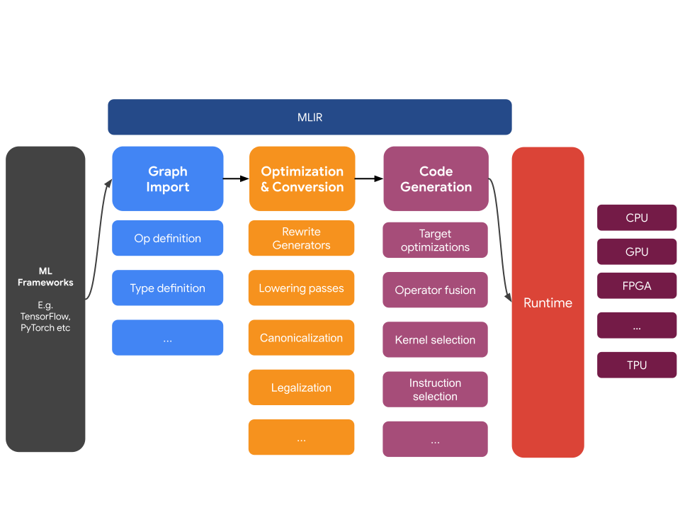

# MLIR

## Overview

MLIR, or Multi-Level Intermediate Representation, is a representation format
and library of compiler utilities that sits between the model representation
and low-level compilers/executors that generate hardware-specific code.

MLIR is, at its heart, a flexible infrastructure for modern optimizing
compilers. This means it consists of a specification for intermediate
representations (IR) and a code toolkit to perform transformations on that
representation. (In compiler parlance, as you move from higher-level
representations to lower-level representations, these transformations can be
called “lowerings”)

MLIR is highly influenced by [LLVM](https://llvm.org/) and unabashedly reuses
many great ideas from it. It has a flexible type system, and allows
representing, analyzing and transforming graphs combining multiple levels of
abstraction in the same compilation unit. These abstractions include TensorFlow
operations, nested polyhedral loop regions, and even LLVM instructions and fixed
hardware operations and types.

We expect MLIR to be of interest to many groups, including:

*   Compiler researchers and implementers looking to optimize performance and
    memory consumption of machine learning models
*   Hardware makers looking for a way to connect their hardware to TensorFlow,
    such as TPUs, portable neural hardware in phones, and other custom ASICs
*   People writing language bindings that want to take advantage of optimizing
    compilers and hardware acceleration.

The TensorFlow ecosystem contains a number of compilers and optimizers that
operate at multiple levels of the software and hardware stack. We expect the
gradual adoption of MLIR to simplify every aspect of this stack.

