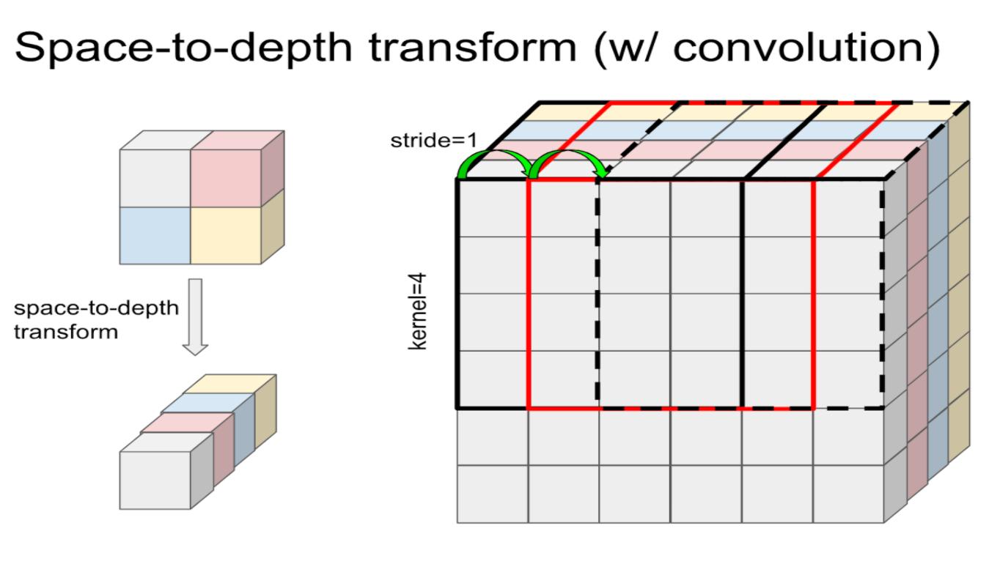

# Automatic Space to Depth Transform in MLIR Bridge

Author: wangtao@, yuanzx@, hinsu@, lyandy@, chiachenc@, aminim@, jpienaar@,
dehao@

## TL;DR

_This document describes an automatic space to depth transform for the first
convolution in the new MLIR bridge to improve MXU efficiency of low batch size
convolutions._

## Background

For image models, the first layer is usually not MXU friendly as it has a
feature size of 3. This results in poor performance especially with small batch.

One way to address this issue is to use the `space-to-depth` transform. This
optimization tiles the 2x2 space dimensions to the feature dimension so that the
feature dimension becomes 3\*4=12, which is more MXU friendly. In order to make
this optimization efficient, the shape of the weight needs to be padded and
transposed to the shape that the convolution emitter expects. The input also
needs to be transposed on the host and padded on the device to make the
convolution efficient. Although a 2x2 space-to-depth transform works only when
the first convolution has a stride of 2, many image models, ResNet-like in
particular, have a stride-2 convolution in the first layer.

Space to depth helped models such as MaskRCNN, SSD and I3D gain more than 2X
speedup and reduce memory usage in the first convolution.

The first convolution in many image models, including ResNet or ResNet-like, is
a (kernel=7, stride=2) 2D convolution. The input of the convolution is images,
which usually has RGB channels. The input of this first convolution is of shape
[batch\_size, height, width, 3] and the kernel size is [kernel\_size,
kernel\_size, 3, out\_channel]. Space to depth is to transform this first
convolution's input to [batch\_size, height // stride, width // stride, 3 \*
stride \* stride] and the kernel to [kernel\_size // stride, kernel\_size //
stride, 3 \* stride \* stride, out\_channel] to improve TPU MXU utilization.



This optimization can be automatically done by the graph optimizer where weight
transformation is done at variable loading time and the input transformation is
done for every inference invocation. A further optimization can fuse this (at
host) with the double transpose to minimize memory operation on host.

## Proposed Method

**block\_size** is defined as the number of space sizes transformed to the depth
dimension. _stride % block\_size == 0_ and _stride >= block\_size_ is required
to do the transform. There are three parts of automatically space to depth
transformation:

1.  Transform input on the host.

    Space-to-depth performs the following permutation, which is equivalent to
    `tf.nn.space_to_depth`.

    ```python
    images = tf.reshape(images, [batch, h // block_size, block_size,
                               w // block_size, block_size, c])
    images = tf.transpose(images, [0, 1, 3, 2, 4, 5])
    images = tf.reshape(images, [batch, h // block_size, w // block_size,
                               c * (block_size ** 2)])
    ```

    `SpaceToDepthOp` can be called on the host to perform the transform.

1.  Weight Transformation

    Weight Transformation is similar to Input Transform. Weight transform is
    needed to apply space to depth optimization for a model that needs to load a
    pre-train checkpoint. This transform can be done on the host or TPU device
    based on the cost. As the size of the kernel is relatively small, this won't
    add additional cost to TPU device time. Below is the logic to transform the
    kernel of shape [7, 7, 3, 64] to [4, 4, 12, 84].

    ```python
    conv0 = tf.compat.v1.layers.Conv2D(
     filters=filters,
     kernel_size=kernel_size,
     strides=2,
     padding=('SAME' if strides == 1 else 'VALID'),
     use_bias=False,
     kernel_initializer=tf.variance_scaling_initializer(),
     data_format=data_format)

    # Use the image size without space-to-depth transform as the input of conv0.
    batch_size, h, w, channel = inputs.get_shape().as_list()
    conv0.build([
     batch_size, h * space_to_depth_block_size, w * space_to_depth_block_size,
     channel // (space_to_depth_block_size**2)
    ])

    kernel = conv0.weights[0]
    # [7, 7, 3, 64] --> [8, 8, 3, 64]

    kernel = tf.pad(
     kernel,
     paddings=tf.constant([[1, 0], [1, 0], [0, 0], [0, 0]]),
     mode='CONSTANT',
     constant_values=0.)
    # Transform kernel follows the space-to-depth logic: https://www.tensorflow.org/api_docs/python/tf/nn/space_to_depth)
    kernel = tf.reshape(
     kernel,
     [4, space_to_depth_block_size, 4, space_to_depth_block_size, 3, filters])

    kernel = tf.transpose(kernel, [0, 2, 1, 3, 4, 5])
    kernel = tf.reshape(kernel, [4, 4, int(channel), filters])
    kernel = tf.cast(kernel, inputs.dtype)
    ```

    If kernel\_size % block\_size != 0, padding is needed for the weight before
    transform, input of Convolution needs to be padded as well.

1.  Rewrite the first convolution

    Need to rewrite the first convolution's shape of input from [batch\_size,
    height, width, 3] to [batch\_size, height // block\_size, width //
    block\_size, 3 \* block\_size \* block\_size] and kernel shape from
    [kernel\_size, kernel\_size, 3, out\_channel] to [kernel\_size //
    block\_size, kernel\_size // block\_size, 3 \* block\_size \* block\_size,

    This is the proposed workflow for automatic space to depth transformation.
    All the transformations will be triggered in a MLIR SpaceToDepthRewritePass,
    this Rewrite pass will be triggered before TPURewrite so that no metadata
    rewrite is needed.

*   First, the rewrite pass will walk through all the convolutions in func of
    tf\_device::LaunchOp and get the first Convolution and its shape;
*   Second, the rewrite pass will apply transformations to the first
    convolution, the padding before the first convolution, first convolution's
    filters and its Conv2DBackPropFilter;
*   At last, the rewrite pass will insert SpaceToDepthOp after IteratorGetNext
    where the iterator's result has the same shape as the first convolution's
    input.

#### Pseudo MLIR code before and after RewritePass

```mlir
// Example: original program:
//
module {
   func @while_body {
     %input = "tf.IteratorGetNext"(...) {device = "/CPU:0"}:
              -> tensor<2x224x224x3xf32>
     %device_launch = "tf_device.launch_func"(%input,...) {func = @_func,...)
     return ...
   }
   func @_func(%input: tensor<2x224x224x3xf32>,
               %filter: tensor<7x7x3x64xf32>) {
     %6 = "tf.Conv2D"(%input, %filter)  {strides = [1, 2, 2, 1]}:
                 (tensor<2x230x230x3xf32>, tensor<7x7x3x64xf32>) ->
      tensor<2x112x112x64xf32>
   }
}

// With this pass, the program will be transformed into:
module {
   func @while_body {
     %input = "tf.IteratorGetNext"(...) {device = "/CPU:0"}
               -> tensor<2x224x224x3xf32>
     %space_to_depth = "tf.SpaceToDepth"(%input) {block_size = 2, ...}:
        (tensor<2x224x224x3xf32>) -> tensor<2x112x112x12xf32>
     %device_launch = "tf_device.launch_func"(%space_to_depth,...) {func = @_func,...)
     return ...
   }
   func @_func(%input: tensor<2x112x112x12xf32>,
              %filter: tensor<7x7x3x64xf32>) {
     %filter_transform = "tf.Pad/tf.Transpose/tf.Reshape"(%filter):
       tensor<7x7x3x64xf32>) -> tensor<4x4x12x64xf32>
     %conv = "tf.Conv2D"(%input, %filter_transform) {strides = [1, 1, 1, 1]}:
       (tensor<2x112x112x12xf32>, tensor<4x4x12x64xf32>) ->
       tensor<2x112x112x64xf32>
   }
}
```

### SpaceToDepth Trigger Condition

Space to depth will only be triggered when batch size is small and the first
convolution channel size is small. Stride of the convolution should be bigger
than 1 as well. A cost model will be built that takes input shape and host cost
into consideration to trigger the transformation. There will be a flag to
disable this feature as well.

### Fuse SpaceToDepth with Automatic Double Transpose

The transpose and reshape op in SpaceToDepthOp on TPU hosts may cause image
model to be infeed bound. To reduce host time, space to depth transform can be
fused with `automatic double transpose` to reduce extra overhead on the host.

### Extend from Conv2D to Conv3D

SpaceToDepth not only helps with 2D image models but also 3D image models such
as I3D. The plan is to apply automatic space to depth for Conv2D as the first
step. After Conv2D is well tested, will generalize this technique to Conv3D.
