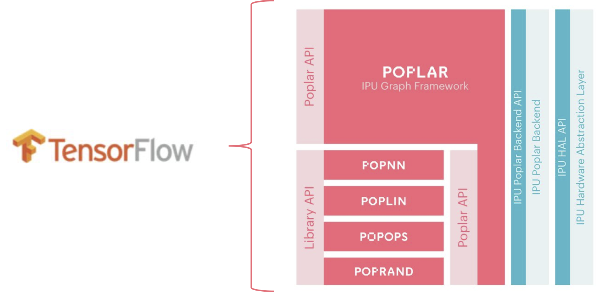
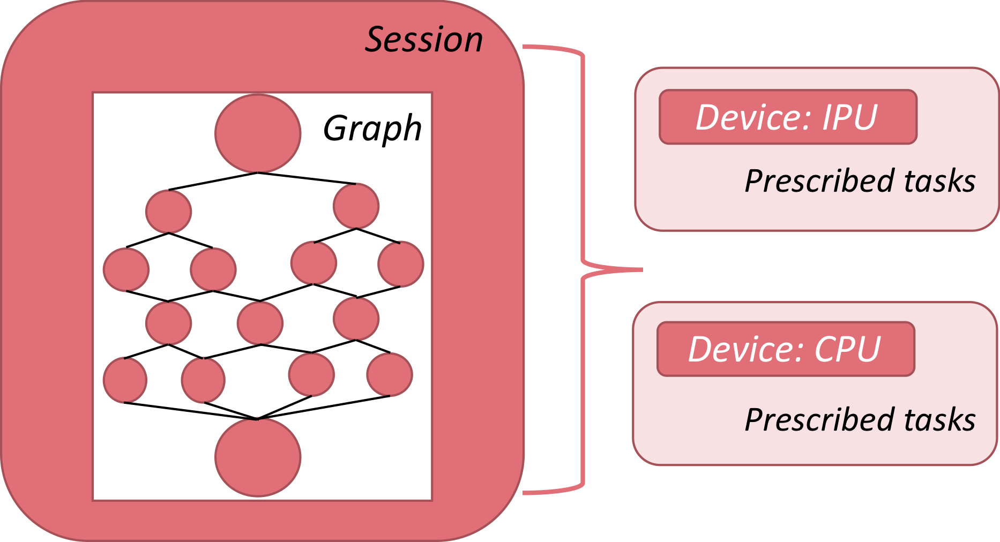
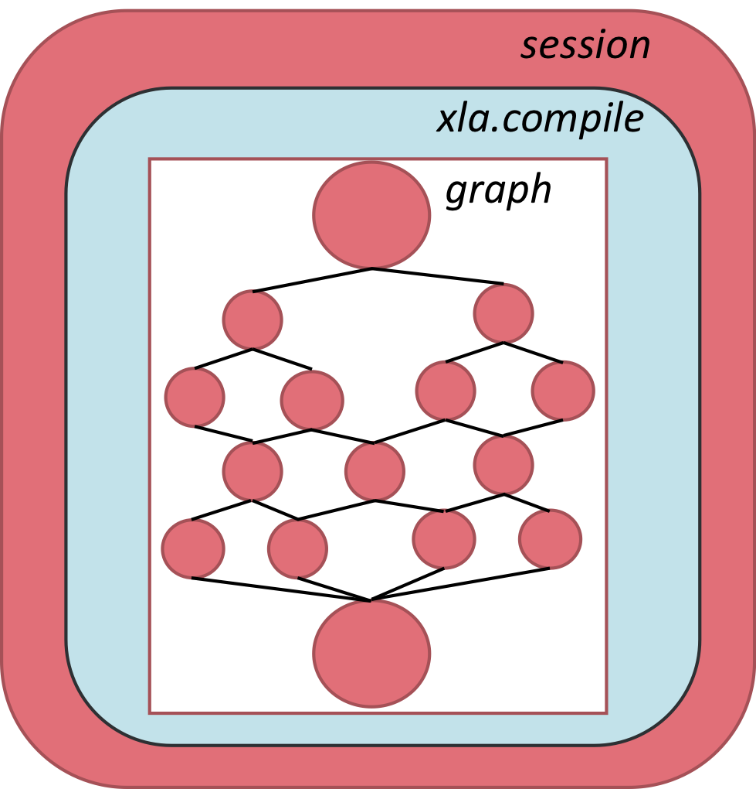
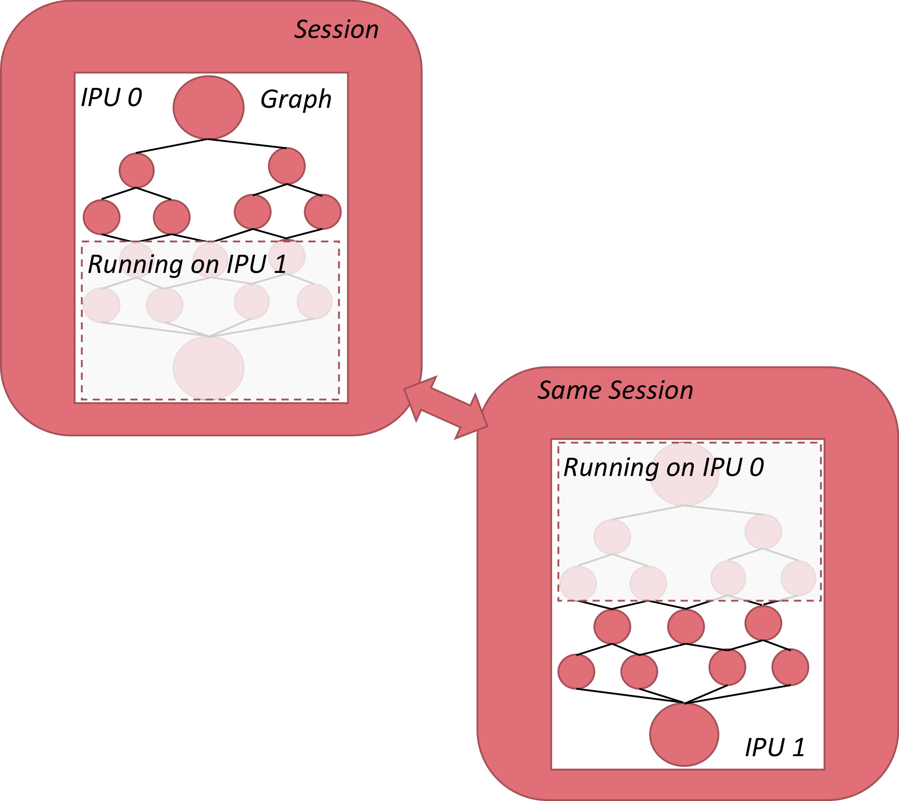

Tensorflow
----------

Tensorflow is a powerful graph-modeling framework that can be used for the
development, training and deployment of deep learning models. In the Graphcore
software stack, Tensorflow sits at the highest level of abstraction where Poplar
and PopLibs interface Tensorflow to actual IPU operations:

    Tensorflow abstraction in relation to Poplar and the IPU

For the discussion that follows, the three key concepts of graph, session and
device as well as their functional interdependency are important to review.

    Interdependency between session, graph and device in Tensorflow

Graph
    A computational graph is the connectivity framework of a deep learning
    model, where nodes are operators and edges are the data streams the connect
    them. Building a deep learning model in Tensorflow is the functional
    equivalent of designing a graph, where specified layer operations, (e.g.
    fully-connected layers), are nodes, and the sequence and connectivity of
    layers, (e.g. a convolutional layer followed by max-pooling), prescribe the
    edges.

Session
    A session is the computational platform that encapsulates a graph. It
    handles data flow into and out of the graph, variable initialization,
    model/weight storage and weight restoration along with a number of other
    operations that are required to manage the computational task.

Device
    The device is the construct that identifies the hardware to which a session
    is ported; e.g. IPU, CPU, TPU, etc. In many of the applications targeting
    the IPU, it will be helpful to segregate task between the CPU and IPU to
    leverage those aspects of the computation that they are each ideally suited
    to undertake.

In the sections that follow, these three concepts will form a recurrent theme in
building and deploying models from Tensorflow.

There are a number of references, user guides, model repos and texts that can
prove valuable in learning the framework. See the :ref:`references-section`
section.

Preliminary Graphs
~~~~~~~~~~~~~~~~~~

The focus now is to implement our first basic graphs targeting the IPU. The
first step will be a straightforward additive graph with nothing save the
fundamental components required for running on an IPU. From there, we add the
*XLA* construct, which is required for a number of Tensorflow operators.
Finally, we add the concept of *sharding*, in which we take our first steps to
model parallelism by splitting a basic graph across four IPUs and consolidate
calculations spread across separate IPUs to produce a single final result.

Basic Graph
~~~~~~~~~~~

We begin with the most humble of aspirations: the ability to add.

.. code-block:: python
    :linenos:

    import tensorflow as tf
    import numpy as np
    from tensorflow.contrib import ipu
    from tensorflow.contrib.ipu.python.ops import ipu_scope

    # Configure arguments for targeting the IPU
    cfg = ipu.utils.create_ipu_config(profiling=True, use_poplar_text_report=True)
    cfg = ipu.utils.set_ipu_model_options(cfg, compile_ipu_code=False)
    cfg = ipu.utils.auto_select_ipus(cfg, 1, sharded=True)
    ipu.utils.configure_ipu_system(cfg)

    with tf.device("cpu"):
        pa = tf.placeholder(np.float32, [2], name="a")
        pb = tf.placeholder(np.float32, [2], name="b")
        pc = tf.placeholder(np.float32, [2], name="c")

    def basic_graph(pa, pb, pc):
        # Do basic addition with tensors
        o1 = pa + pb
        o2 = pa + pc
        simple_graph_output = o1 + o2
        return simple_graph_output

    with ipu_scope("/device:IPU:0"):
        result = basic_graph(pa, pb, pc)

    with tf.Session() as sess:
        # Run the graph through the session feeding it an arbitrary dictionary
        result = sess.run(result, feed_dict={pa: [1., 1.], pb: [0., 1.], pc: [1., 5.]})
        print(result)

Let's review the various key sections of the code as they are presented. In
lines *1-4* are the basic import statements, two of which pertain to the IPU
specifically. Line *3* imports the *ipu* API, which will be the main interface
to set configuration options for the IPU session run. *ipu_scope* is a helper
function that insures the device and resource scopes are set, (i.e. the hardware
is properly initiated when called by the script).

In lines *7-10*, basic configuration options are being defined. In line *7*,
boolean flags are passed to *create_ipu_config*, which results in turning on
*profiling* and *use_poplar_text_report*. *profiling* enables trace event
logging on the IPU, which will monitor operations on the tile architecture of
the chip, disclosing a detailed description of the session as it runs on
hardware . (Greater details of this trace event report will be discussed in the
OOM-debugging section.) *use_poplar_text_report* configures the textual nature
of the generated report, making it more readable for debugging purposes.

In line 8, we are setting options for *set_ipu_model_options*, which consists of
one boolean flag: *compile_ipu_code*. If set to true, Poplar will compile code
that will emulate IPU hardware, which will then be deployed to run on host; i.e.
the CPU. When using *IPU_Model* over actual IPU hardware, the runtime operations
will behave exactly as they would on hardware, with the pivotal exception of
ignoring the actual memory limitations of the IPU and run on the host's
available system memory. This makes the *IPU_Model* an important tool in
debugging OOM-related issues, which shall be touched upon shortly. For now, we
are instructing the API to compile the code to enable running on *IPU_Model* if
so desired, but to actually run on the emulator vs actual hardware, the
environment variable *TF_POPLAR_FLAGS='--use_ipu_model'* would have to be set,
as in

::

    # Using IPU model vs IPU hardware
    if self.base_dictionary['ipu_model']:
        os.environ['TF_POPLAR_FLAGS'] = '--use_ipu_model'

In line 9, the *auto_select_ipus* interface allows for selection of available
IPUs on a server. In this instance, the number of IPUs selected is 1, but can
be changed to any number between 1 and 16 since in a Cauldron-based system,
there are 8 C2 cards installed, each with 2 IPUs. This option will be more
critical when we explore sharding, in which a single graph is segregated into
separate sections, each section targeting a distinct IPU.

In line *12*, the CPU is being prescribed the tasks of setting tensor
placeholders for our graph, which in this case are three vectors of dimension
*2*.

In line *18*, the graph is defined, which returns a tensor representing the
specified sum.

Line *26* uses the IPU helper function to build the graph on the IPU, and so
when the Tensorflow session is initiated and the graph is processed, it will
run on hardware. The result gives

::

    ... [VARIOUS OUTPUT LINES FROM SCRIPT]...
    ...: I tensorflow/compiler/plugin/poplar/driver/executor.cc:660] Device /device:IPU:0 attached to IPU: 0
    [3. 8.]

Beyond summing the vectors correctly, the line directly preceding informs us
that the targeted device was the IPU, and the index of the actual IPU that ran
the graph was IPU *0*. It is noted that *"/device:IPU:0"* in the script is an
identifier for the IPU, and so when using *auto_select_ipus*, the actual IPU
selected to run the graph may not necessarily by *IPU 0*, and could be any of
the other IPUs that are free and available on the server. More on this in the
sharding discussion.

XLA Graph
~~~~~~~~~

The previous script was very basic graph that consisted of the summation of
three vectors and published the results of a forward pass. For certain
applications, it will be necessary to incorporate control flow structures, as in
conditionals of the nature of *if* or *while* statements. Certain recurrent
neural network (RNN) layers and long-short term memory (LSTM) cells have
conditionals implicitly defined in their source code. In those cases, it will be
necessary to use the *XLA* library to define the graph. *XLA* is an optimized
linear algebra library that interfaces the graph to a set of optimization
parsers that render highly efficient computation sets.

Using *XLA* has certain restrictions, the most pertinent of which for the
current discussion is that the dimensions of all tensors involved in the
computational graph must be fully defined at compile time. Dealing with this
restriction can at times require some meticulous refactoring of placeholders or
input tensors, (especially when dealing with mini-batch processing), but does
not constitute a significant development overhead.

The entry way into the *XLA* library is through *xla.compile()*, which will take
a graph along with a feed dictionary for input tensors and return a tensor set.
*xla-compile* sits between the graph definition and the session construct, as in

    *xla.compile* in relation to a session and graph

It is noted that in most IPU-specific implications, it is most likely that an
entire graph will be parsed through *xla.compile*, but it is possible to compile
only a portion of a graph and then assimilate the resulting tensor set from
*xla* with non-*xla* graph sections. Further details of *xla-compile* are
available here:

https://www.tensorflow.org/xla/tutorials/xla_compile

Let's now build on our previous Tensorflow script by adding *xla.compile* to the
session definition.

.. code-block:: python
    :linenos:

    import tensorflow as tf
    import numpy as np
    from tensorflow.contrib.compiler import xla
    from tensorflow.contrib import ipu
    from tensorflow.contrib.ipu.python.ops import ipu_scope

    # Configure argument for targetting the IPU
    cfg = ipu.utils.create_ipu_config(profiling=True, use_poplar_text_report=True)
    cfg = ipu.utils.set_ipu_model_options(cfg, compile_ipu_code=False)
    cfg = ipu.utils.auto_select_ipus(cfg, 1, sharded=True)
    ipu.utils.configure_ipu_system(cfg)

    with tf.device("cpu"):
        pa = tf.placeholder(np.float32, [2], name="a")
        pb = tf.placeholder(np.float32, [2], name="b")
        pc = tf.placeholder(np.float32, [2], name="c")

    def basic_graph(pa, pb, pc):
        # Do basic addition on tensors
        o1 = pa + pb
        o2 = pa + pc
        simple_graph_output = o1 + o2
        return simple_graph_output

    with ipu_scope("/device:IPU:0"):
        xla_result = xla.compile(basic_graph, [pa, pb, pc])

    with tf.Session() as sess:
        # Base run
        result = sess.run(xla_result, feed_dict={pa: [1., 1.], pb: [0., 1.], pc: [1., 5.]})

        print(result)

The script has now gone from calling *basic_graph* directly, to feeding it as
the graph input to *xla.compile*, which takes the graph along with the
corresponding placeholders as input. It is noted that at line *28*, placeholders
are being fed to *xla.compile* whose dimensions have been defined on the CPU in
lines *14* through *16*, but the actual values of these tensors are not defined
until the *session.run* at line 33. i.e., the *dimensions* of the placeholders
are the critical component to *xla.compile* so that the graph can be parsed
correctly at compile time.

Given that this graph and the one given in the previous section are the same, it
is apparent that *xla.compile* is not required to perform the desired sum. That
said, if

::

    def basic_graph(pa, pb, pc):
        # Do basic addition on tensors
        o1 = pa + pb
        o2 = pa + pc
        simple_graph_output = o1 + o2
        return simple_graph_output

where to be replaced with

::

    def while_loop_graph(pa):
            c = tf.constant(0)

            def body_of_while_loop(i):
                return i+1

            cond = lambda i: i < 10
            loop = tf.while_loop(cond, body_of_while_loop, [c])
            square = pa * pa
            return loop, square, tf.no_op()

then *xla.compile* would be strictly required given the use of the
*tf.while_loop()* conditional statement.

Sharding Graph
~~~~~~~~~~~~~~

The final script of this introductory series focuses on sharding: the process of
splitting a graph across multiple IPUs. In essence, the session continues to be
a single entity, so that the graph construct is treated as a single model, but
distinct portions of the graph live on different IPUs, as illustrated below:

    Sharding across two IPUs

Let's now return to our basic script and add the sharding component.

.. code-block:: python
    :linenos:

    import tensorflow as tf
    import numpy as np
    from tensorflow.contrib.compiler import xla
    from tensorflow.contrib import ipu
    from tensorflow.contrib.ipu.python.ops import ipu_scope
    from tensorflow.compiler.plugin.poplar.ops import gen_ipu_ops

    cfg = ipu.utils.create_ipu_config(profiling=True, use_poplar_text_report=True)
    cfg = ipu.utils.set_ipu_model_options(cfg, compile_ipu_code=False)
    # Request 4 IPUs to run the model
    cfg = ipu.utils.auto_select_ipus(cfg, 4, sharded=True)
    ipu.utils.configure_ipu_system(cfg)

    with tf.device("cpu"):
        pa = tf.placeholder(np.float32, [2], name="a")
        pb = tf.placeholder(np.float32, [2], name="b")
        pc = tf.placeholder(np.float32, [2], name="c")

    # Define a trace event
    with tf.device('cpu'):
        report = gen_ipu_ops.ipu_event_trace()

    # Distribute the computation across four shards
    def sharded_graph(pa, pb, pc):
        with ipu.ops.ipu_shard(0):
            o1 = pa + pb
        with ipu.ops.ipu_shard(1):
            o2 = pa + pc
        with ipu.ops.ipu_shard(2):
            o3 = pb + pc
        with ipu.ops.ipu_shard(3):
            out = o1 + o2 + o3
            return out

    with ipu_scope("/device:IPU:0"):
        result = xla.compile(sharded_graph, [pa, pb, pc])

    with tf.Session() as sess:
        # sharded run
        result = sess.run(result, feed_dict={pa: [1., 1.], pb: [0., 1.], pc: [1., 5.]})

        print(result)

Focusing on the sharding facets of this new script, line *11* uses
*auto_select_ipus* to select 4 separate IPUs for the task. This will allow the
script to go through the IPUs currently available to the host, determine which
are being utilized and which are free, and then subscribe to those IPUs that are
available.

In lines *26-35*, the standard sum graph is defined, (with the addition of one
more sum for shard *2*), and now each portion of the sum is performed on a
distinct shard, using

::
    with ipu.ops.ipu_shard(shard_index):

As a result, shards *0* through *2* perform independent tensor sums, while shard
*3* performs an accumulated sum from the other respective shards. In line *39*
we are using *xla.compile* to parse the graph, but it is noted that sharding can
be performed without running through the *XLA* library.

Reviewing the output of the session run,

::

    ... [VARIOUS OUTPUT LINES FROM SCRIPT]...
    ...:  I tensorflow/compiler/plugin/poplar/driver/executor.cc:660] Device /device:IPU:0 attached to IPUs: 5,7,4,6
    [array([ 4., 14.], dtype=float32)]

The first thing to note is that the sum is correct. (Always important to be able
to add correctly.) The second thing to note is that IPUs *4*, *5*, *6* and *7*
were selected to host the graph and take respective shards as indexed in the
code.
