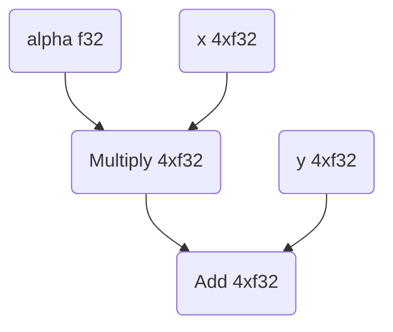

# Compile a StableHLO program with XLA

This tutorial and the code in this directory shows how to write a simple
StableHLO program and then compile it with XLA. The purpose is simply to
show how XLA can injest a StableHLO program and produce an executable
that's compatible with the local device. As such, the program is very
simple: $\alpha x+y$ ("axpy").

The process includes just a few steps:

1.  Construct a StableHLO program using the StableHLO dialect.
2.  Tell XLA to create a "computation" based on this program. In this example,
    we will use PjRt (Pretty much just another Runtime) to achieve that.
3.  Run the compiled executable with some inputs to compute results.

All the code is already provided in this directory, which you can build and
run using the steps at the end of this page.

## 1. Create the StableHLO program

We'll define the computation axpy as a StableHLO program, using an
[MLIR](https://mlir.llvm.org/) file in the
[StableHLO](https://github.com/openxla/stablehlo) dialect.

It can be helpful to consider the computation as a graph, where each node is an
operation (an "op" or "HLO" which means "high-level operation") and the graph
edges are the data flow between operations. So the graph for axpy looks like
this:



And here's how we define the program using MLIR (in the StableHLO dialect):

```mlir
func.func @main(
  %alpha: tensor<f32>, %x: tensor<4xf32>, %y: tensor<4xf32>
) -> tensor<4xf32> {
  %0 = stablehlo.broadcast_in_dim %alpha, dims = []
    : (tensor<f32>) -> tensor<4xf32>
  %1 = stablehlo.multiply %0, %x : tensor<4xf32>
  %2 = stablehlo.add %1, %y : tensor<4xf32>
  func.return %2: tensor<4xf32>
}
```

This code is in [`stablehlo_axpy.mlir`](stablehlo_axpy.mlir).

**Note:** StableHLO expresses broadcasting explicitly, so we use
`"stablehlo.broadcast_in_dim"` to broadcast our scalar to a rank-1 tensor.

## 2. Compile the StableHLO program

Our program for this tutorial is set up as a test in
[`stablehlo_compile_test.cc`](stablehlo_compile_test.cc). In this file,
you'll see that we first set up a `PjRtStreamExecutorClient` that
allows us to compile our StableHLO program:

```c++
// Setup client
LocalClient* local_client = xla::ClientLibrary::LocalClientOrDie();

// Retrieve the "platform" we intend to execute the computation on. The
// concept of "platform" in XLA abstracts entirely everything need to
// interact with some hardware (compiler, runtime, etc.). New HW vendor
// plugs into XLA by registering a new platform with a different string
// key. For example for an Nvidia GPU change the following to:
//   PlatformUtil::GetPlatform("CUDA"));
TF_ASSERT_OK_AND_ASSIGN(se::Platform * platform,
                        PlatformUtil::GetPlatform("cpu"));
se::StreamExecutorConfig config;
config.ordinal = 0;
TF_ASSERT_OK_AND_ASSIGN(se::StreamExecutor * executor,
                        platform->GetExecutor(config));

// LocalDeviceState and PjRtStreamExecutorDevice describes the state of a
// device which can do computation or transfer buffers. Could represent a GPU
// or accelerator, but we'll use the CPU for this example.
auto device_state = std::make_unique<LocalDeviceState>(
    executor, local_client, LocalDeviceState::kSynchronous,
    /*max_inflight_computations=*/32,
    /*allow_event_reuse=*/false, /*use_callback_stream=*/false);
auto device = std::make_unique<PjRtStreamExecutorDevice>(
    0, std::move(device_state), "cpu");
std::vector<std::unique_ptr<PjRtStreamExecutorDevice>> devices;
devices.emplace_back(std::move(device));

// The PjRtStreamExecutorClient will allow us to compile and execute
// computations on the device we just configured.
auto pjrt_se_client = PjRtStreamExecutorClient(
    "cpu", local_client, std::move(devices), /*process_index=*/0,
    /*allocator=*/nullptr, /*host_memory_allocator=*/nullptr,
    /*should_stage_host_to_device_transfers=*/false,
    /*gpu_run_options=*/nullptr);
```

Then we read the StableHLO program from our MLIR file into a string:

```c++
// Read StableHLO program to string
std::string program_path = tsl::io::JoinPath(
    tsl::testing::XlaSrcRoot(), "examples", "axpy", "stablehlo_axpy.mlir");
std::string program_string;

TF_ASSERT_OK(
    tsl::ReadFileToString(tsl::Env::Default(), program_path, &program_string));
```

In order to parse the StableHLO program, we must first register the appropriate
MLIR dialects:

```c++
// Register MLIR dialects necessary to parse our program. In our case this is
// just the Func dialect and StableHLO.
mlir::DialectRegistry dialects;
dialects.insert<mlir::func::FuncDialect>();
mlir::stablehlo::registerAllDialects(dialects);

// Parse StableHLO program.
auto ctx = std::make_unique<mlir::MLIRContext>(dialects);
mlir::OwningOpRef<mlir::ModuleOp> program =
    mlir::parseSourceString<mlir::ModuleOp>(program_string, ctx.get());
```

Now that we've set up our client and parsed the StableHLO program we can
compile it to an executable:

```c++
// Use our client to compile our StableHLO program to an executable.
TF_ASSERT_OK_AND_ASSIGN(std::unique_ptr<PjRtLoadedExecutable> executable,
                        pjrt_se_client.Compile(*program, CompileOptions{}));
```

## 3. Execute the computation

Finally, in [`stablehlo_compile_test.cc`](stablehlo_compile_test.cc),
we can feed the executable some inputs for the three arguments and
compute the results:

```c++
// Create inputs to our computation.
auto alpha_literal = xla::LiteralUtil::CreateR0<float>(3.14f);
auto x_literal = xla::LiteralUtil::CreateR1<float>({1.0f, 2.0f, 3.0f, 4.0f});
auto y_literal =
    xla::LiteralUtil::CreateR1<float>({10.5f, 20.5f, 30.5f, 40.5f});

// Get the host device.
PjRtDevice* cpu = pjrt_se_client.devices()[0];

// Transfer our literals to buffers. If we were using a GPU, these buffers
// would correspond to device memory.
TF_ASSERT_OK_AND_ASSIGN(
    std::unique_ptr<PjRtBuffer> alpha,
    pjrt_se_client.BufferFromHostLiteral(alpha_literal, cpu));
TF_ASSERT_OK_AND_ASSIGN(
    std::unique_ptr<PjRtBuffer> x,
    pjrt_se_client.BufferFromHostLiteral(x_literal, cpu));
TF_ASSERT_OK_AND_ASSIGN(
    std::unique_ptr<PjRtBuffer> y,
    pjrt_se_client.BufferFromHostLiteral(y_literal, cpu));

// Do our computation.
TF_ASSERT_OK_AND_ASSIGN(
    std::vector<std::vector<std::unique_ptr<PjRtBuffer>>> axpy_result,
    executable->Execute({{alpha.get(), x.get(), y.get()}}, /*options=*/{}));

// Convert result buffer back to literal.
TF_ASSERT_OK_AND_ASSIGN(std::shared_ptr<Literal> axpy_result_literal,
                        axpy_result[0][0]->ToLiteralSync());

// Check to make sure that our results match what we expect.
xla::LiteralTestUtil::ExpectR1Near<float>({13.64f, 26.78f, 39.92f, 53.06f},
                                          *axpy_result_literal,
                                          xla::ErrorSpec(0.01f));
```

## 4. Build and run the code

You can build and run this example as follows using
[Bazelisk](https://github.com/bazelbuild/bazelisk#readme) or
[Bazel](https://bazel.build/) (run from within `xla/examples/axpy/`):

```sh
bazelisk test :stablehlo_compile_test --test_output=all --nocheck_visibility
```

Sample output from the test should look like this:

```sh
==================== Test output for //xla/examples/axpy:stablehlo_compile_test:
[==========] Running 1 test from 1 test suite.
[----------] Global test environment set-up.
[----------] 1 test from StableHloAxpyTest
[ RUN      ] StableHloAxpyTest.LoadAndRunCpuExecutable
Loaded StableHLO program from xla/examples/axpy/stablehlo_axpy.mlir:
func.func @main(
  %alpha: tensor<f32>, %x: tensor<4xf32>, %y: tensor<4xf32>
) -> tensor<4xf32> {
  %0 = stablehlo.broadcast_in_dim %alpha, dims = []
    : (tensor<f32>) -> tensor<4xf32>
  %1 = stablehlo.multiply %0, %x : tensor<4xf32>
  %2 = stablehlo.add %1, %y : tensor<4xf32>
  func.return %2: tensor<4xf32>
}

Computation inputs:
        alpha:f32[] 3.14
        x:f32[4] {1, 2, 3, 4}
        y:f32[4] {10.5, 20.5, 30.5, 40.5}
Computation output: f32[4] {13.64, 26.78, 39.920002, 53.06}
[       OK ] StableHloAxpyTest.LoadAndRunCpuExecutable (264 ms)
[----------] 1 test from StableHloAxpyTest (264 ms total)

[----------] Global test environment tear-down
[==========] 1 test from 1 test suite ran. (264 ms total)
[  PASSED  ] 1 test.
```
