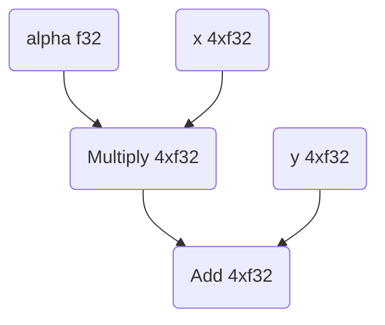

## Getting started - basic example

The following code sample shows how to use XLA to compute a simple vector
expression: $$\alpha x+y$$ ("axpy"). The full code sample is
[here](https://github.com/openxla/xla/blob/test/xla/examples/axpy/stablehlo_compile_test.cc).

This sample presents an example XLA program using [MLIR](https://mlir.llvm.org/)
and [StableHLO](https://github.com/openxla/stablehlo) that takes data as input,
uses XLA to build a graph to compute the expression and returns the resulting
data.

This is done in several steps:

1.  Construct an XLA graph that encodes the expression we want to compute. The
    graph's nodes are XLA operations (sometimes called "ops" or HLOs for
    "high-level operations"), and its edges represent the data flow between
    operations. We will create this graph using an MLIR module in the
    [StableHLO](https://github.com/openxla/stablehlo) dialect.
2.  Ask XLA to create a "computation" based on this graph. In this example, we
    will use PjRt (Pretty much just another Runtime) to compile our module.
3.  Use the previously compiled executable and input data to compute results.

The XLA graph we construct for axpy is:



Here is the MLIR module (in the StableHLO dialect) that XLA will use to
construct our graph (step 1):

```mlir
module @axpy {
  func.func public @main(
    %alpha: tensor<f32>,
    %x: tensor<4 x f32>,
    %y: tensor<4 x f32>
  ) -> tensor<4 x f32> {
    %a = "stablehlo.broadcast_in_dim" (%alpha) {
      broadcast_dimensions = dense<[]> : tensor<0 x i64>
    } : (tensor<f32>) -> tensor<4 x f32>
    %ax = stablehlo.multiply %a, %x : tensor<4 x f32>
    %result = stablehlo.add %ax, %y : tensor<4 x f32>
    return %result: tensor<4 x f32>
  }
}
```

Notably, StableHLO doesn't support implicit broadcasting, so we will use
`"stablehlo.broadcast_in_dim"` to broadcast our scalar to a rank-1 tensor.

At the start of our test, we will set up a PjRtStreamExecutorClient that will
allow us to compile our StableHLO module:

```c++
// Setup client
LocalClient* local_client = xla::ClientLibrary::LocalClientOrDie();

// Retrieve the "platform" we intend to execute the computation on. The
// concept of "platform" in XLA abstracts entirely everything need to
// interact with some hardware (compiler, runtime, etc.). New HW vendor
// plugs into XLA by registering a new platform with a different string
// key. For example for an Nvidia GPU change the following to:
//   PlatformUtil::GetPlatform("CUDA"));
TF_ASSERT_OK_AND_ASSIGN(se::Platform * platform,
                        PlatformUtil::GetPlatform("cpu"));
se::StreamExecutorConfig config;
config.ordinal = 0;
TF_ASSERT_OK_AND_ASSIGN(se::StreamExecutor * executor,
                        platform->GetExecutor(config));

// LocalDeviceState and PjRtStreamExecutorDevice describes the state of a
// device which can do computation or transfer buffers. Could represent a GPU
// or accelerator, but we'll use the CPU for this example.
auto device_state = std::make_unique<LocalDeviceState>(
    executor, local_client, LocalDeviceState::kSynchronous,
    /*max_inflight_computations=*/32,
    /*allow_event_reuse=*/false, /*use_callback_stream=*/false);
auto device = std::make_unique<PjRtStreamExecutorDevice>(
    0, std::move(device_state), "cpu");
std::vector<std::unique_ptr<PjRtStreamExecutorDevice>> devices;
devices.emplace_back(std::move(device));

// The PjRtStreamExecutorClient will allow us to compile and execute
// computations on the device we just configured.
auto pjrt_se_client = PjRtStreamExecutorClient(
    "cpu", local_client, std::move(devices), /*process_index=*/0,
    /*allocator=*/nullptr, /*host_memory_allocator=*/nullptr,
    /*should_stage_host_to_device_transfers=*/false,
    /*gpu_run_options=*/nullptr);
```

Then we will read our StableHLO module to a string:

```c++
// Read StableHLO module to string
std::string module_path = tsl::io::JoinPath(
    tsl::testing::XlaSrcRoot(), "examples", "axpy", "stablehlo_axpy.mlir");
std::string module_string;

TF_ASSERT_OK(
    tsl::ReadFileToString(tsl::Env::Default(), module_path, &module_string));
```

In order to parse the StableHLO module, we must register the appropriate MLIR
dialects:

```c++
// Register MLIR dialects necessary to parse our module. In our case this is
// just the Func dialect and StableHLO.
mlir::DialectRegistry dialects;
dialects.insert<mlir::func::FuncDialect>();
mlir::stablehlo::registerAllDialects(dialects);

// Parse StableHLO module.
auto ctx = std::make_unique<mlir::MLIRContext>(dialects);
mlir::OwningOpRef<mlir::ModuleOp> module =
    mlir::parseSourceString<mlir::ModuleOp>(module_string, ctx.get());
```

Now that we've set up our client and parsed the StableHLO module we can
compile it to an executable (step 2):

```c++
// Use our client to compile our StableHLO module to an executable.
TF_ASSERT_OK_AND_ASSIGN(std::unique_ptr<PjRtLoadedExecutable> executable,
                        pjrt_se_client.Compile(*module, CompileOptions{}));
```

And finally we can feed the executable some inputs (step 3):

```c++
// Create inputs to our computation.
auto alpha_literal = xla::LiteralUtil::CreateR0<float>(3.14f);
auto x_literal = xla::LiteralUtil::CreateR1<float>({1.0f, 2.0f, 3.0f, 4.0f});
auto y_literal =
    xla::LiteralUtil::CreateR1<float>({10.5f, 20.5f, 30.5f, 40.5f});

// Get the host device.
PjRtDevice* cpu = pjrt_se_client.devices()[0];

// Transfer our literals to buffers. If we were using a GPU, these buffers
// would correspond to device memory.
TF_ASSERT_OK_AND_ASSIGN(
    std::unique_ptr<PjRtBuffer> alpha,
    pjrt_se_client.BufferFromHostLiteral(alpha_literal, cpu));
TF_ASSERT_OK_AND_ASSIGN(
    std::unique_ptr<PjRtBuffer> x,
    pjrt_se_client.BufferFromHostLiteral(x_literal, cpu));
TF_ASSERT_OK_AND_ASSIGN(
    std::unique_ptr<PjRtBuffer> y,
    pjrt_se_client.BufferFromHostLiteral(y_literal, cpu));

// Do our computation.
TF_ASSERT_OK_AND_ASSIGN(
    std::vector<std::vector<std::unique_ptr<PjRtBuffer>>> axpy_result,
    executable->Execute({{alpha.get(), x.get(), y.get()}}, /*options=*/{}));

// Convert result buffer back to literal.
TF_ASSERT_OK_AND_ASSIGN(std::shared_ptr<Literal> axpy_result_literal,
                        axpy_result[0][0]->ToLiteralSync());

// Check to make sure that our results match what we expect.
xla::LiteralTestUtil::ExpectR1Near<float>({13.64f, 26.78f, 39.92f, 53.06f},
                                          *axpy_result_literal,
                                          xla::ErrorSpec(0.01f));
```

Sample output from our test should look like this:

```sh
$ bazel test --nocheck_visibility --test_output=all examples/axpy:stablehlo_compile_test
==================== Test output for //third_party/tensorflow/compiler/xla/examples/axpy:stablehlo_compile_test:
[==========] Running 1 test from 1 test suite.
[----------] Global test environment set-up.
[----------] 1 test from StableHloAxpyTest
[ RUN      ] StableHloAxpyTest.LoadAndRunCpuExecutable
Loaded StableHLO module from /path/to/runfiles/xla/examples/axpy/stablehlo_axpy.mlir:
module @axpy {
  func.func public @main(
    %alpha: tensor<f32>,
    %x: tensor<4 x f32>,
    %y: tensor<4 x f32>
  ) -> tensor<4 x f32> {
    %a = "stablehlo.broadcast_in_dim" (%alpha) {
      broadcast_dimensions = dense<[]> : tensor<0 x i64>
    } : (tensor<f32>) -> tensor<4 x f32>
    %ax = stablehlo.multiply %a, %x : tensor<4 x f32>
    %result = stablehlo.add %ax, %y : tensor<4 x f32>
    return %result: tensor<4 x f32>
  }
}

Computation inputs:
        alpha:f32[] 3.14
        x:f32[4] {1, 2, 3, 4}
        y:f32[4] {10.5, 20.5, 30.5, 40.5}
Computation output: f32[4] {13.64, 26.78, 39.920002, 53.06}
[       OK ] StableHloAxpyTest.LoadAndRunCpuExecutable (105 ms)
[----------] 1 test from StableHloAxpyTest (105 ms total)

[----------] Global test environment tear-down
[==========] 1 test from 1 test suite ran. (105 ms total)
[  PASSED  ] 1 test.
```
