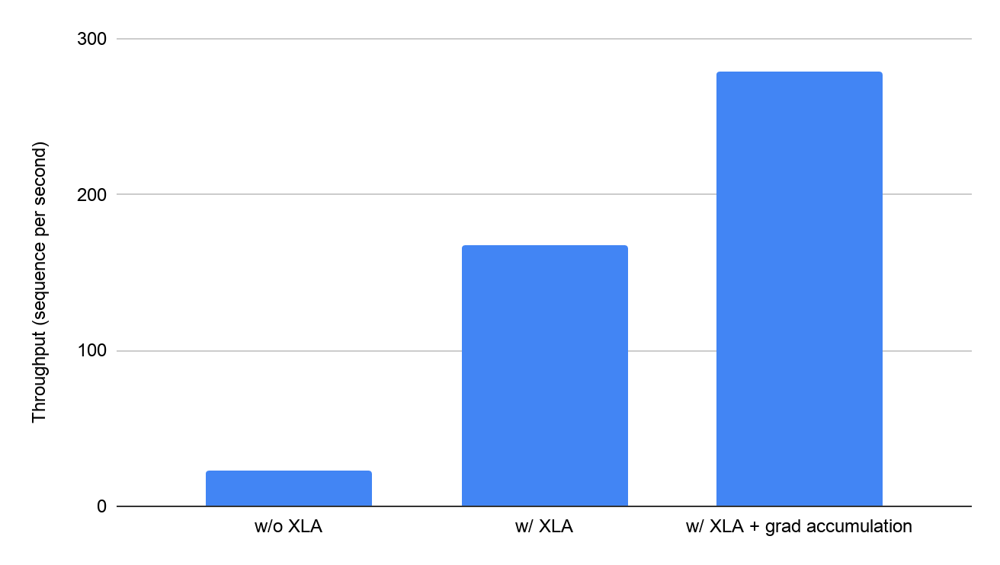

# XLA: Optimizing Compiler for Machine Learning

XLA (Accelerated Linear Algebra) is a domain-specific compiler for linear
algebra that can accelerate TensorFlow models with potentially no source code
changes.

The results are improvements in speed and memory usage: most internal benchmarks
run ~1.15x faster after XLA is enabled. The dataset below is evaluated on a
single NVidia V100 GPU:

<div style="width:90%; margin:auto; margin-bottom:10px; margin-top:20px;">

</div>

## Introduction

When a TensorFlow program is run, all of the operations are executed
individually by the TensorFlow executor. Each TensorFlow operation has a
precompiled GPU kernel implementation that the executor dispatches to.

XLA provides an alternative mode of running models: it compiles the TensorFlow
graph into a sequence of computation kernels generated specifically for the
given model. Because these kernels are unique to the model, they can exploit
model-specific information for optimization. For example, let's look at an
optimization XLA does in the context of a simple TensorFlow computation:

```
def model_fn(x, y, z):
  return tf.reduce_sum(x + y * z)
```

Run without XLA, the graph launches three kernels: one for the multiplication,
one for the addition and one for the reduction. However, XLA can optimize the
graph so that it computes the result in a single kernel launch. It does this by
"fusing" the addition, multiplication and reduction into a single GPU kernel.
Moreover, this fused operation does not write out the intermediate values
produced by `y*z` and `x+y*z` to memory; instead it "streams" the results of
these intermediate computations directly to their users while keeping them
entirely in GPU registers. Fusion is XLA's single most important optimization.
Memory bandwidth is typically the scarcest resource on hardware accelerators, so
removing memory operations is one of the best ways to improve performance.

## Enable XLA for TensorFlow models

### Auto-clustering

A simplest way to start using XLA in TensorFlow models is to enable
_auto-clustering_, which automatically finds _clusters_ (connected subgraphs)
within the TensorFlow graph which can be compiled and executed using XLA.
Auto-clustering on GPU can be enabled by setting the `TF_XLA_FLAGS` environment
variable:

```
$ TF_XLA_FLAGS=--tf_xla_auto_jit=2 path/to/your/tf/program
```

Auto-clustering is currently optimized for GPU workloads, but it can also be
enabled on CPU by additionally using the flag `--tf_xla_cpu_global_jit`:

```
$ TF_XLA_FLAGS="--tf_xla_auto_jit=2 --tf_xla_cpu_global_jit" path/to/your/program
```

Note: Auto-clustering support on CPU and on multi-GPU environments is
experimental.

For a detailed usage example see the [auto-clustering tutorial
colab](./tutorials/autoclustering_xla.ipynb).

### Explicit compilation with tf.function

Auto-clustering is a great tool for making the model faster without any changes
to the code, but it may be hard to understand what changes have been performed.

Explicit compilation API offers a more fine-grained control for choosing which
functions should be compiled.
For example, the following TensorFlow function which performs the MNIST training
is compiled with XLA:

```
@tf.function(experimental_compile=True)
def train_mnist(images, labels):
    images, labels = cast(images, labels)

    with tf.GradientTape() as tape:
      predicted_labels = layer(images)
      loss = tf.reduce_mean(tf.nn.sparse_softmax_cross_entropy_with_logits(
          logits=predicted_labels, labels=labels
      ))
    layer_variables = layer.trainable_variables
    grads = tape.gradient(loss, layer_variables)
    optimizer.apply_gradients(zip(grads, layer_variables))
```

The `experimental_compile` API has _must-compile_ semantics: either the entire
function is compiled with XLA, or an `errors.InvalidArgumentError` exception is
thrown. XLA can not currently compile functions where dimensions are not
_inferrable_: that is, if it's not possible to infer the dimensions of all
tensors without running the entire computation. For example, the following
function will not compile:

```
@tf.function
def not_compilable(x):
  return tf.unique(x)
```

Shapes can vary across the runs though:

```
@tf.function(experimental_compile=True)
def recompiled_on_launch(a, b):
  return a + b

recompiled_on_launch(tf.ones([1, 10]), tf.ones([1, 10]))
recompiled_on_launch(tf.ones([1, 100]), tf.ones([1, 100]))
```

See the [tutorial colab](./tutorials/compile.ipynb) for a more detailed usage
example.

### AOT (Ahead-of-time) compilation for CPU with `tfcompile`

You can also use a standalone [`tfcompile`](./tfcompile) tool,
which converts TensorFlow graph into executable code (for x86-64 CPU only).

## Inspect compiled programs

XLA provides introspection facilities which let you inspect the generated
programs. To dump the generated programs, use the environment variable
`XLA_FLAGS`:

```
$ XLA_FLAGS="--xla_dump_to=/tmp/generated" TF_XLA_FLAGS="--tf_xla_auto_jit=2" my/tensorflow/program
```

After the dumping is performed, you can find the following files in
`/tmp/generated`:

-   `module_XXXX.*_optimizations.txt` Generated
    [XLA programs](./operation_semantics.md), one per each compiled cluster.
    Attaching those when submitting XLA bug reports is extremely helpful!

-   `module_XXXX.ir-*.ll` Generated files in
    [LLVM](https://llvm.org/docs/LangRef.html) intermediate representation, with
    [NVPTX](https://llvm.org/docs/NVPTXUsage.html) intrinsics.

-   `module_XXXX.ptx` Generated
    [PTX](https://docs.nvidia.com/cuda/parallel-thread-execution/index.html)
    files.

You can also dump the graph visualizing the embedding of XLA clusters inside of
the TensorFlow graph with:

```
$ TF_DUMP_GRAPH_PREFIX=/tmp/generated TF_XLA_FLAGS="--tf_xla_clustering_debug"
```

## Reproducible bug reports

A bug report is much easier to reproduce if it includes dumps for the generated
XLA programs and the used auto-clustering embedding.
To generate them for a TensorFlow program running with auto-clustering, launch:

```
$ TF_DUMP_GRAPH_PREFIX=/tmp/generated \
  TF_XLA_FLAGS="--tf_xla_clustering_debug --tf_xla_auto_jit=2" \
  XLA_FLAGS="--xla_dump_hlo_as_text --xla_dump_to=/tmp/generated" \
    my/tensorflow/program"
```

When filing bugs, attach the contents of the `/tmp/generated` directory
(referenced above).

If possible, try to isolate
a bug to a single XLA program by using the
[`replay_computation`](https://github.com/tensorflow/tensorflow/blob/master/tensorflow/compiler/xla/tools/run_hlo_module_main.cc)
and iteratively running it on generated programs.

## Known Issues

Compilation with XLA can greatly improve the performance of your programs, but
the TensorFlow interop has a number of known sharp corners.

### TensorArray TF/XLA Interconversion

The problem manifests itself as an error message
`Support for TensorList crossing the XLA/TF boundary is not implemented`.

XLA supports `tf.TensorArray`. However, the _interconversion_ between TF and
XLA representations is not implemented yet.
This error often arises when the `TensorArray` is used inside the compiled
block, but the derivative is taken outside.

Workaround: compile the outermost scope which is taking the derivative.

### Random Number Generation

XLA currently ignores TF seeds to random operations. This affects stateful TF
random operations, such as `tf.random.normal`, or `tf.nn.dropout`.  XLA will
behave as if the compilation was seeded with a new unique seed at each run. This
limitation does not apply to stateless random ops.

## XLA Frontends

Apart from TensorFlow, XLA programs can be generated by:

-   [JAX](https://github.com/google/jax): Composable transformations of
    Python+NumPy programs
-   [Julia](https://github.com/JuliaTPU/XLA.jl): The Julia language for
    scientific computing
-   [PyTorch](https://github.com/pytorch/xla): PyTorch framework

## Further reading

-   [XLA Architecture](./architecture.md): Overview of the XLA architecture
-   [XLA - TensorFlow, Compiled](https://developers.googleblog.com/2017/03/xla-tensorflow-compiled.html):
    Read on Google Developers Blog
-   Check out the
    [XLA source](https://github.com/tensorflow/tensorflow/tree/master/tensorflow/compiler/xla)
    on Github!

<iframe frameborder="0" allowfullscreen="1" allow="accelerometer; autoplay;
encrypted-media; gyroscope; picture-in-picture" width="640" height="360"
src="https://www.youtube.com/embed/kAOanJczHA0?origin=https%3A%2F%2Fwww.tensorflow.org&amp;autohide=1&amp;showinfo=0&amp;video-id=kAOanJczHA0&amp;enablejsapi=1&amp;widgetid=1"
id="widget2" data-title="YouTube video player"></iframe>
