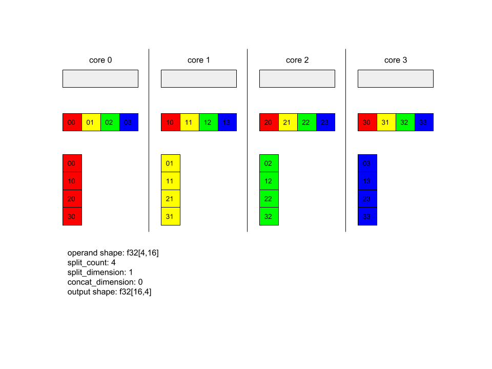
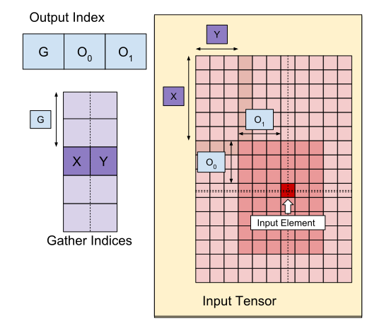
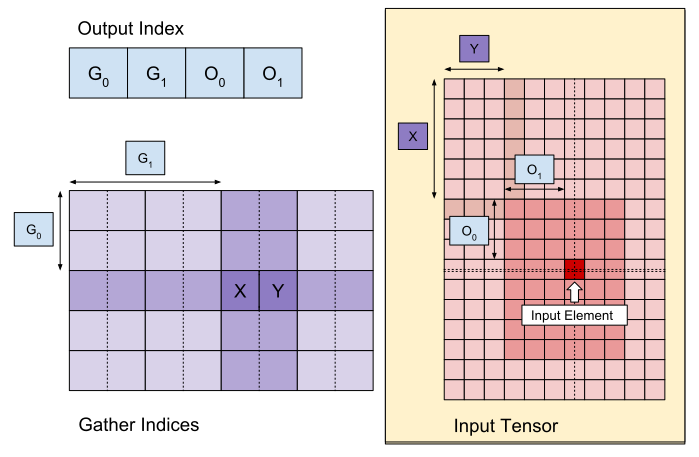
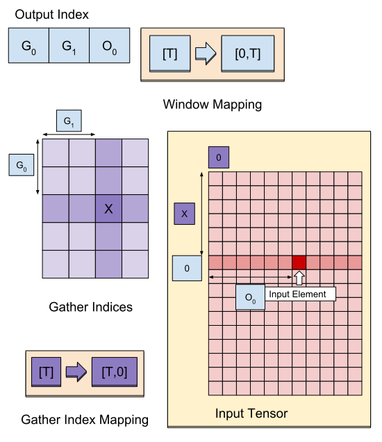
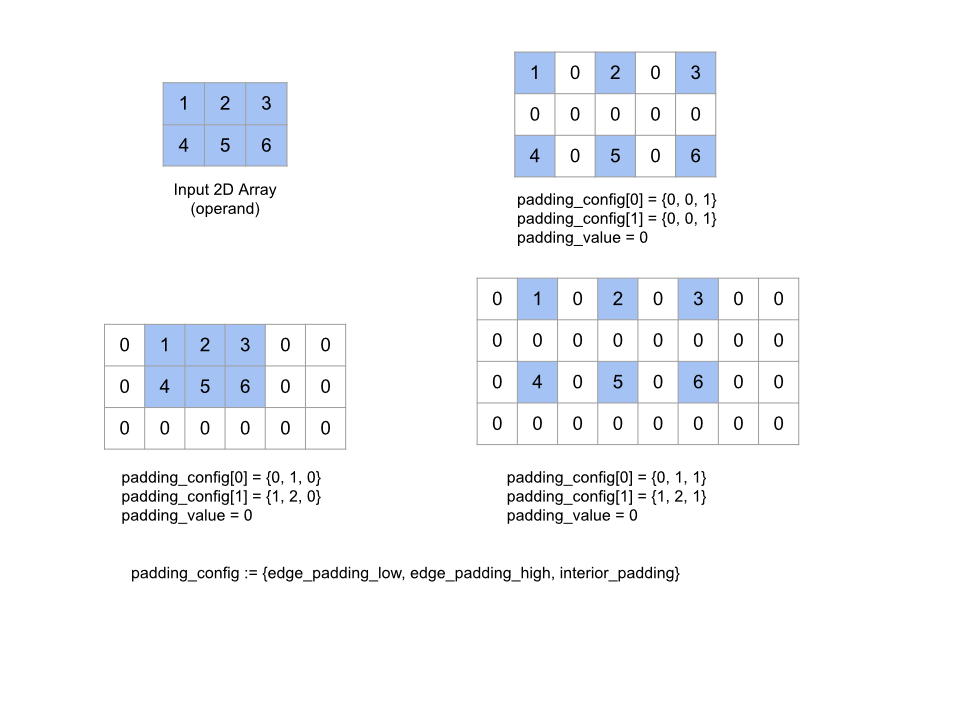
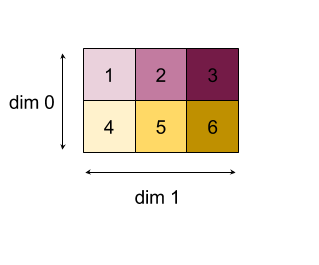
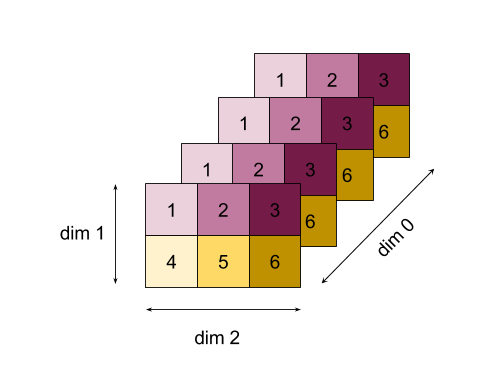
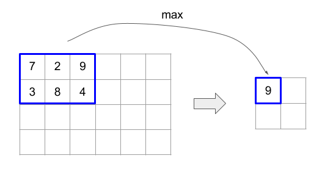
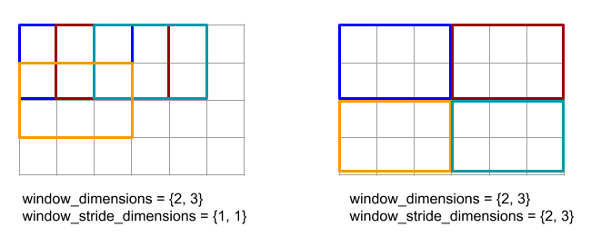
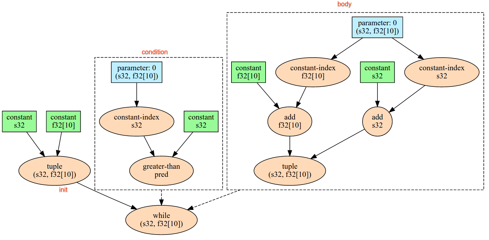

# Operation Semantics

The following describes the semantics of operations defined in the
[`XlaBuilder`](https://www.tensorflow.org/code/tensorflow/compiler/xla/client/xla_builder.h)
interface. Typically, these operations map one-to-one to operations defined in
the RPC interface in
[`xla_data.proto`](https://www.tensorflow.org/code/tensorflow/compiler/xla/xla_data.proto).

A note on nomenclature: the generalized data type XLA deals with is an
N-dimensional array holding elements of some uniform type (such as 32-bit
float). Throughout the documentation, *array* is used to denote an
arbitrary-dimensional array. For convenience, special cases have more specific
and familiar names; for example a *vector* is a 1-dimensional array and a
*matrix* is a 2-dimensional array.

## AfterAll

See also
[`XlaBuilder::AfterAll`](https://www.tensorflow.org/code/tensorflow/compiler/xla/client/xla_builder.h).

AfterAll takes a variadic number of tokens and produces a single token. Tokens
are primitive types which can be threaded between side-effecting operations to
enforce ordering. `AfterAll` can be used as a join of tokens for ordering a
operation after a set operations.

<b> `AfterAll(operands)` </b>

Arguments  | Type    | Semantics
---------- | ------- | -------------------------
`operands` | `XlaOp` | variadic number of tokens

## AllReduce

See also
[`XlaBuilder::AllReduce`](https://www.tensorflow.org/code/tensorflow/compiler/xla/client/xla_builder.h).

Performs a custom computation across replicas.

<b> `AllReduce(operand, computation, replica_group_ids, channel_id)` </b>

| Arguments        | Type                 | Semantics                        |
| ---------------- | -------------------- | -------------------------------- |
| `operand`        | `XlaOp`              | Array to reduce across replicas. |
| `computation`    | `XlaComputation`     | Reduction computation            |
| `replica_groups` | vector of vectors of | Groups between which the         |
:                  : `int64`              : reductions are performed         :
| `channel_id`     | optional `int64`     | Optional channel ID for          |
:                  :                      : cross-module communication       :

-   `replica_groups` is a list of replica groups between which the reduction is
    performed (replica id for the current replica can be retrieved using
    [`ReplicaId`](#replicaid)). `replica_groups` must either be empty (in which
    case all replicas belong to a single group), or contain the same number of
    elements as the number of replicas. For example, `replica_groups = {0, 2},
    {1, 3}` performs reduction between the replicas `0` and `2`, and `1` and
    `3`.
-   `channel_id` is used for cross-module communication: only `all-reduce`
    operations with the same `channel_id` can communicate to each other.

The output shape is the same as the input shape. For example, if there are two
replicas and the operand has the value `[1.0, 2.5]` and `[3.0, 5.25]`
respectively on the two replicas, then the output value from this op and
summation computation will be `[4.0, 7.75]` on both replicas.

Computing the result of `AllReduce` requires having one input from each replica,
so if one replica executes a `AllReduce` node more times than another, then the
former replica will wait forever. Since the replicas are all running the same
program, there are not a lot of ways for that to happen, but it is possible when
a while loop's condition depends on data from infeed and the data that is infed
causes the while loop to iterate more times on one replica than another.

## AllToAll

See also
[`XlaBuilder::AllToAll`](https://www.tensorflow.org/code/tensorflow/compiler/xla/client/xla_builder.h).

AllToAll is a collective operation that sends data from all cores to all cores.
It has two phases:

1.  The scatter phase. On each core, the operand is split into `split_count`
    number of blocks along the `split_dimensions`, and the blocks are scattered
    to all cores, e.g., the ith block is send to the ith core.
2.  The gather phase. Each core concatenates the received blocks along the
    `concat_dimension`.

The participating cores can be configured by:

-   `replica_groups`: each ReplicaGroup contains a list of replica id
    participating in the computation (replica id for the current replica can be
    retrieved using [`ReplicaId`](#replicaid)). AllToAll will be applied within
    subgroups in the specified order. For example, `replica_groups = {{1,2,3},
    {4,5,0}}` means that an AllToAll will be applied within replicas `{1, 2,
    3}`, and in the gather phase, and the received blocks will be concatenated
    in the same order of 1, 2, 3. Then, another AllToAll will be applied within
    replicas 4, 5, 0, and the concatenation order is also 4, 5, 0. If
    `replica_groups` is empty, all replicas belong to one group, in the
    concatenation order of their appearance.

Prerequisites:

-   The dimension size of the operand on the `split_dimension` is divisible by
`split_count`.
-   The operand's shape is not tuple.

<b> `AllToAll(operand, split_dimension, concat_dimension, split_count,
replica_groups)` </b>


| Arguments          | Type                  | Semantics                       |
| ------------------ | --------------------- | ------------------------------- |
| `operand`          | `XlaOp`               | n dimensional input array       |
| `split_dimension`  | `int64`               | A value in the interval `[0,    |
:                    :                       : n)` that names the dimension    :
:                    :                       : along which the operand is      :
:                    :                       : split                           :
| `concat_dimension` | `int64`               | a value in the interval `[0,    |
:                    :                       : n)` that names the dimension    :
:                    :                       : along which the split blocks    :
:                    :                       : are concatenated                :
| `split_count`      | `int64`               | the number of cores that        |
:                    :                       : participate this operation. If  :
:                    :                       : `replica_groups` is empty, this :
:                    :                       : should be the number of         :
:                    :                       : replicas; otherwise, this       :
:                    :                       : should be equal to the number   :
:                    :                       : of replicas in each group.      :
| `replica_groups`   | `ReplicaGroup` vector | each group contains a list of   |
:                    :                       : replica id.                     :

Below shows an example of Alltoall.

```
XlaBuilder b("alltoall");
auto x = Parameter(&b, 0, ShapeUtil::MakeShape(F32, {4, 16}), "x");
AllToAll(x, /*split_dimension=*/1, /*concat_dimension=*/0, /*split_count=*/4);
```

<div style="width:95%; margin:auto; margin-bottom:10px; margin-top:20px;">

</div>

In this example, there are 4 cores participating the Alltoall. On each core, the
operand is split into 4 parts along dimension 0, so each part has shape
f32[4,4]. The 4 parts are scattered to all cores. Then each core concatenates
the received parts along dimension 1, in the order or core 0-4. So the output on
each core has shape f32[16,4].

## BatchNormGrad

See also
[`XlaBuilder::BatchNormGrad`](https://www.tensorflow.org/code/tensorflow/compiler/xla/client/xla_builder.h)
and [the original batch normalization paper](https://arxiv.org/abs/1502.03167)
for a detailed description of the algorithm.

Calculates gradients of batch norm.

<b> `BatchNormGrad(operand, scale, mean, variance, grad_output, epsilon, feature_index)` </b>

| Arguments       | Type                    | Semantics                        |
| --------------- | ----------------------- | -------------------------------- |
| `operand`       | `XlaOp`                 | n dimensional array to be        |
:                 :                         : normalized (x)                   :
| `scale`         | `XlaOp`                 | 1 dimensional array              |
:                 :                         : (\\(\gamma\\))                   :
| `mean`          | `XlaOp`                 | 1 dimensional array (\\(\mu\\))  |
| `variance`      | `XlaOp`                 | 1 dimensional array              |
:                 :                         : (\\(\sigma^2\\))                 :
| `grad_output`   | `XlaOp`                 | Gradients passed to              |
:                 :                         : `BatchNormTraining`              :
:                 :                         : (\\( \nabla y\\))                :
| `epsilon`       | `float`                 | Epsilon value (\\(\epsilon\\))   |
| `feature_index` | `int64`                 | Index to feature dimension in    |
:                 :                         : `operand`                        :

For each feature in the feature dimension (`feature_index` is the index for the
feature dimension in `operand`), the operation calculates the gradients with
respect to `operand`, `offset` and `scale` across all the other dimensions. The
`feature_index` must be a valid index for the feature dimension in `operand`.

The three gradients are defined by the following formulas (assuming a
4-dimensional array as `operand` and with feature dimension index $$l$$, batch
size `m` and spatial sizes `w` and `h`):

\\[ \begin{split} c_l&=
\frac{1}{mwh}\sum_{i=1}^m\sum_{j=1}^w\sum_{k=1}^h
\left( \nabla y_{ijkl} \frac{x_{ijkl} - \mu_l}{\sigma^2_l+\epsilon} \right)
\\\\
\nabla x_{ijkl} &= \frac{\gamma_{l}}{\sqrt{\sigma^2_{l}+\epsilon}}
\left( \nabla y_{ijkl} - \mathrm{mean}(\nabla y) - c_l (x_{ijkl} - \mu_{l})
\right)
\\\\
\nabla \gamma_l &= \sum_{i=1}^m\sum_{j=1}^w\sum_{k=1}^h \left( \nabla y_{ijkl}
\frac{x_{ijkl} - \mu_l}{\sqrt{\sigma^2_{l}+\epsilon}} \right)
\\\\\
\nabla \beta_l &= \sum_{i=1}^m\sum_{j=1}^w\sum_{k=1}^h \nabla y_{ijkl}
\end{split} \\]

The inputs `mean` and `variance` represent moments value
across batch and spatial dimensions.

The output type is a tuple of three handles:

| Outputs        | Type                    | Semantics                         |
| -------------  | ----------------------- | --------------------------------- |
| `grad_operand` | `XlaOp`                 | gradient with respect to input    |
:                :                         : `operand` (\\( \nabla x\\))       :
| `grad_scale`   | `XlaOp`                 | gradient with respect to input    |
:                :                         : `scale` (\\( \nabla \gamma\\))    :
| `grad_offset`  | `XlaOp`                 | gradient with respect to input    |
:                :                         : `offset`(\\( \nabla \beta\\))     :

## BatchNormInference

See also
[`XlaBuilder::BatchNormInference`](https://www.tensorflow.org/code/tensorflow/compiler/xla/client/xla_builder.h)
and [the original batch normalization paper](https://arxiv.org/abs/1502.03167)
for a detailed description of the algorithm.

Normalizes an array across batch and spatial dimensions.

<b> `BatchNormInference(operand, scale, offset, mean, variance, epsilon, feature_index)` </b>

Arguments       | Type    | Semantics
--------------- | ------- | ---------------------------------------
`operand`       | `XlaOp` | n dimensional array to be normalized
`scale`         | `XlaOp` | 1 dimensional array
`offset`        | `XlaOp` | 1 dimensional array
`mean`          | `XlaOp` | 1 dimensional array
`variance`      | `XlaOp` | 1 dimensional array
`epsilon`       | `float` | Epsilon value
`feature_index` | `int64` | Index to feature dimension in `operand`

For each feature in the feature dimension (`feature_index` is the index for the
feature dimension in `operand`), the operation calculates the mean and variance
across all the other dimensions and uses the mean and variance to normalize each
element in `operand`. The `feature_index` must be a valid index for the feature
dimension in `operand`.

`BatchNormInference`  is equivalent to calling `BatchNormTraining` without
computing `mean` and `variance` for each batch. It uses the input `mean` and
`variance` instead as estimated values. The purpose of this op is to reduce
latency in inference, hence the name `BatchNormInference`.

The output is an n-dimensional, normalized array with the same shape as input
`operand`.

## BatchNormTraining

See also
[`XlaBuilder::BatchNormTraining`](https://www.tensorflow.org/code/tensorflow/compiler/xla/client/xla_builder.h)
and [`the original batch normalization paper`](https://arxiv.org/abs/1502.03167)
for a detailed description of the algorithm.

Normalizes an array across batch and spatial dimensions.

<b> `BatchNormTraining(operand, scale, offset, epsilon, feature_index)` </b>

Arguments       | Type    | Semantics
--------------- | ------- | ----------------------------------------
`operand`       | `XlaOp` | n dimensional array to be normalized (x)
`scale`         | `XlaOp` | 1 dimensional array (\\(\gamma\\))
`offset`        | `XlaOp` | 1 dimensional array (\\(\beta\\))
`epsilon`       | `float` | Epsilon value (\\(\epsilon\\))
`feature_index` | `int64` | Index to feature dimension in `operand`

For each feature in the feature dimension (`feature_index` is the index for the
feature dimension in `operand`), the operation calculates the mean and variance
across all the other dimensions and uses the mean and variance to normalize each
element in `operand`. The `feature_index` must be a valid index for the feature
dimension in `operand`.

The algorithm goes as follows for each batch in `operand` \\(x\\) that
contains `m` elements with `w` and `h` as the size of spatial dimensions
(assuming `operand` is an 4 dimensional array):

- Calculates batch mean \\(\mu_l\\) for each feature `l` in feature dimension:
\\(\mu_l=\frac{1}{mwh}\sum_{i=1}^m\sum_{j=1}^w\sum_{k=1}^h x_{ijkl}\\)

- Calculates batch variance \\(\sigma^2_l\\):
\\(\sigma^2_l=\frac{1}{mwh}\sum_{i=1}^m\sum_{j=1}^w\sum_{k=1}^h (x_{ijkl} - \mu_l)^2\\)

- Normalizes, scales and shifts:
\\(y_{ijkl}=\frac{\gamma_l(x_{ijkl}-\mu_l)}{\sqrt[2]{\sigma^2_l+\epsilon}}+\beta_l\\)

The epsilon value, usually a small number, is added to avoid divide-by-zero errors.

The output type is a tuple of three `XlaOp`s:

| Outputs      | Type                    | Semantics                            |
| ------------ | ----------------------- | -------------------------------------|
| `output`     | `XlaOp`                 | n dimensional array with the same    |
:              :                         : shape as input `operand` (y)         :
| `batch_mean` | `XlaOp`                 | 1 dimensional array (\\(\mu\\))      |
| `batch_var`  | `XlaOp`                 | 1 dimensional array (\\(\sigma^2\\)) |

The `batch_mean` and `batch_var` are moments calculated across the batch and
spatial dimensions using the formulas above.

## BitcastConvertType

See also
[`XlaBuilder::BitcastConvertType`](https://www.tensorflow.org/code/tensorflow/compiler/xla/client/xla_builder.h).

Similar to a `tf.bitcast` in TensorFlow, performs an element-wise bitcast
operation from a data shape to a target shape. The dimensions must match, and
the conversion is an element-wise one; e.g. `s32` elements become `f32` elements
via bitcast routine. Bitcast is implemented as a low-level cast, so machines
with different floating-point representations will give different results.

<b> `BitcastConvertType(operand, new_element_type)` </b>

Arguments          | Type            | Semantics
------------------ | --------------- | ---------------------------
`operand`          | `XlaOp`         | array of type T with dims D
`new_element_type` | `PrimitiveType` | type U

The dimensions of the operand and the target shape must match. The bit-width of
the source and destination element types must be equal. The source
and destination element types must not be tuples.

## Broadcast

See also
[`XlaBuilder::Broadcast`](https://www.tensorflow.org/code/tensorflow/compiler/xla/client/xla_builder.h).

Adds dimensions to an array by duplicating the data in the array.

<b> `Broadcast(operand, broadcast_sizes)` </b>

Arguments         | Type                | Semantics
----------------- | ------------------- | -------------------------------
`operand`         | `XlaOp`             | The array to duplicate
`broadcast_sizes` | `ArraySlice<int64>` | The sizes of the new dimensions

The new dimensions are inserted on the left, i.e. if `broadcast_sizes` has
values `{a0, ..., aN}` and the operand shape has dimensions `{b0, ..., bM}` then
the shape of the output has dimensions `{a0, ..., aN, b0, ..., bM}`.

The new dimensions index into copies of the operand, i.e.

```
output[i0, ..., iN, j0, ..., jM] = operand[j0, ..., jM]
```

For example, if `operand` is a scalar `f32` with value `2.0f`, and
`broadcast_sizes` is `{2, 3}`, then the result will be an array with shape
`f32[2, 3]` and all the values in the result will be `2.0f`.

## BroadcastInDim

See also
[`XlaBuilder::BroadcastInDim`](https://www.tensorflow.org/code/tensorflow/compiler/xla/client/xla_builder.h).

Expands the size and rank of an array by duplicating the data in the array.

<b> `BroadcastInDim(operand, out_dim_size, broadcast_dimensions)` </b>

| Arguments              | Type                | Semantics                     |
| ---------------------- | ------------------- | ----------------------------- |
| `operand`              | `XlaOp`             | The array to duplicate        |
| `out_dim_size`         | `ArraySlice<int64>` | The sizes of the dimensions   |
:                        :                     : of the target shape           :
| `broadcast_dimensions` | `ArraySlice<int64>` | Which dimension in the target |
:                        :                     : shape each dimension of the   :
:                        :                     : operand shape corresponds to  :

Similar to Broadcast, but allows adding dimensions anywhere and expanding
existing dimensions with size 1.

The `operand` is broadcast to the shape described by `out_dim_size`.
`broadcast_dimensions` maps the dimensions of `operand` to the dimensions of the
target shape, i.e. the i'th dimension of the operand is mapped to the
broadcast_dimension\[i\]'th dimension of the output shape. The dimensions of
`operand` must have size 1 or be the same size as the dimension in in the output
shape they are mapped to. The remaining dimensions are filled with dimensions of
size 1. Degenerate-dimension broadcasting then broadcasts along these degenerate
dimensions to reach the output shape. The semantics are described in detail on
the [broadcasting page](broadcasting.md).

## Call

See also
[`XlaBuilder::Call`](https://www.tensorflow.org/code/tensorflow/compiler/xla/client/xla_builder.h).

Invokes a computation with the given arguments.

<b> `Call(computation, args...)` </b>

| Arguments     | Type                   | Semantics                           |
| ------------- | ---------------------- | ----------------------------------- |
| `computation` | `XlaComputation`       | computation of type `T_0, T_1, ..., |
:               :                        : T_N -> S` with N parameters of      :
:               :                        : arbitrary type                      :
| `args`        | sequence of N `XlaOp`s | N arguments of arbitrary type       |

The arity and types of the `args` must match the parameters of the
`computation`. It is allowed to have no `args`.

## Cholesky

See also
[`XlaBuilder::Cholesky`](https://www.tensorflow.org/code/tensorflow/compiler/xla/client/xla_builder.h).

Computes the
[Cholesky decomposition](https://en.wikipedia.org/wiki/Cholesky_decomposition)
of a batch of symmetric (Hermitian) positive definite matrices.

<b> `Cholesky(a, lower)` </b>

Arguments | Type    | Semantics
--------- | ------- | -----------------------------------------------------
`a`       | `XlaOp` | a rank > 2 array of a complex or floating-point type.
`lower`   | `bool`  | whether to use the upper or lower triangle of `a`.

If `lower` is `true`, computes lower-triangular matrices `l` such that $$ a = l
. l^T $$. If `lower` is `false`, computes upper-triangular matrices `u` such
that $$ a = u^T . u $$.

Input data is read only from the lower/upper triangle of `a`, depending on the
value of `lower`. Values from the other triangle are ignored. Output data is
returned in the same triangle; the values in the other triangle are
implementation-defined and may be anything.

If the rank of `a` is greater than 2, `a` is treated as a batch of matrices,
where all except the minor 2 dimensions are batch dimensions.

If `a` is not symmetric (Hermitian) positive definite, the result is
implementation-defined.

## Clamp

See also
[`XlaBuilder::Clamp`](https://www.tensorflow.org/code/tensorflow/compiler/xla/client/xla_builder.h).

Clamps an operand to within the range between a minimum and maximum value.

<b> `Clamp(min, operand, max)` </b>

Arguments | Type    | Semantics
--------- | ------- | ---------------
`min`     | `XlaOp` | array of type T
`operand` | `XlaOp` | array of type T
`max`     | `XlaOp` | array of type T

Given an operand and minimum and maximum values, returns the operand if it is in
the range between the minimum and maximum, else returns the minimum value if the
operand is below this range or the maximum value if the operand is above this
range.  That is, `clamp(a, x, b) =  min(max(a, x), b)`.

All three arrays must be the same shape. Alternatively, as a restricted form of
[broadcasting](broadcasting.md), `min` and/or `max` can be a scalar of type `T`.

Example with scalar `min` and `max`:

```
let operand: s32[3] = {-1, 5, 9};
let min: s32 = 0;
let max: s32 = 6;
==>
Clamp(min, operand, max) = s32[3]{0, 5, 6};
```

## Collapse

See also
[`XlaBuilder::Collapse`](https://www.tensorflow.org/code/tensorflow/compiler/xla/client/xla_builder.h)
and the `tf.reshape` operation.

Collapses dimensions of an array into one dimension.

<b> `Collapse(operand, dimensions)` </b>

Arguments    | Type           | Semantics
------------ | -------------- | -----------------------------------------------
`operand`    | `XlaOp`        | array of type T
`dimensions` | `int64` vector | in-order, consecutive subset of T's dimensions.

Collapse replaces the given subset of the operand's dimensions by a single
dimension. The input arguments are an arbitrary array of type T and a
compile-time-constant vector of dimension indices. The dimension indices must be
an in-order (low to high dimension numbers), consecutive subset of T's
dimensions. Thus, {0, 1, 2}, {0, 1}, or {1, 2} are all valid dimension sets, but
{1, 0} or {0, 2} are not. They are replaced by a single new dimension, in the
same position in the dimension sequence as those they replace, with the new
dimension size equal to the product of original dimension sizes. The lowest
dimension number in `dimensions` is the slowest varying dimension (most major)
in the loop nest which collapses these dimension, and the highest dimension
number is fastest varying (most minor). See the `tf.reshape` operator
if more general collapse ordering is needed.

For example, let v be an array of 24 elements:

```
let v = f32[4x2x3] {{{10, 11, 12},  {15, 16, 17}},
{{20, 21, 22},  {25, 26, 27}},
{{30, 31, 32},  {35, 36, 37}},
{{40, 41, 42},  {45, 46, 47}}};

// Collapse to a single dimension, leaving one dimension.
let v012 = Collapse(v, {0,1,2});
then v012 == f32[24] {10, 11, 12, 15, 16, 17,
20, 21, 22, 25, 26, 27,
30, 31, 32, 35, 36, 37,
40, 41, 42, 45, 46, 47};

// Collapse the two lower dimensions, leaving two dimensions.
let v01 = Collapse(v, {0,1});
then v01 == f32[4x6] {{10, 11, 12, 15, 16, 17},
{20, 21, 22, 25, 26, 27},
{30, 31, 32, 35, 36, 37},
{40, 41, 42, 45, 46, 47}};

// Collapse the two higher dimensions, leaving two dimensions.
let v12 = Collapse(v, {1,2});
then v12 == f32[8x3] {{10, 11, 12},
{15, 16, 17},
{20, 21, 22},
{25, 26, 27},
{30, 31, 32},
{35, 36, 37},
{40, 41, 42},
{45, 46, 47}};

```

## CollectivePermute

See also
[`XlaBuilder::CollectivePermute`](https://www.tensorflow.org/code/tensorflow/compiler/xla/client/xla_builder.h).

CollectivePermute is a collective operation that sends and receives data cross
replicas.

<b> `CollectivePermute(operand, source_target_pairs)` </b>

| Arguments             | Type                    | Semantics                  |
| --------------------- | ----------------------- | -------------------------- |
| `operand`             | `XlaOp`                 | n dimensional input array  |
| `source_target_pairs` | `<int64, int64>` vector | A list of                  |
:                       :                         : (source_replica_id,        :
:                       :                         : target_replica_id) pairs.  :
:                       :                         : For each pair, the operand :
:                       :                         : is sent from source        :
:                       :                         : replica to target replica. :

Note that there are the following restrictions on the `source_target_pair`:

-   Any two pairs should not have the same target replica id, and they should
not have the same source replica id.
-   If a replica id is not a target in any pair, then the output on that replica
is a tensor consists of 0(s) with the same shape as the input.

## Concatenate

See also
[`XlaBuilder::ConcatInDim`](https://www.tensorflow.org/code/tensorflow/compiler/xla/client/xla_builder.h).

Concatenate composes an array from multiple array operands. The array is of the
same rank as each of the input array operands (which must be of the same rank as
each other) and contains the arguments in the order that they were specified.

<b> `Concatenate(operands..., dimension)` </b>

| Arguments   | Type                  | Semantics                              |
| ----------- | --------------------- | -------------------------------------- |
| `operands`  | sequence of N `XlaOp` | N arrays of type T with dimensions     |
:             :                       : [L0, L1, ...]. Requires N >= 1.        :
| `dimension` | `int64`               | A value in the interval `[0, N)` that  |
:             :                       : names the dimension to be concatenated :
:             :                       : between the `operands`.                :

With the exception of `dimension` all dimensions must be the same. This is
because XLA does not support "ragged" arrays. Also note that rank-0 values
cannot be concatenated (as it's impossible to name the dimension along which the
concatenation occurs).

1-dimensional example:

```
Concat({{2, 3}, {4, 5}, {6, 7}}, 0)
>>> {2, 3, 4, 5, 6, 7}
```

2-dimensional example:

```
let a = {
{1, 2},
{3, 4},
{5, 6},
};
let b = {
{7, 8},
};
Concat({a, b}, 0)
>>> {
{1, 2},
{3, 4},
{5, 6},
{7, 8},
}
```

Diagram:
<div style="width:95%; margin:auto; margin-bottom:10px; margin-top:20px;">

</div>

## Conditional

See also
[`XlaBuilder::Conditional`](https://www.tensorflow.org/code/tensorflow/compiler/xla/client/xla_builder.h).

<b> `Conditional(pred, true_operand, true_computation, false_operand,
false_computation)` </b>

Arguments           | Type             | Semantics
------------------- | ---------------- | --------------------------------------
`pred`              | `XlaOp`          | Scalar of type `PRED`
`true_operand`      | `XlaOp`          | Argument of type $$ T_0 $$
`true_computation`  | `XlaComputation` | XlaComputation of type $$ T_0 \to S$$
`false_operand`     | `XlaOp`          | Argument of type $$ T_1 $$
`false_computation` | `XlaComputation` | XlaComputation of type $$ T_1 \to S $$

Executes `true_computation` if `pred` is `true`, `false_computation` if `pred`
is `false`, and returns the result.

The `true_computation` must take in a single argument of type $$ T_0 $$ and will
be invoked with `true_operand` which must be of the same type. The
`false_computation` must take in a single argument of type $$ T_1 $$ and will be
invoked with `false_operand` which must be of the same type. The type of the
returned value of `true_computation` and `false_computation` must be the same.

Note that only one of `true_computation` and `false_computation` will be
executed depending on the value of `pred`.

<b> `Conditional(branch_index, branch_computations, branch_operands)` </b>

| Arguments             | Type                  | Semantics                    |
| --------------------- | --------------------- | ---------------------------- |
| `branch_index`        | `XlaOp`               | Scalar of type `S32`         |
| `branch_computations` | sequence of N         | XlaComputations of type $$   |
:                       : `XlaComputation`      : T_0 \to S , T_1 \to S , ..., :
:                       :                       : T_{N-1} \to S $$             :
| `branch_operands`     | sequence of N `XlaOp` | Arguments of type $$ T_0 ,   |
:                       :                       : T_1 , ..., T_{N-1} $$        :

Executes `branch_computations[branch_index]`, and returns the result. If
`branch_index` is an `S32` which is < 0 or >= N, then `branch_computations[N-1]`
is executed as the default branch.

Each `branch_computations[b]` must take in a single argument of type `T_b` and
will be invoked with `branch_operands[b]` which must be of the same type. The
type of the returned value of each `branch_computations[b]` must be the same.

Note that only one of the `branch_computations` will be executed depending on
the value of `branch_index`.

## Conv (convolution)

See also
[`XlaBuilder::Conv`](https://www.tensorflow.org/code/tensorflow/compiler/xla/client/xla_builder.h).

As ConvWithGeneralPadding, but the padding is specified in a short-hand way as
either SAME or VALID. SAME padding pads the input (`lhs`) with zeroes so that
the output has the same shape as the input when not taking striding into
account. VALID padding simply means no padding.

## ConvWithGeneralPadding (convolution)

See also
[`XlaBuilder::ConvWithGeneralPadding`](https://www.tensorflow.org/code/tensorflow/compiler/xla/client/xla_builder.h).

Computes a convolution of the kind used in neural networks. Here, a convolution
can be thought of as a n-dimensional window moving across a n-dimensional base
area and a computation is performed for each possible position of the window.

| Arguments             | Type                     | Semantics                |
| --------------------- | ------------------------ | ------------------------ |
| `lhs`                 | `XlaOp`                  | rank n+2 array of inputs |
| `rhs`                 | `XlaOp`                  | rank n+2 array of kernel |
:                       :                          : weights                  :
| `window_strides`      | `ArraySlice<int64>`      | n-d array of kernel      |
:                       :                          : strides                  :
| `padding`             | `ArraySlice< pair<int64, | n-d array of (low, high) |
:                       : int64>>`                 : padding                  :
| `lhs_dilation`        | `ArraySlice<int64>`      | n-d lhs dilation factor  |
:                       :                          : array                    :
| `rhs_dilation`        | `ArraySlice<int64>`      | n-d rhs dilation factor  |
:                       :                          : array                    :
| `feature_group_count` | int64                    | the number of feature    |
:                       :                          : groups                   :
| `batch_group_count`   | int64                    | the number of batch      |
:                       :                          : groups                   :

Let n be the number of spatial dimensions. The `lhs` argument is a rank n+2
array describing the base area. This is called the input, even though of course
the rhs is also an input. In a neural network, these are the input activations.
The n+2 dimensions are, in this order:

*   `batch`: Each coordinate in this dimension represents an independent input
for which convolution is carried out.
*   `z/depth/features`: Each (y,x) position in the base area has a vector
associated to it, which goes into this dimension.
*   `spatial_dims`: Describes the `n` spatial dimensions that define the base
area that the window moves across.

The `rhs` argument is a rank n+2 array describing the convolutional
filter/kernel/window. The dimensions are, in this order:

*   `output-z`: The `z` dimension of the output.
*   `input-z`: The size of this dimension times `feature_group_count` should
equal the size of the `z` dimension in lhs.
*   `spatial_dims`: Describes the `n` spatial dimensions that define the n-d
window that moves across the base area.

The `window_strides` argument specifies the stride of the convolutional window
in the spatial dimensions. For example, if the stride in the first spatial
dimension is 3, then the window can only be placed at coordinates where the
first spatial index is divisible by 3.

The `padding` argument specifies the amount of zero padding to be applied to the
base area. The amount of padding can be negative -- the absolute value of
negative padding indicates the number of elements to remove from the specified
dimension before doing the convolution. `padding[0]` specifies the padding for
dimension `y` and `padding[1]` specifies the padding for dimension `x`. Each
pair has the low padding as the first element and the high padding as the second
element. The low padding is applied in the direction of lower indices while the
high padding is applied in the direction of higher indices. For example, if
`padding[1]` is `(2,3)` then there will be a padding by 2 zeroes on the left and
by 3 zeroes on the right in the second spatial dimension. Using padding is
equivalent to inserting those same zero values into the input (`lhs`) before
doing the convolution.

The `lhs_dilation` and `rhs_dilation` arguments specify the dilation factor to
be applied to the lhs and rhs, respectively, in each spatial dimension. If the
dilation factor in a spatial dimension is d, then d-1 holes are implicitly
placed between each of the entries in that dimension, increasing the size of the
array. The holes are filled with a no-op value, which for convolution means
zeroes.

Dilation of the rhs is also called atrous convolution. For more details, see
`tf.nn.atrous_conv2d`. Dilation of the lhs is also called transposed
convolution. For more details, see `tf.nn.conv2d_transpose`.

The `feature_group_count` argument (default value 1) can be used for grouped
convolutions. `feature_group_count` needs to be a divisor of both the input and
the output feature dimension. If `feature_group_count` is greater than 1, it
means that conceptually the input and output feature dimension and the `rhs`
output feature dimension are split evenly into `feature_group_count` many
groups, each group consisting of a consecutive subsequence of features. The
input feature dimension of `rhs` needs to be equal to the `lhs` input feature
dimension divided by `feature_group_count` (so it already has the size of a
group of input features). The i-th groups are used together to compute
`feature_group_count` many separate convolutions. The results of these
convolutions are concatenated together in the output feature dimension.

For depthwise convolution the `feature_group_count` argument would be set to the
input feature dimension, and the filter would be reshaped from
`[filter_height, filter_width, in_channels, channel_multiplier]` to
`[filter_height, filter_width, 1, in_channels * channel_multiplier]`. For more
details, see `tf.nn.depthwise_conv2d`.

The `batch_group_count` (default value 1) argument can be used for depthwise
filters during backpropagation. `batch_group_count` needs to be a divisor of the
size of the `lhs` (input) batch dimension. If `batch_group_count` is greater
than 1, it means that the output batch dimension should be of size
`batch_group_size` where `batch_group_size = input batch / batch_group_count`.
For convolutions with `batch_group_count` greater than 1, the input batch size
must evenly divide into batch_group_size and output feature size, which implies
that the output feature size must be equal to batch_group_count. Conceptually,
this can be achieved by performing the usual convolution, and then scraping
`batch_group_size` number of elements on the diagonal of the matrix formed by
output batch and output feature.

The output shape has these dimensions, in this order:

*   `batch`: The size of this dimension times `batch_group_count` should equal
    the size of the `batch` dimension in lhs.
*   `z`: Same size as `output-z` on the kernel (`rhs`).
*   `spatial_dims`: One value for each valid placement of the convolutional
    window.

The valid placements of the convolutional window are determined by the strides
and the size of the base area after padding.

To describe what a convolution does, consider a 2d convolution, and pick some
fixed `batch`, `z`, `y`, `x` coordinates in the output. Then `(y,x)` is a
position of a corner of the window within the base area (e.g. the upper left
corner, depending on how you interpret the spatial dimensions). We now have a 2d
window, taken from the base area, where each 2d point is associated to a 1d
vector, so we get a 3d box. From the convolutional kernel, since we fixed the
output coordinate `z`, we also have a 3d box. The two boxes have the same
dimensions, so we can take the sum of the element-wise products between the two
boxes (similar to a dot product). That is the output value.

Note that if `output-z` is e.g., 5, then each position of the window produces 5
values in the output into the `z` dimension of the output. These values differ
in what part of the convolutional kernel is used - there is a separate 3d box of
values used for each `output-z` coordinate. So you could think of it as 5
separate convolutions with a different filter for each of them.

Here is pseudo-code for a 2d convolution with padding and striding:

```
for (b, oz, oy, ox) {  // output coordinates
value = 0;
for (iz, ky, kx) {  // kernel coordinates and input z
iy = oy*stride_y + ky - pad_low_y;
ix = ox*stride_x + kx - pad_low_x;
if ((iy, ix) inside the base area considered without padding) {
value += input(b, iz, iy, ix) * kernel(oz, iz, ky, kx);
}
}
output(b, oz, oy, ox) = value;
}
```

## ConvertElementType

See also
[`XlaBuilder::ConvertElementType`](https://www.tensorflow.org/code/tensorflow/compiler/xla/client/xla_builder.h).

Similar to an element-wise `static_cast` in C++, performs an element-wise
conversion operation from a data shape to a target shape. The dimensions must
match, and the conversion is an element-wise one; e.g. `s32` elements become
`f32` elements via an `s32`-to-`f32` conversion routine.

<b> `ConvertElementType(operand, new_element_type)` </b>

Arguments          | Type            | Semantics
------------------ | --------------- | ---------------------------
`operand`          | `XlaOp`         | array of type T with dims D
`new_element_type` | `PrimitiveType` | type U

The dimensions of the operand and the target shape must match. The source and
destination element types must not be tuples.

A conversion such as `T=s32` to `U=f32` will perform a normalizing int-to-float
conversion routine such as round-to-nearest-even.

> Note: The precise float-to-int and visa-versa conversions are currently
> unspecified, but may become additional arguments to the convert operation in
> the future.  Not all possible conversions have been implemented for all
>targets.

```
let a: s32[3] = {0, 1, 2};
let b: f32[3] = convert(a, f32);
then b == f32[3]{0.0, 1.0, 2.0}
```

## CrossReplicaSum

Performs `AllReduce` with a summation computation.

## CustomCall

See also
[`XlaBuilder::CustomCall`](https://www.tensorflow.org/code/tensorflow/compiler/xla/client/xla_builder.h).

Call a user-provided function within a computation.

<b> `CustomCall(target_name, args..., shape)` </b>

| Arguments     | Type                   | Semantics                         |
| ------------- | ---------------------- | --------------------------------- |
| `target_name` | `string`               | Name of the function. A call      |
:               :                        : instruction will be emitted which :
:               :                        : targets this symbol name.         :
| `args`        | sequence of N `XlaOp`s | N arguments of arbitrary type,    |
:               :                        : which will be passed to the       :
:               :                        : function.                         :
| `shape`       | `Shape`                | Output shape of the function      |

The function signature is the same, regardless of the arity or type of args:

```
extern "C" void target_name(void* out, void** in);
```

For example, if CustomCall is used as follows:

```
let x = f32[2] {1,2};
let y = f32[2x3] {{10, 20, 30}, {40, 50, 60}};

CustomCall("myfunc", {x, y}, f32[3x3])
```

Here is an example of an implementation of `myfunc`:

```
extern "C" void myfunc(void* out, void** in) {
float (&x)[2] = *static_cast<float(*)[2]>(in[0]);
float (&y)[2][3] = *static_cast<float(*)[2][3]>(in[1]);
EXPECT_EQ(1, x[0]);
EXPECT_EQ(2, x[1]);
EXPECT_EQ(10, y[0][0]);
EXPECT_EQ(20, y[0][1]);
EXPECT_EQ(30, y[0][2]);
EXPECT_EQ(40, y[1][0]);
EXPECT_EQ(50, y[1][1]);
EXPECT_EQ(60, y[1][2]);
float (&z)[3][3] = *static_cast<float(*)[3][3]>(out);
z[0][0] = x[1] + y[1][0];
// ...
}
```

The user-provided function must not have side-effects and its execution must be
idempotent.

> Note: The opaque nature of the user-provided function restricts optimization
> opportunities for the compiler. Try to express your computation in terms of
> native XLA ops whenever possible; only use CustomCall as a last resort.

## Dot

See also
[`XlaBuilder::Dot`](https://www.tensorflow.org/code/tensorflow/compiler/xla/client/xla_builder.h).

<b> `Dot(lhs, rhs)` </b>

Arguments | Type    | Semantics
--------- | ------- | ---------------
`lhs`     | `XlaOp` | array of type T
`rhs`     | `XlaOp` | array of type T

The exact semantics of this operation depend on the ranks of the operands:

| Input                   | Output                | Semantics               |
| ----------------------- | --------------------- | ----------------------- |
| vector [n] `dot` vector | scalar                | vector dot product      |
: [n]                     :                       :                         :
| matrix [m x k] `dot`    | vector [m]            | matrix-vector           |
: vector [k]              :                       : multiplication          :
| matrix [m x k] `dot`    | matrix [m x n]        | matrix-matrix           |
: matrix [k x n]          :                       : multiplication          :

The operation performs sum of products over the second dimension of `lhs` (or
the first if it has rank 1) and the first dimension of `rhs`. These are the
"contracted" dimensions. The contracted dimensions of `lhs` and `rhs` must be of
the same size. In practice, it can be used to perform dot products between
vectors, vector/matrix multiplications or matrix/matrix multiplications.

## DotGeneral

See also
[`XlaBuilder::DotGeneral`](https://www.tensorflow.org/code/tensorflow/compiler/xla/client/xla_builder.h).

<b> `DotGeneral(lhs, rhs, dimension_numbers)` </b>

Arguments           | Type                  | Semantics
------------------- | --------------------- | ---------------
`lhs`               | `XlaOp`               | array of type T
`rhs`               | `XlaOp`               | array of type T
`dimension_numbers` | `DotDimensionNumbers` | contracting and batch dimension numbers

As Dot, but allows contracting and batch dimension numbers to be specified for
both the 'lhs' and 'rhs'.

| DotDimensionNumbers Fields | Type                    | Semantics
| --------- | ----------------------- | ---------------
| 'lhs_contracting_dimensions' | repeated int64 | 'lhs' contracting dimension numbers |
| 'rhs_contracting_dimensions' | repeated int64 | 'rhs' contracting dimension numbers |
| 'lhs_batch_dimensions' | repeated int64 | 'lhs' batch dimension numbers |
| 'rhs_batch_dimensions' | repeated int64 | 'rhs' batch dimension numbers |

DotGeneral performs the sum of products over contracting dimensions specified
in 'dimension_numbers'.

Associated contracting dimension numbers from the 'lhs' and 'rhs' do not need
to be the same and but must have the same dimension sizes.

Example with contracting dimension numbers:

```
lhs = { {1.0, 2.0, 3.0},
{4.0, 5.0, 6.0} }

rhs = { {1.0, 1.0, 1.0},
{2.0, 2.0, 2.0} }

DotDimensionNumbers dnums;
dnums.add_lhs_contracting_dimensions(1);
dnums.add_rhs_contracting_dimensions(1);

DotGeneral(lhs, rhs, dnums) -> { {6.0, 12.0},
{15.0, 30.0} }
```

Associated batch dimension numbers from the 'lhs' and 'rhs' must
have the same dimension sizes.

Example with batch dimension numbers (batch size 2, 2x2 matrices):

```
lhs = { { {1.0, 2.0},
{3.0, 4.0} },
{ {5.0, 6.0},
{7.0, 8.0} } }

rhs = { { {1.0, 0.0},
{0.0, 1.0} },
{ {1.0, 0.0},
{0.0, 1.0} } }

DotDimensionNumbers dnums;
dnums.add_lhs_contracting_dimensions(2);
dnums.add_rhs_contracting_dimensions(1);
dnums.add_lhs_batch_dimensions(0);
dnums.add_rhs_batch_dimensions(0);

DotGeneral(lhs, rhs, dnums) -> { { {1.0, 2.0},
{3.0, 4.0} },
{ {5.0, 6.0},
{7.0, 8.0} } }
```

| Input                               | Output            | Semantics        |
| ----------------------------------- | ----------------- | ---------------- |
| [b0, m, k] `dot` [b0, k, n]         | [b0, m, n]        |  batch matmul    |
| [b0, b1, m, k] `dot` [b0, b1, k, n] | [b0, b1, m, n]    |  batch matmul    |

It follows that the resulting dimension number starts with the batch dimension,
then the 'lhs' non-contracting/non-batch dimension, and finally the 'rhs'
non-contracting/non-batch dimension.

## DynamicSlice

See also
[`XlaBuilder::DynamicSlice`](https://www.tensorflow.org/code/tensorflow/compiler/xla/client/xla_builder.h).

DynamicSlice extracts a sub-array from the input array at dynamic
`start_indices`. The size of the slice in each dimension is passed in
`size_indices`, which specify the end point of exclusive slice intervals in each
dimension: [start, start + size). The shape of `start_indices` must be rank ==
1, with dimension size equal to the rank of `operand`.

<b> `DynamicSlice(operand, start_indices, size_indices)` </b>

| Arguments       | Type                  | Semantics                          |
| --------------- | --------------------- | ---------------------------------- |
| `operand`       | `XlaOp`               | N dimensional array of type T      |
| `start_indices` | sequence of N `XlaOp` | List of N scalar integers          |
:                 :                       : containing the starting indices of :
:                 :                       : the slice for each dimension.      :
:                 :                       : Value must be greater than or      :
:                 :                       : equal to zero.                     :
| `size_indices`  | `ArraySlice<int64>`   | List of N integers containing the  |
:                 :                       : slice size for each dimension.     :
:                 :                       : Each value must be strictly        :
:                 :                       : greater than zero, and start +     :
:                 :                       : size must be less than or equal to :
:                 :                       : the size of the dimension to avoid :
:                 :                       : wrapping modulo dimension size.    :

The effective slice indices are computed by applying the following
transformation for each index `i` in `[1, N)` before performing the slice:

```
start_indices[i] = clamp(start_indices[i], 0, operand.dimension_size[i] - size_indices[i])
```

This ensures that the extracted slice is always in-bounds with respect to the
operand array. If the slice is in-bounds before the transformation is applied,
the transformation has no effect.

1-dimensional example:

```
let a = {0.0, 1.0, 2.0, 3.0, 4.0}
let s = {2}

DynamicSlice(a, s, {2}) produces:
{2.0, 3.0}
```

2-dimensional example:

```
let b =
{ {0.0,  1.0,  2.0},
{3.0,  4.0,  5.0},
{6.0,  7.0,  8.0},
{9.0, 10.0, 11.0} }
let s = {2, 1}

DynamicSlice(b, s, {2, 2}) produces:
{ { 7.0,  8.0},
{10.0, 11.0} }
```
## DynamicUpdateSlice

See also
[`XlaBuilder::DynamicUpdateSlice`](https://www.tensorflow.org/code/tensorflow/compiler/xla/client/xla_builder.h).

DynamicUpdateSlice generates a result which is the value of the input array
`operand`, with a slice `update` overwritten at `start_indices`.
The shape of `update` determines the shape of the sub-array of the result which
is updated.
The shape of `start_indices` must be rank == 1, with dimension size equal to
the rank of `operand`.

<b> `DynamicUpdateSlice(operand, update, start_indices)` </b>

| Arguments       | Type                  | Semantics                          |
| --------------- | --------------------- | ---------------------------------- |
| `operand`       | `XlaOp`               | N dimensional array of type T      |
| `update`        | `XlaOp`               | N dimensional array of type T      |
:                 :                       : containing the slice update. Each  :
:                 :                       : dimension of update shape must be  :
:                 :                       : strictly greater than zero, and    :
:                 :                       : start + update must be less than   :
:                 :                       : or equal to the operand size for   :
:                 :                       : each dimension to avoid generating :
:                 :                       : out-of-bounds update indices.      :
| `start_indices` | sequence of N `XlaOp` | List of N scalar integers          |
:                 :                       : containing the starting indices of :
:                 :                       : the slice for each dimension.      :
:                 :                       : Value must be greater than or      :
:                 :                       : equal to zero.                     :

The effective slice indices are computed by applying the following
transformation for each index `i` in `[1, N)` before performing the slice:

```
start_indices[i] = clamp(start_indices[i], 0, operand.dimension_size[i] - update.dimension_size[i])
```

This ensures that the updated slice is always in-bounds with respect to the
operand array. If the slice is in-bounds before the transformation is applied,
the transformation has no effect.

1-dimensional example:

```
let a = {0.0, 1.0, 2.0, 3.0, 4.0}
let u = {5.0, 6.0}
let s = {2}

DynamicUpdateSlice(a, u, s) produces:
{0.0, 1.0, 5.0, 6.0, 4.0}
```

2-dimensional example:

```
let b =
{ {0.0,  1.0,  2.0},
{3.0,  4.0,  5.0},
{6.0,  7.0,  8.0},
{9.0, 10.0, 11.0} }
let u =
{ {12.0,  13.0},
{14.0,  15.0},
{16.0,  17.0} }

let s = {1, 1}

DynamicUpdateSlice(b, u, s) produces:
{ {0.0,  1.0,  2.0},
{3.0, 12.0, 13.0},
{6.0, 14.0, 15.0},
{9.0, 16.0, 17.0} }
```

## Element-wise binary arithmetic operations

See also
[`XlaBuilder::Add`](https://www.tensorflow.org/code/tensorflow/compiler/xla/client/xla_builder.h).

A set of element-wise binary arithmetic operations is supported.

<b> `Op(lhs, rhs)` </b>

Where `Op` is one of `Add` (addition), `Sub` (subtraction), `Mul`
(multiplication), `Div` (division), `Rem` (remainder), `Max` (maximum), `Min`
(minimum), `LogicalAnd` (logical AND), or `LogicalOr` (logical OR).

Arguments | Type    | Semantics
--------- | ------- | ----------------------------------------
`lhs`     | `XlaOp` | left-hand-side operand: array of type T
`rhs`     | `XlaOp` | right-hand-side operand: array of type T

The arguments' shapes have to be either similar or compatible. See the
[broadcasting](broadcasting.md) documentation about what it means for shapes to
be compatible. The result of an operation has a shape which is the result of
broadcasting the two input arrays. In this variant, operations between arrays of
different ranks are *not* supported, unless one of the operands is a scalar.

When `Op` is `Rem`, the sign of the result is taken from the dividend, and the
absolute value of the result is always less than the divisor's absolute value.

Integer division overflow (signed/unsigned division/remainder by zero or signed
division/remainder of `INT_SMIN` with `-1`) produces an implementation defined
value.

An alternative variant with different-rank broadcasting support exists for these
operations:

<b> `Op(lhs, rhs, broadcast_dimensions)` </b>

Where `Op` is the same as above. This variant of the operation should be used
for arithmetic operations between arrays of different ranks (such as adding a
matrix to a vector).

The additional `broadcast_dimensions` operand is a slice of integers used to
expand the rank of the lower-rank operand up to the rank of the higher-rank
operand. `broadcast_dimensions` maps the dimensions of the lower-rank shape to
the dimensions of the higher-rank shape. The unmapped dimensions of the expanded
shape are filled with dimensions of size one. Degenerate-dimension broadcasting
then broadcasts the shapes along these degenerate dimensions to equalize the
shapes of both operands. The semantics are described in detail on the
[broadcasting page](broadcasting.md).

## Element-wise comparison operations

See also
[`XlaBuilder::Eq`](https://www.tensorflow.org/code/tensorflow/compiler/xla/client/xla_builder.h).

A set of standard element-wise binary comparison operations is supported. Note
that standard IEEE 754 floating-point comparison semantics apply when comparing
floating-point types.

<b> `Op(lhs, rhs)` </b>

Where `Op` is one of `Eq` (equal-to), `Ne` (not equal-to), `Ge`
(greater-or-equal-than), `Gt` (greater-than), `Le` (less-or-equal-than), `Lt`
(less-than).

Arguments | Type    | Semantics
--------- | ------- | ----------------------------------------
`lhs`     | `XlaOp` | left-hand-side operand: array of type T
`rhs`     | `XlaOp` | right-hand-side operand: array of type T

The arguments' shapes have to be either similar or compatible. See the
[broadcasting](broadcasting.md) documentation about what it means for shapes to
be compatible. The result of an operation has a shape which is the result of
broadcasting the two input arrays with the element type `PRED`. In this variant,
operations between arrays of different ranks are *not* supported, unless one of
the operands is a scalar.

An alternative variant with different-rank broadcasting support exists for these
operations:

<b> `Op(lhs, rhs, broadcast_dimensions)` </b>

Where `Op` is the same as above. This variant of the operation should be used
for comparison operations between arrays of different ranks (such as adding a
matrix to a vector).

The additional `broadcast_dimensions` operand is a slice of integers specifying
the dimensions to use for broadcasting the operands. The semantics are described
in detail on the [broadcasting page](broadcasting.md).

## Element-wise unary functions

XlaBuilder supports these element-wise unary functions:

<b>`Abs(operand)`</b> Element-wise abs `x -> |x|`.

<b>`Ceil(operand)`</b> Element-wise ceil `x -> ⌈x⌉`.

<b>`Cos(operand)`</b> Element-wise cosine `x -> cos(x)`.

<b>`Exp(operand)`</b> Element-wise natural exponential `x -> e^x`.

<b>`Floor(operand)`</b> Element-wise floor `x -> ⌊x⌋`.

<b>`IsFinite(operand)`</b> Tests whether each element of `operand` is finite,
i.e., is not positive or negative infinity, and is not `NaN`. Returns an array
of `PRED` values with the same shape as the input, where each element is `true`
if and only if the corresponding input element is finite.

<b>`Log(operand)`</b> Element-wise natural logarithm `x -> ln(x)`.

<b>`LogicalNot(operand)`</b> Element-wise logical not `x -> !(x)`.

<b>`PopulationCount(operand)`</b> Computes the number of bits set in each
element of `operand`.

<b>`Neg(operand)`</b> Element-wise negation `x -> -x`.

<b>`Sign(operand)`</b> Element-wise sign operation `x -> sgn(x)` where

$$\text{sgn}(x) = \begin{cases} -1 & x < 0\\ -0 & x = -0\\ NaN & x = NaN\\ +0 & x = +0\\ 1 & x > 0 \end{cases}$$

using the comparison operator of the element type of `operand`.

<b>`Tanh(operand)`</b> Element-wise hyperbolic tangent `x -> tanh(x)`.


Arguments | Type    | Semantics
--------- | ------- | ---------------------------
`operand` | `XlaOp` | The operand to the function

The function is applied to each element in the `operand` array, resulting in an
array with the same shape. It is allowed for `operand` to be a scalar (rank 0).

## Fft

The XLA FFT operation implements the forward and inverse Fourier Transforms for
real and complex inputs/outputs. Multidimensional FFTs on up to 3 axes are
supported, except on TPU, where only a single axis is supported (please file a
github issue if you require higher order).

See also
[`XlaBuilder::Fft`](https://www.tensorflow.org/code/tensorflow/compiler/xla/client/xla_builder.h).

| Arguments    | Type                | Semantics                |
| ------------ | ------------------- | ------------------------ |
| `operand`    | `XlaOp`             | The array we are Fourier |
:              :                     : transforming.            :
| `fft_type`   | `FftType`           | See the table below.     |
| `fft_length` | `ArraySlice<int64>` | The time-domain lengths  |
:              :                     : of the axes being        :
:              :                     : transformed. This is     :
:              :                     : needed in particular for :
:              :                     : IRFFT to right-size the  :
:              :                     : innermost axis, since    :
:              :                     : `RFFT(fft_length=[16])`  :
:              :                     : has the same output      :
:              :                     : shape as                 :
:              :                     : `RFFT(fft_length=[17])`. :

| `FftType` | Semantics                                                        |
| --------- | ---------------------------------------------------------------- |
| `FFT`     | Forward complex-to-complex FFT. Shape is unchanged.              |
| `IFFT`    | Inverse complex-to-complex FFT. Shape is unchanged.              |
| `RFFT`    | Forward real-to-complex FFT. Shape of the innermost axis is      |
:           : reduced to `fft_length[-1] // 2 + 1` if `fft_length[-1]` is a    :
:           : non-zero value, omitting the reversed conjugate part of the      :
:           : transformed signal beyond the Nyquist frequency.                 :
| `IRFFT`   | Inverse real-to-complex FFT (i.e. takes complex, returns real).  |
:           : Shape of the innermost axis is expanded to `fft_length[-1]` if   :
:           : `fft_length[-1]` is a non-zero value, inferring the part of the  :
:           : transformed signal beyond the Nyquist frequency from the reverse :
:           : conjugate of the `1` to `fft_length[-1] // 2 + 1` entries.       :

#### Multidimensional FFT

When more than 1 `fft_length` is provided, this is equivalent to applying a
cascade of FFT operations to each of the innermost axes. Note that for the
real->complex and complex->real cases, the innermost axis transform is
(effectively) performed first (RFFT; last for IRFFT), which is why the innermost
axis is the one which changes size. Other axis transforms will then be
complex->complex.

#### Implementation details

CPU FFT is backed by Eigen's TensorFFT. GPU FFT uses cuFFT.

## Gather

The XLA gather operation stitches together several slices (each slice at a
potentially different runtime offset) of an input array.

### General Semantics

See also
[`XlaBuilder::Gather`](https://www.tensorflow.org/code/tensorflow/compiler/xla/client/xla_builder.h).
For a more intuitive description, see the "Informal Description" section below.

<b> `gather(operand, start_indices, offset_dims, collapsed_slice_dims, slice_sizes, start_index_map)` </b>

| Arguments              | Type                | Semantics                     |
| ---------------------- | ------------------- | ----------------------------- |
| `operand`              | `XlaOp`             | The array we’re gathering     |
:                        :                     : from.                         :
| `start_indices`        | `XlaOp`             | Array containing the starting |
:                        :                     : indices of the slices we      :
:                        :                     : gather.                       :
| `index_vector_dim`     | `int64`             | The dimension in              |
:                        :                     : `start_indices` that          :
:                        :                     : "contains" the starting       :
:                        :                     : indices. See below for a      :
:                        :                     : detailed description.         :
| `offset_dims`          | `ArraySlice<int64>` | The set of dimensions in the  |
:                        :                     : output shape that offset into :
:                        :                     : an array sliced from operand. :
| `slice_sizes`          | `ArraySlice<int64>` | `slice_sizes[i]` is the       |
:                        :                     : bounds for the slice on       :
:                        :                     : dimension `i`.                :
| `collapsed_slice_dims` | `ArraySlice<int64>` | The set of dimensions in each |
:                        :                     : slice that are collapsed      :
:                        :                     : away. These dimensions must   :
:                        :                     : have size 1.                  :
| `start_index_map`      | `ArraySlice<int64>` | A map that describes how to   |
:                        :                     : map indices in                :
:                        :                     : `start_indices` to legal      :
:                        :                     : indices into operand.         :
| `indices_are_sorted`   | `bool`              | Whether the indices are       |
:                        :                     : guaranteed to be sorted by    :
:                        :                     : the caller.                   :
| `unique_indices`       | `bool`              | Whether the indices are       |
:                        :                     : guaranteed to be unique by    :
:                        :                     : the caller.                   :

For convenience, we label dimensions in the output array not in `offset_dims`
as `batch_dims`.

The output is an array of rank `batch_dims.size` + `offset_dims.size`.

The `operand.rank` must equal the sum of `offset_dims.size` and
`collapsed_slice_dims`. Also, `slice_sizes.size` has to be equal to
`operand.rank`.

If `index_vector_dim` is equal to `start_indices.rank` we implicitly consider
`start_indices` to have a trailing `1` dimension (i.e. if `start_indices` was of
shape `[6,7]` and `index_vector_dim` is `2` then we implicitly consider the
shape of `start_indices` to be `[6,7,1]`).

The bounds for the output array along dimension `i` is computed as follows:

1. If `i` is present in `batch_dims` (i.e. is equal to `batch_dims[k]` for
some `k`) then we pick the corresponding dimension bounds out of
`start_indices.shape`, skipping `index_vector_dim` (i.e. pick
`start_indices.shape.dims`[`k`] if `k` < `index_vector_dim` and
`start_indices.shape.dims`[`k`+`1`] otherwise).

2. If `i` is present in `offset_dims` (i.e. equal to `offset_dims`[`k`] for
some `k`) then we pick the corresponding bound out of `slice_sizes` after
accounting for `collapsed_slice_dims` (i.e. we pick
`adjusted_slice_sizes`[`k`] where `adjusted_slice_sizes` is `slice_sizes`
with the bounds at indices `collapsed_slice_dims` removed).

Formally, the operand index `In` corresponding to a given output index `Out` is
calculated as follows:

1.  Let `G` = { `Out`[`k`] for `k` in `batch_dims` }. Use `G` to slice out a
    vector `S` such that `S`[`i`] = `start_indices`[Combine(`G`, `i`)] where
    Combine(A, b) inserts b at position `index_vector_dim` into A. Note that
    this is well defined even if `G` is empty -- if `G` is empty then `S` =
    `start_indices`.

2.  Create a starting index, `S`<sub>`in`</sub>, into `operand` using `S` by
    scattering `S` using `start_index_map`. More precisely:

    1.  `S`<sub>`in`</sub>[`start_index_map`[`k`]] = `S`[`k`] if `k` <
        `start_index_map.size`.

    2.  `S`<sub>`in`</sub>[`_`] = `0` otherwise.

3.  Create an index `O`<sub>`in`</sub> into `operand` by scattering the indices
    at the offset dimensions in `Out` according to the `collapsed_slice_dims`
    set. More precisely:

    1.  `O`<sub>`in`</sub>[`remapped_offset_dims`(`k`)] =
        `Out`[`offset_dims`[`k`]] if `k` < `offset_dims.size`
        (`remapped_offset_dims` is defined below).

    2.  `O`<sub>`in`</sub>[`_`] = `0` otherwise.

4.  `In` is `O`<sub>`in`</sub> + `S`<sub>`in`</sub> where + is element-wise
    addition.

`remapped_offset_dims` is a monotonic function with domain [`0`, `offset.size`)
and range [`0`, `operand.rank`) \ `collapsed_slice_dims`. So if, e.g.,
`offset.size` is `4`, `operand.rank` is `6` and `collapsed_slice_dims` is {`0`,
`2`} then `remapped_offset_dims` is {`0`→`1`, `1`→`3`, `2`→`4`, `3`→`5`}.

If `indices_are_sorted` is set to true then XLA can assume that `start_indices`
are sorted (in ascending `start_index_map` order) by the user. If they are not
then the semantics is implementation defined.

If `unique_indices` is set to true then XLA can assume that all element
scattered to are unique. So XLA could use non-atomic operations. If
`unique_indices` is set to true and the indices being scattered to are not
unique then the semantics is implementation defined.

### Informal Description and Examples

Informally, every index `Out` in the output array corresponds to an element `E`
in the operand array, computed as follows:

-   We use the batch dimensions in `Out` to look up a starting index from
    `start_indices`.

-   We use `start_index_map` to map the starting index (whose size may be less
    than operand.rank) to a "full" starting index into the `operand`.

-   We dynamic-slice out a slice with size `slice_sizes` using the full starting
    index.

-   We reshape the slice by collapsing the `collapsed_slice_dims` dimensions.
    Since all collapsed slice dimensions must have a bound of 1, this reshape is
    always legal.

-   We use the offset dimensions in `Out` to index into this slice to get the
    input element, `E`, corresponding to output index `Out`.

`index_vector_dim` is set to `start_indices.rank` - `1` in all of the examples
that follow. More interesting values for `index_vector_dim` do not change the
operation fundamentally, but make the visual representation more cumbersome.

To get an intuition on how all of the above fits together, let's look at an
example that gathers 5 slices of shape `[8,6]` from a `[16,11]` array.  The
position of a slice into the `[16,11]` array can be represented as an index
vector of shape `S64[2]`, so the set of 5 positions can be represented as a
`S64[5,2]` array.

The behavior of the gather operation can then be depicted as an index
transformation that takes [`G`,`O`<sub>`0`</sub>,`O`<sub>`1`</sub>], an index in
the output shape, and maps it to an element in the input array in the following
way:

<div style="width:95%; margin:auto; margin-bottom:10px; margin-top:20px;">

</div>

We first select an (`X`,`Y`) vector from the gather indices array using `G`.
The element in the output array at index
[`G`,`O`<sub>`0`</sub>,`O`<sub>`1`</sub>] is then the element in the input
array at index [`X`+`O`<sub>`0`</sub>,`Y`+`O`<sub>`1`</sub>].

`slice_sizes` is `[8,6]`, which decides the range of O<sub>`0`</sub> and
O<sub>`1`</sub>, and this in turn decides the bounds of the slice.

This gather operation acts as a batch dynamic slice with `G` as the batch
dimension.

The gather indices may be multidimensional.  For instance, a more general
version of the example above using a "gather indices" array of shape `[4,5,2]`
would translate indices like this:

<div style="width:95%; margin:auto; margin-bottom:10px; margin-top:20px;">

</div>

Again, this acts as a batch dynamic slice `G`<sub>`0`</sub> and
`G`<sub>`1`</sub> as the batch dimensions.  The slice size is still `[8,6]`.

The gather operation in XLA generalizes the informal semantics outlined above in
the following ways:

1. We can configure which dimensions in the output shape are the offset
dimensions (dimensions containing `O`<sub>`0`</sub>, `O`<sub>`1`</sub> in
the last example).  The output batch dimensions (dimensions containing
`G`<sub>`0`</sub>, `G`<sub>`1`</sub> in the last example) are defined to be
the output dimensions that are not offset dimensions.

2. The number of output offset dimensions explicitly present in the output
shape may be smaller than the input rank.  These "missing" dimensions, which
are listed explicitly as `collapsed_slice_dims`, must have a slice size of
`1`.  Since they have a slice size of `1` the only valid index for them is
`0` and eliding them does not introduce ambiguity.

3. The slice extracted from the "Gather Indices" array ((`X`, `Y`) in the last
example) may have fewer elements than the input array rank, and an explicit
mapping dictates how the index should be expanded to have the same rank as
the input.

As a final example, we use (2) and (3) to implement `tf.gather_nd`:

<div style="width:95%; margin:auto; margin-bottom:10px; margin-top:20px;">

</div>

`G`<sub>`0`</sub> and `G`<sub>`1`</sub> are used to slice out a starting index
from the gather indices array as usual, except the starting index has only one
element, `X`. Similarly, there is only one output offset index with the value
`O`<sub>`0`</sub>. However, before being used as indices into the input array,
these are expanded in accordance to "Gather Index Mapping" (`start_index_map` in
the formal description) and "Offset Mapping" (`remapped_offset_dims` in the
formal description) into [`X`,`0`] and [`0`,`O`<sub>`0`</sub>] respectively,
adding up to [`X`,`O`<sub>`0`</sub>]. In other words, the output index
[`G`<sub>`0`</sub>,`G`<sub>`1`</sub>,`O`<sub>`0`</sub>] maps to the input index
[`GatherIndices`[`G`<sub>`0`</sub>,`G`<sub>`1`</sub>,`0`],`X`] which gives us
the semantics for `tf.gather_nd`.

`slice_sizes` for this case is `[1,11]`.  Intuitively this means that every
index `X` in the gather indices array picks an entire row and the result is the
concatenation of all these rows.

## GetDimensionSize

See also
[`XlaBuilder::GetDimensionSize`](https://www.tensorflow.org/code/tensorflow/compiler/xla/client/xla_builder.h).

Returns the size of the given dimension of the operand. The operand must be
array shaped.

<b> `GetDimensionSize(operand, dimension)` </b>

| Arguments   | Type    | Semantics                                           |
| ----------- | ------- | --------------------------------------------------- |
| `operand`   | `XlaOp` | n dimensional input array                           |
| `dimension` | `int64` | A value in the interval `[0, n)` that specifies the |
:             :         : dimension                                           :

## SetDimensionSize

See also
[`XlaBuilder::SetDimensionSize`](https://www.tensorflow.org/code/tensorflow/compiler/xla/client/xla_builder.h).

Sets the dynamic size of XlaOp's given dimension. The operand must be
array shaped.

<b> `SetDimensionSize(operand, size, dimension)` </b>

| Arguments   | Type    | Semantics                                           |
| ----------- | ------- | --------------------------------------------------- |
| `operand`   | `XlaOp` | n dimensional input array.                          |
| `size`      | `XlaOp` | int32 representing the runtime dynamic size.        |
| `dimension` | `int64` | A value in the interval `[0, n)` that specifies the |
:             :         : dimension.                                          :

Pass through the operand as result, with dynamic dimension tracked by the
compiler.

Padded values will be ignored by downstream reduction ops.

```
let v: f32[10] = f32[10]{1, 2, 3, 4, 5, 6, 7, 8, 9, 10};
let five: s32 = 5;
let six: s32 = 6;

// Setting dynamic dimension size doesn't change the upper bound of the static
// shape.
let padded_v_five: f32[10] = set_dimension_size(v, five, /*dimension=*/0);
let padded_v_six: f32[10] = set_dimension_size(v, six, /*dimension=*/0);

// sum == 1 + 2 + 3 + 4 + 5
let sum:f32[] = reduce_sum(padded_v_five);
// product == 1 * 2 * 3 * 4 * 5
let product:f32[] = reduce_product(padded_v_five);

// Changing padding size will yield different result.
// sum == 1 + 2 + 3 + 4 + 5 + 6
let sum':f32[] = reduce_sum(padded_v_six);
```

## GetTupleElement

See also
[`XlaBuilder::GetTupleElement`](https://www.tensorflow.org/code/tensorflow/compiler/xla/client/xla_builder.h).

Indexes into a tuple with a compile-time-constant value.

The value must be a compile-time-constant so that shape inference can determine
the type of the resulting value.

This is analogous to `std::get<int N>(t)` in C++. Conceptually:

```
let v: f32[10] = f32[10]{0, 1, 2, 3, 4, 5, 6, 7, 8, 9};
let s: s32 = 5;
let t: (f32[10], s32) = tuple(v, s);
let element_1: s32 = gettupleelement(t, 1);  // Inferred shape matches s32.
```

See also `tf.tuple`.

## Infeed

See also
[`XlaBuilder::Infeed`](https://www.tensorflow.org/code/tensorflow/compiler/xla/client/xla_builder.h).

<b> `Infeed(shape)` </b>

| Argument | Type    | Semantics                                             |
| -------- | ------- | ----------------------------------------------------- |
| `shape`  | `Shape` | Shape of the data read from the Infeed interface. The |
:          :         : layout field of the shape must be set to match the    :
:          :         : layout of the data sent to the device; otherwise its  :
:          :         : behavior is undefined.                                :

Reads a single data item from the implicit Infeed streaming interface of the
device, interpreting the data as the given shape and its layout, and returns a
`XlaOp` of the data. Multiple Infeed operations are allowed in a
computation, but there must be a total order among the Infeed operations. For
example, two Infeeds in the code below have a total order since there is a
dependency between the while loops.

```
result1 = while (condition, init = init_value) {
Infeed(shape)
}

result2 = while (condition, init = result1) {
Infeed(shape)
}
```

Nested tuple shapes are not supported. For an empty tuple shape, the Infeed
operation is effectively a no-op and proceeds without reading any data from the
Infeed of the device.

> Note: We plan to allow multiple Infeed operations without a total order, in
> which case the compiler will provide information about how the Infeed
> operations are serialized in the compiled program.

## Iota

<b> `Iota()` </b>

Builds a constant literal on device rather than a potentially large host
transfer. Creates a rank 1 array of values starting at zero and incrementing by
one. For floating-point types, the produced array is equivalent to
`ConvertElementType(Iota(...))` where the `Iota` is of integral type and the
conversion is to the floating-point type.

Arguments        | Type            | Semantics
---------------- | --------------- | ------------------------------------
`type`           | `PrimitiveType` | type U
`size`           | `int64`         | The number of elements in the array.
`iota_dimension` | `int64`         | The dimension to increment along.

## Map

See also
[`XlaBuilder::Map`](https://www.tensorflow.org/code/tensorflow/compiler/xla/client/xla_builder.h).

<b> `Map(operands..., computation)` </b>

| Arguments         | Type                   | Semantics                      |
| ----------------- | ---------------------- | ------------------------------ |
| `operands`        | sequence of N `XlaOp`s | N arrays of types T_0..T_{N-1} |
| `computation`     | `XlaComputation`       | computation of type `T_0, T_1, |
:                   :                        : ..., T_{N + M -1} -> S` with N :
:                   :                        : parameters of type T and M of  :
:                   :                        : arbitrary type                 :
| `dimensions`      | `int64` array          | array of map dimensions        |

Applies a scalar function over the given `operands` arrays, producing an array
of the same dimensions where each element is the result of the mapped function
applied to the corresponding elements in the input arrays.

The mapped function is an arbitrary computation with the restriction that it has
N inputs of scalar type `T` and a single output with type `S`. The output has
the same dimensions as the operands except that the element type T is replaced
with S.

For example: `Map(op1, op2, op3, computation, par1)` maps `elem_out <-
computation(elem1, elem2, elem3, par1)` at each (multi-dimensional) index in the
input arrays to produce the output array.

## Pad

See also
[`XlaBuilder::Pad`](https://www.tensorflow.org/code/tensorflow/compiler/xla/client/xla_builder.h).

<b> `Pad(operand, padding_value, padding_config)` </b>

| Arguments        | Type            | Semantics                               |
| ---------------- | --------------- | --------------------------------------- |
| `operand`        | `XlaOp`         | array of type `T`                       |
| `padding_value`  | `XlaOp`         | scalar of type `T` to fill in the added |
:                  :                 : padding                                 :
| `padding_config` | `PaddingConfig` | padding amount on both edges (low,      |
:                  :                 : high) and between the elements of each  :
:                  :                 : dimension                               :

Expands the given `operand` array by padding around the array as well as between
the elements of the array with the given `padding_value`. `padding_config`
specifies the amount of edge padding and the interior padding for each
dimension.

`PaddingConfig` is a repeated field of `PaddingConfigDimension`, which contains
three fields for each dimension: `edge_padding_low`, `edge_padding_high`, and
`interior_padding`.

`edge_padding_low` and `edge_padding_high` specify the amount of padding added
at the low-end (next to index 0) and the high-end (next to the highest index) of
each dimension respectively. The amount of edge padding can be negative -- the
absolute value of negative padding indicates the number of elements to remove
from the specified dimension.

`interior_padding` specifies the amount of padding added between any two
elements in each dimension; it may not be negative.  Interior padding occurs
logically before edge padding, so in the case of negative edge padding, elements
are removed from the interior-padded operand.

This operation is a no-op if the edge padding pairs are all (0, 0) and the
interior padding values are all 0. The figure below shows examples of different
`edge_padding` and `interior_padding` values for a two-dimensional array.

<div style="width:95%; margin:auto; margin-bottom:10px; margin-top:20px;">
  
</div>

## Recv

See also
[`XlaBuilder::Recv`](https://www.tensorflow.org/code/tensorflow/compiler/xla/client/xla_builder.h).

<b> `Recv(shape, channel_handle)` </b>

| Arguments        | Type            | Semantics                            |
| ---------------- | --------------- | ------------------------------------ |
| `shape`          | `Shape`         | shape of the data to receive         |
| `channel_handle` | `ChannelHandle` | unique identifier for each send/recv pair |

Receives data of the given shape from a `Send` instruction in another
computation that shares the same channel handle. Returns a
XlaOp for the received data.

The client API of `Recv` operation represents synchronous communication.
However, the instruction is internally decomposed into 2 HLO instructions
(`Recv` and `RecvDone`) to enable asynchronous data transfers. See also
[`HloInstruction::CreateRecv` and `HloInstruction::CreateRecvDone`](https://www.tensorflow.org/code/tensorflow/compiler/xla/service/hlo_instruction.h).

<b>`Recv(const Shape& shape, int64 channel_id)`</b>

Allocates resources required to receive data from a `Send` instruction with the
same channel_id. Returns a context for the allocated resources, which is used
by a following `RecvDone` instruction to wait for the completion of the data
transfer. The context is a tuple of {receive buffer (shape), request identifier
(U32)} and it can only be used by a `RecvDone` instruction.

<b> `RecvDone(HloInstruction context)` </b>

Given a context created by a `Recv` instruction, waits for the data transfer to
complete and returns the received data.

## Reduce

See also
[`XlaBuilder::Reduce`](https://www.tensorflow.org/code/tensorflow/compiler/xla/client/xla_builder.h).

Applies a reduction function to one or more arrays in parallel.

<b> `Reduce(operands..., init_values..., computation, dimensions)` </b>

| Arguments     | Type                  | Semantics                            |
| ------------- | --------------------- | ------------------------------------ |
| `operands`    | Sequence of N `XlaOp` | N arrays of types `T_0, ..., T_N`.   |
| `init_values` | Sequence of N `XlaOp` | N scalars of types `T_0, ..., T_N`.  |
| `computation` | `XlaComputation`      | computation of type `T_0, ..., T_N, T_0, ..., T_N ->` `Collate(T_0, ..., T_N)`. |
| `dimensions`  | `int64` array         | unordered array of dimensions to reduce. |

Where:

* N is required to be greater or equal to 1.
* All input arrays must have the same dimensions.
* If `N = 1`, `Collate(T)` is `T`.
* If `N > 1`, `Collate(T_0, ..., T_N)` is a tuple of `N` elements of type `T`.

The output of the op is `Collate(Q_0, ..., Q_N)` where `Q_i` is an array of type
`T_i`, the dimensions of which are described below.

This operation reduces one or more dimensions of each input array into scalars.
The rank of each returned array is `rank(operand) - len(dimensions)`. The
initial value used for every reduction is `init_value`, and it may be inserted
anywhere during computation by the back-end. In most cases, `init_value` is an
identity of the reduction function (for example, `0` for addition). The applied
`computation` is always passed the `init_value` on the left-hand side.

The evaluation order of the reduction function is arbitrary and may be
non-deterministic. Therefore, the reduction function should not be overly
sensitive to reassociation.

Some reduction functions like addition are not strictly associative for floats.
However, if the range of the data is limited, floating-point addition is close
enough to being associative for most practical uses. It is possible to conceive
of some completely non-associative reductions, however, and these will produce
incorrect or unpredictable results in XLA.

As an example, when reducing across one dimension in a single 1D array with
values `[10, 11, 12, 13]`, with reduction function `f` (this is `computation`)
then that could be computed as

`f(10, f(11, f(12, f(init_value, 13)))`

but there are also many other possibilities, e.g.

`f(init_value, f(f(10, f(init_value, 11)), f(f(init_value, 12), f(init_value, 13))))`

The following is a rough pseudo-code example of how reduction could be
implemented, using summation as the reduction computation with an initial value
of 0.

```python
result_shape <- remove all dims in dimensions from operand_shape

# Iterate over all elements in result_shape. The number of r's here is equal
# to the rank of the result
for r0 in range(result_shape[0]), r1 in range(result_shape[1]), ...:
  # Initialize this result element
  result[r0, r1...] <- 0

  # Iterate over all the reduction dimensions
  for d0 in range(dimensions[0]), d1 in range(dimensions[1]), ...:
    # Increment the result element with the value of the operand's element.
    # The index of the operand's element is constructed from all ri's and di's
    # in the right order (by construction ri's and di's together index over the
    # whole operand shape).
    result[r0, r1...] += operand[ri... di]
```

Here's an example of reducing a 2D array (matrix). The shape has rank 2,
dimension 0 of size 2 and dimension 1 of size 3:

<div style="width:95%; margin:auto; margin-bottom:10px; margin-top:20px;">
  
</div>

Results of reducing dimensions 0 or 1 with an "add" function:

<div style="width:95%; margin:auto; margin-bottom:10px; margin-top:20px;">
  
</div>

Note that both reduction results are 1D arrays. The diagram shows one as column
and another as row just for visual convenience.

For a more complex example, here is a 3D array. Its rank is 3, dimension 0 of
size 4, dimension 1 of size 2 and dimension 2 of size 3. For simplicity, the
values 1 to 6 are replicated across dimension 0.

<div style="width:95%; margin:auto; margin-bottom:10px; margin-top:20px;">
  
</div>

Similarly to the 2D example, we can reduce just one dimension. If we reduce
dimension 0, for example, we get a rank-2 array where all values across
dimension 0 were folded into a scalar:

```text
|  4   8  12 |
| 16  20  24 |
```

If we reduce dimension 2, we also get a rank-2 array where all values across
dimension 2 were folded into a scalar:

```text
| 6  15 |
| 6  15 |
| 6  15 |
| 6  15 |
```

Note that the relative order between the remaining dimensions in the input is
preserved in the output, but some dimensions may get assigned new numbers (since
the rank changes).

We can also reduce multiple dimensions. Add-reducing dimensions 0 and 1 produces
the 1D array `[20, 28, 36]`.

Reducing the 3D array over all its dimensions produces the scalar `84`.

### Variadic Reduce

When `N > 1`, reduce function application is slightly more complex, as it is
applied simultaneously to all inputs. The operands are supplied to the
computation in the following order:

*   Running reduced value for the first operand
*   ...
*   Running reduced value for the N'th operand
*   Input value for the first operand
*   ...
*   Input value for the N'th operand

For example, consider the following reduction function, which can be used to
compute the max and the argmax of a 1-D array in parallel:

```python
f: (Float, Int, Float, Int) -> Float, Int
f(max, argmax, value, index):
  if value >= max:
    return (value, index)
  else:
    return (max, argmax)
```

For 1-D Input arrays `V = Float[N], K = Int[N]`, and init values
`I_V = Float, I_K =  Int`, the result `f_(N-1)` of reducing across the only
input dimension is equivalent to the following recursive application:

```
f_0 = f(I_V, I_K, V_0, K_0)
f_1 = f(f_0.first, f_0.second, V_1, K_1)
...
f_(N-1) = f(f_(N-2).first, f_(N-2).second, V_(N-1), K_(N-1))
```

Applying this reduction to an array of values, and an array of sequential
indices (i.e. iota), will co-iterate over the arrays, and return a tuple
containing the maximal value and the matching index.

## ReducePrecision

See also
[`XlaBuilder::ReducePrecision`](https://www.tensorflow.org/code/tensorflow/compiler/xla/client/xla_builder.h).

Models the effect of converting floating-point values to a lower-precision
format (such as IEEE-FP16) and back to the original format.  The number of
exponent and mantissa bits in the lower-precision format can be specified
arbitrarily, although all bit sizes may not be supported on all hardware
implementations.

<b> `ReducePrecision(operand, mantissa_bits, exponent_bits)` </b>

Arguments       | Type    | Semantics
--------------- | ------- | -------------------------------------------------
`operand`       | `XlaOp` | array of floating-point type `T`.
`exponent_bits` | `int32` | number of exponent bits in lower-precision format
`mantissa_bits` | `int32` | number of mantissa bits in lower-precision format

The result is an array of type `T`.  The input values are rounded to the nearest
value representable with the given number of mantissa bits (using "ties to even"
semantics), and any values that exceed the range specified by the number of
exponent bits are clamped to positive or negative infinity.  `NaN` values are
retained, although they may be converted to canonical `NaN` values.

The lower-precision format must have at least one exponent bit (in order to
distinguish a zero value from an infinity, since both have a zero mantissa), and
must have a non-negative number of mantissa bits.  The number of exponent or
mantissa bits may exceed the corresponding value for type `T`; the corresponding
portion of the conversion is then simply a no-op.

## ReduceWindow

See also
[`XlaBuilder::ReduceWindow`](https://www.tensorflow.org/code/tensorflow/compiler/xla/client/xla_builder.h).

Applies a reduction function to all elements in each window of the input
multi-dimensional array, producing an output multi-dimensional array with the
same number of elements as the number of valid positions of the window. A
pooling layer can be expressed as a `ReduceWindow`. Similar to
[`Reduce`](#reduce), the applied `computation` is always passed the `init_value`
on the left-hand side.

<b> `ReduceWindow(operand, init_value, computation, window_dimensions,
window_strides, padding)` </b>

| Arguments           | Type                | Semantics                        |
| ------------------- | ------------------- | -------------------------------- |
| `operand`           | `XlaOp`             | N dimensional array containing   |
:                     :                     : elements of type T. This is the  :
:                     :                     : base area on which the window is :
:                     :                     : placed.                          :
| `init_value`        | `XlaOp`             | Starting value for the           |
:                     :                     : reduction. See [Reduce](#reduce) :
:                     :                     : for details.                     :
| `computation`       | `XlaComputation`    | Reduction function of type `T, T |
:                     :                     : -> T`, to apply to all elements  :
:                     :                     : in each window                   :
| `window_dimensions` | `ArraySlice<int64>` | array of integers for window     |
:                     :                     : dimension values                 :
| `window_strides`    | `ArraySlice<int64>` | array of integers for window     |
:                     :                     : stride values                    :
| `base_dilations`    | `ArraySlice<int64>` | array of integers for base       |
:                     :                     : dilation values                  :
| `window_dilations`  | `ArraySlice<int64>` | array of integers for window     |
:                     :                     : dilation values                  :
| `padding`           | `Padding`           | padding type for window          |
:                     :                     : (Padding\:\:kSame, which pads so :
:                     :                     : as to have the same output shape :
:                     :                     : as input if the stride is 1, or  :
:                     :                     : Padding\:\:kValid, which uses no :
:                     :                     : no padding and "stops" the       :
:                     :                     : window once it no longer fits)   :

Below code and figure shows an example of using `ReduceWindow`. Input is a
matrix of size [4x6] and both window_dimensions and window_stride_dimensions are
[2x3].

```
// Create a computation for the reduction (maximum).
XlaComputation max;
{
  XlaBuilder builder(client_, "max");
  auto y = builder.Parameter(0, ShapeUtil::MakeShape(F32, {}), "y");
  auto x = builder.Parameter(1, ShapeUtil::MakeShape(F32, {}), "x");
  builder.Max(y, x);
  max = builder.Build().ConsumeValueOrDie();
}

// Create a ReduceWindow computation with the max reduction computation.
XlaBuilder builder(client_, "reduce_window_2x3");
auto shape = ShapeUtil::MakeShape(F32, {4, 6});
auto input = builder.Parameter(0, shape, "input");
builder.ReduceWindow(
    input,
    /*init_val=*/builder.ConstantLiteral(LiteralUtil::MinValue(F32)),
    *max,
    /*window_dimensions=*/{2, 3},
    /*window_stride_dimensions=*/{2, 3},
    Padding::kValid);
```

<div style="width:95%; margin:auto; margin-bottom:10px; margin-top:20px;">
  
</div>

Stride of 1 in a dimension specifies that the position of a window in the
dimension is 1 element away from its adjacent window. In order to specify that
no windows overlap with each other, window_stride_dimensions should be equal to
window_dimensions. The figure below illustrates the use of two different stride
values. Padding is applied to each dimension of the input and the calculations
are the same as though the input came in with the dimensions it has after
padding.

<div style="width:95%; margin:auto; margin-bottom:10px; margin-top:20px;">
  
</div>

For a non-trivial padding example, consider computing reduce-window minimum
(initial value is `MAX_FLOAT`) with dimension `3` and stride `2` over the input
array `[10000, 1000, 100, 10, 1]`. Padding `kValid` computes minimums over two
_valid_ windows: `[10000, 1000, 100]` and `[100, 10, 1]`, resulting in the
output `[100, 1]`. Padding `kSame` first pads the array so that the shape after
the reduce-window would be the _same_ as input for stride one by adding initial
elements on both sides, getting `[MAX_VALUE, 10000, 1000, 100, 10, 1,
MAX_VALUE]`. Running reduce-window over the padded array operates on three
windows `[MAX_VALUE, 10000, 1000]`, `[1000, 100, 10]`, `[10, 1, MAX_VALUE]`, and
yields `[1000, 10, 1]`.

The evaluation order of the reduction function is arbitrary and may be
non-deterministic. Therefore, the reduction function should not be overly
sensitive to reassociation. See the discussion about associativity in the
context of [`Reduce`](#reduce) for more details.

## ReplicaId

See also
[`XlaBuilder::ReplicaId`](https://www.tensorflow.org/code/tensorflow/compiler/xla/client/xla_builder.h).

Returns the unique ID (U32 scalar) of the replica.

<b> `ReplicaId()` </b>

The unique ID of each replica is an unsigned integer in the interval `[0, N)`,
where `N` is the number of replicas. Since all the replicas are running the same
program, a `ReplicaId()` call in the program will return a different value on
each replica.

## Reshape

See also
[`XlaBuilder::Reshape`](https://www.tensorflow.org/code/tensorflow/compiler/xla/client/xla_builder.h)
and the [`Collapse`](#collapse) operation.

Reshapes the dimensions of an array into a new configuration.

<b> `Reshape(operand, new_sizes)` </b>
<b> `Reshape(operand, dimensions, new_sizes)` </b>

Arguments    | Type           | Semantics
------------ | -------------- | ---------------------------------------
`operand`    | `XlaOp`        | array of type T
`dimensions` | `int64` vector | order in which dimensions are collapsed
`new_sizes`  | `int64` vector | vector of sizes of new dimensions

Conceptually, reshape first flattens an array into a one-dimensional vector of
data values, and then refines this vector into a new shape. The input arguments
are an arbitrary array of type T, a compile-time-constant vector of dimension
indices, and a compile-time-constant vector of dimension sizes for the result.
The values in the `dimension` vector, if given, must be a permutation of all of
T's dimensions; the default if not given is `{0, ..., rank - 1}`. The order of
the dimensions in `dimensions` is from slowest-varying dimension (most major) to
fastest-varying dimension (most minor) in the loop nest which collapses the
input array into a single dimension. The `new_sizes` vector determines the size
of the output array. The value at index 0 in `new_sizes` is the size of
dimension 0, the value at index 1 is the size of dimension 1, and so on. The
product of the `new_size` dimensions must equal the product of the operand's
dimension sizes. When refining the collapsed array into the multidimensional
array defined by `new_sizes`, the dimensions in `new_sizes` are ordered from
slowest varying (most major) and to fastest varying (most minor).

For example, let v be an array of 24 elements:

```
let v = f32[4x2x3] {{{10, 11, 12}, {15, 16, 17}},
                    {{20, 21, 22}, {25, 26, 27}},
                    {{30, 31, 32}, {35, 36, 37}},
                    {{40, 41, 42}, {45, 46, 47}}};

In-order collapse:
let v012_24 = Reshape(v, {0,1,2}, {24});
then v012_24 == f32[24] {10, 11, 12, 15, 16, 17, 20, 21, 22, 25, 26, 27,
                         30, 31, 32, 35, 36, 37, 40, 41, 42, 45, 46, 47};

let v012_83 = Reshape(v, {0,1,2}, {8,3});
then v012_83 == f32[8x3] {{10, 11, 12}, {15, 16, 17},
                          {20, 21, 22}, {25, 26, 27},
                          {30, 31, 32}, {35, 36, 37},
                          {40, 41, 42}, {45, 46, 47}};

Out-of-order collapse:
let v021_24 = Reshape(v, {1,2,0}, {24});
then v012_24 == f32[24]  {10, 20, 30, 40, 11, 21, 31, 41, 12, 22, 32, 42,
                          15, 25, 35, 45, 16, 26, 36, 46, 17, 27, 37, 47};

let v021_83 = Reshape(v, {1,2,0}, {8,3});
then v021_83 == f32[8x3] {{10, 20, 30}, {40, 11, 21},
                          {31, 41, 12}, {22, 32, 42},
                          {15, 25, 35}, {45, 16, 26},
                          {36, 46, 17}, {27, 37, 47}};


let v021_262 = Reshape(v, {1,2,0}, {2,6,2});
then v021_262 == f32[2x6x2] {{{10, 20}, {30, 40},
                              {11, 21}, {31, 41},
                              {12, 22}, {32, 42}},
                             {{15, 25}, {35, 45},
                              {16, 26}, {36, 46},
                              {17, 27}, {37, 47}}};
```

As a special case, reshape can transform a single-element array to a scalar and
vice versa. For example,

```
Reshape(f32[1x1] {{5}}, {0,1}, {}) == 5;
Reshape(5, {}, {1,1}) == f32[1x1] {{5}};
```

## Rev (reverse)

See also
[`XlaBuilder::Rev`](https://www.tensorflow.org/code/tensorflow/compiler/xla/client/xla_builder.h).

<b>`Rev(operand, dimensions)`</b>

Arguments    | Type                | Semantics
------------ | ------------------- | ---------------------
`operand`    | `XlaOp`             | array of type T
`dimensions` | `ArraySlice<int64>` | dimensions to reverse

Reverses the order of elements in the `operand` array along the specified
`dimensions`, generating an output array of the same shape. Each element of the
operand array at a multidimensional index is stored into the output array at a
transformed index. The multidimensional index is transformed by reversing the
index in each dimension to be reversed (i.e., if a dimension of size N is one of
the reversing dimensions, its index i is transformed into N - 1 - i).

One use for the `Rev` operation is to reverse the convolution weight array along
the two window dimensions during the gradient computation in neural networks.

## RngNormal

See also
[`XlaBuilder::RngNormal`](https://www.tensorflow.org/code/tensorflow/compiler/xla/client/xla_builder.h).

Constructs an output of a given shape with random numbers generated following
the $$N(\mu, \sigma)$$ normal distribution. The parameters $$\mu$$ and
$$\sigma$$, and output shape have to have a floating point elemental type. The
parameters furthermore have to be scalar valued.

<b>`RngNormal(mu, sigma, shape)`</b>

| Arguments | Type    | Semantics                                           |
| --------- | ------- | --------------------------------------------------- |
| `mu`      | `XlaOp` | Scalar of type T specifying mean of generated       |
:           :         : numbers                                   :
| `sigma`   | `XlaOp` | Scalar of type T specifying standard deviation of   |
:           :         : generated numbers                                   :
| `shape`   | `Shape` | Output shape of type T                              |

## RngUniform

See also
[`XlaBuilder::RngUniform`](https://www.tensorflow.org/code/tensorflow/compiler/xla/client/xla_builder.h).

Constructs an output of a given shape with random numbers generated following
the uniform distribution over the interval $$[a,b)$$. The parameters and output
element type have to be a boolean type, an integral type or a floating point
types, and the types have to be consistent. The CPU and GPU backends currently
only support F64, F32, F16, BF16, S64, U64, S32 and U32. Furthermore, the
parameters need to be scalar valued. If $$b <= a$$ the result is
implementation-defined.

<b>`RngUniform(a, b, shape)`</b>

| Arguments | Type                    | Semantics                         |
| --------- | ----------------------- | --------------------------------- |
| `a`       | `XlaOp`                 | Scalar of type T specifying lower |
:           :                         : limit of interval                 :
| `b`       | `XlaOp`                 | Scalar of type T specifying upper |
:           :                         : limit of interval                 :
| `shape`   | `Shape`                 | Output shape of type T            |

## Scatter

The XLA scatter operation generates a result which is the value of the input
array `operand`, with several slices (at indices specified by `scatter_indices`)
updated with the values in `updates` using `update_computation`.

See also
[`XlaBuilder::Scatter`](https://www.tensorflow.org/code/tensorflow/compiler/xla/client/xla_builder.h).

<b> `scatter(operand, scatter_indices, updates, update_computation, index_vector_dim, update_window_dims, inserted_window_dims, scatter_dims_to_operand_dims)` </b>

Arguments                      | Type                | Semantics
------------------------------ | ------------------- | ---------
`operand`                      | `XlaOp`             | Array to be scattered into.
`scatter_indices`              | `XlaOp`             | Array containing the starting indices of the slices that must be scattered to.
`updates`                      | `XlaOp`             | Array containing the values that must be used for scattering.
`update_computation`           | `XlaComputation`    | Computation to be used for combining the existing values in the input array and the updates during scatter. This computation should be of type `(T, T) -> T`.
`index_vector_dim`             | `int64`             | The dimension in `scatter_indices` that contains the starting indices.
`update_window_dims`           | `ArraySlice<int64>` | The set of dimensions in `updates` shape that are _window dimensions_.
`inserted_window_dims`         | `ArraySlice<int64>` | The set of _window dimensions_ that must be inserted into `updates` shape.
`scatter_dims_to_operand_dims` | `ArraySlice<int64>` | A dimensions map from the scatter indices to the operand index space. This array is interpreted as mapping `i` to `scatter_dims_to_operand_dims[i]` . It has to be one-to-one and total.
`indices_are_sorted`           | `bool`              | Whether the indices are guaranteed to be sorted by the caller.

If `index_vector_dim` is equal to `scatter_indices.rank` we implicitly consider
`scatter_indices` to have a trailing `1` dimension.

We define `update_scatter_dims` of type `ArraySlice<int64>` as the set of
dimensions in `updates` shape that are not in `update_window_dims`, in ascending
order.

The arguments of scatter should follow these constraints:

-   `updates` array must be of rank `update_window_dims.size +
    scatter_indices.rank - 1`.

-   Bounds of dimension `i` in `updates` must conform to the following:

    -   If `i` is present in `update_window_dims` (i.e. equal to
        `update_window_dims`[`k`] for some `k`), then the bound of dimension `i`
        in `updates` must not exceed the corresponding bound of `operand` after
        accounting for the `inserted_window_dims` (i.e.
        `adjusted_window_bounds`[`k`], where `adjusted_window_bounds` contains
        the bounds of `operand` with the bounds at indices
        `inserted_window_dims` removed).
    -   If `i` is present in `update_scatter_dims` (i.e. equal to
        `update_scatter_dims`[`k`] for some `k`), then the bound of dimension
        `i` in `updates` must be equal to the corresponding bound of
        `scatter_indices`, skipping `index_vector_dim` (i.e.
        `scatter_indices.shape.dims`[`k`], if `k` < `index_vector_dim` and
        `scatter_indices.shape.dims`[`k+1`] otherwise).

-   `update_window_dims` must be in ascending order, not have any repeating
    dimension numbers, and be in the range `[0, updates.rank)`.

-   `inserted_window_dims` must be in ascending order, not have any repeating
    dimension numbers, and be in the range `[0, operand.rank)`.

-   `operand.rank` must equal the sum of `update_window_dims.size` and
    `inserted_window_dims.size`.

-   `scatter_dims_to_operand_dims.size` must be equal to
    `scatter_indices`[`index_vector_dim`], and its values must be in the range
    `[0, operand.rank)`.

For a given index `U` in the `updates` array, the corresponding index `I` in the
`operand` array into which this update has to be applied is computed as follows:

1.  Let `G` = { `U`[`k`] for `k` in `update_scatter_dims` }. Use `G` to look up
    an index vector `S` in the `scatter_indices` array such that `S`[`i`] =
    `scatter_indices`[Combine(`G`, `i`)] where Combine(A, b) inserts b at
    positions `index_vector_dim` into A.
2.  Create an index `S`<sub>`in`</sub> into `operand` using `S` by scattering
    `S` using the `scatter_dims_to_operand_dims` map. More formally:
    1.  `S`<sub>`in`</sub>[`scatter_dims_to_operand_dims`[`k`]] = `S`[`k`] if
        `k` < `scatter_dims_to_operand_dims.size`.
    2.  `S`<sub>`in`</sub>[`_`] = `0` otherwise.
3.  Create an index `W`<sub>`in`</sub> into `operand` by scattering the indices
    at `update_window_dims` in `U` according to `inserted_window_dims`. More
    formally:
    1.  `W`<sub>`in`</sub>[`window_dims_to_operand_dims`(`k`)] = `U`[`k`] if `k`
        is in `update_window_dims`, where `window_dims_to_operand_dims` is the
        monotonic function with domain [`0`, `update_window_dims.size`) and
        range [`0`, `operand.rank`) \\ `inserted_window_dims`. (For example, if
        `update_window_dims.size` is `4`, `operand.rank` is `6`, and
        `inserted_window_dims` is {`0`, `2`} then `window_dims_to_operand_dims`
        is {`0`→`1`, `1`→`3`, `2`→`4`, `3`→`5`}).
    2.  `W`<sub>`in`</sub>[`_`] = `0` otherwise.
4.  `I` is `W`<sub>`in`</sub> + `S`<sub>`in`</sub> where + is element-wise
    addition.

In summary, the scatter operation can be defined as follows.

-   Initialize `output` with `operand`, i.e. for all indices `O` in the
    `operand` array: \
    `output`[`O`] = `operand`[`O`]
-   For every index `U` in the `updates` array and the corresponding index `O`
    in the `operand` array, if `O` is a valid index for `output`: \
    `output`[`O`] = `update_computation`(`output`[`O`], `updates`[`U`])

The order in which updates are applied is non-deterministic. So, when multiple
indices in `updates` refer to the same index in `operand`, the corresponding
value in `output` will be non-deterministic.

Note that the first parameter that is passed into the `update_computation` will
always be the current value from the `output` array and the second parameter
will always be the value from the `updates` array. This is important
specifically for cases when the `update_computation` is _not commutative_.

If `indices_are_sorted` is set to true then XLA can assume that `start_indices`
are sorted (in ascending `start_index_map` order) by the user. If they are not
then the semantics is implementation defined.

Informally, the scatter op can be viewed as an _inverse_ of the gather op, i.e.
the scatter op updates the elements in the input that are extracted by the
corresponding gather op.

For a detailed informal description and examples, refer to the
"Informal Description" section under `Gather`.

## Select

See also
[`XlaBuilder::Select`](https://www.tensorflow.org/code/tensorflow/compiler/xla/client/xla_builder.h).

Constructs an output array from elements of two input arrays, based on the
values of a predicate array.

<b> `Select(pred, on_true, on_false)` </b>

Arguments  | Type    | Semantics
---------- | ------- | ------------------
`pred`     | `XlaOp` | array of type PRED
`on_true`  | `XlaOp` | array of type T
`on_false` | `XlaOp` | array of type T

The arrays `on_true` and `on_false` must have the same shape. This is also the
shape of the output array. The array `pred` must have the same dimensionality as
`on_true` and `on_false`, with the `PRED` element type.

For each element `P` of `pred`, the corresponding element of the output array is
taken from `on_true` if the value of `P` is `true`, and from `on_false` if the
value of `P` is `false`. As a restricted form of [broadcasting](broadcasting.md),
`pred` can be a scalar of type `PRED`. In this case, the output array is taken
wholly from `on_true` if `pred` is `true`, and from `on_false` if `pred` is `false`.

Example with non-scalar `pred`:

```
let pred: PRED[4] = {true, false, false, true};
let v1: s32[4] = {1, 2, 3, 4};
let v2: s32[4] = {100, 200, 300, 400};
==>
Select(pred, v1, v2) = s32[4]{1, 200, 300, 4};
```

Example with scalar `pred`:

```
let pred: PRED = true;
let v1: s32[4] = {1, 2, 3, 4};
let v2: s32[4] = {100, 200, 300, 400};
==>
Select(pred, v1, v2) = s32[4]{1, 2, 3, 4};
```

Selections between tuples are supported. Tuples are considered to be scalar
types for this purpose. If `on_true` and `on_false` are tuples (which must have
the same shape!) then `pred` has to be a scalar of type `PRED`.

## SelectAndScatter

See also
[`XlaBuilder::SelectAndScatter`](https://www.tensorflow.org/code/tensorflow/compiler/xla/client/xla_builder.h).

This operation can be considered as a composite operation that first computes
`ReduceWindow` on the `operand` array to select an element from each window, and
then scatters the `source` array to the indices of the selected elements to
construct an output array with the same shape as the operand array. The binary
`select` function is used to select an element from each window by applying it
across each window, and it is called with the property that the first
parameter's index vector is lexicographically less than the second parameter's
index vector. The `select` function returns `true` if the first parameter is
selected and returns `false` if the second parameter is selected, and the
function must hold transitivity (i.e., if `select(a, b)` and `select(b, c)` are
`true`, then `select(a, c)` is also `true`) so that the selected element does
not depend on the order of the elements traversed for a given window.

The function `scatter` is applied at each selected index in the output array. It
takes two scalar parameters:

1.  Current value at the selected index in the output array
2.  The scatter value from `source` that applies to the selected index

It combines the two parameters and returns a scalar value that's used to update
the value at the selected index in the output array. Initially, all indices of
the output array are set to `init_value`.

The output array has the same shape as the `operand` array and the `source`
array must have the same shape as the result of applying a `ReduceWindow`
operation on the `operand` array. `SelectAndScatter` can be used to
backpropagate the gradient values for a pooling layer in a neural network.

<b>`SelectAndScatter(operand, select, window_dimensions, window_strides,
padding, source, init_value, scatter)`</b>

| Arguments           | Type                | Semantics                        |
| ------------------- | ------------------- | -------------------------------- |
| `operand`           | `XlaOp`             | array of type T over which the   |
:                     :                     : windows slide                    :
| `select`            | `XlaComputation`    | binary computation of type `T, T |
:                     :                     : -> PRED`, to apply to all        :
:                     :                     : elements in each window; returns :
:                     :                     : `true` if the first parameter is :
:                     :                     : selected and returns `false` if  :
:                     :                     : the second parameter is selected :
| `window_dimensions` | `ArraySlice<int64>` | array of integers for window     |
:                     :                     : dimension values                 :
| `window_strides`    | `ArraySlice<int64>` | array of integers for window     |
:                     :                     : stride values                    :
| `padding`           | `Padding`           | padding type for window          |
:                     :                     : (Padding\:\:kSame or             :
:                     :                     : Padding\:\:kValid)               :
| `source`            | `XlaOp`             | array of type T with the values  |
:                     :                     : to scatter                       :
| `init_value`        | `XlaOp`             | scalar value of type T for the   |
:                     :                     : initial value of the output      :
:                     :                     : array                            :
| `scatter`           | `XlaComputation`    | binary computation of type `T, T |
:                     :                     : -> T`, to apply each scatter     :
:                     :                     : source element with its          :
:                     :                     : destination element              :

The figure below shows examples of using `SelectAndScatter`, with the `select`
function computing the maximal value among its parameters. Note that when the
windows overlap, as in the figure (2) below, an index of the `operand` array may
be selected multiple times by different windows. In the figure, the element of
value 9 is selected by both of the top windows (blue and red) and the binary
addition `scatter` function produces the output element of value 8 (2 + 6).

<div style="width:95%; margin:auto; margin-bottom:10px; margin-top:20px;">
  
</div>

The evaluation order of the `scatter` function is arbitrary and may be
non-deterministic. Therefore, the `scatter` function should not be overly
sensitive to reassociation. See the discussion about associativity in the
context of [`Reduce`](#reduce) for more details.

## Send

See also
[`XlaBuilder::Send`](https://www.tensorflow.org/code/tensorflow/compiler/xla/client/xla_builder.h).

<b> `Send(operand, channel_handle)` </b>

Arguments        | Type            | Semantics
---------------- | --------------- | -----------------------------------------
`operand`        | `XlaOp`         | data to send (array of type T)
`channel_handle` | `ChannelHandle` | unique identifier for each send/recv pair

Sends the given operand data to a `Recv` instruction in another computation
that shares the same channel handle. Does not return any data.

Similar to the `Recv` operation, the client API of `Send` operation represents
synchronous communication, and is internally decomposed into 2 HLO instructions
(`Send` and `SendDone`) to enable asynchronous data transfers. See also
[`HloInstruction::CreateSend` and `HloInstruction::CreateSendDone`](https://www.tensorflow.org/code/tensorflow/compiler/xla/service/hlo_instruction.h).

<b>`Send(HloInstruction operand, int64 channel_id)`</b>

Initiates an asynchronous transfer of the operand to the resources allocated by
the `Recv` instruction with the same channel id. Returns a context, which is
used by a following `SendDone` instruction to wait for the completion of the
data transfer. The context is a tuple of {operand (shape), request identifier
(U32)} and it can only be used by a `SendDone` instruction.

<b> `SendDone(HloInstruction context)` </b>

Given a context created by a `Send` instruction, waits for the data transfer to
complete.  The instruction does not return any data.

<b> Scheduling of channel instructions </b>

The execution order of the 4 instructions for each channel (`Recv`, `RecvDone`,
`Send`, `SendDone`) is as below.

<div style="width:95%; margin:auto; margin-bottom:10px; margin-top:20px;">
  
</div>

* `Recv` happens before `Send`
* `Send` happens before `RecvDone`
* `Recv` happens before `RecvDone`
* `Send` happens before `SendDone`

When the backend compilers generate a linear schedule for each computation that
communicates via channel instructions, there must not be cycles across the
computations. For example, below schedules lead to deadlocks.

<div style="width:95%; margin:auto; margin-bottom:10px; margin-top:20px;">
  
</div>

## Slice

See also
[`XlaBuilder::Slice`](https://www.tensorflow.org/code/tensorflow/compiler/xla/client/xla_builder.h).

Slicing extracts a sub-array from the input array. The sub-array is of the same
rank as the input and contains the values inside a bounding box within the input
array where the dimensions and indices of the bounding box are given as
arguments to the slice operation.

<b> `Slice(operand, start_indices, limit_indices)` </b>

| Arguments       | Type                | Semantics                            |
| --------------- | ------------------- | ------------------------------------ |
| `operand`       | `XlaOp`             | N dimensional array of type T        |
| `start_indices` | `ArraySlice<int64>` | List of N integers containing the    |
:                 :                     : starting indices of the slice for    :
:                 :                     : each dimension. Values must be       :
:                 :                     : greater than or equal to zero.       :
| `limit_indices` | `ArraySlice<int64>` | List of N integers containing the    |
:                 :                     : ending indices (exclusive) for the   :
:                 :                     : slice for each dimension. Each value :
:                 :                     : must be greater than or equal to the :
:                 :                     : respective `start_indices` value for :
:                 :                     : the dimension and less than or equal :
:                 :                     : to the size of the dimension.        :
| `strides`      | `ArraySlice<int64>` | List of N integers that decides the   |
:                 :                     : input stride of the slice.  The slice :
:                 :                     : picks every `strides[d]` element in  :
:                 :                     : dimension `d`.                       :


1-dimensional example:

```
let a = {0.0, 1.0, 2.0, 3.0, 4.0}
Slice(a, {2}, {4}) produces:
  {2.0, 3.0}
```

2-dimensional example:

```
let b =
 { {0.0,  1.0,  2.0},
   {3.0,  4.0,  5.0},
   {6.0,  7.0,  8.0},
   {9.0, 10.0, 11.0} }

Slice(b, {2, 1}, {4, 3}) produces:
  { { 7.0,  8.0},
    {10.0, 11.0} }
```

## Sort

See also
[`XlaBuilder::Sort`](https://www.tensorflow.org/code/tensorflow/compiler/xla/client/xla_builder.h).

<b>`Sort(operands, comparator, dimension, is_stable)`</b>

Arguments    | Type                | Semantics
------------ | ------------------- | --------------------
`operands`   | `ArraySlice<XlaOp>` | The operands to sort.
`comparator` | `XlaComputation`    | The comparator computation to use.
`dimension`  | `int64`             | The dimension along which to sort.
`is_stable`  | `bool`              | Whether stable sorting should be used.

If only one operand is provided:

* If the operand is a rank-1 tensor (an array), the result is a sorted array.
  If you want to sort the array into ascending order, the comparator should
  perform a less-than comparison. Formally, after the array is sorted, it holds
  for all index positions `i, j` with `i < j` that either
  `comparator(value[i], value[j]) = comparator(value[j], value[i]) = false` or
  `comparator(value[i], value[j]) = true`.

* If the operand has higher rank, the operand is sorted along the provided
  dimension. For example, for a rank-2 tensor (a matrix), a dimension value of
  `0` will independently sort every column, and a dimension value of `1` will
  independently sort each row. If no dimension number is provided, then the last
  dimension is chosen by default. For the dimension which is sorted, the same
  sorting order applies as in the rank-1 case.

If `n > 1` operands are provided:

* All `n` operands must be tensors with the same dimensions. The element types
  of the tensors may be different.

* All operands are sorted together, not individually. Conceptually the operands
  are treated as a tuple. When checking whether the elements of each operand at
  index positions `i` and `j` need to be swapped, the comparator is called with
  `2 * n` scalar parameters, where parameter `2 * k` corresponds to the value at
  position `i` from the `k-th` operand, and parameter `2 * k + 1` corresponds to
  the value at position `j` from the `k-th` operand. Usually, the comparator
  would thus compare parameters `2 * k` and `2 * k + 1` with each other and
  possibly use other parameter pairs as tie breakers.

* The result is a tuple that consists of the operands in sorted order (along
  the provided dimension, as above). The `i-th` operand of the tuple corresponds
  to the `i-th` operand of Sort.

For example, if there are three operands `operand0 = [3, 1]`,
`operand1 = [42, 50]`, `operand2 = [-3.0, 1.1]`, and the comparator compares
only the values of `operand0` with less-than, then the output of the sort is the
tuple `([1, 3], [50, 42], [1.1, -3.0])`.

If `is_stable` is set to true, the sort is guaranteed to be stable, that is, if
there are elements which are considered to be equal by the comparator, the
relative order of the equal values is preserved. By default, `is_stable` is set
to false.

## Transpose

See also the `tf.reshape` operation.

<b>`Transpose(operand)`</b>

Arguments     | Type                | Semantics
------------- | ------------------- | ------------------------------
`operand`     | `XlaOp`             | The operand to transpose.
`permutation` | `ArraySlice<int64>` | How to permute the dimensions.


Permutes the operand dimensions with the given permutation, so
`∀ i . 0 ≤ i < rank ⇒ input_dimensions[permutation[i]] = output_dimensions[i]`.

This is the same as Reshape(operand, permutation,
                            Permute(permutation, operand.shape.dimensions)).

## TriangularSolve

See also
[`XlaBuilder::TriangularSolve`](https://www.tensorflow.org/code/tensorflow/compiler/xla/client/xla_builder.h).

Solves systems of linear equations with lower or upper triangular coefficient
matrices by forward- or back-substitution. Broadcasting along leading
dimensions, this routine solves one of the matrix systems `op(a) * x =
b`, or `x * op(a) = b`, for the variable `x`, given `a` and `b`, where `op(a)` is
either `op(a) = a`, or `op(a) = Transpose(a)`, or `op(a) = Conj(Transpose(a))`.

<b> `TriangularSolve(a, b, left_side, lower, unit_diagonal, transpose_a)` </b>

| Arguments       | Type        | Semantics                                    |
| --------------- | ----------- | -------------------------------------------- |
| `a`             | `XlaOp`     | a rank > 2 array of a complex or             |
:                 :             : floating-point type with shape `[..., M,     :
:                 :             : M]`.                                         :
| `b`             | `XlaOp`     | a rank > 2 array of the same type with shape |
:                 :             : `[..., M, K]` if `left_side` is true, `[..., :
:                 :             : K, M]` otherwise.                            :
| `left_side`     | `bool`      | indicates whether to solve a system of the   |
:                 :             : form `op(a) * x = b` (`true`) or `x *        :
:                 :             : op(a) = b` (`false`).                        :
| `lower`         | `bool`      | whether to use the upper or lower triangle   |
:                 :             : of `a`.                                      :
| `unit_diagonal` | `bool`      | if `true`, the diagonal elements of `a` are  |
:                 :             : assumed to be `1` and not accessed.          :
| `transpose_a`   | `Transpose` | whether to use `a` as is, transpose it or    |
:                 :             : take its conjugate transpose.                :

Input data is read only from the lower/upper triangle of `a`, depending on the
value of `lower`. Values from the other triangle are ignored. Output data is
returned in the same triangle; the values in the other triangle are
implementation-defined and may be anything.

If the rank of `a` and `b` are greater than 2, they are treated as batches of
matrices, where all except the minor 2 dimensions are batch dimensions. `a` and
`b` must have equal batch dimensions.

## Tuple

See also
[`XlaBuilder::Tuple`](https://www.tensorflow.org/code/tensorflow/compiler/xla/client/xla_builder.h).

A tuple containing a variable number of data handles, each of which has its own
shape.

This is analogous to `std::tuple` in C++. Conceptually:

```
let v: f32[10] = f32[10]{0, 1, 2, 3, 4, 5, 6, 7, 8, 9};
let s: s32 = 5;
let t: (f32[10], s32) = tuple(v, s);
```

Tuples can be deconstructed (accessed) via the [`GetTupleElement`]
(#gettupleelement) operation.

## While

See also
[`XlaBuilder::While`](https://www.tensorflow.org/code/tensorflow/compiler/xla/client/xla_builder.h).

<b> `While(condition, body, init)` </b>

| Arguments   | Type             | Semantics                                |
| ----------- | ---------------- | ---------------------------------------- |
| `condition` | `XlaComputation` | XlaComputation of type `T -> PRED` which |
:             :                  : defines the termination condition of the :
:             :                  : loop.                                    :
| `body`      | `XlaComputation` | XlaComputation of type `T -> T` which    |
:             :                  : defines the body of the loop.            :
| `init`      | `T`              | Initial value for the parameter of       |
:             :                  : `condition` and `body`.                  :

Sequentially executes the `body` until the `condition` fails. This is similar to
a typical while loop in many other languages except for the differences and
restrictions listed below.

*   A `While` node returns a value of type `T`, which is the result from the
    last execution of the `body`.
*   The shape of the type `T` is statically determined and must be the same
    across all iterations.

The T parameters of the computations are initialized with the `init` value in
the first iteration and are automatically updated to the new result from `body`
in each subsequent iteration.

One main use case of the `While` node is to implement the repeated execution of
training in neural networks. Simplified pseudocode is shown below with a graph
that represents the computation. The code can be found in
[`while_test.cc`](https://www.tensorflow.org/code/tensorflow/compiler/xla/tests/while_test.cc).
The type `T` in this example is a `Tuple` consisting of an `int32` for the
iteration count and a `vector[10]` for the accumulator. For 1000 iterations, the
loop keeps adding a constant vector to the accumulator.

```
// Pseudocode for the computation.
init = {0, zero_vector[10]} // Tuple of int32 and float[10].
result = init;
while (result(0) < 1000) {
  iteration = result(0) + 1;
  new_vector = result(1) + constant_vector[10];
  result = {iteration, new_vector};
}
```

<div style="width:95%; margin:auto; margin-bottom:10px; margin-top:20px;">
  
</div>
