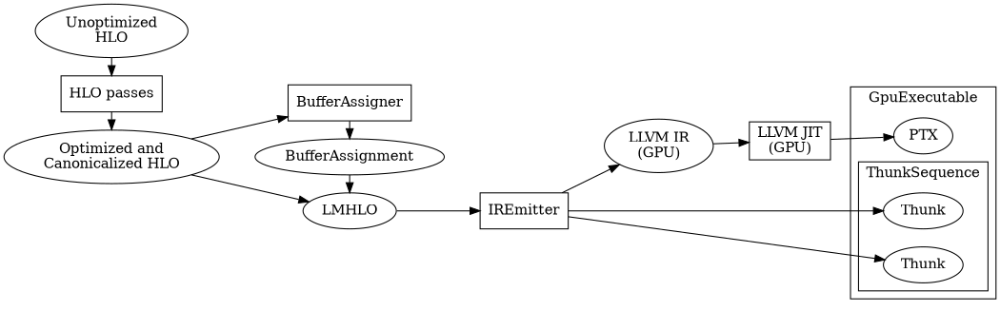
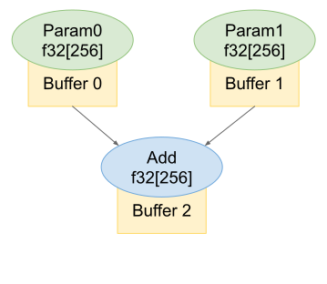

# XLA GPU Backend

<!--* freshness: { owner: "jurahul" reviewed: "2022-02-04" } *-->

## Compile time

At compile time,
[`GpuCompiler`](https://github.com/tensorflow/tensorflow/blob/master/tensorflow/compiler/xla/service/gpu/gpu_compiler.h)
generates
[`GpuExecutable`](https://github.com/tensorflow/tensorflow/blob/master/tensorflow/compiler/xla/service/gpu/gpu_executable.h),
whose `ExecuteOnStream` interface will be called by the XLA service at runtime.
The figure below shows the work flow of `GpuCompiler`.



<center></img></center>

### Optimization

`GpuCompiler` runs a pipeline of target-independent and target-dependent
optimizations on the input HLO graph. For example, it folds
[`Transpose`](https://www.tensorflow.org/xla/operation_semantics#transpose) into
[`Dot`](https://www.tensorflow.org/xla/operation_semantics#dot) in certain
situations so that the `Transpose` instruction can be elided in a cuBLAS gemm
call.

### Canonicalization

After HLO optimizations, `GpuCompiler` runs canonicalization transformations to
ensure `IrEmitter` can emit valid IR. Canonicalization makes later IR emission
easier, because `IrEmitter` currently works on one HLO instruction at a time
without a global view of the entire graph.

### Buffer Analysis

The buffer assignment pass assigns a buffer if necessary to store the result of
each HLO instruction. Actual buffer allocation happens at runtime. Therefore, at
compile time, the buffer analysis assigns `BufferAllocation`s, which contains
metadata (such as the index and shape of the buffer) for `GpuExecutable` to
allocate and deallocate buffers.

### LMHLO Conversion

`GpuCompiler` takes the optimized HLO and `BufferAssignment`, and convert them
to the MLIR dialect
[`LMHLO`](https://github.com/tensorflow/tensorflow/blob/master/tensorflow/compiler/mlir/hlo/include/mlir-hlo/Dialect/lhlo/IR/lhlo_ops.td).

The `LMHLO` dialect is a graph consists of `LMHLO` ops. `LMHLO` ops are
buffer-based and sequentially ordered. The sequential order reflects the
execution order.

In `LMHLO`, direct operand-user information is stripped away, as each op is only
connected with its buffers, not ops which generate those buffers.

Notice that some `LMHLO` ops, e.g. `lmhlo.fusion` or `lmhlo.reduce`, contain
[`MHLO`](https://github.com/tensorflow/tensorflow/blob/master/tensorflow/compiler/mlir/hlo/include/mlir-hlo/Dialect/mhlo/IR/hlo_ops.td)-based
regions. They are tensor-based `MHLO` regions because ops in them don't have
buffers associated.

The code that converts XLA HLO to `LMHLO` is
[here](https://github.com/tensorflow/tensorflow/blob/master/tensorflow/compiler/mlir/xla/transforms/mhlo_to_lhlo_with_xla.h).

Currently, lowering of those `MHLO` regions takes a twist:

*   First, `MHLO` regions get converted back to XLA HLO graphs.
*   Then the converted XLA HLO graphs are handled by
    [`FusedIrEmitter`](https://github.com/tensorflow/tensorflow/blob/master/tensorflow/compiler/xla/service/llvm_ir/fused_ir_emitter.h)
    and
    [`ElementalIrEmitter`](https://github.com/tensorflow/tensorflow/blob/master/tensorflow/compiler/xla/service/elemental_ir_emitter.h).

### IR Emission

`IrEmitter` emits CUDA kernels in LLVM IR to implement most `LMHLO` operations
in the input graph. `GpuCompiler` then compiles emitted LLVM IR to PTX using
LLVM as a JIT compiler. `IrEmitter` does not need to emit IR for some
instructions. For example, `GpuCompiler` implements certain Dot instructions as
cuBLAS gemms, which do not require any customized kernels.

`IrEmitter` has two subclasses:

*   `IrEmitterUnnested`, which emits code for all `LMHLO` instructions, and
*   `IrEmitterNested`, which handles instructions in nested computations (e.g.
    those scalar computations in `Map` and `Reduce`).

`IrEmitterUnnested` emits zero or more global functions for each `LMHLO`
instruction. In contrast, `IrEmitterNested` emits a device function for each HLO
instruction. These device functions, if small, are likely to be inlined to
kernels.

### Thunk Building

Besides emitting LLVM IR, `IrEmitter` also generates a sequence of
[thunks](https://github.com/tensorflow/tensorflow/blob/master/tensorflow/compiler/xla/service/gpu/thunk.h).
Each thunk contains metadata for `GpuExecutable` to invoke an HLO instruction at
runtime. For HLO instructions implemented as cuBLAS gemms, `IrEmitter` generates
`GemmThunk`s whose `ExecuteOnStream` interface calls a cuBLAS gemm via
[StreamExecutor](https://github.com/tensorflow/tensorflow/tree/master/tensorflow/stream_executor)
APIs. For instructions implemented as customized kernels, `IrEmitter` generates
`KernelThunk`s which contain necessary arguments for launching kernels.

<center></img></center>

For instance, the figure above shows an HLO graph that performs an elementwise
add on two input arrays of shape `f32[256]`. Suppose the buffer analysis assigns
buffer 0, 1, and 2 to `Param0`, `Param1`, and `Add`, respectively. Also suppose
`IrEmitter` emits a kernel named "add" for the `Add` instruction. In this case,
`IrEmitter` generates

```
KernelThunk { input buffers = [0, 1], output buffer = [2], kernel name = "add" }
```

At runtime, `GpuExecutable` launches the kernel named "add" with the base
addresses of buffer 0, 1, and 2.

### Constructing GpuExecutable

Finally, `GpuCompiler` constructs a `GpuExecutable` object that wraps the PTX
assembly and the thunk sequence generated by the `IrEmitter`.

## Runtime

At runtime, `GpuExecutable` does the following:

1.  Allocates all buffers assigned by the buffer analysis.
2.  Invokes all the thunks in its thunk sequence by calling their
    `ExecuteOnStream` interface. The base address of the allocated buffers are
    passed as an array of `void*` to the kernels and device functions emitted by
    the `IrEmitter`.
3.  Deallocates all buffers that do not live out.
