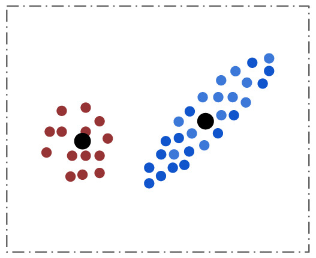

# Gaussian Mixture Models

Gaussian mixture models assume that the input is generated by a mixture of a
finite number of Gaussian distributions with unknown parameters.

Typically an EM (Expectation Maximization) algorithm is used to estimate these
parameters, which include the mean, covariance and mixture ratios of the
underlying components.

We provide a distributed implementation for running the GMM algorithm. Options
are provided to let the user decide on which parameters to learn. The learned
covariance can be either full or diagonal.
