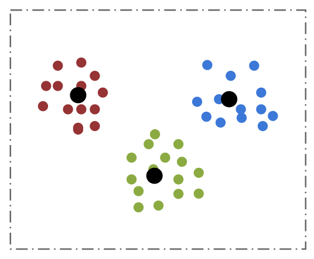

# K-Means Clustering

Given a set of input $$x_i$$, K-means clustering finds a set C of cluster
centers that minimizes the inertia, defined as $$ \sum_{i=0}^{n} \min_{\mu_j \in
C} (||x_i - \mu_j||^2) $$.

The **K-means** algorithm, or **Lloyd's algorithm**, is an iterative approach
where each iteration involves assigning each input point to its closest cluster,
followed by recomputing the new value of the cluster center as the mean of the
points assigned to it. It runs full-batch, which means each iteration goes
through the full set of inputs to compute a new set of cluster centers.
Convergence is typically pretty fast, in terms of number of iterations, but
there can be local minima.

**[Mini-batch K-means](https://www.eecs.tufts.edu/~dsculley/papers/fastkmeans.pdf)**
is a stochastic variant of Lloyd's algorithm which updates the cluster centers
based on a mini-batch of data. It converges much faster than the full-batch
version, especially for large data sets, and the quality is typically close to
the full-batch version.

**[K-Means++](http://ilpubs.stanford.edu:8090/778/1/2006-13.pdf)** is an
approach for computing the initial cluster assignments that is expensive but is
typically less prone to getting stuck in bad local minima.

**[k-MC2](https://www.aaai.org/ocs/index.php/AAAI/AAAI16/paper/view/12147/11759)**
provides a very fast seeding method that provides high quality centers
comparable to K-Means++ seeding. k-MC2 works particularly well if it is combined
with Mini-batch K-Means.

We provide distributed implementations of both full-batch and mini-batch K-Means
algorithm. K-Means++, k-MC2 and random initialization are supported. The user
can also choose between **Cosine** and **Squared Euclidean** distance metrics.
