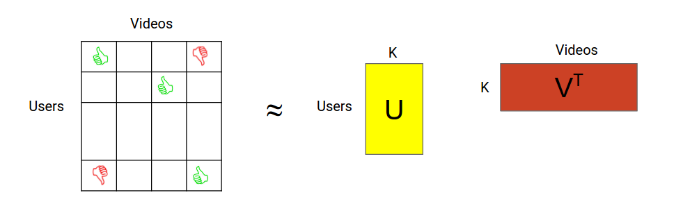

# WALS Factorization

$$
% commands
\newcommand\bracket[2]{\left\langle #1, #2 \right\rangle}
\newcommand\trace{\text{trace}}
\newcommand\Rbb{\mathbb{R}}
$$

### Problem formulation

WALS (Weighed Alternating Least Squares) is an algorithm for factorizing a
sparse matrix $$A \in \Rbb^{n \times m}$$ into low rank factors, $$U \in \Rbb^{n
\times k}$$ and $$V \in \Rbb^{m \times k}$$, such that the product $$UV^T$$ is a
"good" approximation of the full matrix.

Typically, it involves minimizing the following loss function:

$$ min_{U,V}
(\|\sqrt{W} \odot (A- UV^T)\|_F^2 + \lambda (\|U\|_F^2 + \|V\|_F^2)),
$$

where

-   $$\lambda$$ is a regularization parameter,
-   $$\odot$$ denotes the component-wise product,
-   $$W$$ is a weight matrix of the form $$W_{i, j} = w_0 + 1_{A_{ij} \neq 0}R_i
    C_j$$, where $$w_0$$ is the weight of unobserved entries, and $$R \in
    \Rbb^n$$ and $$C \in \Rbb^m$$ are the row and column weights respectively.
    This form of the weight matrix lends this problem to an efficient
    implementation.

### Solution method

The WALS algorithm proceeds in phases, or "sweeps", where each sweep involves
fixing $$U$$ and solving for $$V$$, and then fixing $$V$$ and solving for $$U$$.
Note that each subproblem is an unconstrained quadratic minimization problem and
can be solved exactly. Convergence is typically pretty fast (10-20 sweeps).

### Loss computation

The product $$UV^T$$ is dense, and can be too large to compute. So we use the
following reformulation of the loss to be able to compute it efficiently. First,
we decompose the norm into two terms, corresponding to the sparsity pattern of
$$A$$. Let $$S = \{(i, j) : A_{i, j} \neq 0\}$$.

$$
\begin{align}
\|\sqrt W \odot (A - UV^T)\|_F^2
&= \sum_{(i, j) \in S} (w_0 + R_i C_j) (A_{ij} - \bracket{u_i}{v_j})^2 +
\sum_{(i, j) \not\in S} w_0 (\bracket{u_i}{v_j})^2 \\
&= \sum_{(i, j) \in S} \left( (w_0 + R_i C_j) (A_{ij} - \bracket{u_i}{v_j})^2 -
w_0 \bracket{u_i}{v_j}^2 \right) + w_0\|UV^T\|_F^2
\end{align}
$$

The last term can be computed efficiently by observing that

$$
\|UV^T\|_F^2 = \trace(UV^TVU^T) = \trace(U^TUV^TV)
$$

Each of the Gramian matrices $$U^TU$$ and $$V^TV$$ are $$k\times k$$ and are
cheap to store. Additionally, $$\|U\|_F^2 = \trace(U^TU)$$ and similarly for
$$V$$, so we can use the trace of the individual Gramians to compute the norms.
