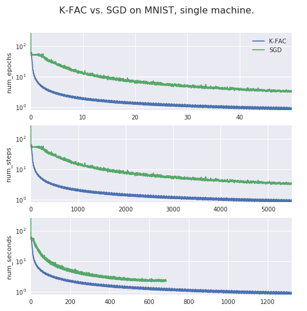

# K-FAC: Kronecker-Factored Approximate Curvature

# <font color="red", size=10><u>WARNING: </u></font>
# ==third_party/tensorflow/contrib/kfac is deprecated. This will be==
# ==removed on 15-07-2018. <!-- STY:begin_strip_and_replace -->Please import third_party/tensorflow_kfac.==
# ==<!-- STY:end_strip_and_replace Please check https://github.com/tensorflow/kfac. -->==

**K-FAC in TensorFlow** is an implementation of [K-FAC][kfac-paper], an
approximate second-order optimization method, in TensorFlow. When applied to
feedforward and convolutional neural networks, K-FAC can converge `>3.5x`
faster in `>14x` fewer iterations than SGD with Momentum.

[kfac-paper]: https://arxiv.org/abs/1503.05671

## What is K-FAC?

K-FAC, short for "Kronecker-factored Approximate Curvature", is an approximation
to the [Natural Gradient][natural_gradient] algorithm designed specifically for
neural networks. It maintains a block-diagonal approximation to the [Fisher
Information matrix][fisher_information], whose inverse preconditions the
gradient.

K-FAC can be used in place of SGD, Adam, and other `Optimizer` implementations.
Experimentally, K-FAC converges `>3.5x` faster than well-tuned SGD.

Unlike most optimizers, K-FAC exploits structure in the model itself (e.g. "What
are the weights for layer i?"). As such, you must add some additional code while
constructing your model to use K-FAC.

[natural_gradient]: http://www.mitpressjournals.org/doi/abs/10.1162/089976698300017746
[fisher_information]: https://en.wikipedia.org/wiki/Fisher_information#Matrix_form

## Why should I use K-FAC?

K-FAC can take advantage of the curvature of the optimization problem, resulting
in **faster training**. For an 8-layer Autoencoder, K-FAC converges to the same
loss as SGD with Momentum in 3.8x fewer seconds and 14.7x fewer updates. See how
training loss changes as a function of number of epochs, steps, and seconds:



## Is K-FAC for me?

If you have a feedforward or convolutional model for classification that is
converging too slowly, K-FAC is for you. K-FAC can be used in your model if:

*   Your model defines a posterior distribution.
*   Your model uses only fully-connected or convolutional layers (residual
    connections OK).
*   You are training on CPU or GPU.
*   You can modify model code to register layers with K-FAC.

## How do I use K-FAC?

Using K-FAC requires three steps:

1.  Registering layer inputs, weights, and pre-activations with a
    `LayerCollection`.
1.  Minimizing the loss with a `KfacOptimizer`.
1.  Keeping K-FAC's preconditioner updated.

```python
# Build model.
w = tf.get_variable("w", ...)
b = tf.get_variable("b", ...)
logits = tf.matmul(x, w) + b
loss = tf.reduce_mean(
  tf.nn.softmax_cross_entropy_with_logits(labels=y, logits=logits))

# Register layers.
layer_collection = LayerCollection()
layer_collection.register_fully_connected((w, b), x, logits)
layer_collection.register_categorical_predictive_distribution(logits)

# Construct training ops.
optimizer = KfacOptimizer(..., layer_collection=layer_collection)
train_op = optimizer.minimize(loss)

# Minimize loss.
with tf.Session() as sess:
  ...
  sess.run([train_op, optimizer.cov_update_op, optimizer.inv_update_op])
```

See [`examples/`](https://www.tensorflow.org/code/tensorflow/contrib/kfac/examples/) for runnable, end-to-end illustrations.

## Authors

- Alok Aggarwal
- Daniel Duckworth
- James Martens
- Matthew Johnson
- Olga Wichrowska
- Roger Grosse
