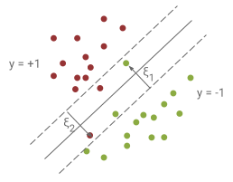

# Support Vector Machines (SVMs)

Support Vector Machines (SVMs) is a class of supervised machine learning
algorithms that scale well in high dimensional spaces.  SVMs search for the
boundary (hyperplane for linear SVM classifier) that maximizes the distance to
the nearest training data point of any class (i.e., the **margin**).

The [**tf.contrib.learn.SVM**]
(https://www.tensorflow.org/code/tensorflow/contrib/learn/python/learn/estimators/svm.py)
Estimator currently implements linear SVMs for binary classification and uses
the hinge loss. Note that tf.contrib.learn.SVM is a **soft margin** classifier,
that is, it returns a linear boundary even when the training data is not
linearly separable. More specifically, tf.contrib.learn.SVM finds the optimal
hyperplane by solving the following optimization problem:

$$
\min_{{\bf w}, {\bf \xi}} \quad \frac{1}{N}\sum_{i=1}^N \xi_i
+  \frac{\lambda}{2}\|{\bf w}\|^2 \\
\textrm{subject to: }
\forall i, \, \xi_i \ge 0, \, \xi_i \ge 1 - y_i {\bf w}^T {\bf x}_i
$$

For the solution of the optimization problem, the Stochastic Dual Coordinate
Ascent ([SDCA](https://www.tensorflow.org/code/tensorflow/contrib/linear_optimizer/kernels/g3doc/readme.md))
algorithm is currently being used as the default optimizer. tf.contrib.learn.SVM
supports (global) $$L1$$ and $$L2$$ regularization and also works with weighted
examples. The implementation works in both single-machine and distributed
settings.
