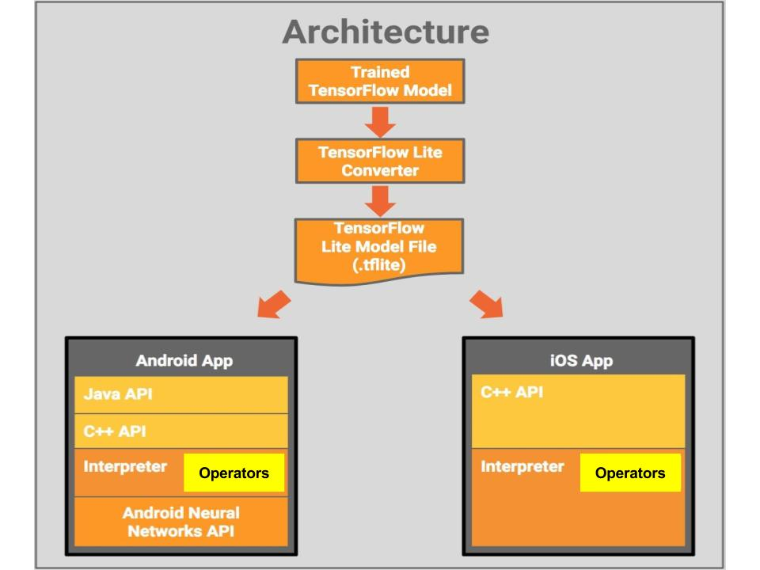

# TensorFlow Lite
TensorFlow Lite is TensorFlow’s lightweight solution for mobile and embedded devices. It enables low-latency inference of on-device machine learning models with a small binary size and fast performance supporting hardware acceleration.

TensorFlow Lite uses many techniques for achieving low latency like optimizing the kernels for specific mobile apps, pre-fused activations, quantized kernels that allow smaller and faster (fixed-point math) models, and in the future, leverage specialized machine learning hardware to get the best possible performance for a particular model on a particular device.


# Getting Started with a Demo App

This section contains an example application using TensorFlow Lite for Android devices. The demo is a sample camera app that classifies images continuously using a quantized Mobilenet model. A device running Android 5.0 ( API 21) or higher is required to run the demo.

There are 3 ways to get the demo app to your device
 - Download the prebuilt binary or
 - Use Android Studio to build the application or
 - Download the source code for TensorFlow Lite and the demo and build it using bazel

## Description
In the demo app, inference is done using the TensorFlow Lite Java API. The demo app classifies frames in real-time, displaying the top most probable classifications. It also displays the time taken to detect the object.

## Downloading the pre-built binary
The  fastest path to trying the demo, is to download the pre-built binary
[TfLiteCameraDemo.apk](https://storage.googleapis.com/download.tensorflow.org/deps/tflite/TfLiteCameraDemo.apk)

Once the apk is installed, click the app icon to start the app. The first-time the app is opened, the app asks for runtime permissions to access the device camera. The demo app opens the back-camera of the device and recognizes the objects in the camera’s field of view. At the bottom of the image (or at the left of the image if the device is in landscape mode), it shows the latency of classification and the top three objects classified.

## Building in Android Studio using TensorFlow Lite AAR from JCenter
The simplest way to compile the demo app, and try out changes to the project code is to use AndroidStudio.

 - Install the latest version of Android Studio 3 as specified [here](https://developer.android.com/studio/index.html).
 - Make sure the Android SDK version is greater than 26 and NDK version is greater than 14 (in the Android Studio Settings).
 - Import the tensorflow/contrib/lite/java/demo directory as a new Android Studio project.
 - Click through installing all the Gradle extensions it requests.
 - Download the quantized Mobilenet TensorFlow Lite model from [here](https://storage.googleapis.com/download.tensorflow.org/models/tflite/mobilenet_v1_224_android_quant_2017_11_08.zip)
     - unzip and copy mobilenet_quant_v1_224.tflite to the assets directory:
       tensorflow/contrib/lite/java/demo/app/src/main/assets/
 - Build and run the demo app

## Building TensorFlow Lite and the demo app from source

### Clone the TensorFlow repo
- git clone
  [https://github.com/tensorflow/tensorflow](https://github.com/tensorflow/tensorflow)

### Install Bazel
If bazel is not installed on your system, install it now by following [these directions](https://bazel.build/versions/master/docs/install.html)

NOTE: Bazel does not currently support building for Android on Windows. Full support for gradle/cmake builds is coming soon, but in the meantime Windows users should download the [prebuilt binary](https://storage.googleapis.com/download.tensorflow.org/deps/tflite/TfLiteCameraDemo.apk) instead.

### Install Android NDK and SDK
Bazel is the primary build system for TensorFlow. Bazel and the Android NDK and SDK must be installed on your system.
 - Install the latest version of Bazel as per the instructions on the [Bazel website](https://bazel.build/versions/master/docs/install.html)
 - The Android NDK is required to build the native (C/C++) TensorFlow Lite code. The current recommended version is 14b, which can be found [here](https://developer.android.com/ndk/downloads/older_releases.html#ndk-14b-downloads).
 - The Android SDK and build tools may be obtained [here](https://developer.android.com/tools/revisions/build-tools.html), or alternatively as part of [Android Studio](https://developer.android.com/studio/index.html). Build tools API >= 23 is required to build the TF Android demo (though it will run on API >= 21 devices).
 - In the root of the TensorFlow repository update the `WORKSPACE` file with the `api_level` and location of the SDK and NDK. If you installed it with AndroidStudio the SDK path can be found in the SDK manager, and the default NDK path is:`{SDK path}/ndk-bundle.`

```
 Android_sdk_repository (
   name = "androidsdk",
   api_level = 23,
   build_tools_version = "23.0.2",
   path = "/home/xxxx/android-sdk-linux/", )

android_ndk_repository(
  name="androidndk",
  path="/home/xxxx/android-ndk-r10e/",
  api_level=19)

```
Additional details on building with Android can be found [here](https://github.com/tensorflow/tensorflow/tree/master/tensorflow/contrib/lite/java/demo/README.md).

### Build the  source code
Run bazel with the following command to build the demo.

Build the demo app:
bazel build --cxxopt='--std=c++11' //tensorflow/contrib/lite/java/demo/app/src/main:TfLiteCameraDemo

### Note

Currently, we only support building the Android demo app within a Python 2
environment (due to a Bazel bug).

### More about the demo
The demo is resizing each camera image frame to (224 width * 224 height) to match the  quantized Mobilenet model being used. The resized image is converted into a ByteBuffer row by row of size 1 * 224 * 224 * 3 bytes, where 1 is the number of images in a batch 224 * 224 is the width and height of the image 3 bytes represents three colors of a pixel. This demo uses the TensorFlow Lite Java inference API for models which take a single input and provide a single output. This outputs a two-dimensional array, with the first dimension being the category index and the second dimension being the confidence of classification. The Mobilenet model has 1001 unique categories and the app sorts the probabilities of all the categories and displays the top three. The Mobilenet quantized model is bundled within the assets directory of the app.

# TensorFlow Lite Quick Start

## Step 1. Decide which GraphDef to use
 Depending on the use case, the developer may choose to use one of the popular
 open-sourced models such as InceptionV3 or MobileNets, re-train these models
 with their own custom data set or even build their own custom model.

### Using a pre-trained model

[MobileNets](https://research.googleblog.com/2017/06/mobilenets-open-source-models-for.html) is a family of mobile-first computer vision models for [TensorFlow](https://www.tensorflow.org/) designed to effectively maximize accuracy while being mindful of the restricted resources for an on-device or embedded application. MobileNets are small, low-latency, low-power models parameterized to meet the resource constraints of a variety of use cases. They can be built upon for classification, detection, embeddings and segmentation similar to how other popular large scale models, such as [Inception](https://arxiv.org/pdf/1602.07261.pdf), are used. Google provides 16 pre-trained [ImageNet](http://www.image-net.org/challenges/LSVRC/)  classification checkpoints for MobileNets for use in mobile projects of all sizes.

[Inception-v3](https://arxiv.org/abs/1512.00567) is an image recognition model which achieves fairly high accuracy in recognizing general objects with 1000 classes, like "Zebra", "Dalmatian", and "Dishwasher". The model extracts general features from input images using a convolutional neural network and classifies them based on those features with fully-connected and softmax layers.

[On Device Smart Reply](https://research.googleblog.com/2017/02/on-device-machine-intelligence.html)  is an on-device model which provides one-touch replies for an incoming text message by suggesting contextually relevant messages. The model is built specifically for memory constrained devices such as watches & phones and it has been successfully used to surface [Smart Replies on Android Wear](https://research.googleblog.com/2017/02/on-device-machine-intelligence.html). Note that this model only works on Android as of now.

These pre-trained models can be downloaded from [here](g3doc/models.md).

### Retrain Inception-V3 or MobileNet for a custom data set
The above pre-trained models have been trained on the ImageNet data set, which consists of 1000 predefined classes. A model will need to be re-trained if these classes are not relevant or useful for a given use case. This technique is called transfer learning, which starts with a model that has been already trained on a problem and will then be retrained on a similar problem. Deep learning from scratch can take days, but transfer learning can be done fairly quickly. In order to do this, a developer will need to generate their custom data set labeled with the relevant classes.

The [TensorFlow for Poets](https://codelabs.developers.google.com/codelabs/tensorflow-for-poets/) codelab walks through this process step-by-step. The retraining code supports retraining for both floating point and quantized inference.


### Train a custom model
A developer may choose to train a custom model using Tensorflow. TensorFlow documentation has [several tutorials](https://www.tensorflow.org/tutorials/) for building and training models. If the user has written a model using TensorFlow’s Slim Framework the first step is to export this to a GraphDef file. This is necessary because Slim does not store the model structure outside the code, so to communicate with other parts of the framework it needs to be exported. Documentation for the export can be found [here](https://github.com/tensorflow/models/tree/master/research/slim#Export). The output of this step will be a .pb file for the custom model.

TensorFlow Lite currently supports a subset of TensorFlow operators. Please refer to [this document](https://github.com/tensorflow/tensorflow/tree/master/tensorflow/contrib/lite/g3doc/tf_ops_compatibility.md) for details of supported operators and their usage. This
set will continue to expand in future releases of Tensorflow Lite.


## Step 2. Model format conversion

The model generated in Step 1 is a standard Tensorflow model. After the completion of Step 1 a user should have a standard .pb or .pbtxt GraphDef file. If the application developer is using a pre-trained model (as defined in Step 1 above), they can download a ready to use, already converted model for use from [here](https://github.com/tensorflow/tensorflow/tree/master/tensorflow/contrib/lite/g3doc/models.md). Models generated using retraining (aka transfer learning) or custom models will need to be converted using the steps mentioned below.

A prerequisite to converting the model to the Tensorflow Lite format is to freeze the graph.

Since we employ several formats, the following definitions may be useful:
 - GraphDef (.pb) - a protobuf that represents the TensorFlow training and or computation graph. This contains operators, tensors, and variables definitions.

 - CheckPoint (.ckpt) - Serialized variables from a TensorFlow graph. Note, this does not contain the graph structure, so alone it cannot typically be interpreted.

 - FrozenGraphDef - a subclass of GraphDef that contains no variables. A GraphDef can be converted to a frozen graphdef by taking a checkpoint and a graphdef and converting every variable into a constant with the value looked up in the checkpoint.

 - SavedModel - A collection of GraphDef and CheckPoint together with a signature that labels input and output arguments to a model. A GraphDef and Checkpoint can be extracted from a saved model.

 - TensorFlow lite model (.lite) - a serialized flatbuffer, containing TensorFlow lite operators and Tensors for the TensorFlow lite interpreter. This is most analogous to TensorFlow frozen GraphDefs.

### Freeze Graph
To use this .pb GraphDef file within TensorFlow Lite, the application developer will need checkpoints containing trained weight parameters. The .pb contains only the structure of the graph. The process of merging the checkpoint values with the graph structure is known as “freezing” the graph.

The developer should know where the checkpoints folder is present or checkpoints can also be downloaded for a pre-trained model (Example: Here is a link to the [MobileNets](https://github.com/tensorflow/models/blob/master/research/slim/nets/mobilenet_v1.md)).

Graph freezing can be done using the command below (and modifying the arguments appropriately)

```
bazel build tensorflow/python/tools:freeze_graph

bazel-bin/tensorflow/python/tools/freeze_graph\
    --input_graph=/tmp/mobilenet_v1_224.pb \
    --input_checkpoint=/tmp/checkpoints/mobilenet-10202.ckpt \
    --input_binary=true --output_graph=/tmp/frozen_mobilenet_v1_224.pb \
    --output_node_names=MobileNet/Predictions/Reshape_1
```

The user has to first build the freeze_graph script using bazel and then run the script.  The input_binary flag has to be enabled to ensure that the protobuf is read and written in binary format.  The user has to input the .pb and the .ckpt files to freeze the graph The output_node_names may not be obvious outside of the code that built the model. The easiest way to find them is to visualize the graph, either with
graphviz, or [in tensorboard](https://codelabs.developers.google.com/codelabs/tensorflow-for-poets-2/#3).

This frozen Graphdef is now ready to be converted to flatbuffer format (.lite) for use on Android or iOS.  On Android users have the flexibility to use either the float or quantized versions of the frozen graphdef, if available, using the Tensorflow Optimizing Converter tool.

Here is a sample command line to convert the frozen Graphdef to '.lite' format for  The Tensorflow Optimizing Converter supports both float and quantized models, however, different configuration parameters are needed depending on whether a FLOAT or QUANTIZED mode is being used.

```
bazel build tensorflow/contrib/lite/toco:toco

bazel-bin/tensorflow/contrib/lite/toco/toco -- \
  --input_file=(pwd)/mobilenet_v1_1.0_224/frozen_graph.pb \
  --input_format=TENSORFLOW_GRAPHDEF  --output_format=TFLITE \
  --output_file=/tmp/mobilenet_v1_1.0_224.lite --inference_type=FLOAT \
  --input_type=FLOAT --input_arrays=input \
  --output_arrays=MobilenetV1/Predictions/Reshape_1 --input_shapes=1,224,224,3
```

- The input_file argument should point to the frozen GraphDef file that holds the model architecture.
- The output_file argument should point to where the TensorFlow Lite model file should be generated.
- The input_type and inference_type arguments should be set to FLOAT, unless converted a [quantized](https://github.com/tensorflow/tensorflow/tree/master/tensorflow/contrib/lite/g3doc/) model.
- Setting the input_array, output_array and input_shape arguments are a bit trickier. The easiest way to find these values is to explore the graph in tensorboard .  The user should reuse the arguments that were used for specifying the output nodes for inference in the `freeze_graph`step.

Note, it is also possible to use the Tensorflow Optimizing Converter through protos either from Python or from the command line see the
documentation [here](https://github.com/tensorflow/tensorflow/tree/mastertensorflow/contrib/lite/python:toco_from_protos target) A developer can then integrate the conversion step into their model design workflow to ensure that a model will be easily convertible to a mobile inference graph. For example,

```
import tensorflow as tf

img = tf.placeholder(name="img", dtype=tf.float32, shape=(1, 64, 64, 3))
val = img + tf.constant([1., 2., 3.]) + tf.constant([1., 4., 4.])
out = tf.identity(val, name="out")
with tf.Session() as sess:
  tflite_model = tf.contrib.lite.toco_convert(sess.graph_def, [img], [out])
  open("converteds_model.tflite", "wb").write(tflite_model)

```
For detailed instructions on how to use the Tensorflow Optimizing Converter, please see [here](https://github.com/tensorflow/tensorflow/tree/master/tensorflow/contrib/lite/toco/g3doc/cmdline_examples.md).

You may refer to the [Ops compatibility guide](https://github.com/tensorflow/tensorflow/tree/master/tensorflow/contrib/lite/g3doc/tf_ops_compatibility.md) for troubleshooting help. If that doesn’t help, please file an [issue](https://github.com/tensorflow/tensorflow/issues).

## Step 3. Use the TensorFlow Lite model for inference in a mobile app

After completion of Step 2 the developer should have a .lite model.

### For Android
Because Android apps need to be written in Java, and core TensorFlow is in C++, a JNI library is provided to interface between the two. Its interface is aimed only at inference, so it provides the ability to load a graph, set up inputs, and run the model to calculate particular outputs. The full documentation for the set of methods can be seen [here](https://github.com/tensorflow/tensorflow/blob/master/tensorflow/contrib/lite/g3doc/). The demo app is also open sourced on [github](https://github.com/tensorflow/tensorflow/tree/master/tensorflow/contrib/lite/java/demo/app).

The [demo app](https://github.com/tensorflow/tensorflow/tree/master/tensorflow/contrib/lite/java/demo/app)  uses this interface, so it’s a good place to look for example usage. You can also download the prebuilt binary [here](http://download.tensorflow.org/deps/tflite/TfLiteCameraDemo.apk).

Note that you’d need to follow instructions for installing TensorFlow on Android, setting up bazel and Android Studio outlined [here](https://www.tensorflow.org/mobile/android_build).

### For iOS
Follow the documentation [here](https://github.com/tensorflow/tensorflow/tree/master/tensorflow/contrib/lite/g3doc/ios.md) to get integrate a TFLite model into your app.
