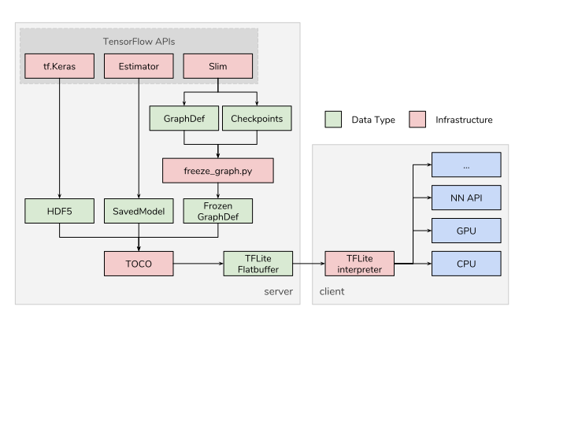

# TOCO: TensorFlow Lite Optimizing Converter

The TensorFlow Lite Optimizing Converter converts TensorFlow graphs into
TensorFlow Lite graphs. There are additional usages that are also detailed in
the usage documentation.

## Usage documentation

Usage information is given in these documents:

*   [Command-line glossary](g3doc/cmdline_reference.md)
*   [Command-line examples](g3doc/cmdline_examples.md)
*   [Python API examples](g3doc/python_api.md)

## Where the converter fits in the TensorFlow landscape

Once an application developer has a trained TensorFlow model, TOCO will accept
that model and generate a TensorFlow Lite
[FlatBuffer](https://google.github.io/flatbuffers/) file. TOCO currently supports
[SavedModels](https://www.tensorflow.org/guide/saved_model#using_savedmodel_with_estimators)
and frozen graphs (models generated via
[freeze_graph.py](https://github.com/tensorflow/tensorflow/blob/master/tensorflow/python/tools/freeze_graph.py)).
The TensorFlow Lite FlatBuffer file can be shipped to client devices, generally
mobile devices, where the TensorFlow Lite interpreter handles them on-device.
This flow is represented in the diagram below.

