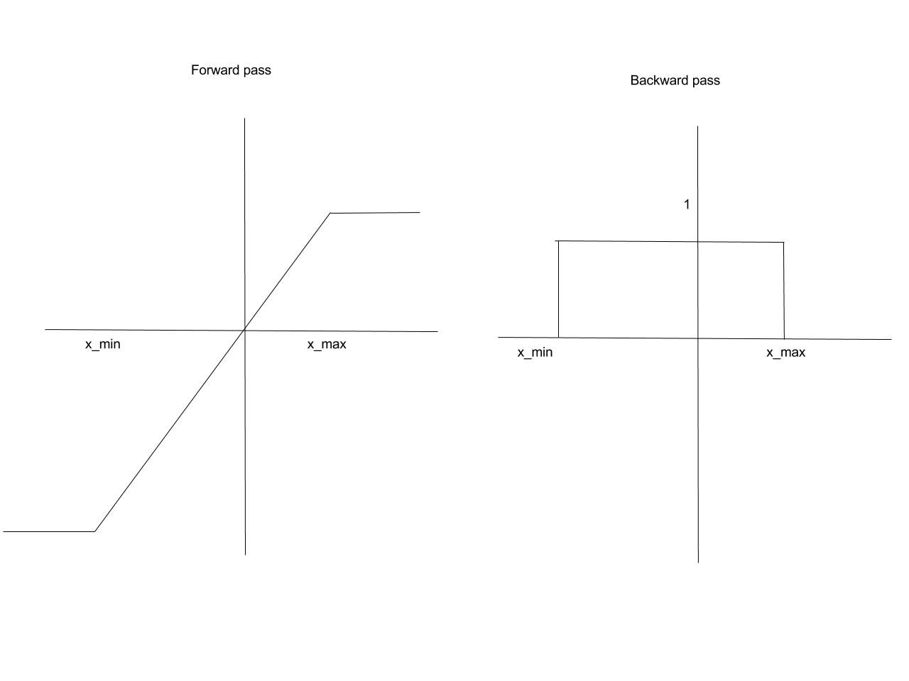

tf.contrib.quantize provides tools for transforming graphs to include ops to
model quantization of weights, biases and activations during both training and
inference. This is done using the
[fake quantization op]
(https://www.tensorflow.org/versions/r0.12/api_docs/python/array_ops/fake_quantization),
which is described below:

Recent literature has shown that fixed point networks provide comparable
performance to floating point networks [1]. This is achieved by modeling the
quantization operation during training in both the forward and backward passes.
The fake quantization operator achieves this by modeling the quantizer as a pass
through estimator [2]. Note that during back propagation, the parameters are
updated at high precision as this is needed to ensure sufficient precision in
accumulating tiny adjustments to the parameters. However, for the forward pass,
the parameters and activations are quantized to the desired lower precision.
 

###Forward pass

\begin{equation*}
f_Q(x) = \Delta\text{ }round\left(\frac{sat\left(x\right)-x_{min}}{\Delta}\right)
\end{equation*}

where

$$
\begin{equation*}
sat(x) =
\left\{
	\begin{array}{ll}
		x_{min}  & \mbox{if } x \le x_{min} \\
		x & \mbox{if } x_{min} \leq x \leq x_{max} \\
    x_{max} & \mbox{if } x_{max} \le x
	\end{array}
\right.
\end{equation*}
$$

where $$\Delta$$ is the Quantizer Step size, given by
$$\Delta =\frac{x_{max} - x_{min} }{255} $$ and $$x_{min} $$ and $$x_{max}$$ are
the minimum and maximum values of the variable under consideration. Note that
the rounding performed is deterministic and corresponds to asymmetric rounding,
which is supported in almost all hardware platforms.

###Backward pass
For the backward pass, we model the quantizer as a piecewise linear block, with
derivatives that are non-zero only in the linear region.

\begin{equation*}
\frac{df_Q(x)}{dx}=1, x_{min} \leq x \leq x_{max},\text{ 0  elsewhere }
\end{equation*}

Therefore, the backward pass through the quantizer reduces to passing through
the gradients as long as the inputs to the quantizer are in the linear region.
Otherwise, the gradients are set to zero.

Note that the quantizer is fully specified by the min and max values of the
variables being quantized.

[1] P.Gysel, "HARDWARE-ORIENTED APPROXIMATION OF CONVOLUTIONAL
NEURAL NETWORKS", https://arxiv.org/pdf/1604.03168.pdf

[2] Y.Bengio, "Estimating or Propagating Gradients Through Stochastic Neurons
for Conditional Computation", https://arxiv.org/abs/1308.3432
