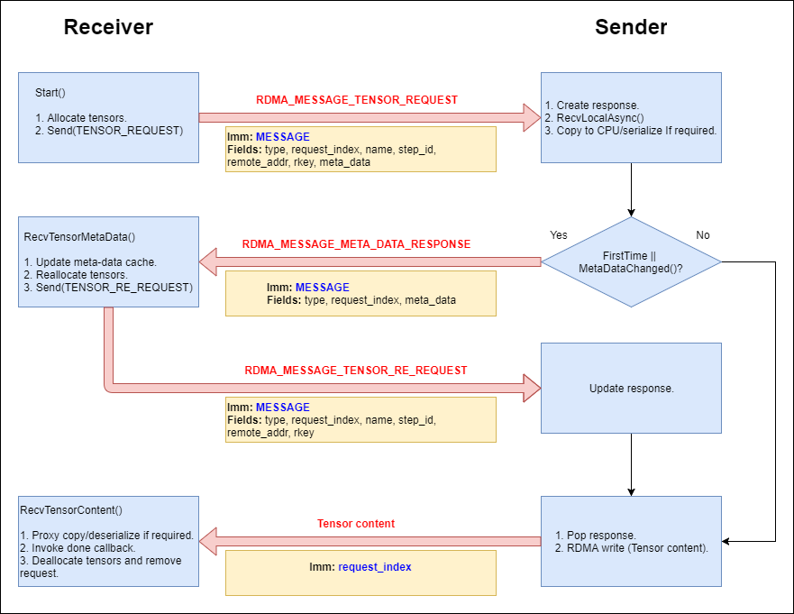

## How to compile, use and configure RDMA-enabled TensorFlow
1. Follow the regular TF compilation instructions. During configure step, if you want ibverbs based RDMA support, answer yes to this question:

    ```Do you wish to build TensorFlow with VERBS-RDMA support [y/N]```

2. To turn on RDMA connection, add the protocol "grpc+verbs" in server definition:

    ```server = tf.train.Server(cluster, job_name="local", task_index=0, protocol='grpc+verbs') # default protocol is 'grpc'```

3. RDMA configuration is done by setting the following environment variables:
   * **RDMA_DEVICE**: The RDMA device name to be used. If not defined by user, a default device with an active port will be set if exists.
   * **RDMA_DEVICE_PORT**: The port within the selected device. Not relevant if RDMA_DEVICE is not defined. If not defined by user, a default active port will be set if exists.
   * **RDMA_GID_INDEX**: The GID index of the port. If not defined by user, a default suitable GID index will be set (RoCEV2 is favourable as default).
   * **RDMA_QP_PKEY_INDEX**: The Pkey for the QP. If not defined by user, the default value is 0.
   * **RDMA_QP_QUEUE_DEPTH**: TX/RX queue size for the QP. If not defined by user, the default value is 1024.
   * **RDMA_QP_TIMEOUT**: The retransmission timeout for QPs. If not defined by user, the default value is 14.
   * **RDMA_QP_RETRY_COUNT**: Number of retransmission for QPs. If not defined by user, the default value is 7.
   * **RDMA_QP_SL**: Service level configuration for QOS and ECN, valid values are 0-7. If not defined by user, the default value is 0.
   * **RDMA_QP_MTU**: MTU configuration for the QPs. If not defined by user, the default value is active MTU from query_port.
   * **RDMA_TRAFFIC_CLASS**: Traffic class configuration for QP, in case of DSCP trust level QoS configuration. If not defined by user, the default value is 0. For more info see [HowTo Configure Trust state on Mellanox Adapters](https://community.mellanox.com/docs/DOC-2866).

## Overview
The design is based on TensorFlow r1.0. An RDMA path is added between servers for tensor transfer (weights, gradients, etc). The existing GRPC path remains and is responsible for "administrative" tasks, such as setting up the RDMA path, exchanging computation graphs, etc.

During the server setup, an RDMA manager is created to manage low-level RDMA components such as RDMA channel and RDMA adapter, an RDMA rendezvous manager is created to oversee send/recv operations between servers. Following the distributed TensorFlow design philosophy, the send operation is passive, i.e. merely placing a tensor in the local out-going table. It is the receive operation that actually initiates the tensor transfer.

TensorFlow dynamically allocates memory for tensors that are to be sent or received. This causes difficulty for RDMA operations where pinned memory is required. Few remedies are possible:
1. The memory is pinned, transferred, then unpinned for each and every tensor to be transferred. This incurs significant operation overhead since pinning and unpinning memory for each dynamically generated tensor is slow. 
2. Buffer is pre-allocated and pinned for each tensor. This incurs large memory overhead and extra copying from the tensor to its pinned buffer, but may still be faster than the former.
3. Following HKUST research on the use of GPU direct, and their [GDR implementation](https://github.com/tensorflow/tensorflow/blob/master/tensorflow/contrib/gdr/README.md), there is a smart way to benefit from the TensorFlow allocation theme which is mostly pool based, i.e allocators pre-allocate a large memory block, and allocate the tensors from there. By attaching a custom Visitor to relevant allocators, we can do a single registration of the entire memory block, which zeros the registration overhead. Once the block is registered, each new tensor allocated will be at a registered address, which will allow us to do direct RDMA writes to it.

For best performance, we will adopt HKUST 0 copies approach in our solution. This means:

1. Tensor writes will be done directly from the source tensor to the **result** tensor, with no memory copies in between. This should be done for all DMAable tensors which are located either on CPU or on a RDMA compatible GPU device (GPU direct). 
2. Non DMAable tensors (CanMemCopy == false) will be serialized to a TensorProto on the sender side, RDMA written to a registered buffer on the receiver side, and then deserialized by the receiver.
3. Tensors which are located on a non-RDMA-compatible GPU, will be RDMA written to a registered CPU **proxy** buffer on the receiver side, and then copied to GPU by the receiver.

## Design details

### Terminology

* **Sender** - The node which sends the tensor.
* **Receiver** - The node which receives the tensor.
* **Result tensor** - The destination tensor, allocated on its appropriate device.
* **Proxy tensor** - A CPU allocated tensor, which will be used in the case where the result tensor cannot be RDMA written to directly (GPU direct is disabled or not available). The RDMA write will therefore be done to the proxy tensor, and afterwards we will do a manual local copy from it to the result tensor.

### Messages

* RDMA_MESSAGE_TENSOR_REQUEST
* RDMA_MESSAGE_META_DATA_RESPONSE
* RDMA_MESSAGE_TENSOR_RE_REQUEST

### Transport protocol

The tensor transfer process is initiated when the receiver requests a tensor. In code it is done by calling **Rendezvous::Recv()** or **Rendezvous::RecvAsync()**. The TensorFlow base implementation handles the case where the requested tensor is located on the same node. The more interesting case where the requested tensor is located on a remote node (receiver != sender) is to be handled in a derivation of the pure virtual **BaseRemoteRendezvous::RecvFromRemoteAsync()**. TensorFlow provides a default GRPC based implementation which comes in the vanilla version but suffers in scalability when running large models. Our RDMA based implementation presumes to be more scalable. HKUST's contrib GDR implementation is more scalable than GRPC, and less scalable than ours, only because we did our evolution based on it.

Our entry point is the implementation of **RdmaRemoteRendezvous::RecvFromRemoteAsync()**, located in rdma_rendezvous_mgr.cc. The implementation creates a new **RdmaTensorRequest** object, keyed by request index (uint32_t), stores it in a list of pending requests, and calls its **Start()** method. The **Start()** method basically does 2 things:

1. Allocate the result tensor (and the proxy tensor if required).
2. Send a **RDMA_MESSAGE_TENSOR_REQUEST** to the sender, containing the address of the destination tensor (result/proxy) for RDMA write.

In order to allocate the result and proxy tensors, we need to know the tensor's meta-data, i.e. shape and data-type for DMAable tensors, and proto-size for serialized tensors. Unfortunately, this information is only available on the sender side which complicates manners. In order to avoid sending extra messages for querying the meta-data at each step, we store a local meta-data cache per tensor, which will only be update upon changes. Based on the assumption that the meta-data of a tensor rarely changes between steps, we expect that on most times the cache will only be updated once. The sender is responsible to detect changes in the meta-data, and update the receiver. In order for the sender to know that the meta-data had changed, each **RDMA_MESSAGE_TENSOR_REQUEST** will contain the meta-data that the receiver had grabbed from the local cache. The sender will then compare the meta-data from the message to the tensor's new meta-data.

When the sender receives an **RDMA_MESSAGE_TENSOR_REQUEST**, it will create a new **RdmaTensorResponse** object for the given request message, store it in a list of pending responses, and will invoke its **Start()** method. The **Start()** method does the following:

1. Grab the source tensor from the local table (In code, **RecvLocalAsync()**).
2. If the source tensor is not DMAable, serialize it to a TensorProto.
3. If the source tensor is located on a device which cannot be DMA written from, copy it to CPU.
4. If it is the first time this tensor is requested, or if the tensor's meta-data changed:
	1. Clone the tensor's data to be sent later.
	2. Send a **RDMA_MESSAGE_META_DATA_RESPONSE** containing the new meta-data.
5. Otherwise:
	1. RDMA write the tensor (or TensorProto) to the destination address and rkey specified in the request message. The immediate value for the write will be the request index.


When the receiver receives the **RDMA_MESSAGE_META_DATA_RESPONSE**, it will locate the relevant **RdmaTensorRequest** using the request index specified in the message, and invoke its **RecvTensorMetaData()** which does the following:

1. Update the local meta-data cache.
2. Reallocate the result/proxy tensors. 
3. Re-send the tensor request. For traceability, the new message has a different name: **RDMA_MESSAGE_TENSOR_RE_REQUEST**.

When the sender receives a **RDMA_MESSAGE_TENSOR_RE_REQUEST**, it will locate the relevant **RdmaTensorResponse** using the request index specified in the message, and invoke its **Resume()** method, which will RDMA write the contents of the tensor that was cloned earlier, to the new remote address specified in the re-request.

When the receiver receives the RDMA write, it will locate the relevant **RdmaTensorRequest** using the request index which is the immediate value. It will then invoke its **RecvTensorContent()** which does the following:

1. Proxy copy/deserialize if required.
2. Invoke the done callback.
3. Deallocate the result/proxy tensors and remove the request from the pending list.



### Additional design notes

1. When the sender receives a tensor request, the source tensor may or may not be ready yet. The situation is handled through a process of tag matching:
	* If the request arrives before the tensor is ready, then a callback is put in a local table, and will be invoked once the tensor arrives.
	* If the tensor is ready before the request arrives, than the tensor is put in a local table. When the request arrives, it will invoke the callback immediately.
   In code it is done by calling **RecvLocalAsync()**, which receives the tensor's key, step-id, and the callback.
2. When the callback is invoked, the relevant tensor is removed from the tag matching table. In the case where we need to send the tensor's meta-data, the **RdmaTensorResponse** will store a copy of the tensor until the re-request arrives.
3. The sending of protocol messages (**RDMA_MESSAGE_TENSOR_REQUEST**, **RDMA_MESSAGE_META_DATA_RESPONSE** and **RDMA_MESSAGE_TENSOR_RE_REQUEST**) is done by the class **RdmaMessageBuffer**. All messages are sent using RDMA writes from/to fixed messages buffers. This implies that we cannot send on a specific channel more than one message at a time. In order to synchronize the messages, the **RdmaMessageBuffer** holds the a local and remote buffer statuses which can be either busy or idle. When a write is issued, both statuses will be changed to busy. When the write-complete event is received, the local status is changed to idle. When the write is received on the remote side, the remote side will parse the message, and return an ACK back to the sending side on which the sending side will update the remote status to idle. When both the local and remote statuses are idle, the next message can be sent.
5. ACK writes are empty writes (hence they require no buffer) with immediate value 0xFFFFFFFE. Message writes have the immediate value 0xFFFFFFFF. All other writes are tensor-content writes whose immediate value is the request-index.

### RDMA components

* **enum RdmaImmDataType**       - Immediate types to distinguish between different RDMA writes on the remote side. Ack writes and control-message writes have a fixed immediate value. The rest of the writes are tensor writes and the immediate value is the relevant request index.
* **enum  RdmaWriteIDType**      - Types to distinguish between different RDMA write-complete events: Ack, control message and tensor writes.
* **class RdmaWriteID**          - Context for RDMA write complete events. Holds the RdmaWriteIDType and additional data.
* **class RdmaTensorMetaData**   - Meta-data for a tensor (type, shape, is_dead, proto_size).
* **class RdmaMemoryMgr**        - Manages the meta-data cache, and the registered memory regions.
* **class RdmaTensorRequest**    - Holds and manages information for a single tensor request throughout the entire receive cycle. API:
	* **Start()**                - Start the request sequence.
		* Allocate the result tensor (and proxy tensor if required).
		* Send RDMA_MESSAGE_TENSOR_REQUEST to the remote side.
	* **RecvTensorMetaData()**   - Receive meta-data from the remote side.
		* Update the local meta-data cache.
		* Reallocate the result tensor (and proxy tensor if required).
		* Re-send the request to the remote side.
	* **RecvTensorContent()**    - Receive tensor content from the remote side (RDMA write was completed).
		* Decode proto if required and/or move to GPU if the content was not written to it directly (GPU direct is not available).
		* Invoke the done callback.
* **class RdmaTensorResponse**   - Holds and manages information for a single tensor response throughout the entire send cycle. API:
	* **Start()**                - Start the response sequence. 
		* Find the tensor in the local tag-match table.
		* Compare the tensor's meta-data to the meta-data in the message (taken from the requester's local cache). 
			* If meta-data changed:
				* Clone the tensor to be sent later.
				* Send a meta-data update message and wait for re-request.
			* Else:
				* Send the tensor's content (using direct RDMA write).
	* **Resume()**               - Resume the response sequence after a re-request. Send the tensor's content that was cloned earlier.
	* **Destroy()**              - Destroy the response's resources and remove it form the pending list.
* **class RdmaAdapter**          - The base for RDMA communications. It may contain multiple channels and buffers.  It is responsible for handling various incoming RDMA messages.
* **class RdmaChannel**          - Responsible for RDMA connection to a particular node. It manages messagee buffers. A channel has a request table which stores all the pending tensor requests.
* **class RdmaMessageBuffer**    - Responsible for sending or receiving messages. It has a fixed size memory to store the data. It has a queue to store the pending jobs. A channel has two message buffers one for tx and one for rx.
* **class RdmaMgr**              - Manages the adapter and channels, including channel creation, channel setup via GRPC service, channel lookup, etc.
* **class RdmaRendezvousMgr**    - Manages multiple rdma rendezvous.
* **class RdmaRemoteRendezvous** - A derived class of BaseRemoteRendezvous. This class is the back end for "send" and "recv" ops. When the sendrecv_op wants to send or receive a tensor, it calls the rendezvous' "send" and "recv" functions respectively. Rendezvous are identified by "step_id", a random number, so that tensors for different iterations don't get mixed up.

### Message structure:

| type | name_size | name | step_id | request_index | remote_addr/checksum | rkey | is_dead | data_type | tensor_shape | tensor_bytes | error_status          |
|------|---------- |------|---------|---------------|----------------------|------|---------|-----------|--------------|--------------|-----------------------|
|  1B  |    2B     | 512  |  8B     |      8B       |           8B         |   4B |      1B |     XB    |    XB        |    8B        | Size - 4B, proto - XB |

* **RDMA_MESSAGE_TENSOR_REQUEST**  - (receiver ==> sender) The original tensor request. 
	* type - The message type.
	* name (name_size) - Name of the requested tensor.
	* step_id - Step ID.
	* request_index - Request index.
	* remote_addr/rkey - Address/rkey of the result/proxy tensor. Irrelevant for first-time request.
	* is_dead/data_type/tensor_shape/tensor_bytes - The current meta-data as stored in the receiver local cache. The sender will use that information to know if the receiver's cache requires updating.
* **RDMA_MESSAGE_META_DATA_RESPONSE**  - (sender ==> receiver) The meta-data update message in case meta-data had changed (or if it is the first time the tensor is requested).
	* type - The message type.
	* request_index - Request index.
	* is_dead/data_type/tensor_shape/tensor_bytes - The up-to-date meta-data.
	* checksum - In data validation mode, this will hold the checksum of the source tensor.
* **RDMA_MESSAGE_TENSOR_RE_REQUEST** - (receiver ==> sender) Tensor re-request after meta-data update and reallocation of result/proxy tensors.
	* type - The message type.
	* name (name_size) - Name of the requested tensor.
	* step_id - Step ID.
	* request_index - Request index.
	* remote_addr/rkey - Address/rkey of the reallocated result/proxy tensor.
* **RDMA_MESSAGE_ERROR_STATUS** - (sender ==> receiver) Notify the receiver that an error had occured on the sender side, so it can propagate it to the upper levels.
	* type - The message type.
	* name (name_size) - Name of the requested tensor.
	* step_id - Step ID.
	* request_index - Request index.
	* error_status - The error status (code, message, details).
