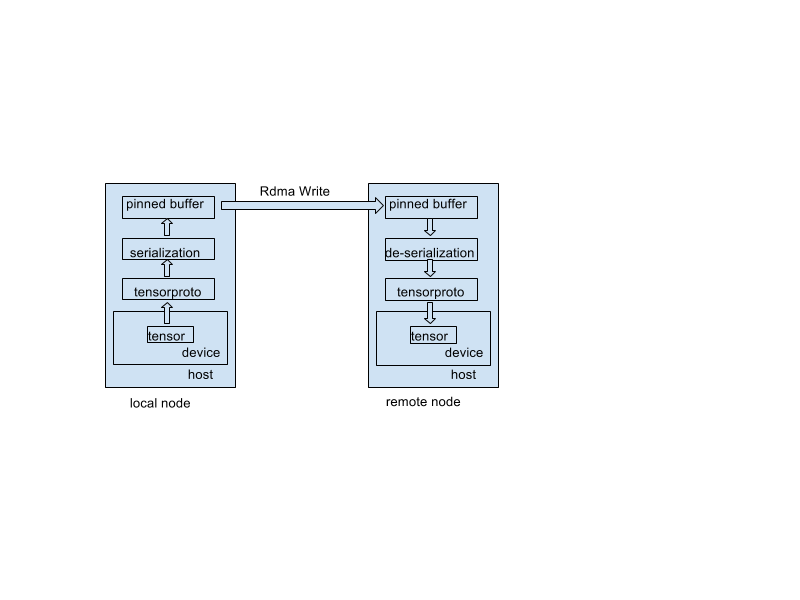

## How to compile, use and configure RDMA-enabled TensorFlow
1. Follow the regular TF compilation instructions. During configure step, if you want ibverbs based RDMA support, answer yes to this question:

    ```Do you wish to build TensorFlow with VERBS-RDMA support [y/N]```

2. To turn on RDMA connection, add the protocol "grpc+verbs" in server definition:

    ```server = tf.train.Server(cluster, job_name="local", task_index=0, protocol='grpc+verbs') # default protocol is 'grpc'```

3. RDMA configuration is done by setting the following environment variables:
   * **RDMA_DEVICE**: The RDMA device name to be used. If not defined by user, a default device with an active port will be set if exists.
   * **RDMA_DEVICE_PORT**: The port within the selected device. Not relevant if RDMA_DEVICE is not defined. If not defined by user, a default active port will be set if exists.
   * **RDMA_GID_INDEX**: The GID index of the port. If not defined by user, a default suitable GID index will be set (RoCEV2 is favourable as default).
   * **RDMA_QP_PKEY_INDEX**: The Pkey for the QP. If not defined by user, the default value is 0.
   * **RDMA_QP_QUEUE_DEPTH**: TX/RX queue size for the QP. If not defined by user, the default value is 1024.
   * **RDMA_QP_TIMEOUT**: The retransmission timeout for QPs. If not defined by user, the default value is 14.
   * **RDMA_QP_RETRY_COUNT**: Number of retransmission for QPs. If not defined by user, the default value is 7.
   * **RDMA_QP_SL**: Service level configuration for QOS and ECN, valid values are 0-7. If not defined by user, the default value is 0.
   * **RDMA_QP_MTU**: MTU configuration for the QPs. If not defined by user, the default value is active MTU from query_port.
   * **RDMA_TRAFFIC_CLASS**: Traffic class configuration for QP, in case of DSCP trust level QoS configuration. If not defined by user, the default value is 0. For more info see [HowTo Configure Trust state on Mellanox Adapters](https://community.mellanox.com/docs/DOC-2866).

## Overview
The design is based on TensorFlow r1.0. An RDMA path is added between servers for tensor transfer (weights, gradients, etc). The existing GRPC path remains and is responsible for "administrative" tasks, such as setting up the RDMA path, exchanging computation graphs, etc.

During the server setup, an RDMA manager is created to manage low-level RDMA components such as RDMA channel and RDMA adapter, an RDMA rendezvous manager is created to oversee send/recv operations between servers. Following the distributed TensorFlow design philosophy, the send operation is passive, i.e. merely placing a tensor in the local out-going table. It is the receive operation that actually initiates the tensor transfer.

TensorFlow dynamically allocates memory for tensors that are to be sent or received. This causes difficulty for RDMA operations where pinned memory is required. Two remedies are possible, either the memory is pinned, transfer, then unpinned for each and every tensor to be transferred, or a buffer is pre-allocated and pinned for each tensor. The former incurs significant operation overhead since pinning and unpinning memory for each dynamically generated tensor is slow. The latter incurs large memory overhead and extra copying from the tensor to its pinned buffer, but may still be faster than the former. The second approach is adopted in this design. Each RDMA channel, representing a RDMA connection to a peer, contains a table of pinned buffers for all the seen tensors that requires transfer. It is assumed that the tensor size rarely changes across different steps. So only one buffer is created for the same tensor across all the steps. In the rare case when the tensor size does increases, the old buffer is discarded and new buffer of larger size is created and pinned.

When a tensor is prepared for transfer, it is first converted to TensorProto, then the proto is serialized to byte array and copied to the pinned buffer. The content of the buffer is transferred to the remote node via RDMA write. On the remote side, the process is reversed. This is illustrated in the diagram below. The conversion of TensorProto is introduced to simplify transfer of string-tensors. Also since the TensorProto lives in host memory, even if the origin tensor lives in the device, the pinned buffers are all allocated in the host memory.


The following improvements can be made in the future. First, conversion to TensorProto and serialization can be avoided for numeric (float/int) tensors since their internal buffer can be access directly as byte array. Second, the pinned buffer may be allocated on device if the tensor is located in the device. This avoids extra device-to-host copy at the expense of extra device memory consumption.
## Design details

### RDMA components

* **RDMA adapter:** The base for RDMA communications. It may contain multiple channels and buffers.  It is responsible for handling various incoming RDMA messages.
* **RDMA channel:** Responsible for RDMA connection to a particular node. It manages multiple buffers. A channel has a callback table which stores all the callbacks for the requested tensors.
* **RDMA buffer:** Responsible for sending or receiving data. It has a fixed size memory to store the data. It has a queue to store the pending jobs. There are three types of buffers, message buffer, ACK buffer and tensor buffer. A channel has two message buffers, two ack buffers and many tensor buffers.
* **RDMA manager:** Manages the adapter and channels, including channel creation, channel setup via GRPC service, channel lookup, etc.
* **RDMA rendezvous manager:** manages multiple rdma rendezvous. 
* **RDMA rendezvous:** a derived class of BaseRemoteRendezvous. This class is the back end for "send" and "recv" ops. When the sendrecv_op wants to send or receive a tensor, it calls the rendezvous' "send" and "recv" functions respectively. Rendezvous are identified by "step_id", a random number, so that tensors for different iterations don't get mixed up.

### The SEND operation

In TensorFlow, when rendezvous sends a tensor, it merely puts a tensor in a local table in the corresponding rendezvous. If the tensor has been requested, a callback exists in the table. "send" will activate the callback, which tries to send the tensor across the node.


### The RECV operation

When a tensor is requested, rendezvous' recv function is called. The function first places a callback in the channel's callback table, which will be activated once the tensor is sent from the source. In the next step, a message is sent to notify the source of the requested tensor. Once the source receives the message, it will check locally for the tensor, if not found, a callback is placed in the table, otherwise, the tensor id will be placed at corresponding RDMA buffer's job queue for future transmission. When a tensor is scheduled to be transmitted, the RDMA buffer needs to have the memory allocated and initialized (registered with the remote buffer info). If the memory is not ready, the transmission is deferred, a message is sent to the destination to establish the memory first. The other case a transmission can be deferred is when the buffer is still being used by an on-going transmission.

### Three types of RDMA buffers

* **Message buffer:** responsible for sending message only.
* **Ack buffer:** once a message is sent, the recipient needs to send an ack via the ack buffer to free up the message buffer. An ack buffer is exclusively for its coupled message buffer.
* **Tensor buffer:** responsible for sending tensors. The recipient needs to send back a message to free up the sending buffer.

### RDMA packet format

|type|name_size|name|step_id|buffer_size|remote_addr|rkey|is_dead|data_type|tensor_shape|tensor_bytes|tensor_buffer|

### Six types of RDMA messages
* RDMA_MESSAGE_ACK
* RDMA_MESSAGE_BUFFER_IDLE
* RDMA_MESSAGE_BUFFER_REQUEST
* RDMA_MESSAGE_BUFFER_RESPONSE
* RDMA_MESSAGE_TENSOR_REQUEST
* RDMA_MESSAGE_TENSOR_WRITE

### Actions upon receiving RDMA messages
* RDMA_MESSAGE_ACK
  * sender: mark local ack buffer idle.
  * receiver: mark remote message buffer idle, send next item.
* RDMA_MESSAGE_BUFFER_IDLE
  * sender: mark local message buffer idle, send next item.
  * receiver: send ack, set remote tensor buffer idle, send next item.
* RDMA_MESSAGE_BUFFER_REQUEST
  * sender: mark local message buffer idle, send next item.
  * receiver: send ack, find or create tensor buffer, send BUFFER_RESPONSE.
* RDMA_MESSAGE_BUFFER_RESPONSE
  * sender: mark local message buffer idle, send next item.
  * receiver: send ack, set remote buffer info, set local and remote buffer idle, send next item.
* RDMA_MESSAGE_TENSOR_REQUEST
  * sender: mark local message buffer idle, send next item.
  * receiver: send ack, find or create tensor buffer, enqueue tensor id, send next item.
* RDMA_MESSAGE_TENSOR_WRITE
  * sender: mark local message buffer idle, send next item.
  * receiver: run callback.
