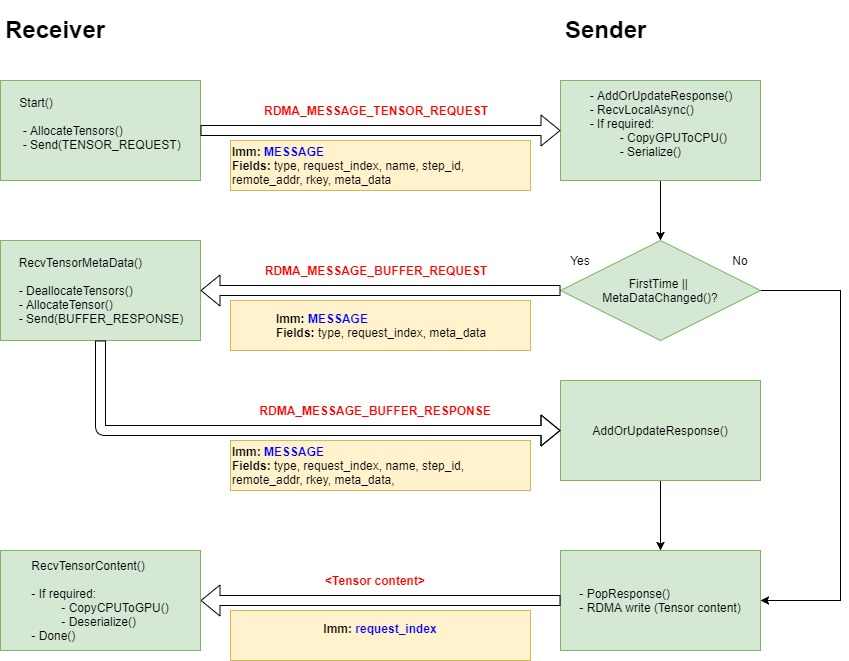

## Verbs implementation to use direct tensor writes (0 copies)

### Motivation:

Following HKUST research on the use of GPU direct, and their [GDR implementation](https://github.com/tensorflow/tensorflow/blob/master/tensorflow/contrib/gdr/README.md), we wish to adopt the 0 copies approach and apply it to the current verbs implementation, while keeping the current implementation advantages, such as configurability and the use of RDMA for control messages.

### Performance:

Compared with the current GRPC, verbs and GDR implementation, the result implementation gave the best performance for every model, with any number of nodes. For VGG16 on 8 nodes with 4 P100 GPUs each, the prototype beat the second place by over 15%.

### Implementation requirements:

1. Tensor writes need to be done directly from the source Tensor to the destination Tensor, with no memory copies in between. This should be done for all DMAble tensors which are located either on CPU or on a RDMA compatible GPU device (GPU direct). 
2. Non DMAble tensors (CanMemCopy == false) will be serialized to proto on the sender side, RDMA written to a registered buffer on the receiver side, and then deserialized by the receiver.
3. Tensors which are located on a non-RDMA-compatible GPU, will be RDMA written to a registered CPU proxy buffer on the receiver side, and then copied to GPU by the receiver.

### Implementation constrains:

For best stability and proof of correctness, we will divide the implementation to two stages:
1. At first stage we will keep changes to the current implementation to the minimum possible. The expense will be that we may have unused or unnecessary code leftovers, which may also affect performance. 
2. At second stage, we will re-iterate over the code and remove irrelevant code parts.
The design of the solution aims that we will achieve both stages with relative ease. 

### Design guidelines:

1. Since we do not want to do any unnecessary memory copying, we will no longer allocate a fixed CPU buffer as the destination for the RDMA write. Instead we will do the writing directly to the result tensor, or if the result tensor is on a device which does not support RDMA, we will do the writing to a proxy CPU tensor and then copy its content to the result tensor.
2. The address of the destination Tensor needs to be sent to the sender side for writing, meaning that the result/proxy tensor should be pre-allocated on the receiver side, prior to sending the tensor request. In order to do that, we need to know its meta-data, i.e. shape and data-type for DMAble tensors, and proto-size for serialized tensors. Unfortunately, this information is only available on the sender side which complicates manners. In order to avoid sending extra messages for querying the meta-data on each step, we store a local meta-data cache per tensor. Based on the assumption that the meta-data of a tensor rarely changes between steps, we expect that on most times the cache will only be updated once. When the sender receives a request for a tensor, if it is the first time this tensor is requested, or in the rare case that the meta-data did change, the sender will first send a meta-data response, on which the receiver will update the local cache, and reallocate the result/proxy tensors if required. When the receiver sends the tensor request, it will contain also the meta-data currently stored in its local cache, so the sender can compare it to see if there was a change.
3. When the sender writes the tensor content to the result tensor, no additional data is being written with it. That means we need to reside on ibverbs immediate (uint32_t) to indicate which request we are responding to (in order to trigger the receive callback). The easiest and most elegant way is to key the recv callback with a unique request_index (uint32_t), instead of the current key_with_step_id (string). 
4. Since the sender no longer writes the tensor from/to fixed buffers, we no longer need to schedule the writes using the local/remote status. In addition we no longer rely on the RmdaTensorBuffer members as the source/destination addresses and rkey/lkey. Instead, each RdmaTensorBuffer will hold multiple "Response" objects (one per step-id), from which we derive destination address and rkey. The source address and lkey are always the ones of the source Tensor.
5. With the addition of tensor pre-allocation, we noticed there is a large code similarity between sending the first tensor request and re-sending the request in case of meta-data changes. After implementing a common method for tensor pre-allocation, it turned out that implementation becomes much simpler by encapsulating the process of request sending/re-sending, meta-data response callback and content response callback, all in a single "Request" class. The request class holds all the relevant request information, which reduces excessive parameter passing and lambda capturing. This decision is purely for elegance and code simplicity, and we decided to implement it in first stage because it makes the implementation much easier.

### New types/classes:

* **enum RdmaImmDataType** - Immediate types to distinguish between different RDMA writes on the remote side. Ack writes and control-message writes have a fixed immediate value. The rest of the writes are tensor writes and the immediate value is the relevant request index.
* **enum  RdmaWriteIDType**    - Types to distinguish between different RDMA write-complete events: Ack, control message, tensor DMA write and tensor proto write.
* **class RdmaWriteID**        - Context for RDMA write complete events. Holds the RdmaWriteIDType and additional data.
* **class RemoteAddressContext** - Remote address information (address + mr). Will be passed as write context for tensor proto writes.
* **class RdmaTensorMetaData** - Meta-data for a tensor (type, shape, is_dead, proto_size).
* **class RdmaMemoryMgr**      - Manages the meta-data cache, and the registered memory regions.
* **class RdmaTensorRequest**  - Holds and manages information for a single tensor request throughout the entire receive cycle. API:
	* Start() - Start the request.
	* RecvTensorMetaData() - Receive meta-data from the remote side.
	* RecvTensorContent() - Receive tensor content from the remote side and invoke the done() callback. 
* **class RdmaTensorResponse** - Holds information for a single tensor response, such as destination address and rkey.

### Protocol changes:

The protocol messages themselves will remain mostly unchanged at the first stage, but will be used differently, as described below. The current messages structures already have most of the required fields for the new implementation. The only change is the "buffer_size" field which is no longer used since we are no longer sending additional information with the tensor, and thus it is now always equal to the "tensor_bytes" field. Instead, we use that field to pass the "request_index".

### Message structure:

| type | name_size | name | step_id | request_index | remote_addr | rkey | is_dead | data_type | tensor_shape | tensor_bytes |
|------|---------- |------|---------|---------------|-------------|------|---------|-----------|--------------|--------------|
|  1B  |    2B     | 512  |  8B     |      8B       |         8B  |   4B |      1B |     XB    |    XB        |    8B        |

* **RDMA_MESSAGE_TENSOR_REQUEST**  - (receiver ==> sender) The original tensor request. 
	* type - The message type.
	* name (name_size) - Name of the requested tensor.
	* step_id - Step ID.
	* request_index - Request index.
	* remote_addr/rkey - Address/rkey of the result/proxy tensor. Irrelevant for first-time request.
	* is_dead/data_type/tensor_shape/tensor_bytes - The current meta-data as stored in the receiver local cache. The sender will use that information to know if the receiver's cache requires updating.
* **RDMA_MESSAGE_BUFFER_REQUEST**  - (sender ==> receiver) The meta-data update message in case meta-data had changed (or if it is the first time the tensor is requested).
	* type - The message type.
	* request_index - Request index.
	* is_dead/data_type/tensor_shape/tensor_bytes - The up-to-date meta-data.
* **RDMA_MESSAGE_BUFFER_RESPONSE** - (receiver ==> sender) Tensor re-request after meta-data update and reallocation of result/proxy tensors.
	* type - The message type.
	* name (name_size) - Name of the requested tensor.
	* step_id - Step ID.
	* request_index - Request index.
	* remote_addr/rkey - Address/rkey of the reallocated result/proxy tensor.
	* is_dead/data_type/tensor_shape/tensor_bytes - The new meta-data. Will be removed in the next phase.
* **RDMA_MESSAGE_TENSOR_WRITE**    - (sender ==> receiver) No longer sent. There is only a direct write of the tensor content to the result/proxy tensor. Request index passed as the immediate value of the write.
* **RDMA_MESSAGE_TENSOR_IDLE**     - (receiver ==> sender) No longer sent.

### Second stage optimizations:
1. Remove unused code leftovers.
2. Remove the ACK buffer completely, since we can rely completely on its immediate value.

### Future optimizations:
1. Map the tensor names to indexes, to significantly reduce the request message size.
2. Understand the purpose of empty tensors and if we can skip remote fetching for them.
3. Consider concatenating multiple requests and/or using multiple message buffers.
4. Consider a no-request architecture.
