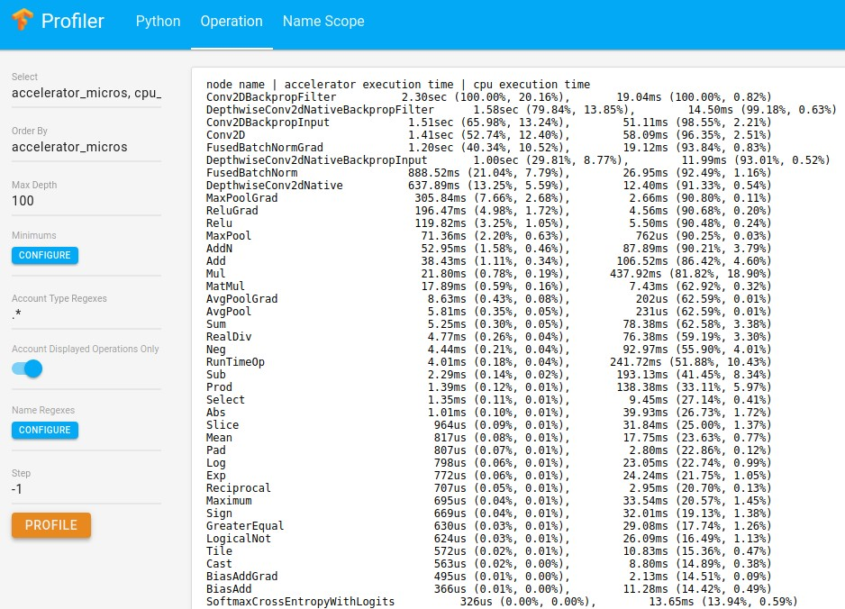
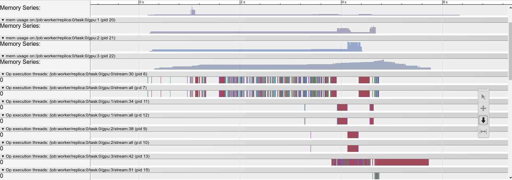

<h1>TensorFlow Profiler and Advisor</h1>

* [Features](#features)
* [Quick Start](#quick-start)
* [Demo](#demo)
* [Feature Request and Bug Report](#feature-request-and-bug-report)


### Features

* Profile model architectures.
  * parameters, tensor shapes, float operations, device placement, etc.
* Profile multiple-steps model performance.
  * execution time, memory consumption.
* Auto profile and advise.
  * accelerator utilization check
  * expensive operation check
  * operation configuration check
  * distributed runtime check (Not OSS)

### Quick Start

```python
# When using high-level API, session is usually hidden.
#
# Under the default ProfileContext, run a few hundred steps.
# The ProfileContext will sample some steps and dump the profiles
# to files. Users can then use command line tool or Web UI for
# interactive profiling.
with tf.contrib.tfprof.ProfileContext('/tmp/train_dir') as pctx:
  # High level API, such as slim, Estimator, etc.
  train_loop()

bazel-bin/tensorflow/core/profiler/profiler \
    --profile_path=/tmp/train_dir/profile_xx
tfprof> op -select micros,bytes,occurrence -order_by micros

# Profiler ui available at: https://github.com/tensorflow/profiler-ui
python ui.py --profile_context_path=/tmp/train_dir/profile_xx
```


```python
# When using lower-level APIs with a Session object. User can have
# explicit control of each step.
#
# Create options to profile the time and memory information.
builder = tf.profiler.ProfileOptionBuilder
opts = builder(builder.time_and_memory()).order_by('micros').build()
# Create a profiling context, set constructor argument `trace_steps`,
# `dump_steps` to empty for explicit control.
with tf.contrib.tfprof.ProfileContext('/tmp/train_dir',
                                      trace_steps=[],
                                      dump_steps=[]) as pctx:
  with tf.Session() as sess:
    # Enable tracing for next session.run.
    pctx.trace_next_step()
    # Dump the profile to '/tmp/train_dir' after the step.
    pctx.dump_next_step()
    _ = session.run(train_op)
    pctx.profiler.profile_operations(options=opts)
```

```python
# For more advanced usage, user can control the tracing steps and
# dumping steps. User can also run online profiling during training.
#
# Create options to profile time/memory as well as parameters.
builder = tf.profiler.ProfileOptionBuilder
opts = builder(builder.time_and_memory()).order_by('micros').build()
opts2 = tf.profiler.ProfileOptionBuilder.trainable_variables_parameter()

# Collect traces of steps 10~20, dump the whole profile (with traces of
# step 10~20) at step 20. The dumped profile can be used for further profiling
# with command line interface or Web UI.
with tf.contrib.tfprof.ProfileContext('/tmp/train_dir',
                                      trace_steps=range(10, 20),
                                      dump_steps=[20]) as pctx:
  # Run online profiling with 'op' view and 'opts' options at step 15, 18, 20.
  pctx.add_auto_profiling('op', opts, [15, 18, 20])
  # Run online profiling with 'scope' view and 'opts2' options at step 20.
  pctx.add_auto_profiling('scope', opts2, [20])
  # High level API, such as slim, Estimator, etc.
  train_loop()
```


<b>Detail Tutorials</b>

*  [Python API](g3doc/python_api.md)
*  [Command Line Interface](g3doc/command_line.md)
*  [Profile Time](g3doc/profile_time.md)
*  [Profile Memory](g3doc/profile_memory.md)
*  [Profile Model Architecture](g3doc/profile_model_architecture.md)
*  [Auto Detect and Advise](g3doc/advise.md)

<b>Detail Documentation</b>

*  [Options](g3doc/options.md)

## Demo

### Attribute TensorFlow graph running time to your Python codes.
```shell
tfprof> code -max_depth 1000 -show_name_regexes .*model_analyzer.*py.* -select micros -account_type_regexes .* -order_by micros
_TFProfRoot (0us/22.44ms)
  model_analyzer_test.py:149:run_filename_as_m...:none (0us/22.44ms)
    model_analyzer_test.py:33:_run_code_in_main:none (0us/22.44ms)
      model_analyzer_test.py:208:<module>:test.main() (0us/22.44ms)
        model_analyzer_test.py:132:testComplexCodeView:x = lib.BuildFull... (0us/22.44ms)
          model_analyzer_testlib.py:63:BuildFullModel:return sgd_op.min... (0us/21.83ms)
          model_analyzer_testlib.py:58:BuildFullModel:cell, array_ops.c... (0us/333us)
          model_analyzer_testlib.py:54:BuildFullModel:seq.append(array_... (0us/254us)
            model_analyzer_testlib.py:42:BuildSmallModel:x = nn_ops.conv2d... (0us/134us)
            model_analyzer_testlib.py:46:BuildSmallModel:initializer=init_... (0us/40us)
            ...
          model_analyzer_testlib.py:61:BuildFullModel:loss = nn_ops.l2_... (0us/28us)
          model_analyzer_testlib.py:60:BuildFullModel:target = array_op... (0us/0us)
        model_analyzer_test.py:134:testComplexCodeView:sess.run(variable... (0us/0us)
```

### Show your model variables and the number of parameters.
```
tfprof> scope -account_type_regexes VariableV2 -max_depth 4 -select params
_TFProfRoot (--/930.58k params)
  global_step (1/1 params)
  init/init_conv/DW (3x3x3x16, 432/864 params)
  pool_logit/DW (64x10, 640/1.28k params)
    pool_logit/DW/Momentum (64x10, 640/640 params)
  pool_logit/biases (10, 10/20 params)
    pool_logit/biases/Momentum (10, 10/10 params)
  unit_last/final_bn/beta (64, 64/128 params)
  unit_last/final_bn/gamma (64, 64/128 params)
  unit_last/final_bn/moving_mean (64, 64/64 params)
  unit_last/final_bn/moving_variance (64, 64/64 params)
```

### Show the most expensive operation types.
```
tfprof> op -select micros,bytes,occurrence -order_by micros
node name | requested bytes | total execution time | accelerator execution time | cpu execution time | op occurrence (run|defined)
SoftmaxCrossEntropyWithLogits      36.58MB (100.00%, 0.05%),      1.37sec (100.00%, 26.68%),           0us (100.00%, 0.00%),      1.37sec (100.00%, 30.75%),      30|30
MatMul                        2720.57MB (99.95%, 3.66%),      708.14ms (73.32%, 13.83%),     280.76ms (100.00%, 41.42%),       427.39ms (69.25%, 9.62%),  2694|3450
ConcatV2                       741.37MB (96.29%, 1.00%),       389.63ms (59.49%, 7.61%),        31.80ms (58.58%, 4.69%),       357.83ms (59.63%, 8.05%),  4801|6098
Mul                           3957.24MB (95.29%, 5.33%),       338.02ms (51.88%, 6.60%),       80.88ms (53.88%, 11.93%),       257.14ms (51.58%, 5.79%),  7282|9427
Add                            740.05MB (89.96%, 1.00%),       321.76ms (45.28%, 6.28%),        13.50ms (41.95%, 1.99%),       308.26ms (45.79%, 6.94%),  1699|2180
Sub                             32.46MB (88.97%, 0.04%),       216.20ms (39.00%, 4.22%),          241us (39.96%, 0.04%),       215.96ms (38.85%, 4.86%),  1780|4372
Slice                          708.07MB (88.92%, 0.95%),       179.88ms (34.78%, 3.51%),        25.38ms (39.92%, 3.74%),       154.50ms (33.99%, 3.48%),  5800|7277
AddN                           733.21MB (87.97%, 0.99%),       158.36ms (31.26%, 3.09%),        50.10ms (36.18%, 7.39%),       108.26ms (30.51%, 2.44%),  4567|5481
Fill                           954.27MB (86.98%, 1.28%),       138.29ms (28.17%, 2.70%),        16.21ms (28.79%, 2.39%),       122.08ms (28.08%, 2.75%),  3278|9686
Select                         312.33MB (85.70%, 0.42%),       104.75ms (25.47%, 2.05%),        18.30ms (26.40%, 2.70%),        86.45ms (25.33%, 1.95%),  2880|5746
ApplyAdam                      231.65MB (85.28%, 0.31%),        92.66ms (23.43%, 1.81%),            0us (23.70%, 0.00%),        92.66ms (23.38%, 2.09%),      27|27
```

### Auto-profile.

```shell
tfprof> advise
Not running under xxxx. Skip JobChecker.

AcceleratorUtilizationChecker:
device: /job:worker/replica:0/task:0/device:GPU:0 low utilization: 0.03
device: /job:worker/replica:0/task:0/device:GPU:1 low utilization: 0.08
device: /job:worker/replica:0/task:0/device:GPU:2 low utilization: 0.04
device: /job:worker/replica:0/task:0/device:GPU:3 low utilization: 0.21

OperationChecker:
Found operation using NHWC data_format on GPU. Maybe NCHW is faster.

JobChecker:

ExpensiveOperationChecker:
top 1 operation type: SoftmaxCrossEntropyWithLogits, cpu: 1.37sec, accelerator: 0us, total: 1.37sec (26.68%)
top 2 operation type: MatMul, cpu: 427.39ms, accelerator: 280.76ms, total: 708.14ms (13.83%)
top 3 operation type: ConcatV2, cpu: 357.83ms, accelerator: 31.80ms, total: 389.63ms (7.61%)
top 1 graph node: seq2seq/loss/sampled_sequence_loss/sequence_loss_by_example/SoftmaxCrossEntropyWithLogits_11, cpu: 89.92ms, accelerator: 0us, total: 89.92ms
top 2 graph node: train_step/update_seq2seq/output_projection/w/ApplyAdam, cpu: 84.52ms, accelerator: 0us, total: 84.52ms
top 3 graph node: seq2seq/loss/sampled_sequence_loss/sequence_loss_by_example/SoftmaxCrossEntropyWithLogits_19, cpu: 73.02ms, accelerator: 0us, total: 73.02ms
seq2seq_attention_model.py:360:build_graph:self._add_seq2seq(), cpu: 3.16sec, accelerator: 214.84ms, total: 3.37sec
  seq2seq_attention_model.py:293:_add_seq2seq:decoder_outputs, ..., cpu: 2.46sec, accelerator: 3.25ms, total: 2.47sec
    seq2seq_lib.py:181:sampled_sequence_...:average_across_ti..., cpu: 2.46sec, accelerator: 3.24ms, total: 2.47sec
      seq2seq_lib.py:147:sequence_loss_by_...:crossent = loss_f..., cpu: 2.46sec, accelerator: 3.06ms, total: 2.46sec
      seq2seq_lib.py:148:sequence_loss_by_...:log_perp_list.app..., cpu: 1.33ms, accelerator: 120us, total: 1.45ms
  seq2seq_attention_model.py:192:_add_seq2seq:sequence_length=a..., cpu: 651.56ms, accelerator: 158.92ms, total: 810.48ms
    seq2seq_lib.py:104:bidirectional_rnn:sequence_length, ..., cpu: 306.58ms, accelerator: 73.54ms, total: 380.12ms
      core_rnn.py:195:static_rnn:state_size=cell.s..., cpu: 306.52ms, accelerator: 73.54ms, total: 380.05ms
    seq2seq_lib.py:110:bidirectional_rnn:initial_state_bw,..., cpu: 296.21ms, accelerator: 73.54ms, total: 369.75ms
      core_rnn.py:195:static_rnn:state_size=cell.s..., cpu: 296.11ms, accelerator: 73.54ms, total: 369.65ms
    seq2seq_lib.py:113:bidirectional_rnn:outputs = [tf.con..., cpu: 46.88ms, accelerator: 3.87ms, total: 50.75ms
  seq2seq_attention_model.py:253:_add_seq2seq:initial_state_att..., cpu: 32.48ms, accelerator: 50.01ms, total: 82.50ms
    seq2seq.py:693:attention_decoder:attns = attention..., cpu: 11.73ms, accelerator: 38.41ms, total: 50.14ms
      seq2seq.py:653:attention:s = math_ops.redu..., cpu: 2.62ms, accelerator: 17.80ms, total: 20.41ms
      seq2seq.py:658:attention:array_ops.reshape..., cpu: 1.90ms, accelerator: 12.08ms, total: 13.98ms
      seq2seq.py:655:attention:a = nn_ops.softma..., cpu: 4.15ms, accelerator: 4.25ms, total: 8.40ms
    seq2seq.py:686:attention_decoder:cell_output, stat..., cpu: 14.43ms, accelerator: 4.85ms, total: 19.27ms
    seq2seq.py:696:attention_decoder:output = linear([..., cpu: 3.04ms, accelerator: 2.88ms, total: 5.93ms
      core_rnn_cell_impl.py:1009:_linear:res = math_ops.ma..., cpu: 2.33ms, accelerator: 2.71ms, total: 5.04ms
seq2seq_attention_model.py:363:build_graph:self._add_train_o..., cpu: 1.28sec, accelerator: 462.93ms, total: 1.74sec
  seq2seq_attention_model.py:307:_add_train_op:tf.gradients(self..., cpu: 967.84ms, accelerator: 462.88ms, total: 1.43sec
    gradients_impl.py:563:gradients:grad_scope, op, f..., cpu: 692.60ms, accelerator: 390.75ms, total: 1.08sec
    gradients_impl.py:554:gradients:out_grads[i] = co..., cpu: 164.71ms, accelerator: 16.21ms, total: 180.92ms
      control_flow_ops.py:1314:ZerosLikeOutsideL...:return array_ops...., cpu: 121.85ms, accelerator: 16.21ms, total: 138.05ms
      control_flow_ops.py:1313:ZerosLikeOutsideL...:zeros_shape = arr..., cpu: 22.85ms, accelerator: 0us, total: 22.85ms
      control_flow_ops.py:1312:ZerosLikeOutsideL...:switch_val = swit..., cpu: 20.02ms, accelerator: 0us, total: 20.02ms
    gradients_impl.py:515:gradients:out_grads = _Aggr..., cpu: 108.69ms, accelerator: 51.92ms, total: 160.61ms
      gradients_impl.py:846:_AggregatedGrads:out_grads[i] = _M..., cpu: 107.99ms, accelerator: 50.05ms, total: 158.04ms
      gradients_impl.py:856:_AggregatedGrads:array_ops.concat(..., cpu: 340us, accelerator: 1.87ms, total: 2.21ms
  seq2seq_attention_model.py:322:_add_train_op:zip(grads, tvars)..., cpu: 307.56ms, accelerator: 0us, total: 307.56ms
    optimizer.py:456:apply_gradients:update_ops.append..., cpu: 307.43ms, accelerator: 0us, total: 307.43ms
      optimizer.py:102:update_op:return optimizer...., cpu: 222.66ms, accelerator: 0us, total: 222.66ms
      optimizer.py:97:update_op:return optimizer...., cpu: 84.76ms, accelerator: 0us, total: 84.76ms
```

### Visualize time and memory

```shell
# The following example generates a timeline.
tfprof> graph -step -1 -max_depth 100000 -output timeline:outfile=<filename>

generating trace file.

******************************************************
Timeline file is written to <filename>.
Open a Chrome browser, enter URL chrome://tracing and load the timeline file.
******************************************************
```



```shell
# The following example generates a pprof graph (only supported by code view).
# Since TensorFlow runs the graph instead of Python code, the pprof graph
# doesn't profile the statistics of Python, but the TensorFlow graph
# nodes created by the Python call stack.
# Nevertheless, it pops critical Python code path for us.
#
# `-trim_name_regexes` trims the some traces that have no valuable information.
# `-select accelerator_micros` pick accelerator time for pprof graph. User
# can also generate memory profile using `-select bytes`
tfprof> code -select accelerator_micros -max_depth 100000 -output pprof:outfile=<filename>  -trim_name_regexes .*apply_op.*

# Use google-pprof, from the google-perftools package to visualize the generated file.
# On Ubuntu you can install it with `apt-get install it google-perftools`.
google-pprof --pdf --nodecount=100 <filename>
```


### Feature Request and Bug Report

Contact: xpan@google.com

Providing `GraphDef` and `RunMetadata` file will greatly help
bug fix. `OpLogProto` is a good plus if it is used.


#### Teams

* Xin Pan
* Chris Antaki
* Yao Zhang
* Jon Shlens
