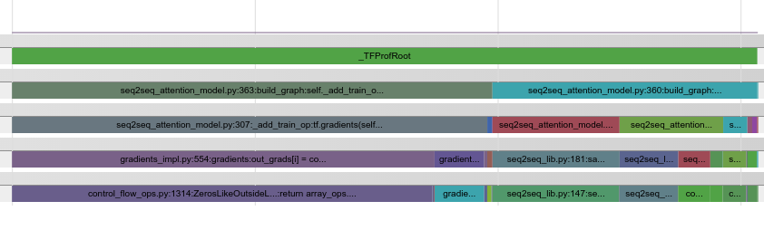

## Command Line Interface Tutorials

* [Command Line Inputs](#command-line-inputs)
* [Start `tfprof`](#start-tfprof)
* [Examples](#examples)
  * [Profile Python Time](#profile-python-time)
  * [Profile Graph Time](#profile-graph-time)
  * [Profile Checkpoint Value](#profile-checkpoint-value)
  * [Profile Model Parameter](#profile-model-parameter)
  * [Profile Device Placement](#profile-device-placement)
  * [Define Customized Operation Type](#define-customized-operation-type)
  * [Non-interactive Mode](#non-interactive-mode)


### Command Line Inputs

tfprof command line tool uses the following input:

<b>--profile_path:</b> A ProfileProto binary proto file.
See QuickStart on generating the file.

<b>THE OLD WAY BELOW IS DEPRECATED:</b>

<b>--graph_path:</b> GraphDef proto file (optional in eager execution).
Used to build in-memory
data structure of the model. For example, graph.pbtxt written by tf.Supervisor
can be passed to --graph_path. You can also easily get GraphDef using
tf.get_default_graph().as_graph_def(add_shapes=True) or other API.

<b>--run_meta_path:</b> RunMetadata proto file (optional).
Used to get the memory consumption and execution time of
each op of the model.

The following code snippet writes a RunMetadata file:

```python
run_options = config_pb2.RunOptions(trace_level=config_pb2.RunOptions.FULL_TRACE)
run_metadata = config_pb2.RunMetadata()
_ = self._sess.run(..., options=run_options, run_metadata=run_metadata)
with tf.gfile.Open(os.path.join(output_dir, "run_meta"), "w") as f:
  f.write(run_metadata.SerializeToString())
```

<b>--op_log_path:</b>
tensorflow.tfprof.OpLogProto (optional). A proto used to provide extra operation
information. 1) float operations. 2) code traces. 3) define customized operation
type for `-account_type_regexes` option.

The following code snippet writes a OpLogProto file.

```python
tf.profiler.write_op_log(graph, log_dir, op_log=None)
```

<b>--checkpoint_path:</b> TensorFlow checkpoint (optional).
It defines _checkpoint_variable op type. It also provides checkpointed tensors' values.
Note: this feature is not well maintained now.


### Start `tfprof`

#### Build `tfprof`

```shell
# Build the tool.
bazel build --config opt tensorflow/core/profiler:profiler

# Help information, including detail 'option' instructions.
bazel-bin/tensorflow/core/profiler/profiler help
```

#### Start `tfprof` Interactive Mode
```shell
# The following commands will start tfprof interactive mode.
#
# Recommended:
#
# The file contains the binary string of ProfileProto.
# It contains all needed information in one file.
bazel-bin/tensorflow/core/profiler/profiler \
    --profile_path=profile_xxx
#
# Alternatively, user can pass separate files.
#
# --graph_path contains the model architecutre and tensor shapes.
# --run_meta_path contains the memory and time information.
# --op_log_path contains float operation and code traces.
# --checkpoint_path contains the model checkpoint data.
#
# Only includes model architecture, parameters and shapes.
bazel-bin/tensorflow/core/profiler/profiler \
    --graph_path=graph.pbtxt

# For profiling eager execution, user can only specify run_meta_path
# and profile execution info of each operation.
bazel-bin/tensorflow/core/profiler/profiler \
    --run_meta_path=run_meta
#
# Additionally profile ops memory and timing.
bazel-bin/tensorflow/core/profiler/profiler \
    --graph_path=graph.pbtxt \
    --run_meta_path=run_meta \
#
# tfprof_log is used to define customized op types, float ops and code traces.
# Use tfprof_logger.write_op_log() to create tfprof_log.
bazel-bin/tensorflow/core/profiler/profiler \
    --graph_path=graph.pbtxt \
    --run_meta_path=run_meta \
    --op_log_path=tfprof_log \
#
# Additionally profile checkpoint statistics and values.
# Use '-account_type_regexes _checkpoint_variables' to select
# checkpoint tensors.
bazel-bin/tensorflow/core/profiler/profiler \
    --graph_path=graph.pbtxt \
    --run_meta_path=run_meta \
    --op_log_path=tfprof_log \
    --checkpoint_path=model.ckpt
```

#### Start `tfprof` Non-interactive Mode.

```python
# Runs tfprof in one-shot.
bazel-bin/tensorflow/core/profiler/profiler scope \
    --graph_path=graph.pbtxt \
    --max_depth=3
```

#### Press enter to show the default options

Refer to [Options](options.md) for option instructions.

```shell
tfprof>
-max_depth                  4
-min_bytes                  0
-min_micros                 0
-min_params                 0
-min_float_ops              0
-min_occurrence             0
-step                       -1
-order_by                   name
-account_type_regexes       Variable,VariableV2
-start_name_regexes         .*
-trim_name_regexes
-show_name_regexes          .*
-hide_name_regexes          IsVariableInitialized_[0-9]+,save\/.*,^zeros[0-9_]*
-account_displayed_op_only  false
# supported select fields. Availability depends on --[run_meta|checkpoint|op_log]_path.
# [bytes|micros|params|float_ops|occurrence|tensor_value|device|op_types]
-select                     params
# format: output_type:key=value,key=value...
# output_types: stdout (default), timeline, file.
# key=value pairs:
#   1. timeline: outfile=<filename>
#   2. file: outfile=<filename>
#   3. stdout: None.
# E.g. timeline:outfile=/tmp/timeline.json
-output
```

### Examples

#### Profile Python Time
```shell
# Requires --graph_path --op_log_path
tfprof> code -max_depth 1000 -show_name_regexes .*model_analyzer.*py.* -select micros -account_type_regexes .* -order_by micros
_TFProfRoot (0us/22.44ms)
  model_analyzer_test.py:149:run_filename_as_m...:none (0us/22.44ms)
    model_analyzer_test.py:33:_run_code_in_main:none (0us/22.44ms)
      model_analyzer_test.py:208:<module>:test.main() (0us/22.44ms)
        model_analyzer_test.py:132:testComplexCodeView:x = lib.BuildFull... (0us/22.44ms)
          model_analyzer_testlib.py:63:BuildFullModel:return sgd_op.min... (0us/21.83ms)
          model_analyzer_testlib.py:58:BuildFullModel:cell, array_ops.c... (0us/333us)
          model_analyzer_testlib.py:54:BuildFullModel:seq.append(array_... (0us/254us)
            model_analyzer_testlib.py:42:BuildSmallModel:x = nn_ops.conv2d... (0us/134us)
            model_analyzer_testlib.py:46:BuildSmallModel:initializer=init_... (0us/40us)
            ...
          model_analyzer_testlib.py:61:BuildFullModel:loss = nn_ops.l2_... (0us/28us)
          model_analyzer_testlib.py:60:BuildFullModel:target = array_op... (0us/0us)
        model_analyzer_test.py:134:testComplexCodeView:sess.run(variable... (0us/0us)
```

Set ```-output timeline:outfile=<filename>``` to generate timeline instead of stdout.
<left>

</left>

#### Profile Graph Time

```shell
# I defined an op named ‘cost’ to calculate the loss. I want to know what ops
# it depends on take a long time to run.

# Requires --graph_path, --run_meta_path.
tfprof> graph -start_name_regexes cost.* -max_depth 100 -min_micros 10000 -select micros -account_type_regexes .*
_TFProfRoot (0us/3.61sec)
  init/init_conv/Conv2D (11.75ms/3.10sec)
    random_shuffle_queue_DequeueMany (3.09sec/3.09sec)
  unit_1_0/sub2/conv2/Conv2D (74.14ms/3.19sec)
  unit_1_3/sub2/conv2/Conv2D (60.75ms/3.34sec)
  unit_2_4/sub2/conv2/Conv2D (73.58ms/3.54sec)
  unit_3_3/sub2/conv2/Conv2D (10.26ms/3.60sec)
```

#### Profile Checkpoint Value
```shell
# Requires --graph_path, --checkpoint_path.
tfprof> scope -show_name_regexes unit_1_0.*gamma -select tensor_value -max_depth 5
_TFProfRoot ()
  unit_1_0/shared_activation/init_bn/gamma ()
[1.80 2.10 2.06 1.91 2.26 1.86 1.81 1.37 1.78 1.85 1.96 1.54 2.04 2.34 2.22 1.99 ],
  unit_1_0/sub2/bn2/gamma ()
[1.57 1.83 1.30 1.25 1.59 1.14 1.26 0.82 1.19 1.10 1.48 1.01 0.82 1.23 1.21 1.14 ],
```

#### Profile Model Parameter

```shell
# Show the number of parameters of all `tf.trainable_variables()` in the model.
# Requires --graph_path --op_log_path.
# store option for future commands.
tfprof> set -account_type_regexes _trainable_variables
tfprof> scope -max_depth 4 -select params
_TFProfRoot (--/464.15k params)
  init/init_conv/DW (3x3x3x16, 432/432 params)
  pool_logit/DW (64x10, 640/640 params)
  pool_logit/biases (10, 10/10 params)
  unit_last/final_bn/beta (64, 64/64 params)
  unit_last/final_bn/gamma (64, 64/64 params)
```

Where does `_trainable_variables` come from? It is customized operation type
defined through the OpLogProto file.
Users can [Define Customized Operation Type](#define-customized-operation-type)

<b>Following example shows importance of defining customized operation type.</b>
In this example, extra `Variables` are created by TensorFlow
implicitly and “/Momentum” is appended to their names. They shouldn't be
included in you “model capacity” calculation.

```shell
tfprof> scope -account_type_regexes VariableV2 -max_depth 4 -select params
_TFProfRoot (--/930.58k params)
  global_step (1/1 params)
  init/init_conv/DW (3x3x3x16, 432/864 params)
  pool_logit/DW (64x10, 640/1.28k params)
    pool_logit/DW/Momentum (64x10, 640/640 params)
  pool_logit/biases (10, 10/20 params)
    pool_logit/biases/Momentum (10, 10/10 params)
  unit_last/final_bn/beta (64, 64/128 params)
  unit_last/final_bn/gamma (64, 64/128 params)
  unit_last/final_bn/moving_mean (64, 64/64 params)
  unit_last/final_bn/moving_variance (64, 64/64 params)
```

#### Profile Device Placement

In this tutorial, a model is split
on several gpus at workers and several parameter servers.

In tfprof, 'device' is an op_type. For example, if op1 and op2 are placed on
gpu:0. They share an operation type.

```shell
bazel-bin/tensorflow/core/profiler/profiler \
  --graph_path=/tmp/graph.pbtxt  \
  --run_meta_path=/tmp/run_meta

# Looks like ps task 1 is holding twice more parameters than task 0.
tfprof> scope -select device,params -account_type_regexes .*ps.*task:0.* -max_depth 1
_TFProfRoot (--/25.81m params)
tfprof> scope -select device,params -account_type_regexes .*ps.*task:1.* -max_depth 1
_TFProfRoot (--/58.84m params)
```

#### Define Customized Operation Type

First, in Python code, create an `OpLogProto` proto and add op type
information to it:

```python
op_log = tfprof_log_pb2.OpLogProto()
entry = op_log.log_entries.add()
entry.name = 'pool_logit/DW'
entry.types.append('pool_logit')
entry = op_log.log_entries.add()
entry.name = 'pool_logit/biases'
entry.types.append('pool_logit')
```

Second, call write_op_log to write the OpLogProto proto.

```python
tf.profiler.write_op_log(
    sess.graph, /tmp/my_op_log_dir, op_log)

# Get run-time shape information in order to fill shapes and get flops.
tf.profiler.write_op_log(
    sess.graph, /tmp/my_op_log_dir, op_log, run_meta)
```

Third, when starting the tfprof tool, specify
"--op_log_path=/tmp/my_op_log_dir/op_log"

```shell
tfprof> scope -account_type_regexes pool_logit -max_depth 4 -select params
_TFProfRoot (--/650 params)
  pool_logit/DW (64x10, 640/640 params)
  pool_logit/biases (10, 10/10 params)
```

Note that `tf.profiler.write_op_log(...)` automatically
assigns all `Variables` inside `tf.trainable_variables()` a customized
operation type: `_trainable_variables`.


#### Non-interactive Mode
12) Run tfprof in one-shot mode and dump result to file.

```shell
# By default output to stdout. Use -output option to change output types.
tfprof scope --graph_path=graph.pbtxt  \
             --max_depth=3 \
             --output="file:outfile=/tmp/dump"
Reading Files...
Parsing GraphDef...
Preparing Views...

cat /tmp/dump
_TFProfRoot (--/930.58k params)
  global_step (0/0 params)
  pool_logit/DW (64x10, 640/1.28k params)
  pool_logit/biases (10, 10/20 params)
```
