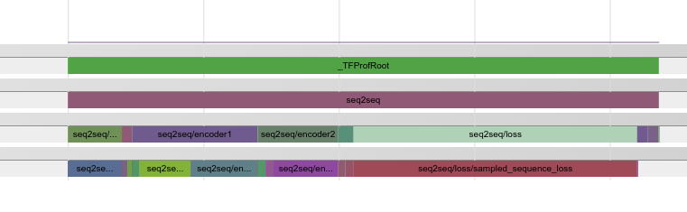

## Python API Tutorials

* [Parameters and Shapes](#parameters-and-shapes)
* [Float Operations](#float-operations)
* [Time and Memory](#time-and-memory)
* [Visualize](#visualize)
* [Multi-step Profiling](#multi-step-profiling)

```import tensorflow as tf```.

### Parameters and Shapes.
```python
# Print trainable variable parameter statistics to stdout.
ProfileOptionBuilder = tf.profiler.ProfileOptionBuilder

param_stats = tf.profiler.profile(
    tf.get_default_graph(),
    options=ProfileOptionBuilder.trainable_variables_parameter())

# Use code view to associate statistics with Python codes.
opts = ProfileOptionBuilder(
    ProfileOptionBuilder.trainable_variables_parameter()
    ).with_node_names(show_name_regexes=['.*my_code1.py.*', '.*my_code2.py.*']
    ).build()
param_stats = tf.profiler.profile(
    tf.get_default_graph(),
    cmd='code',
    options=opts)

# param_stats can be tensorflow.tfprof.GraphNodeProto or
# tensorflow.tfprof.MultiGraphNodeProto, depending on the view.
# Let's print the root below.
sys.stdout.write('total_params: %d\n' % param_stats.total_parameters)
```

### Float Operations

#### Note: See [Caveats](profile_model_architecture.md#caveats) in "Profile Model Architecture" Tutorial
``` python
# Print to stdout an analysis of the number of floating point operations in the
# model broken down by individual operations.
tf.profiler.profile(
    tf.get_default_graph(),
    options=tf.profiler.ProfileOptionBuilder.float_operation())
```

### Time and Memory
You will first need to run the following set up in your model in order to
compute the memory and timing statistics.

```python
# Generate the RunMetadata that contains the memory and timing information.
#
# Note: When run on accelerator (e.g. GPU), an operation might perform some
#       cpu computation, enqueue the accelerator computation. The accelerator
#       computation is then run asynchronously. The profiler considers 3
#       times: 1) accelerator computation. 2) cpu computation (might wait on
#       accelerator). 3) the sum of 1 and 2.
#
run_metadata = tf.RunMetadata()
with tf.Session() as sess:
  _ = sess.run(train_op,
               options=tf.RunOptions(trace_level=tf.RunOptions.FULL_TRACE),
               run_metadata=run_metadata)
```

Finally, you may run `tf.profiler.profile` to explore the timing and memory
information of the model.

``` python
# Print to stdout an analysis of the memory usage and the timing information
# broken down by python codes.
ProfileOptionBuilder = tf.profiler.ProfileOptionBuilder
opts = ProfileOptionBuilder(ProfileOptionBuilder.time_and_memory()
    ).with_node_names(show_name_regexes=['.*my_code.py.*']).build()

tf.profiler.profile(
    tf.get_default_graph(),
    run_meta=run_metadata,
    cmd='code',
    options=opts)

# Print to stdout an analysis of the memory usage and the timing information
# broken down by operation types.
tf.profiler.profile(
    tf.get_default_graph(),
    run_meta=run_metadata,
    cmd='op',
    options=tf.profiler.ProfileOptionBuilder.time_and_memory())
```

### Visualize

```
To visualize the result of Python API results:
Call `with_step(0).with_timeline_output(filename)` to generate a timeline json file.
Open a Chrome Browser, type URL `chrome://tracing`, and load the json file.
```

Below are 2 examples of graph view and scope view.

<left>


</left>

### Multi-step Profiling

tfprof allows you to profile statistics across multiple steps.

```python
opts = model_analyzer.PRINT_ALL_TIMING_MEMORY.copy()
opts['account_type_regexes'] = ['.*']

with session.Session() as sess:
  r1, r2, r3 = lib.BuildSplitableModel()
  sess.run(variables.global_variables_initializer())

  # Create a profiler.
  profiler = model_analyzer.Profiler(sess.graph)
  # Profile without RunMetadata of any step.
  pb0 = profiler.profile_name_scope(opts)

  run_meta = config_pb2.RunMetadata()
  _ = sess.run(r1,
               options=config_pb2.RunOptions(
                   trace_level=config_pb2.RunOptions.FULL_TRACE),
               run_metadata=run_meta)

  # Add run_meta of step 1.
  profiler.add_step(1, run_meta)
  pb1 = profiler.profile_name_scope(opts)

  run_meta2 = config_pb2.RunMetadata()
  _ = sess.run(r2,
               options=config_pb2.RunOptions(
                   trace_level=config_pb2.RunOptions.FULL_TRACE),
               run_metadata=run_meta2)
  # Add run_meta of step 2.
  profiler.add_step(2, run_meta2)
  pb2 = profiler.profile_name_scope(opts)

  run_meta3 = config_pb2.RunMetadata()
  _ = sess.run(r3,
               options=config_pb2.RunOptions(
                   trace_level=config_pb2.RunOptions.FULL_TRACE),
               run_metadata=run_meta3)
  # Add run_meta of step 3.
  profiler.add_step(3, run_meta3)
  pb3 = profiler.profile_name_scope(opts)
```
