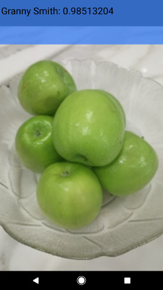
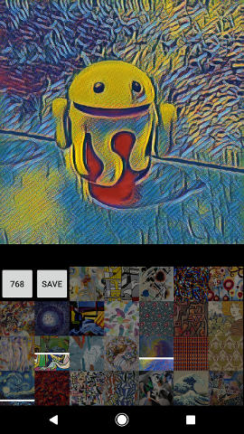
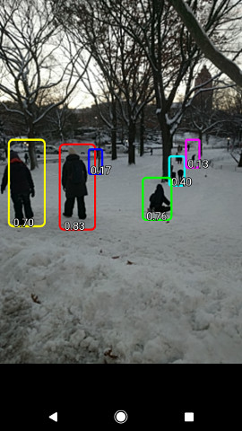

# TensorFlow Android Camera Demo

This folder contains an example application utilizing TensorFlow for Android
devices.

## Description

The demos in this folder are designed to give straightforward samples of using
TensorFlow in mobile applications.

Inference is done using the [TensorFlow Android Inference Interface](../../../tensorflow/contrib/android),
which may be built separately if you want a standalone library to drop into your
existing application. Object tracking and YUV -> RGB conversion is handled by
libtensorflow_demo.so.

A device running Android 5.0 (API 21) or higher is required to run the demo due
to the use of the camera2 API, although the native libraries themselves can run
on API >= 14 devices.

## Current samples:

1. [TF Classify](https://github.com/tensorflow/tensorflow/blob/master/tensorflow/examples/android/src/org/tensorflow/demo/ClassifierActivity.java):
        Uses the [Google Inception](https://arxiv.org/abs/1409.4842)
        model to classify camera frames in real-time, displaying the top results
        in an overlay on the camera image.
2. [TF Detect](https://github.com/tensorflow/tensorflow/blob/master/tensorflow/examples/android/src/org/tensorflow/demo/DetectorActivity.java):
        Demonstrates a model based on [Scalable Object Detection
        using Deep Neural Networks](https://arxiv.org/abs/1312.2249) to
        localize and track people in the camera preview in real-time.
3. [TF Stylize](https://github.com/tensorflow/tensorflow/blob/master/tensorflow/examples/android/src/org/tensorflow/demo/StylizeActivity.java):
        Uses a model based on [A Learned Representation For Artistic Style]
        (https://arxiv.org/abs/1610.07629) to restyle the camera preview image
        to that of a number of different artists.



## Prebuilt APK:

If you just want the fastest path to trying the demo, you may download the
nightly build
[here](https://ci.tensorflow.org/view/Nightly/job/nightly-android/). Expand the
"View" and then the "out" folders under "Last Successful Artifacts" to find
tensorflow_demo.apk. Also available are precompiled native libraries that you
may drop into your own applications. See
[tensorflow/contrib/android/README.md](../../../tensorflow/contrib/android/README.md)
for more details.

## Running the Demo

Once the app is installed it can be started via the "TF Classify", "TF Detect"
and "TF Stylize" icons, which have the orange TensorFlow logo as their icon.

While running the activities, pressing the volume keys on your device will
toggle debug visualizations on/off, rendering additional info to the screen
that may be useful for development purposes.

## Building the Demo from Source

Pick your preferred approach below. At the moment, we have full support for
Bazel, and partial support for gradle, cmake, make, and Android Studio.

As a first step for all build types, clone the TensorFlow repo with:

```
git clone --recurse-submodules https://github.com/tensorflow/tensorflow.git
```

Note that `--recurse-submodules` is necessary to prevent some issues with
protobuf compilation.

### Bazel

NOTE: Bazel does not currently support building for Android on Windows. Full
support for gradle/cmake builds is coming soon, but in the meantime we suggest
that Windows users download the
[prebuilt binaries](https://ci.tensorflow.org/view/Nightly/job/nightly-android/)
instead.

##### Install Bazel and Android Prerequisites

Bazel is the primary build system for TensorFlow. To build with Bazel,
it and the Android NDK and SDK must be installed on your system.

1. Install the latest version of Bazel as per the instructions [on the Bazel website](https://bazel.build/versions/master/docs/install.html).
2. The Android NDK is required to build the native (C/C++) TensorFlow code.
        The current recommended version is 12b, which may be found
        [here](https://developer.android.com/ndk/downloads/older_releases.html#ndk-12b-downloads).
3. The Android SDK and build tools may be obtained
        [here](https://developer.android.com/tools/revisions/build-tools.html),
        or alternatively as part of
        [Android Studio](https://developer.android.com/studio/index.html). Build
        tools API >= 23 is required to build the TF Android demo (though it will
        run on API >= 21 devices).

##### Edit WORKSPACE

The Android entries in [`<workspace_root>/WORKSPACE`](../../../WORKSPACE#L19-L32)
must be uncommented with the paths filled in appropriately depending on where
you installed the NDK and SDK. Otherwise an error such as:
"The external label '//external:android/sdk' is not bound to anything" will
be reported.

Also edit the API levels for the SDK in WORKSPACE to the highest level you
have installed in your SDK. This must be >= 23 (this is completely independent
of the API level of the demo, which is defined in AndroidManifest.xml).
The NDK API level may remain at 14.

##### Install Model Files (optional)

The TensorFlow `GraphDef`s that contain the model definitions and weights
are not packaged in the repo because of their size. They are downloaded
automatically and packaged with the APK by Bazel via a new_http_archive defined
in `WORKSPACE` during the build process, and by Gradle via download-models.gradle.

**Optional**: If you wish to place the models in your assets manually,
remove all of the `model_files` entries from the `assets`
list in `tensorflow_demo` found in the `[BUILD](BUILD)` file. Then download
and extract the archives yourself to the `assets` directory in the source tree:

```bash
BASE_URL=https://storage.googleapis.com/download.tensorflow.org/models
for MODEL_ZIP in inception5h.zip mobile_multibox_v1a.zip stylize_v1.zip
do
  curl -L ${BASE_URL}/${MODEL_ZIP} -o /tmp/${MODEL_ZIP}
  unzip /tmp/${MODEL_ZIP} -d tensorflow/examples/android/assets/
done
```

This will extract the models and their associated metadata files to the local
assets/ directory.

If you are using Gradle, make sure to remove download-models.gradle reference
from build.gradle after your manually download models; otherwise gradle
might download models again and overwrite your models.

##### Build

After editing your WORKSPACE file to update the SDK/NDK configuration,
you may build the APK. Run this from your workspace root:

```bash
bazel build -c opt //tensorflow/examples/android:tensorflow_demo
```

If you get build errors about protocol buffers, run
`git submodule update --init` and make sure that you've modified your WORKSPACE
file as instructed, then try building again.

##### Install

Make sure that adb debugging is enabled on your Android 5.0 (API 21) or
later device, then after building use the following command from your workspace
root to install the APK:

```bash
adb install -r bazel-bin/tensorflow/examples/android/tensorflow_demo.apk
```

### Android Studio

Android Studio may be used to build the demo in conjunction with Bazel. First,
make sure that you can build with Bazel following the above directions. Then,
look at [build.gradle](build.gradle) and make sure that the path to Bazel
matches that of your system.

At this point you can add the tensorflow/examples/android directory as a new
Android Studio project. Click through installing all the Gradle extensions it
requests, and you should be able to have Android Studio build the demo like any
other application (it will call out to Bazel to build the native code with the
NDK).

### CMake

Full CMake support for the demo is coming soon, but for now it is possible to
build the TensorFlow Android Inference library using
[tensorflow/contrib/android/cmake](../../../tensorflow/contrib/android/cmake).
