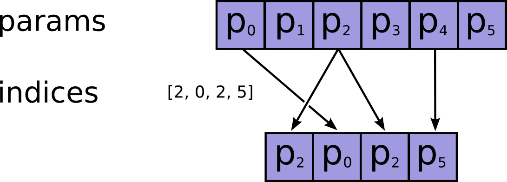
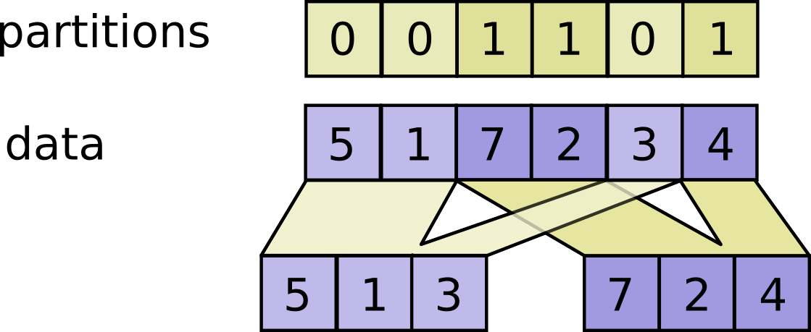
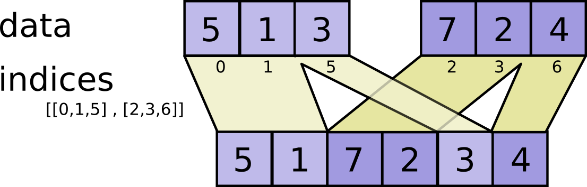

<!-- This file is machine generated: DO NOT EDIT! -->

# Tensor Transformations <a class="md-anchor" id="AUTOGENERATED-tensor-transformations"></a>

Note: Functions taking `Tensor` arguments can also take anything accepted by
[`tf.convert_to_tensor`](../../api_docs/python/framework.md#convert_to_tensor).

<!-- TOC-BEGIN This section is generated by neural network: DO NOT EDIT! -->
## Contents
### [Tensor Transformations](#AUTOGENERATED-tensor-transformations)
* [Casting](#AUTOGENERATED-casting)
  * [`tf.string_to_number(string_tensor, out_type=None, name=None)`](#string_to_number)
  * [`tf.to_double(x, name='ToDouble')`](#to_double)
  * [`tf.to_float(x, name='ToFloat')`](#to_float)
  * [`tf.to_bfloat16(x, name='ToBFloat16')`](#to_bfloat16)
  * [`tf.to_int32(x, name='ToInt32')`](#to_int32)
  * [`tf.to_int64(x, name='ToInt64')`](#to_int64)
  * [`tf.cast(x, dtype, name=None)`](#cast)
* [Shapes and Shaping](#AUTOGENERATED-shapes-and-shaping)
  * [`tf.shape(input, name=None)`](#shape)
  * [`tf.size(input, name=None)`](#size)
  * [`tf.rank(input, name=None)`](#rank)
  * [`tf.reshape(tensor, shape, name=None)`](#reshape)
  * [`tf.squeeze(input, squeeze_dims=None, name=None)`](#squeeze)
  * [`tf.expand_dims(input, dim, name=None)`](#expand_dims)
* [Slicing and Joining](#AUTOGENERATED-slicing-and-joining)
  * [`tf.slice(input_, begin, size, name=None)`](#slice)
  * [`tf.split(split_dim, num_split, value, name='split')`](#split)
  * [`tf.tile(input, multiples, name=None)`](#tile)
  * [`tf.pad(input, paddings, name=None)`](#pad)
  * [`tf.concat(concat_dim, values, name='concat')`](#concat)
  * [`tf.pack(values, name='pack')`](#pack)
  * [`tf.unpack(value, num=None, name='unpack')`](#unpack)
  * [`tf.reverse_sequence(input, seq_lengths, seq_dim, name=None)`](#reverse_sequence)
  * [`tf.reverse(tensor, dims, name=None)`](#reverse)
  * [`tf.transpose(a, perm=None, name='transpose')`](#transpose)
  * [`tf.gather(params, indices, name=None)`](#gather)
  * [`tf.dynamic_partition(data, partitions, num_partitions, name=None)`](#dynamic_partition)
  * [`tf.dynamic_stitch(indices, data, name=None)`](#dynamic_stitch)


<!-- TOC-END This section was generated by neural network, THANKS FOR READING! -->

## Casting <a class="md-anchor" id="AUTOGENERATED-casting"></a>

TensorFlow provides several operations that you can use to cast tensor data
types in your graph.

- - -

### `tf.string_to_number(string_tensor, out_type=None, name=None)` <a class="md-anchor" id="string_to_number"></a>

Converts each string in the input Tensor to the specified numeric type.

(Note that int32 overflow results in an error while float overflow
results in a rounded value.)

##### Args: <a class="md-anchor" id="AUTOGENERATED-args-"></a>


*  <b>`string_tensor`</b>: A `Tensor` of type `string`.
*  <b>`out_type`</b>: An optional `tf.DType` from: `tf.float32, tf.int32`. Defaults to `tf.float32`.
    The numeric type to interpret each string in string_tensor as.
*  <b>`name`</b>: A name for the operation (optional).

##### Returns: <a class="md-anchor" id="AUTOGENERATED-returns-"></a>

  A `Tensor` of type `out_type`.
  A Tensor of the same shape as the input string_tensor.


- - -

### `tf.to_double(x, name='ToDouble')` <a class="md-anchor" id="to_double"></a>

Casts a tensor to type `float64`.

##### Args: <a class="md-anchor" id="AUTOGENERATED-args-"></a>


*  <b>`x`</b>: A `Tensor` or `SparseTensor`.
*  <b>`name`</b>: A name for the operation (optional).

##### Returns: <a class="md-anchor" id="AUTOGENERATED-returns-"></a>

  A `Tensor` or `SparseTensor` with same shape as `x` with type `float64`.

##### Raises: <a class="md-anchor" id="AUTOGENERATED-raises-"></a>


*  <b>`TypeError`</b>: If `x` cannot be cast to the `float64`.


- - -

### `tf.to_float(x, name='ToFloat')` <a class="md-anchor" id="to_float"></a>

Casts a tensor to type `float32`.

##### Args: <a class="md-anchor" id="AUTOGENERATED-args-"></a>


*  <b>`x`</b>: A `Tensor` or `SparseTensor`.
*  <b>`name`</b>: A name for the operation (optional).

##### Returns: <a class="md-anchor" id="AUTOGENERATED-returns-"></a>

  A `Tensor` or `SparseTensor` with same shape as `x` with type `float32`.

##### Raises: <a class="md-anchor" id="AUTOGENERATED-raises-"></a>


*  <b>`TypeError`</b>: If `x` cannot be cast to the `float32`.


- - -

### `tf.to_bfloat16(x, name='ToBFloat16')` <a class="md-anchor" id="to_bfloat16"></a>

Casts a tensor to type `bfloat16`.

##### Args: <a class="md-anchor" id="AUTOGENERATED-args-"></a>


*  <b>`x`</b>: A `Tensor` or `SparseTensor`.
*  <b>`name`</b>: A name for the operation (optional).

##### Returns: <a class="md-anchor" id="AUTOGENERATED-returns-"></a>

  A `Tensor` or `SparseTensor` with same shape as `x` with type `bfloat16`.

##### Raises: <a class="md-anchor" id="AUTOGENERATED-raises-"></a>


*  <b>`TypeError`</b>: If `x` cannot be cast to the `bfloat16`.


- - -

### `tf.to_int32(x, name='ToInt32')` <a class="md-anchor" id="to_int32"></a>

Casts a tensor to type `int32`.

##### Args: <a class="md-anchor" id="AUTOGENERATED-args-"></a>


*  <b>`x`</b>: A `Tensor` or `SparseTensor`.
*  <b>`name`</b>: A name for the operation (optional).

##### Returns: <a class="md-anchor" id="AUTOGENERATED-returns-"></a>

  A `Tensor` or `SparseTensor` with same shape as `x` with type `int32`.

##### Raises: <a class="md-anchor" id="AUTOGENERATED-raises-"></a>


*  <b>`TypeError`</b>: If `x` cannot be cast to the `int32`.


- - -

### `tf.to_int64(x, name='ToInt64')` <a class="md-anchor" id="to_int64"></a>

Casts a tensor to type `int64`.

##### Args: <a class="md-anchor" id="AUTOGENERATED-args-"></a>


*  <b>`x`</b>: A `Tensor` or `SparseTensor`.
*  <b>`name`</b>: A name for the operation (optional).

##### Returns: <a class="md-anchor" id="AUTOGENERATED-returns-"></a>

  A `Tensor` or `SparseTensor` with same shape as `x` with type `int64`.

##### Raises: <a class="md-anchor" id="AUTOGENERATED-raises-"></a>


*  <b>`TypeError`</b>: If `x` cannot be cast to the `int64`.


- - -

### `tf.cast(x, dtype, name=None)` <a class="md-anchor" id="cast"></a>

Casts a tensor to a new type.

The operation casts `x` (in case of `Tensor`) or `x.values`
(in case of `SparseTensor`) to `dtype`.

For example:

```python
# tensor `a` is [1.8, 2.2], dtype=tf.float
tf.cast(a, tf.int32) ==> [1, 2]  # dtype=tf.int32
```

##### Args: <a class="md-anchor" id="AUTOGENERATED-args-"></a>


*  <b>`x`</b>: A `Tensor` or `SparseTensor`.
*  <b>`dtype`</b>: The destination type.
*  <b>`name`</b>: A name for the operation (optional).

##### Returns: <a class="md-anchor" id="AUTOGENERATED-returns-"></a>

  A `Tensor` or `SparseTensor` with same shape as `x`.

##### Raises: <a class="md-anchor" id="AUTOGENERATED-raises-"></a>


*  <b>`TypeError`</b>: If `x` cannot be cast to the `dtype`.


## Shapes and Shaping <a class="md-anchor" id="AUTOGENERATED-shapes-and-shaping"></a>

TensorFlow provides several operations that you can use to determine the shape
of a tensor and change the shape of a tensor.

- - -

### `tf.shape(input, name=None)` <a class="md-anchor" id="shape"></a>

Returns the shape of a tensor.

This operation returns a 1-D integer tensor representing the shape of `input`.

For example:

```prettyprint
# 't' is [[[1, 1, 1], [2, 2, 2]], [[3, 3, 3], [4, 4, 4]]]
shape(t) ==> [2, 2, 3]
```

##### Args: <a class="md-anchor" id="AUTOGENERATED-args-"></a>


*  <b>`input`</b>: A `Tensor`.
*  <b>`name`</b>: A name for the operation (optional).

##### Returns: <a class="md-anchor" id="AUTOGENERATED-returns-"></a>

  A `Tensor` of type `int32`.


- - -

### `tf.size(input, name=None)` <a class="md-anchor" id="size"></a>

Returns the size of a tensor.

This operation returns an integer representing the number of elements in
`input`.

For example:

```prettyprint
# 't' is [[[1, 1,, 1], [2, 2, 2]], [[3, 3, 3], [4, 4, 4]]]]
size(t) ==> 12
```

##### Args: <a class="md-anchor" id="AUTOGENERATED-args-"></a>


*  <b>`input`</b>: A `Tensor`.
*  <b>`name`</b>: A name for the operation (optional).

##### Returns: <a class="md-anchor" id="AUTOGENERATED-returns-"></a>

  A `Tensor` of type `int32`.


- - -

### `tf.rank(input, name=None)` <a class="md-anchor" id="rank"></a>

Returns the rank of a tensor.

This operation returns an integer representing the rank of `input`.

For example:

```prettyprint
# 't' is [[[1, 1, 1], [2, 2, 2]], [[3, 3, 3], [4, 4, 4]]]
# shape of tensor 't' is [2, 2, 3]
rank(t) ==> 3
```

**Note**: The rank of a tensor is not the same as the rank of a matrix. The rank
of a tensor is the number of indices required to uniquely select each element
of the tensor. Rank is also known as "order", "degree", or "ndims."

##### Args: <a class="md-anchor" id="AUTOGENERATED-args-"></a>


*  <b>`input`</b>: A `Tensor`.
*  <b>`name`</b>: A name for the operation (optional).

##### Returns: <a class="md-anchor" id="AUTOGENERATED-returns-"></a>

  A `Tensor` of type `int32`.


- - -

### `tf.reshape(tensor, shape, name=None)` <a class="md-anchor" id="reshape"></a>

Reshapes a tensor.

Given `tensor`, this operation returns a tensor that has the same values
as `tensor` with shape `shape`.

If `shape` is the special value `[-1]`, then `tensor` is flattened and the
operation outputs a 1-D tensor with all elements of `tensor`.

If `shape` is 1-D or higher, then the operation returns a tensor with shape
`shape` filled with the values of `tensor`. In this case, the number of elements
implied by `shape` must be the same as the number of elements in `tensor`.

For example:

```prettyprint
# tensor 't' is [1, 2, 3, 4, 5, 6, 7, 8, 9]
# tensor 't' has shape [9]
reshape(t, [3, 3]) ==> [[1, 2, 3]
                        [4, 5, 6]
                        [7, 8, 9]]

# tensor 't' is [[[1, 1], [2, 2]]
#                [[3, 3], [4, 4]]]
# tensor 't' has shape [2, 2, 2]
reshape(t, [2, 4]) ==> [[1, 1, 2, 2]
                        [3, 3, 4, 4]]

# tensor 't' is [[[1, 1, 1],
#                 [2, 2, 2]],
#                [[3, 3, 3],
#                 [4, 4, 4]],
#                [[5, 5, 5],
#                 [6, 6, 6]]]
# tensor 't' has shape [3, 2, 3]
# pass '[-1]' to flatten 't'
reshape(t, [-1]) ==> [1, 1, 1, 2, 2, 2, 3, 3, 3, 4, 4, 4, 5, 5, 5, 6, 6, 6]
```

##### Args: <a class="md-anchor" id="AUTOGENERATED-args-"></a>


*  <b>`tensor`</b>: A `Tensor`.
*  <b>`shape`</b>: A `Tensor` of type `int32`. Defines the shape of the output tensor.
*  <b>`name`</b>: A name for the operation (optional).

##### Returns: <a class="md-anchor" id="AUTOGENERATED-returns-"></a>

  A `Tensor`. Has the same type as `tensor`.


- - -

### `tf.squeeze(input, squeeze_dims=None, name=None)` <a class="md-anchor" id="squeeze"></a>

Removes dimensions of size 1 from the shape of a tensor.

Given a tensor `input`, this operation returns a tensor of the same type with
all dimensions of size 1 removed. If you don't want to remove all size 1
dimensions, you can remove specific size 1 dimensions by specifying
`squeeze_dims`.

For example:

```prettyprint
# 't' is a tensor of shape [1, 2, 1, 3, 1, 1]
shape(squeeze(t)) ==> [2, 3]
```

Or, to remove specific size 1 dimensions:

```prettyprint
# 't' is a tensor of shape [1, 2, 1, 3, 1, 1]
shape(squeeze(t, [2, 4])) ==> [1, 2, 3, 1]
```

##### Args: <a class="md-anchor" id="AUTOGENERATED-args-"></a>


*  <b>`input`</b>: A `Tensor`. The `input` to squeeze.
*  <b>`squeeze_dims`</b>: An optional list of `ints`. Defaults to `[]`.
    If specified, only squeezes the dimensions listed. The dimension
    index starts at 0. It is an error to squeeze a dimension that is not 1.
*  <b>`name`</b>: A name for the operation (optional).

##### Returns: <a class="md-anchor" id="AUTOGENERATED-returns-"></a>

  A `Tensor`. Has the same type as `input`.
  Contains the same data as `input`, but has one or more dimensions of
  size 1 removed.


- - -

### `tf.expand_dims(input, dim, name=None)` <a class="md-anchor" id="expand_dims"></a>

Inserts a dimension of 1 into a tensor's shape.

Given a tensor `input`, this operation inserts a dimension of 1 at the
dimension index `dim` of `input`'s shape. The dimension index `dim` starts at
zero; if you specify a negative number for `dim` it is counted backward from
the end.

This operation is useful if you want to add a batch dimension to a single
element. For example, if you have a single image of shape `[height, width,
channels]`, you can make it a batch of 1 image with `expand_dims(image, 0)`,
which will make the shape `[1, height, width, channels]`.

Other examples:

```prettyprint
# 't' is a tensor of shape [2]
shape(expand_dims(t, 0)) ==> [1, 2]
shape(expand_dims(t, 1)) ==> [2, 1]
shape(expand_dims(t, -1)) ==> [2, 1]

# 't2' is a tensor of shape [2, 3, 5]
shape(expand_dims(t2, 0)) ==> [1, 2, 3, 5]
shape(expand_dims(t2, 2)) ==> [2, 3, 1, 5]
shape(expand_dims(t2, 3)) ==> [2, 3, 5, 1]
```

This operation requires that:

`-1-input.dims() <= dim <= input.dims()`

This operation is related to `squeeze()`, which removes dimensions of
size 1.

##### Args: <a class="md-anchor" id="AUTOGENERATED-args-"></a>


*  <b>`input`</b>: A `Tensor`.
*  <b>`dim`</b>: A `Tensor` of type `int32`.
    0-D (scalar). Specifies the dimension index at which to
    expand the shape of `input`.
*  <b>`name`</b>: A name for the operation (optional).

##### Returns: <a class="md-anchor" id="AUTOGENERATED-returns-"></a>

  A `Tensor`. Has the same type as `input`.
  Contains the same data as `input`, but its shape has an additional
  dimension of size 1 added.


## Slicing and Joining <a class="md-anchor" id="AUTOGENERATED-slicing-and-joining"></a>

TensorFlow provides several operations to slice or extract parts of a tensor,
or join multiple tensors together.

- - -

### `tf.slice(input_, begin, size, name=None)` <a class="md-anchor" id="slice"></a>

Extracts a slice from a tensor.

This operation extracts a slice of size `size` from a tensor `input` starting
at the location specified by `begin`. The slice `size` is represented as a
tensor shape, where `size[i]` is the number of elements of the 'i'th dimension
of `input` that you want to slice. The starting location (`begin`) for the
slice is represented as an offset in each dimension of `input`. In other
words, `begin[i]` is the offset into the 'i'th dimension of `input` that you
want to slice from.

`begin` is zero-based; `size` is one-based. If `size[i]` is -1,
all remaining elements in dimension i are included in the
slice. In other words, this is equivalent to setting:

`size[i] = input.dim_size(i) - begin[i]`

This operation requires that:

`0 <= begin[i] <= begin[i] + size[i] <= Di  for i in [0, n]`

For example:

```
# 'input' is [[[1, 1, 1], [2, 2, 2]],
#             [[3, 3, 3], [4, 4, 4]],
#             [[5, 5, 5], [6, 6, 6]]]
tf.slice(input, [1, 0, 0], [1, 1, 3]) ==> [[[3, 3, 3]]]
tf.slice(input, [1, 0, 0], [1, 2, 3]) ==> [[[3, 3, 3],
                                            [4, 4, 4]]]
tf.slice(input, [1, 0, 0], [2, 1, 3]) ==> [[[3, 3, 3]],
                                           [[5, 5, 5]]]
```

##### Args: <a class="md-anchor" id="AUTOGENERATED-args-"></a>


*  <b>`input_`</b>: A `Tensor`.
*  <b>`begin`</b>: An `int32` or `int64` `Tensor`.
*  <b>`size`</b>: An `int32` or `int64` `Tensor`.
*  <b>`name`</b>: A name for the operation (optional).

##### Returns: <a class="md-anchor" id="AUTOGENERATED-returns-"></a>

  A `Tensor` the same type as `input`.


- - -

### `tf.split(split_dim, num_split, value, name='split')` <a class="md-anchor" id="split"></a>

Splits a tensor into `num_split` tensors along one dimension.

Splits `value` along dimension `split_dim` into `num_split` smaller tensors.
Requires that `num_split` evenly divide `value.shape[split_dim]`.

For example:

```python
# 'value' is a tensor with shape [5, 30]
# Split 'value' into 3 tensors along dimension 1
split0, split1, split2 = tf.split(1, 3, value)
tf.shape(split0) ==> [5, 10]
```

##### Args: <a class="md-anchor" id="AUTOGENERATED-args-"></a>


*  <b>`split_dim`</b>: A 0-D `int32` `Tensor`. The dimension along which to split.
    Must be in the range `[0, rank(value))`.
*  <b>`num_split`</b>: A Python integer. The number of ways to split.
*  <b>`value`</b>: The `Tensor` to split.
*  <b>`name`</b>: A name for the operation (optional).

##### Returns: <a class="md-anchor" id="AUTOGENERATED-returns-"></a>

  `num_split` `Tensor` objects resulting from splitting `value`.


- - -

### `tf.tile(input, multiples, name=None)` <a class="md-anchor" id="tile"></a>

Constructs a tensor by tiling a given tensor.

This operation creates a new tensor by replicating `input` `multiples` times.
The output tensor's i'th dimension has `input.dims(i) * multiples[i]` elements,
and the values of `input` are replicated `multiples[i]` times along the 'i'th
dimension. For example, tiling `[a b c d]` by `[2]` produces
`[a b c d a b c d]`.

##### Args: <a class="md-anchor" id="AUTOGENERATED-args-"></a>


*  <b>`input`</b>: A `Tensor`. 1-D or higher.
*  <b>`multiples`</b>: A `Tensor` of type `int32`.
    1-D. Length must be the same as the number of dimensions in `input`
*  <b>`name`</b>: A name for the operation (optional).

##### Returns: <a class="md-anchor" id="AUTOGENERATED-returns-"></a>

  A `Tensor`. Has the same type as `input`.


- - -

### `tf.pad(input, paddings, name=None)` <a class="md-anchor" id="pad"></a>

Pads a tensor with zeros.

This operation pads a `input` with zeros according to the `paddings` you
specify. `paddings` is an integer tensor with shape `[Dn, 2]`, where n is the
rank of `input`. For each dimension D of `input`, `paddings[D, 0]` indicates
how many zeros to add before the contents of `input` in that dimension, and
`paddings[D, 1]` indicates how many zeros to add after the contents of `input`
in that dimension.

The padded size of each dimension D of the output is:

`paddings(D, 0) + input.dim_size(D) + paddings(D, 1)`

For example:

```prettyprint
# 't' is [[1, 1], [2, 2]]
# 'paddings' is [[1, 1]], [2, 2]]
# rank of 't' is 2
pad(t, paddings) ==> [[0, 0, 0, 0, 0]
                      [0, 0, 0, 0, 0]
                      [0, 1, 1, 0, 0]
                     [[0, 2, 2, 0, 0]
                      [0, 0, 0, 0, 0]]
```

##### Args: <a class="md-anchor" id="AUTOGENERATED-args-"></a>


*  <b>`input`</b>: A `Tensor`.
*  <b>`paddings`</b>: A `Tensor` of type `int32`.
*  <b>`name`</b>: A name for the operation (optional).

##### Returns: <a class="md-anchor" id="AUTOGENERATED-returns-"></a>

  A `Tensor`. Has the same type as `input`.


- - -

### `tf.concat(concat_dim, values, name='concat')` <a class="md-anchor" id="concat"></a>

Concatenates tensors along one dimension.

Concatenates the list of tensors `values` along dimension `concat_dim`.  If
`values[i].shape = [D0, D1, ... Dconcat_dim(i), ...Dn]`, the concatenated
result has shape

    [D0, D1, ... Rconcat_dim, ...Dn]

where

    Rconcat_dim = sum(Dconcat_dim(i))

That is, the data from the input tensors is joined along the `concat_dim`
dimension.

The number of dimensions of the input tensors must match, and all dimensions
except `concat_dim` must be equal.

For example:

```python
t1 = [[1, 2, 3], [4, 5, 6]]
t2 = [[7, 8, 9], [10, 11, 12]]
tf.concat(0, [t1, t2]) ==> [[1, 2, 3], [4, 5, 6], [7, 8, 9], [10, 11, 12]]
tf.concat(1, [t1, t2]) ==> [[1, 2, 3, 7, 8, 9], [4, 5, 6, 10, 11, 12]]

# tensor t3 with shape [2, 3]
# tensor t4 with shape [2, 3]
tf.shape(tf.concat(0, [t3, t4])) ==> [4, 3]
tf.shape(tf.concat(1, [t3, t4])) ==> [2, 6]
```

##### Args: <a class="md-anchor" id="AUTOGENERATED-args-"></a>


*  <b>`concat_dim`</b>: 0-D `int32` `Tensor`.  Dimension along which to concatenate.
*  <b>`values`</b>: A list of `Tensor` objects or a single `Tensor`.
*  <b>`name`</b>: A name for the operation (optional).

##### Returns: <a class="md-anchor" id="AUTOGENERATED-returns-"></a>

  A `Tensor` resulting from concatenation of the input tensors.


- - -

### `tf.pack(values, name='pack')` <a class="md-anchor" id="pack"></a>

Packs a list of rank-`R` tensors into one rank-`(R+1)` tensor.

Packs tensors in `values` into a tensor with rank one higher than each tensor
in `values` and shape `[len(values)] + values[0].shape`. The output satisfies
`output[i, ...] = values[i][...]`.

This is the opposite of unpack.  The numpy equivalent is

    tf.pack([x, y, z]) = np.asarray([x, y, z])

##### Args: <a class="md-anchor" id="AUTOGENERATED-args-"></a>


*  <b>`values`</b>: A list of `Tensor` objects with the same shape and type.
*  <b>`name`</b>: A name for this operation (optional).

##### Returns: <a class="md-anchor" id="AUTOGENERATED-returns-"></a>


*  <b>`output`</b>: A packed `Tensor` with the same type as `values`.


- - -

### `tf.unpack(value, num=None, name='unpack')` <a class="md-anchor" id="unpack"></a>

Unpacks the outer dimension of a rank-`R` tensor into rank-`(R-1)` tensors.

Unpacks `num` tensors from `value` along the first dimension.
If `num` is not specified (the default), it is inferred from `value`'s shape.
If `value.shape[0]` is not known, `ValueError` is raised.

The ith tensor in `output` is the slice `value[i, ...]`. Each tensor in
`output` has shape `value.shape[1:]`.

This is the opposite of pack.  The numpy equivalent is

    tf.unpack(x, n) = list(x)

##### Args: <a class="md-anchor" id="AUTOGENERATED-args-"></a>


*  <b>`value`</b>: A rank `R > 0` `Tensor` to be unpacked.
*  <b>`num`</b>: An `int`. The first dimension of value. Automatically inferred if
    `None` (the default).
*  <b>`name`</b>: A name for the operation (optional).

##### Returns: <a class="md-anchor" id="AUTOGENERATED-returns-"></a>

  The list of `Tensor` objects unpacked from `value`.

##### Raises: <a class="md-anchor" id="AUTOGENERATED-raises-"></a>


*  <b>`ValueError`</b>: If `num` is unspecified and cannot be inferred.


- - -

### `tf.reverse_sequence(input, seq_lengths, seq_dim, name=None)` <a class="md-anchor" id="reverse_sequence"></a>

Reverses variable length slices in dimension `seq_dim`.

This op first slices `input` along the first dimension, and for each slice `i`,
reverses the first `seq_lengths[i]` elements along the dimension `seq_dim`.

The elements of `seq_lengths` must obey `seq_lengths[i] < input.dims[seq_dim]`,
and `seq_lengths` must be a vector of length `input.dims(0)`.

The output slice `i` along dimension 0 is then given by input slice `i`, with
the first `seq_lengths[i]` slices along dimension `seq_dim` reversed.

For example:

```prettyprint
# Given this:
seq_dim = 1
input.dims = (4, ...)
seq_lengths = [7, 2, 3, 5]

# then slices of input are reversed on seq_dim, but only up to seq_lengths:
output[0, 0:7, :, ...] = input[0, 7:0:-1, :, ...]
output[1, 0:2, :, ...] = input[1, 2:0:-1, :, ...]
output[2, 0:3, :, ...] = input[2, 3:0:-1, :, ...]
output[3, 0:5, :, ...] = input[3, 5:0:-1, :, ...]

# while entries past seq_lens are copied through:
output[0, 7:, :, ...] = input[0, 7:, :, ...]
output[1, 2:, :, ...] = input[1, 2:, :, ...]
output[2, 3:, :, ...] = input[2, 3:, :, ...]
output[3, 2:, :, ...] = input[3, 2:, :, ...]
```

##### Args: <a class="md-anchor" id="AUTOGENERATED-args-"></a>


*  <b>`input`</b>: A `Tensor`. The input to reverse.
*  <b>`seq_lengths`</b>: A `Tensor` of type `int64`.
    1-D with length `input.dims(0)` and
    `max(seq_lengths) < input.dims(seq_dim)`
*  <b>`seq_dim`</b>: An `int`. The dimension which is partially reversed.
*  <b>`name`</b>: A name for the operation (optional).

##### Returns: <a class="md-anchor" id="AUTOGENERATED-returns-"></a>

  A `Tensor`. Has the same type as `input`.
  The partially reversed input. It has the same shape as `input`.


- - -

### `tf.reverse(tensor, dims, name=None)` <a class="md-anchor" id="reverse"></a>

Reverses specific dimensions of a tensor.

Given a `tensor`, and a `bool` tensor `dims` representing the dimensions
of `tensor`, this operation reverses each dimension i of `tensor` where
`dims[i]` is `True`.

`tensor` can have up to 8 dimensions. The number of dimensions
of `tensor` must equal the number of elements in `dims`. In other words:

`rank(tensor) = size(dims)`

For example:

```prettyprint
# tensor 't' is [[[[ 0,  1,  2,  3],
#                  [ 4,  5,  6,  7],
#                  [ 8,  9, 10, 11]],
#                 [[12, 13, 14, 15],
#                  [16, 17, 18, 19],
#                  [20, 21, 22, 23]]]]
# tensor 't' shape is [1, 2, 3, 4]

# 'dims' is [False, False, False, True]
reverse(t, dims) ==> [[[[ 3,  2,  1,  0],
                        [ 7,  6,  5,  4],
                        [ 11, 10, 9, 8]],
                       [[15, 14, 13, 12],
                        [19, 18, 17, 16],
                        [23, 22, 21, 20]]]]

# 'dims' is [False, True, False, False]
reverse(t, dims) ==> [[[[12, 13, 14, 15],
                        [16, 17, 18, 19],
                        [20, 21, 22, 23]
                       [[ 0,  1,  2,  3],
                        [ 4,  5,  6,  7],
                        [ 8,  9, 10, 11]]]]

# 'dims' is [False, False, True, False]
reverse(t, dims) ==> [[[[8, 9, 10, 11],
                        [4, 5, 6, 7],
                        [0, 1, 2, 3]]
                       [[20, 21, 22, 23],
                        [16, 17, 18, 19],
                        [12, 13, 14, 15]]]]
```

##### Args: <a class="md-anchor" id="AUTOGENERATED-args-"></a>


*  <b>`tensor`</b>: A `Tensor`. Must be one of the following types: `uint8`, `int8`, `int32`, `bool`, `float32`, `float64`.
    Up to 8-D.
*  <b>`dims`</b>: A `Tensor` of type `bool`. 1-D. The dimensions to reverse.
*  <b>`name`</b>: A name for the operation (optional).

##### Returns: <a class="md-anchor" id="AUTOGENERATED-returns-"></a>

  A `Tensor`. Has the same type as `tensor`. The same shape as `tensor`.


- - -

### `tf.transpose(a, perm=None, name='transpose')` <a class="md-anchor" id="transpose"></a>

Transposes `a`. Permutes the dimensions according to `perm`.

The returned tensor's dimension i will correspond to the input dimension
`perm[i]`. If `perm` is not given, it is set to (n-1...0), where n is
the rank of the input tensor. Hence by default, this operation performs a
regular matrix transpose on 2-D input Tensors.

For example:

```python
# 'x' is [[1 2 3]
#         [4 5 6]]
tf.transpose(x) ==> [[1 4]
                     [2 5]
                     [3 6]]

# Equivalently
tf.transpose(x perm=[0, 1]) ==> [[1 4]
                                 [2 5]
                                 [3 6]]

# 'perm' is more useful for n-dimensional tensors, for n > 2
# 'x' is   [[[1  2  3]
#            [4  5  6]]
#           [[7  8  9]
#            [10 11 12]]]
# Take the transpose of the matrices in dimension-0
tf.transpose(b, perm=[0, 2, 1]) ==> [[[1  4]
                                      [2  5]
                                      [3  6]]

                                     [[7 10]
                                      [8 11]
                                      [9 12]]]
```

##### Args: <a class="md-anchor" id="AUTOGENERATED-args-"></a>


*  <b>`a`</b>: A `Tensor`.
*  <b>`perm`</b>: A permutation of the dimensions of `a`.
*  <b>`name`</b>: A name for the operation (optional).

##### Returns: <a class="md-anchor" id="AUTOGENERATED-returns-"></a>

  A transposed `Tensor`.


- - -

### `tf.gather(params, indices, name=None)` <a class="md-anchor" id="gather"></a>

Gather slices from `params` according to `indices`.

`indices` must be an integer tensor of any dimension (usually 0-D or 1-D).
Produces an output tensor with shape `indices.shape + params.shape[1:]` where:

    # Scalar indices
    output[:, ..., :] = params[indices, :, ... :]

    # Vector indices
    output[i, :, ..., :] = params[indices[i], :, ... :]

    # Higher rank indices
    output[i, ..., j, :, ... :] = params[indices[i, ..., j], :, ..., :]

If `indices` is a permutation and `len(indices) == params.shape[0]` then
this operation will permute `params` accordingly.

<div style="width:70%; margin:auto; margin-bottom:10px; margin-top:20px;">

</div>

##### Args: <a class="md-anchor" id="AUTOGENERATED-args-"></a>


*  <b>`params`</b>: A `Tensor`.
*  <b>`indices`</b>: A `Tensor`. Must be one of the following types: `int32`, `int64`.
*  <b>`name`</b>: A name for the operation (optional).

##### Returns: <a class="md-anchor" id="AUTOGENERATED-returns-"></a>

  A `Tensor`. Has the same type as `params`.


- - -

### `tf.dynamic_partition(data, partitions, num_partitions, name=None)` <a class="md-anchor" id="dynamic_partition"></a>

Partitions `data` into `num_partitions` tensors using indices from `partitions`.

For each index tuple `js` of size `partitions.ndim`, the slice `data[js, ...]`
becomes part of `outputs[partitions[js]]`.  The slices with `partitions[js] = i`
are placed in `outputs[i]` in lexicographic order of `js`, and the first
dimension of `outputs[i]` is the number of entries in `partitions` equal to `i`.
In detail,

    outputs[i].shape = [sum(partitions == i)] + data.shape[partitions.ndim:]

    outputs[i] = pack([data[js, ...] for js if partitions[js] == i])

`data.shape` must start with `partitions.shape`.

For example:

    # Scalar partitions
    partitions = 1
    num_partitions = 2
    data = [10, 20]
    outputs[0] = []  # Empty with shape [0, 2]
    outputs[1] = [[10, 20]]

    # Vector partitions
    partitions = [0, 0, 1, 1, 0]
    num_partitions = 2
    data = [10, 20, 30, 40, 50]
    outputs[0] = [10, 20, 50]
    outputs[1] = [30, 40]

<div style="width:70%; margin:auto; margin-bottom:10px; margin-top:20px;">

</div>

##### Args: <a class="md-anchor" id="AUTOGENERATED-args-"></a>


*  <b>`data`</b>: A `Tensor`.
*  <b>`partitions`</b>: A `Tensor` of type `int32`.
    Any shape.  Indices in the range `[0, num_partitions)`.
*  <b>`num_partitions`</b>: An `int` that is `>= 1`.
    The number of partitions to output.
*  <b>`name`</b>: A name for the operation (optional).

##### Returns: <a class="md-anchor" id="AUTOGENERATED-returns-"></a>

  A list of `num_partitions` `Tensor` objects of the same type as data.


- - -

### `tf.dynamic_stitch(indices, data, name=None)` <a class="md-anchor" id="dynamic_stitch"></a>

Interleave the values from the `data` tensors into a single tensor.

Builds a merged tensor such that

    merged[indices[m][i, ..., j], ...] = data[m][i, ..., j, ...]

For example, if each `indices[m]` is scalar or vector, we have

    # Scalar indices
    merged[indices[m], ...] = data[m][...]

    # Vector indices
    merged[indices[m][i], ...] = data[m][i, ...]

Each `data[i].shape` must start with the corresponding `indices[i].shape`,
and the rest of `data[i].shape` must be constant w.r.t. `i`.  That is, we
must have `data[i].shape = indices[i].shape + constant`.  In terms of this
`constant`, the output shape is

    merged.shape = [max(indices)] + constant

Values are merged in order, so if an index appears in both `indices[m][i]` and
`indices[n][j]` for `(m,i) < (n,j)` the slice `data[n][j]` will appear in the
merged result.

For example:

    indices[0] = 6
    indices[1] = [4, 1]
    indices[2] = [[5, 2], [0, 3]]
    data[0] = [61, 62]
    data[1] = [[41, 42], [11, 12]]
    data[2] = [[[51, 52], [21, 22]], [[1, 2], [31, 32]]]
    merged = [[1, 2], [11, 12], [21, 22], [31, 32], [41, 42],
              [51, 52], [61, 62]]

<div style="width:70%; margin:auto; margin-bottom:10px; margin-top:20px;">

</div>

##### Args: <a class="md-anchor" id="AUTOGENERATED-args-"></a>


*  <b>`indices`</b>: A list of at least 2 `Tensor` objects of type `int32`.
*  <b>`data`</b>: A list with the same number of `Tensor` objects as `indices` of `Tensor` objects of the same type.
*  <b>`name`</b>: A name for the operation (optional).

##### Returns: <a class="md-anchor" id="AUTOGENERATED-returns-"></a>

  A `Tensor`. Has the same type as `data`.


