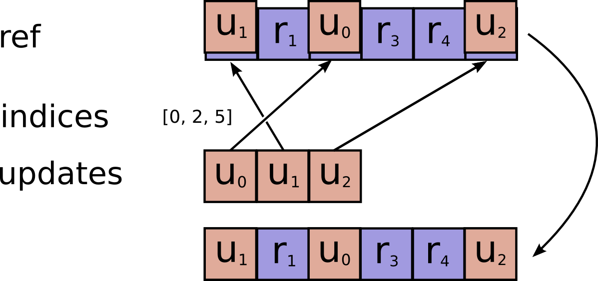
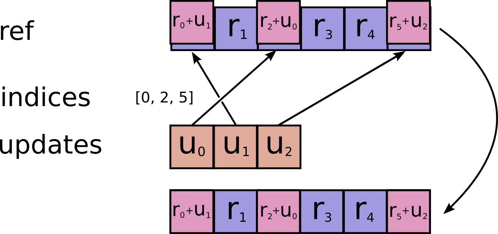

<!-- This file is machine generated: DO NOT EDIT! -->

# Variables <a class="md-anchor" id="AUTOGENERATED-variables"></a>

Note: Functions taking `Tensor` arguments can also take anything accepted by
[`tf.convert_to_tensor`](../../api_docs/python/framework.md#convert_to_tensor).

<!-- TOC-BEGIN This section is generated by neural network: DO NOT EDIT! -->
## Contents
### [Variables](#AUTOGENERATED-variables)
* [Variables](#AUTOGENERATED-variables)
  * [class tf.Variable](#Variable)
* [Variable helper functions](#AUTOGENERATED-variable-helper-functions)
  * [`tf.all_variables()`](#all_variables)
  * [`tf.trainable_variables()`](#trainable_variables)
  * [`tf.initialize_all_variables()`](#initialize_all_variables)
  * [`tf.initialize_variables(var_list, name='init')`](#initialize_variables)
  * [`tf.assert_variables_initialized(var_list=None)`](#assert_variables_initialized)
* [Saving and Restoring Variables](#AUTOGENERATED-saving-and-restoring-variables)
  * [class tf.train.Saver](#Saver)
  * [`tf.train.latest_checkpoint(checkpoint_dir, latest_filename=None)`](#latest_checkpoint)
  * [`tf.train.get_checkpoint_state(checkpoint_dir, latest_filename=None)`](#get_checkpoint_state)
  * [`tf.train.update_checkpoint_state(save_dir, model_checkpoint_path, all_model_checkpoint_paths=None, latest_filename=None)`](#update_checkpoint_state)
* [Sharing Variables](#AUTOGENERATED-sharing-variables)
  * [`tf.get_variable(name, shape=None, dtype=tf.float32, initializer=None, trainable=True, collections=None)`](#get_variable)
  * [`tf.get_variable_scope()`](#get_variable_scope)
  * [`tf.variable_scope(name_or_scope, reuse=None, initializer=None)`](#variable_scope)
  * [`tf.constant_initializer(value=0.0)`](#constant_initializer)
  * [`tf.random_normal_initializer(mean=0.0, stddev=1.0, seed=None)`](#random_normal_initializer)
  * [`tf.truncated_normal_initializer(mean=0.0, stddev=1.0, seed=None)`](#truncated_normal_initializer)
  * [`tf.random_uniform_initializer(minval=0.0, maxval=1.0, seed=None)`](#random_uniform_initializer)
  * [`tf.uniform_unit_scaling_initializer(factor=1.0, seed=None)`](#uniform_unit_scaling_initializer)
  * [`tf.zeros_initializer(shape, dtype=tf.float32)`](#zeros_initializer)
* [Sparse Variable Updates](#AUTOGENERATED-sparse-variable-updates)
  * [`tf.scatter_update(ref, indices, updates, use_locking=None, name=None)`](#scatter_update)
  * [`tf.scatter_add(ref, indices, updates, use_locking=None, name=None)`](#scatter_add)
  * [`tf.scatter_sub(ref, indices, updates, use_locking=None, name=None)`](#scatter_sub)
  * [`tf.sparse_mask(a, mask_indices, name=None)`](#sparse_mask)
  * [class tf.IndexedSlices](#IndexedSlices)


<!-- TOC-END This section was generated by neural network, THANKS FOR READING! -->

## Variables <a class="md-anchor" id="AUTOGENERATED-variables"></a>

- - -

### class tf.Variable <a class="md-anchor" id="Variable"></a>

See the [Variables How To](../../how_tos/variables/index.md) for a high
level overview.

A variable maintains state in the graph across calls to `run()`. You add a
variable to the graph by constructing an instance of the class `Variable`.

The `Variable()` constructor requires an initial value for the variable,
which can be a `Tensor` of any type and shape. The initial value defines the
type and shape of the variable. After construction, the type and shape of
the variable are fixed. The value can be changed using one of the assign
methods.

If you want to change the shape of a variable later you have to use an
`assign` Op with `validate_shape=False`.

Just like any `Tensor`, variables created with `Variable()` can be used as
inputs for other Ops in the graph. Additionally, all the operators
overloaded for the `Tensor` class are carried over to variables, so you can
also add nodes to the graph by just doing arithmetic on variables.

```python
import tensorflow as tf

# Create a variable.
w = tf.Variable(<initial-value>, name=<optional-name>)

# Use the variable in the graph like any Tensor.
y = tf.matmul(w, ...another variable or tensor...)

# The overloaded operators are available too.
z = tf.sigmoid(w + b)

# Assign a new value to the variable with `assign()` or a related method.
w.assign(w + 1.0)
w.assign_add(1.0)
```

When you launch the graph, variables have to be explicitly initialized before
you can run Ops that use their value. You can initialize a variable by
running its *initializer op*, restoring the variable from a save file, or
simply running an `assign` Op that assigns a value to the variable. In fact,
the variable *initializer op* is just an `assign` Op that assigns the
variable's initial value to the variable itself.

```python
# Launch the graph in a session.
with tf.Session() as sess:
    # Run the variable initializer.
    sess.run(w.initializer)
    # ...you now can run ops that use the value of 'w'...
```

The most common initialization pattern is to use the convenience function
`initialize_all_variables()` to add an Op to the graph that initializes
all the variables. You then run that Op after launching the graph.

```python
# Add an Op to initialize all variables.
init_op = tf.initialize_all_variables()

# Launch the graph in a session.
with tf.Session() as sess:
    # Run the Op that initializes all variables.
    sess.run(init_op)
    # ...you can now run any Op that uses variable values...
```

If you need to create a variable with an initial value dependent on another
variable, use the other variable's `initialized_value()`. This ensures that
variables are initialized in the right order.

All variables are automatically collected in the graph where they are
created. By default, the constructor adds the new variable to the graph
collection `GraphKeys.VARIABLES`. The convenience function
`all_variables()` returns the contents of that collection.

When building a machine learning model it is often convenient to distinguish
betwen variables holding the trainable model parameters and other variables
such as a `global step` variable used to count training steps. To make this
easier, the variable constructor supports a `trainable=<bool>` parameter. If
`True`, the new variable is also added to the graph collection
`GraphKeys.TRAINABLE_VARIABLES`. The convenience function
`trainable_variables()` returns the contents of this collection. The
various `Optimizer` classes use this collection as the default list of
variables to optimize.


Creating a variable.

- - -

#### `tf.Variable.__init__(initial_value, trainable=True, collections=None, validate_shape=True, name=None)` <a class="md-anchor" id="Variable.__init__"></a>

Creates a new variable with value `initial_value`.

The new variable is added to the graph collections listed in `collections`,
which defaults to `[GraphKeys.VARIABLES]`.

If `trainable` is `True` the variable is also added to the graph collection
`GraphKeys.TRAINABLE_VARIABLES`.

This constructor creates both a `variable` Op and an `assign` Op to set the
variable to its initial value.

##### Args: <a class="md-anchor" id="AUTOGENERATED-args-"></a>


*  <b>initial_value</b>: A `Tensor`, or Python object convertible to a `Tensor`.
    The initial value for the Variable. Must have a shape specified unless
    `validate_shape` is set to False.
*  <b>trainable</b>: If `True`, the default, also adds the variable to the graph
    collection `GraphKeys.TRAINABLE_VARIABLES`. This collection is used as
    the default list of variables to use by the `Optimizer` classes.
*  <b>collections</b>: List of graph collections keys. The new variable is added to
    these collections. Defaults to `[GraphKeys.VARIABLES]`.
*  <b>validate_shape</b>: If `False`, allows the variable to be initialized with a
    value of unknown shape. If `True`, the default, the shape of
    `initial_value` must be known.
*  <b>name</b>: Optional name for the variable. Defaults to `'Variable'` and gets
    uniquified automatically.

##### Returns: <a class="md-anchor" id="AUTOGENERATED-returns-"></a>

  A Variable.

##### Raises: <a class="md-anchor" id="AUTOGENERATED-raises-"></a>


*  <b>ValueError</b>: If the initial value does not have a shape and
    `validate_shape` is `True`.


- - -

#### `tf.Variable.initialized_value()` <a class="md-anchor" id="Variable.initialized_value"></a>

Returns the value of the initialized variable.

You should use this instead of the variable itself to initialize another
variable with a value that depends on the value of this variable.

```python
# Initialize 'v' with a random tensor.
v = tf.Variable(tf.truncated_normal([10, 40]))
# Use `initialized_value` to guarantee that `v` has been
# initialized before its value is used to initialize `w`.
# The random values are picked only once.
w = tf.Variable(v.initialized_value() * 2.0)
```

##### Returns: <a class="md-anchor" id="AUTOGENERATED-returns-"></a>

  A `Tensor` holding the value of this variable after its initializer
  has run.


Changing a variable value.

- - -

#### `tf.Variable.assign(value, use_locking=False)` <a class="md-anchor" id="Variable.assign"></a>

Assigns a new value to the variable.

This is essentially a shortcut for `assign(self, value)`.

##### Args: <a class="md-anchor" id="AUTOGENERATED-args-"></a>


*  <b>value</b>: A `Tensor`. The new value for this variable.
*  <b>use_locking</b>: If `True`, use locking during the assignment.

##### Returns: <a class="md-anchor" id="AUTOGENERATED-returns-"></a>

  A `Tensor` that will hold the new value of this variable after
  the assignment has completed.


- - -

#### `tf.Variable.assign_add(delta, use_locking=False)` <a class="md-anchor" id="Variable.assign_add"></a>

Adds a value to this variable.

 This is essentially a shortcut for `assign_add(self, delta)`.

##### Args: <a class="md-anchor" id="AUTOGENERATED-args-"></a>


*  <b>delta</b>: A `Tensor`. The value to add to this variable.
*  <b>use_locking</b>: If `True`, use locking during the operation.

##### Returns: <a class="md-anchor" id="AUTOGENERATED-returns-"></a>

  A `Tensor` that will hold the new value of this variable after
  the addition has completed.


- - -

#### `tf.Variable.assign_sub(delta, use_locking=False)` <a class="md-anchor" id="Variable.assign_sub"></a>

Subtracts a value from this variable.

This is essentially a shortcut for `assign_sub(self, delta)`.

##### Args: <a class="md-anchor" id="AUTOGENERATED-args-"></a>


*  <b>delta</b>: A `Tensor`. The value to subtract from this variable.
*  <b>use_locking</b>: If `True`, use locking during the operation.

##### Returns: <a class="md-anchor" id="AUTOGENERATED-returns-"></a>

  A `Tensor` that will hold the new value of this variable after
  the subtraction has completed.


- - -

#### `tf.Variable.scatter_sub(sparse_delta, use_locking=False)` <a class="md-anchor" id="Variable.scatter_sub"></a>

Subtracts `IndexedSlices` from this variable.

This is essentially a shortcut for `scatter_sub(self, sparse_delta.indices,
sparse_delta.values)`.

##### Args: <a class="md-anchor" id="AUTOGENERATED-args-"></a>


*  <b>sparse_delta</b>: `IndexedSlices` to be subtracted from this variable.
*  <b>use_locking</b>: If `True`, use locking during the operation.

##### Returns: <a class="md-anchor" id="AUTOGENERATED-returns-"></a>

  A `Tensor` that will hold the new value of this variable after
  the scattered subtraction has completed.

##### Raises: <a class="md-anchor" id="AUTOGENERATED-raises-"></a>


*  <b>ValueError</b>: if `sparse_delta` is not an `IndexedSlices`.


- - -

#### `tf.Variable.count_up_to(limit)` <a class="md-anchor" id="Variable.count_up_to"></a>

Increments this variable until it reaches `limit`.

When that Op is run it tries to increment the variable by `1`. If
incrementing the variable would bring it above `limit` then the Op raises
the exception `OutOfRangeError`.

If no error is raised, the Op outputs the value of the variable before
the increment.

This is essentially a shortcut for `count_up_to(self, limit)`.

##### Args: <a class="md-anchor" id="AUTOGENERATED-args-"></a>


*  <b>limit</b>: value at which incrementing the variable raises an error.

##### Returns: <a class="md-anchor" id="AUTOGENERATED-returns-"></a>

  A `Tensor` that will hold the variable value before the increment. If no
  other Op modifies this variable, the values produced will all be
  distinct.


- - -

#### `tf.Variable.eval(session=None)` <a class="md-anchor" id="Variable.eval"></a>

In a session, computes and returns the value of this variable.

This is not a graph construction method, it does not add ops to the graph.

This convenience method requires a session where the graph containing this
variable has been launched. If no session is passed, the default session is
used.  See the [Session class](../../api_docs/python/client.md#Session) for more information on
launching a graph and on sessions.

```python
v = tf.Variable([1, 2])
init = tf.initialize_all_variables()

with tf.Session() as sess:
    sess.run(init)
    # Usage passing the session explicitly.
    print v.eval(sess)
    # Usage with the default session.  The 'with' block
    # above makes 'sess' the default session.
    print v.eval()
```

##### Args: <a class="md-anchor" id="AUTOGENERATED-args-"></a>


*  <b>session</b>: The session to use to evaluate this variable. If
    none, the default session is used.

##### Returns: <a class="md-anchor" id="AUTOGENERATED-returns-"></a>

  A numpy `ndarray` with a copy of the value of this variable.


Properties.

- - -

#### `tf.Variable.name` <a class="md-anchor" id="Variable.name"></a>

The name of this variable.

- - -

#### `tf.Variable.dtype` <a class="md-anchor" id="Variable.dtype"></a>

The `DType` of this variable.

- - -

#### `tf.Variable.get_shape()` <a class="md-anchor" id="Variable.get_shape"></a>

The `TensorShape` of this variable.

##### Returns: <a class="md-anchor" id="AUTOGENERATED-returns-"></a>

  A `TensorShape`.


- - -

#### `tf.Variable.device` <a class="md-anchor" id="Variable.device"></a>

The device of this variable.

- - -

#### `tf.Variable.initializer` <a class="md-anchor" id="Variable.initializer"></a>

The initializer operation for this variable.

- - -

#### `tf.Variable.graph` <a class="md-anchor" id="Variable.graph"></a>

The `Graph` of this variable.

- - -

#### `tf.Variable.op` <a class="md-anchor" id="Variable.op"></a>

The `Operation` of this variable.


## Variable helper functions <a class="md-anchor" id="AUTOGENERATED-variable-helper-functions"></a>

TensorFlow provides a set of functions to help manage the set of variables
collected in the graph.

- - -

### `tf.all_variables()` <a class="md-anchor" id="all_variables"></a>

Returns all variables collected in the graph.

The `Variable()` constructor automatically adds new variables to the graph
collection `GraphKeys.VARIABLES`. This convenience function returns the
contents of that collection.

##### Returns: <a class="md-anchor" id="AUTOGENERATED-returns-"></a>

  A list of `Variable` objects.


- - -

### `tf.trainable_variables()` <a class="md-anchor" id="trainable_variables"></a>

Returns all variables created with `trainable=True`.

When passed `trainable=True`, the `Variable()` constructor automatically
adds new variables to the graph collection
`GraphKeys.TRAINABLE_VARIABLES`. This convenience function returns the
contents of that collection.

##### Returns: <a class="md-anchor" id="AUTOGENERATED-returns-"></a>

  A list of Variable objects.


- - -

### `tf.initialize_all_variables()` <a class="md-anchor" id="initialize_all_variables"></a>

Returns an Op that initializes all variables.

This is just a shortcut for `initialize_variables(all_variables())`

##### Returns: <a class="md-anchor" id="AUTOGENERATED-returns-"></a>

  An Op that initializes all variables in the graph.


- - -

### `tf.initialize_variables(var_list, name='init')` <a class="md-anchor" id="initialize_variables"></a>

Returns an Op that initializes a list of variables.

After you launch the graph in a session, you can run the returned Op to
initialize all the variables in `var_list`. This Op runs all the
initializers of the variables in `var_list` in parallel.

Calling `initialize_variables()` is equivalent to passing the list of
initializers to `Group()`.

If `var_list` is empty, however, the function still returns an Op that can
be run. That Op just has no effect.

##### Args: <a class="md-anchor" id="AUTOGENERATED-args-"></a>


*  <b>var_list</b>: List of `Variable` objects to initialize.
*  <b>name</b>: Optional name for the returned operation.

##### Returns: <a class="md-anchor" id="AUTOGENERATED-returns-"></a>

  An Op that run the initializers of all the specified variables.


- - -

### `tf.assert_variables_initialized(var_list=None)` <a class="md-anchor" id="assert_variables_initialized"></a>

Returns an Op to check if variables are initialized.

When run, the returned Op will raise the exception `FailedPreconditionError`
if any of the variables has not yet been initialized.

Note: This function is implemented by trying to fetch the values of the
variables. If one of the variables is not initialized a message may be
logged by the C++ runtime. This is expected.

##### Args: <a class="md-anchor" id="AUTOGENERATED-args-"></a>


*  <b>var_list</b>: List of `Variable` objects to check. Defaults to the
    value of `all_variables().`

##### Returns: <a class="md-anchor" id="AUTOGENERATED-returns-"></a>

  An Op, or None if there are no variables.


## Saving and Restoring Variables <a class="md-anchor" id="AUTOGENERATED-saving-and-restoring-variables"></a>

- - -

### class tf.train.Saver <a class="md-anchor" id="Saver"></a>

Saves and restores variables.

See [Variables](../../how_tos/variables/index.md)
for an overview of variables, saving and restoring.

The `Saver` class adds ops to save and restore variables to and from
*checkpoints*.  It also provides convenience methods to run these ops.

Checkpoints are binary files in a proprietary format which map variable names
to tensor values.  The best way to examine the contents of a checkpoint is to
load it using a `Saver`.

Savers can automatically number checkpoint filenames with a provided counter.
This lets you keep multiple checkpoints at different steps while training a
model.  For example you can number the checkpoint filenames with the training
step number.  To avoid filling up disks, savers manage checkpoint files
automatically. For example, they can keep only the N most recent files, or
one checkpoint for every N hours of training.

You number checkpoint filenames by passing a value to the optional
`global_step` argument to `save()`:

```python
saver.save(sess, 'my-model', global_step=0) ==> filename: 'my-model-0'
...
saver.save(sess, 'my-model', global_step=1000) ==> filename: 'my-model-1000'
```

Additionally, optional arguments to the `Saver()` constructor let you control
the proliferation of checkpoint files on disk:

* `max_to_keep` indicates the maximum number of recent checkpoint files to
  keep.  As new files are created, older files are deleted.  If None or 0,
  all checkpoint files are kept.  Defaults to 5 (that is, the 5 most recent
  checkpoint files are kept.)

* `keep_checkpoint_every_n_hours`: In addition to keeping the most recent
  `max_to_keep` checkpoint files, you might want to keep one checkpoint file
  for every N hours of training.  This can be useful if you want to later
  analyze how a model progressed during a long training session.  For
  example, passing `keep_checkpoint_every_n_hours=2` ensures that you keep
  one checkpoint file for every 2 hours of training.  The default value of
  10,000 hours effectively disables the feature.

Note that you still have to call the `save()` method to save the model.
Passing these arguments to the constructor will not save variables
automatically for you.

A training program that saves regularly looks like:

```python
...
# Create a saver.
saver = tf.train.Saver(...variables...)
# Launch the graph and train, saving the model every 1,000 steps.
sess = tf.Session()
for step in xrange(1000000):
    sess.run(..training_op..)
    if step % 1000 == 0:
        # Append the step number to the checkpoint name:
        saver.save(sess, 'my-model', global_step=step)
```

In addition to checkpoint files, savers keep a protocol buffer on disk with
the list of recent checkpoints. This is used to manage numbered checkpoint
files and by `latest_checkpoint()`, which makes it easy to discover the path
to the most recent checkpoint. That protocol buffer is stored in a file named
'checkpoint' next to the checkpoint files.

If you create several savers, you can specify a different filename for the
protocol buffer file in the call to `save()`.

- - -

#### `tf.train.Saver.__init__(var_list=None, reshape=False, sharded=False, max_to_keep=5, keep_checkpoint_every_n_hours=10000.0, name=None, restore_sequentially=False, saver_def=None, builder=None)` <a class="md-anchor" id="Saver.__init__"></a>

Creates a `Saver`.

The constructor adds ops to save and restore variables.

`var_list` specifies the variables that will be saved and restored. It can
be passed as a `dict` or a list:

* A `dict` of names to variables: The keys are the names that will be
  used to save or restore the variables in the checkpoint files.
* A list of variables: The variables will be keyed with their op name in
  the checkpoint files.

For example:

```python
v1 = tf.Variable(..., name='v1')
v2 = tf.Variable(..., name='v2')

# Pass the variables as a dict:
saver = tf.train.Saver({'v1': v1, 'v2': v2})

# Or pass them as a list.
saver = tf.train.Saver([v1, v2])
# Passing a list is equivalent to passing a dict with the variable op names
# as keys:
saver = tf.train.Saver({v.op.name: v for v in [v1, v2]})
```

The optional `reshape` argument, if True, allows restoring a variable from
a save file where the variable had a different shape, but the same number
of elements and type.  This is useful if you have reshaped a variable and
want to reload it from an older checkpoint.

The optional `sharded` argument, if True, instructs the saver to shard
checkpoints per device.

##### Args: <a class="md-anchor" id="AUTOGENERATED-args-"></a>


*  <b>var_list</b>: A list of Variables or a dictionary mapping names to
    Variables.  If None, defaults to the list of all variables.
*  <b>reshape</b>: If True, allows restoring parameters from a checkpoint
    where the variables have a different shape.
*  <b>sharded</b>: If True, shard the checkpoints, one per device.
*  <b>max_to_keep</b>: maximum number of recent checkpoints to keep.
    Defaults to 10,000 hours.
*  <b>keep_checkpoint_every_n_hours</b>: How often to keep checkpoints.
    Defaults to 10,000 hours.
*  <b>name</b>: string.  Optional name to use as a prefix when adding operations.
*  <b>restore_sequentially</b>: A Bool, which if true, causes restore of different
    variables to happen sequentially within each device.  This can lower
    memory usage when restoring very large models.
*  <b>saver_def</b>: Optional SaverDef proto to use instead of running the builder.
    This is only useful for specialty code that wants to recreate a Saver
    object for a previously built Graph that had a Saver.  The saver_def
    proto should be the one returned by the as_saver_def() call of the
    Saver that was created for that Graph.
*  <b>builder</b>: Optional SaverBuilder to use if a saver_def was not provided.
    Defaults to BaseSaverBuilder().

##### Raises: <a class="md-anchor" id="AUTOGENERATED-raises-"></a>


*  <b>TypeError</b>: If `var_list` is invalid.
*  <b>ValueError</b>: If any of the keys or values in `var_list` is not unique.


- - -

#### `tf.train.Saver.save(sess, save_path, global_step=None, latest_filename=None)` <a class="md-anchor" id="Saver.save"></a>

Saves variables.

This method runs the ops added by the constructor for saving variables.
It requires a session in which the graph was launched.  The variables to
save must also have been initialized.

The method returns the path of the newly created checkpoint file.  This
path can be passed directly to a call to `restore()`.

##### Args: <a class="md-anchor" id="AUTOGENERATED-args-"></a>


*  <b>sess</b>: A Session to use to save the variables.
*  <b>save_path</b>: string.  Path to the checkpoint filename.  If the saver is
    `sharded`, this is the prefix of the sharded checkpoint filename.
*  <b>global_step</b>: If provided the global step number is appended to
    `save_path` to create the checkpoint filename. The optional argument
    can be a Tensor, a Tensor name or an integer.
*  <b>latest_filename</b>: Optional name for the protocol buffer file that will
    contains the list of most recent checkpoint filenames.  That file,
    kept in the same directory as the checkpoint files, is automatically
    managed by the saver to keep track of recent checkpoints.  Defaults to
    'checkpoint'.

##### Returns: <a class="md-anchor" id="AUTOGENERATED-returns-"></a>

  A string: path at which the variables were saved.  If the saver is
    sharded, this string ends with: '-?????-of-nnnnn' where 'nnnnn'
    is the number of shards created.

##### Raises: <a class="md-anchor" id="AUTOGENERATED-raises-"></a>


*  <b>TypeError</b>: If `sess` is not a Session.


- - -

#### `tf.train.Saver.restore(sess, save_path)` <a class="md-anchor" id="Saver.restore"></a>

Restores previously saved variables.

This method runs the ops added by the constructor for restoring variables.
It requires a session in which the graph was launched.  The variables to
restore do not have to have been initialized, as restoring is itself a way
to initialize variables.

The `save_path` argument is typically a value previously returned from a
`save()` call, or a call to `latest_checkpoint()`.

##### Args: <a class="md-anchor" id="AUTOGENERATED-args-"></a>


*  <b>sess</b>: A Session to use to restore the parameters.
*  <b>save_path</b>: Path where parameters were previously saved.


Other utility methods.

- - -

#### `tf.train.Saver.last_checkpoints` <a class="md-anchor" id="Saver.last_checkpoints"></a>

List of not-yet-deleted checkpoint filenames.

You can pass any of the returned values to `restore()`.

##### Returns: <a class="md-anchor" id="AUTOGENERATED-returns-"></a>

  A list of checkpoint filenames, sorted from oldest to newest.

- - -

#### `tf.train.Saver.set_last_checkpoints(last_checkpoints)` <a class="md-anchor" id="Saver.set_last_checkpoints"></a>

Sets the list of not-yet-deleted checkpoint filenames.

##### Args: <a class="md-anchor" id="AUTOGENERATED-args-"></a>


*  <b>last_checkpoints</b>: a list of checkpoint filenames.

##### Raises: <a class="md-anchor" id="AUTOGENERATED-raises-"></a>


*  <b>AssertionError</b>: if the list of checkpoint filenames has already been set.


- - -

#### `tf.train.Saver.as_saver_def()` <a class="md-anchor" id="Saver.as_saver_def"></a>

Generates a `SaverDef` representation of this saver.

##### Returns: <a class="md-anchor" id="AUTOGENERATED-returns-"></a>

  A `SaverDef` proto.


- - -

### `tf.train.latest_checkpoint(checkpoint_dir, latest_filename=None)` <a class="md-anchor" id="latest_checkpoint"></a>

Finds the filename of latest saved checkpoint file.

##### Args: <a class="md-anchor" id="AUTOGENERATED-args-"></a>


*  <b>checkpoint_dir</b>: Directory where the variables were saved.
*  <b>latest_filename</b>: Optional name for the protocol buffer file that
    contains the list of most recent checkpoint filenames.
    See the corresponding argument to `Saver.save()`.

##### Returns: <a class="md-anchor" id="AUTOGENERATED-returns-"></a>

  The full path to the latest checkpoint or None if no checkpoint was found.


- - -

### `tf.train.get_checkpoint_state(checkpoint_dir, latest_filename=None)` <a class="md-anchor" id="get_checkpoint_state"></a>

Returns CheckpointState proto from the "checkpoint" file.

If the "checkpoint" file contains a valid CheckpointState
proto, returns it.

##### Args: <a class="md-anchor" id="AUTOGENERATED-args-"></a>


*  <b>checkpoint_dir</b>: The directory of checkpoints.
*  <b>latest_filename</b>: Optional name of the checkpoint file.  Default to
    'checkpoint'.

##### Returns: <a class="md-anchor" id="AUTOGENERATED-returns-"></a>

  A CheckpointState if the state was available, None
  otherwise.


- - -

### `tf.train.update_checkpoint_state(save_dir, model_checkpoint_path, all_model_checkpoint_paths=None, latest_filename=None)` <a class="md-anchor" id="update_checkpoint_state"></a>

Updates the content of the 'checkpoint' file.

This updates the checkpoint file containing a CheckpointState
proto.

##### Args: <a class="md-anchor" id="AUTOGENERATED-args-"></a>


*  <b>save_dir</b>: Directory where the model was saved.
*  <b>model_checkpoint_path</b>: The checkpoint file.
*  <b>all_model_checkpoint_paths</b>: list of strings.  Paths to all not-yet-deleted
    checkpoints, sorted from oldest to newest.  If this is a non-empty list,
    the last element must be equal to model_checkpoint_path.  These paths
    are also saved in the CheckpointState proto.
*  <b>latest_filename</b>: Optional name of the checkpoint file.  Default to
    'checkpoint'.

##### Raises: <a class="md-anchor" id="AUTOGENERATED-raises-"></a>


*  <b>RuntimeError</b>: If the save paths conflict.


## Sharing Variables <a class="md-anchor" id="AUTOGENERATED-sharing-variables"></a>

TensorFlow provides several classes and operations that you can use to
create variables contingent on certain conditions.

- - -

### `tf.get_variable(name, shape=None, dtype=tf.float32, initializer=None, trainable=True, collections=None)` <a class="md-anchor" id="get_variable"></a>

Gets an existing variable with these parameters or create a new one.

This function prefixes the name with the current variable scope
and performs reuse checks. See the
[Variable Scope How To](../../how_tos/variable_scope/index.md)
for an extensive description of how reusing works. Here is a basic example:

```python
with tf.variable_scope("foo"):
    v = get_variable("v", [1])  # v.name == "foo/v:0"
    w = get_variable("w", [1])  # w.name == "foo/w:0"
with tf.variable_scope("foo", reuse=True)
    v1 = get_variable("v")  # The same as v above.
```

If initializer is `None` (the default), the default initializer passed in
the constructor is used. If that one is `None` too, a
`UniformUnitScalingInitializer` will be used.

##### Args: <a class="md-anchor" id="AUTOGENERATED-args-"></a>


*  <b>name</b>: the name of the new or existing variable.
*  <b>shape</b>: shape of the new or existing variable.
*  <b>dtype</b>: type of the new or existing variable (defaults to `DT_FLOAT`).
*  <b>initializer</b>: initializer for the variable if one is created.
*  <b>trainable</b>: If `True` also add the variable to the graph collection
    `GraphKeys.TRAINABLE_VARIABLES` (see variables.Variable).
*  <b>collections</b>: List of graph collections keys to add the Variable to.
    Defaults to `[GraphKeys.VARIABLES]` (see variables.Variable).

##### Returns: <a class="md-anchor" id="AUTOGENERATED-returns-"></a>

  The created or existing variable.

##### Raises: <a class="md-anchor" id="AUTOGENERATED-raises-"></a>


*  <b>ValueError</b>: when creating a new variable and shape is not declared,
    or when violating reuse during variable creation. Reuse is set inside
    `variable_scope`.


- - -

### `tf.get_variable_scope()` <a class="md-anchor" id="get_variable_scope"></a>

Returns the current variable scope.


- - -

### `tf.variable_scope(name_or_scope, reuse=None, initializer=None)` <a class="md-anchor" id="variable_scope"></a>

Returns a context for variable scope.

Variable scope allows to create new variables and to share already created
ones while providing checks to not create or share by accident. For details,
see the [Variable Scope How To](../../how_tos/variable_scope/index.md),
here we present only a few basic examples.

Simple example of how to create a new variable:

```python
with tf.variable_scope("foo"):
    with tf.variable_scope("bar"):
        v = tf.get_variable("v", [1])
        assert v.name == "foo/bar/v:0"
```

Basic example of sharing a variable:

```python
with tf.variable_scope("foo"):
    v = get_variable("v", [1])
with tf.variable_scope("foo", reuse=True):
    v1 = tf.get_variable("v", [1])
assert v1 == v
```

Sharing a variable by capturing a scope and setting reuse:

```python
with tf.variable_scope("foo") as scope.
    v = get_variable("v", [1])
    scope.reuse_variables()
    v1 = tf.get_variable("v", [1])
assert v1 == v
```

To prevent accidental sharing of variables, we raise an exception when
getting an existing variable in a non-reusing scope.

```python
with tf.variable_scope("foo") as scope.
    v = get_variable("v", [1])
    v1 = tf.get_variable("v", [1])
    #  Raises ValueError("... v already exists ...").
```

Similarly, we raise an exception when trying to get a variable that
does not exist in reuse mode.

```python
with tf.variable_scope("foo", reuse=True):
    v = get_variable("v", [1])
    #  Raises ValueError("... v does not exists ...").
```

Note that the `reuse` flag is inherited: if we open a reusing scope,
then all its sub-scopes become reusing as well.

##### Args: <a class="md-anchor" id="AUTOGENERATED-args-"></a>


*  <b>name_or_scope</b>: `string` or `VariableScope`: the scope to open.
*  <b>reuse</b>: `True` or `None`; if `True`, we go into reuse mode for this scope as
    well as all sub-scopes; if `None`, we just inherit the parent scope reuse.
*  <b>initializer</b>: default initializer for variables within this scope.

##### Yields: <a class="md-anchor" id="AUTOGENERATED-yields-"></a>

  A scope that can be to captured and reused.

##### Raises: <a class="md-anchor" id="AUTOGENERATED-raises-"></a>


*  <b>ValueError</b>: when trying to reuse within a create scope, or create within
    a reuse scope, or if reuse is not `None` or `True`.
*  <b>TypeError</b>: when the types of some arguments are not appropriate.


- - -

### `tf.constant_initializer(value=0.0)` <a class="md-anchor" id="constant_initializer"></a>

Returns an initializer that generates Tensors with a single value.

##### Args: <a class="md-anchor" id="AUTOGENERATED-args-"></a>


*  <b>value</b>: A Python scalar. All elements of the initialized variable
    will be set to this value.

##### Returns: <a class="md-anchor" id="AUTOGENERATED-returns-"></a>

  An initializer that generates Tensors with a single value.


- - -

### `tf.random_normal_initializer(mean=0.0, stddev=1.0, seed=None)` <a class="md-anchor" id="random_normal_initializer"></a>

Returns an initializer that generates Tensors with a normal distribution.

##### Args: <a class="md-anchor" id="AUTOGENERATED-args-"></a>


*  <b>mean</b>: a python scalar or a scalar tensor. Mean of the random values
    to generate.
*  <b>stddev</b>: a python scalar or a scalar tensor. Standard deviation of the
    random values to generate.
*  <b>seed</b>: A Python integer. Used to create random seeds. See
    [`set_random_seed`](../../api_docs/python/constant_op.md#set_random_seed)
    for behavior.

##### Returns: <a class="md-anchor" id="AUTOGENERATED-returns-"></a>

  An initializer that generates Tensors with a normal distribution.


- - -

### `tf.truncated_normal_initializer(mean=0.0, stddev=1.0, seed=None)` <a class="md-anchor" id="truncated_normal_initializer"></a>

Returns an initializer that generates a truncated normal distribution.

These values are similar to values from a random_normal_initializer
except that values more than two standard deviations from the mean
are discarded and re-drawn. This is the recommended initializer for
neural network weights and filters.

##### Args: <a class="md-anchor" id="AUTOGENERATED-args-"></a>


*  <b>mean</b>: a python scalar or a scalar tensor. Mean of the random values
    to generate.
*  <b>stddev</b>: a python scalar or a scalar tensor. Standard deviation of the
    random values to generate.
*  <b>seed</b>: A Python integer. Used to create random seeds. See
    [`set_random_seed`](../../api_docs/python/constant_op.md#set_random_seed)
    for behavior.

##### Returns: <a class="md-anchor" id="AUTOGENERATED-returns-"></a>

  An initializer that generates Tensors with a truncated normal
  distribution.


- - -

### `tf.random_uniform_initializer(minval=0.0, maxval=1.0, seed=None)` <a class="md-anchor" id="random_uniform_initializer"></a>

Returns an initializer that generates Tensors with a uniform distribution.

##### Args: <a class="md-anchor" id="AUTOGENERATED-args-"></a>


*  <b>minval</b>: a python scalar or a scalar tensor. lower bound of the range
    of random values to generate.
*  <b>maxval</b>: a python scalar or a scalar tensor. upper bound of the range
    of random values to generate.
*  <b>seed</b>: A Python integer. Used to create random seeds. See
    [`set_random_seed`](../../api_docs/python/constant_op.md#set_random_seed)
    for behavior.

##### Returns: <a class="md-anchor" id="AUTOGENERATED-returns-"></a>

  An initializer that generates Tensors with a uniform distribution.


- - -

### `tf.uniform_unit_scaling_initializer(factor=1.0, seed=None)` <a class="md-anchor" id="uniform_unit_scaling_initializer"></a>

Returns an initializer that generates tensors without scaling variance.

When initializing a deep network, it is in principle advantageous to keep
the scale of the input variance constant, so it does not explode or diminish
by reaching the final layer. If the input is `x` and the operation `x * W`,
and we want to initialize `W` uniformly at random, we need to pick `W` from

    [-sqrt(3) / sqrt(dim), sqrt(3) / sqrt(dim)]

to keep the scale intact, where `dim = W.shape[0]` (the size of the input).
A similar calculation for convolutional networks gives an analogous result
with `dim` equal to the product of the first 3 dimensions.  When
nonlinearities are present, we need to multiply this by a constant `factor`.
See <https://arxiv.org/pdf/1412.6558v3.pdf> for deeper motivation, experiments
and the calculation of constants. In section 2.3 there, the constants were
numerically computed: for a linear layer it's 1.0, relu: ~1.43, tanh: ~1.15.

##### Args: <a class="md-anchor" id="AUTOGENERATED-args-"></a>


*  <b>factor</b>: Float.  A multiplicative factor by which the values will be scaled.
*  <b>seed</b>: A Python integer. Used to create random seeds. See
    [`set_random_seed`](../../api_docs/python/constant_op.md#set_random_seed)
    for behavior.

##### Returns: <a class="md-anchor" id="AUTOGENERATED-returns-"></a>

  An initializer that generates tensors with unit variance.


- - -

### `tf.zeros_initializer(shape, dtype=tf.float32)` <a class="md-anchor" id="zeros_initializer"></a>

An adaptor for zeros() to match the Initializer spec.


## Sparse Variable Updates <a class="md-anchor" id="AUTOGENERATED-sparse-variable-updates"></a>

The sparse update ops modify a subset of the entries in a dense `Variable`,
either overwriting the entries or adding / subtracting a delta.  These are
useful for training embedding models and similar lookup-based networks, since
only a small subset of embedding vectors change in any given step.

Since a sparse update of a large tensor may be generated automatically during
gradient computation (as in the gradient of
[`tf.gather`](../../api_docs/python/array_ops.md#gather)),
an [`IndexedSlices`](#IndexedSlices) class is provided that encapsulates a set
of sparse indices and values.  `IndexedSlices` objects are detected and handled
automatically by the optimizers in most cases.

- - -

### `tf.scatter_update(ref, indices, updates, use_locking=None, name=None)` <a class="md-anchor" id="scatter_update"></a>

Applies sparse updates to a variable reference.

This operation computes

    # Scalar indices
    ref[indices, ...] = updates[...]

    # Vector indices (for each i)
    ref[indices[i], ...] = updates[i, ...]

    # High rank indices (for each i, ..., j)
    ref[indices[i, ..., j], ...] = updates[i, ..., j, ...]

This operation outputs `ref` after the update is done.
This makes it easier to chain operations that need to use the reset value.

If `indices` contains duplicate entries, lexicographically later entries
override earlier entries.

Requires `updates.shape = indices.shape + ref.shape[1:]`.

<div style="width:70%; margin:auto; margin-bottom:10px; margin-top:20px;">

</div>

##### Args: <a class="md-anchor" id="AUTOGENERATED-args-"></a>


*  <b>ref</b>: A mutable `Tensor`. Should be from a `Variable` node.
*  <b>indices</b>: A `Tensor`. Must be one of the following types: `int32`, `int64`.
    A tensor of indices into the first dimension of `ref`.
*  <b>updates</b>: A `Tensor`. Must have the same type as `ref`.
    A tensor of updated values to store in `ref`.
*  <b>use_locking</b>: An optional `bool`. Defaults to `True`.
    If True, the assignment will be protected by a lock;
    otherwise the behavior is undefined, but may exhibit less contention.
*  <b>name</b>: A name for the operation (optional).

##### Returns: <a class="md-anchor" id="AUTOGENERATED-returns-"></a>

  Same as `ref`.  Returned as a convenience for operations that want
  to use the updated values after the update is done.


- - -

### `tf.scatter_add(ref, indices, updates, use_locking=None, name=None)` <a class="md-anchor" id="scatter_add"></a>

Adds sparse updates to a variable reference.

This operation computes

    # Scalar indices
    ref[indices, ...] += updates[...]

    # Vector indices (for each i)
    ref[indices[i], ...] += updates[i, ...]

    # High rank indices (for each i, ..., j)
    ref[indices[i, ..., j], ...] += updates[i, ..., j, ...]

This operation outputs `ref` after the update is done.
This makes it easier to chain operations that need to use the reset value.

Duplicate entries are handled correctly: if multiple `indices` reference
the same location, their contributions add.

Requires `updates.shape = indices.shape + ref.shape[1:]`.

<div style="width:70%; margin:auto; margin-bottom:10px; margin-top:20px;">

</div>

##### Args: <a class="md-anchor" id="AUTOGENERATED-args-"></a>


*  <b>ref</b>: A mutable `Tensor`. Must be one of the following types: `float32`, `float64`, `int64`, `int32`, `uint8`, `int16`, `int8`, `complex64`, `qint8`, `quint8`, `qint32`.
    Should be from a `Variable` node.
*  <b>indices</b>: A `Tensor`. Must be one of the following types: `int32`, `int64`.
    A tensor of indices into the first dimension of `ref`.
*  <b>updates</b>: A `Tensor`. Must have the same type as `ref`.
    A tensor of updated values to add to `ref`.
*  <b>use_locking</b>: An optional `bool`. Defaults to `False`.
    If True, the addition will be protected by a lock;
    otherwise the behavior is undefined, but may exhibit less contention.
*  <b>name</b>: A name for the operation (optional).

##### Returns: <a class="md-anchor" id="AUTOGENERATED-returns-"></a>

  Same as `ref`.  Returned as a convenience for operations that want
  to use the updated values after the update is done.


- - -

### `tf.scatter_sub(ref, indices, updates, use_locking=None, name=None)` <a class="md-anchor" id="scatter_sub"></a>

Subtracts sparse updates to a variable reference.

    # Scalar indices
    ref[indices, ...] -= updates[...]

    # Vector indices (for each i)
    ref[indices[i], ...] -= updates[i, ...]

    # High rank indices (for each i, ..., j)
    ref[indices[i, ..., j], ...] -= updates[i, ..., j, ...]

This operation outputs `ref` after the update is done.
This makes it easier to chain operations that need to use the reset value.

Duplicate entries are handled correctly: if multiple `indices` reference
the same location, their (negated) contributions add.

Requires `updates.shape = indices.shape + ref.shape[1:]`.

<div style="width:70%; margin:auto; margin-bottom:10px; margin-top:20px;">

</div>

##### Args: <a class="md-anchor" id="AUTOGENERATED-args-"></a>


*  <b>ref</b>: A mutable `Tensor`. Must be one of the following types: `float32`, `float64`, `int64`, `int32`, `uint8`, `int16`, `int8`, `complex64`, `qint8`, `quint8`, `qint32`.
    Should be from a `Variable` node.
*  <b>indices</b>: A `Tensor`. Must be one of the following types: `int32`, `int64`.
    A tensor of indices into the first dimension of `ref`.
*  <b>updates</b>: A `Tensor`. Must have the same type as `ref`.
    A tensor of updated values to subtract from `ref`.
*  <b>use_locking</b>: An optional `bool`. Defaults to `False`.
    If True, the subtraction will be protected by a lock;
    otherwise the behavior is undefined, but may exhibit less contention.
*  <b>name</b>: A name for the operation (optional).

##### Returns: <a class="md-anchor" id="AUTOGENERATED-returns-"></a>

  Same as `ref`.  Returned as a convenience for operations that want
  to use the updated values after the update is done.


- - -

### `tf.sparse_mask(a, mask_indices, name=None)` <a class="md-anchor" id="sparse_mask"></a>

Masks elements of `IndexedSlices`.

Given an `IndexedSlices` instance `a`, returns another `IndexedSlices` that
contains a subset of the slices of `a`. Only the slices at indices specified
in `mask_indices` are returned.

This is useful when you need to extract a subset of slices in an
`IndexedSlices` object.

For example:

```python
# `a` contains slices at indices [12, 26, 37, 45] from a large tensor
# with shape [1000, 10]
a.indices => [12, 26, 37, 45]
tf.shape(a.values) => [4, 10]

# `b` will be the subset of `a` slices at its second and third indices, so
# we want to mask of its first and last indices (which are at absolute
# indices 12, 45)
b = tf.sparse_mask(a, [12, 45])

b.indices => [26, 37]
tf.shape(b.values) => [2, 10]

```

##### Args: <a class="md-anchor" id="AUTOGENERATED-args-"></a>

  * `a`: An `IndexedSlices` instance.
  * `mask_indices`: Indices of elements to mask.
  * `name`: A name for the operation (optional).

##### Returns: <a class="md-anchor" id="AUTOGENERATED-returns-"></a>

  The masked `IndexedSlices` instance.


- - -

### class tf.IndexedSlices <a class="md-anchor" id="IndexedSlices"></a>

A sparse representation of a set of tensor slices at given indices.

This class is a simple wrapper for a pair of `Tensor` objects:

* `values`: A `Tensor` of any dtype with shape `[D0, D1, ..., Dn]`.
* `indices`: A 1-D integer `Tensor` with shape `[D0]`.

An `IndexedSlices` is typically used to represent a subset of a larger
tensor `dense` of shape `[LARGE0, D1, .. , DN]` where `LARGE0 >> D0`.
The values in `indices` are the indices in the first dimension of
the slices that have been extracted from the larger tensor.

The dense tensor `dense` represented by an `IndexedSlices` `slices` has

```python
dense[slices.indices[i], :, :, :, ...] = slices.values[i, :, :, :, ...]
```

The `IndexedSlices` class is used principally in the definition of
gradients for operations that have sparse gradients
(e.g. [`tf.gather`](../../api_docs/python/array_ops.md#gather)).

Contrast this representation with
[`SparseTensor`](../../api_docs/python/sparse_ops.md#SparseTensor),
which uses multi-dimensional indices and scalar values.

- - -

#### `tf.IndexedSlices.__init__(values, indices, dense_shape=None)` <a class="md-anchor" id="IndexedSlices.__init__"></a>

Creates an `IndexedSlices`.


- - -

#### `tf.IndexedSlices.values` <a class="md-anchor" id="IndexedSlices.values"></a>

A `Tensor` containing the values of the slices.

- - -

#### `tf.IndexedSlices.indices` <a class="md-anchor" id="IndexedSlices.indices"></a>

A 1-D `Tensor` containing the indices of the slices.

- - -

#### `tf.IndexedSlices.dense_shape` <a class="md-anchor" id="IndexedSlices.dense_shape"></a>

A 1-D `Tensor` containing the shape of the corresponding dense tensor.


- - -

#### `tf.IndexedSlices.name` <a class="md-anchor" id="IndexedSlices.name"></a>

The name of this `IndexedSlices`.

- - -

#### `tf.IndexedSlices.dtype` <a class="md-anchor" id="IndexedSlices.dtype"></a>

The `DType` of elements in this tensor.

- - -

#### `tf.IndexedSlices.device` <a class="md-anchor" id="IndexedSlices.device"></a>

The name of the device on which `values` will be produced, or `None`.

- - -

#### `tf.IndexedSlices.op` <a class="md-anchor" id="IndexedSlices.op"></a>

The `Operation` that produces `values` as an output.


