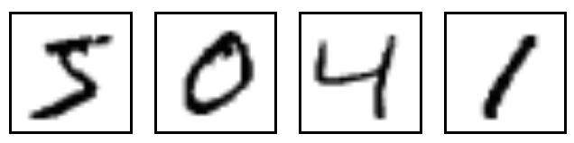
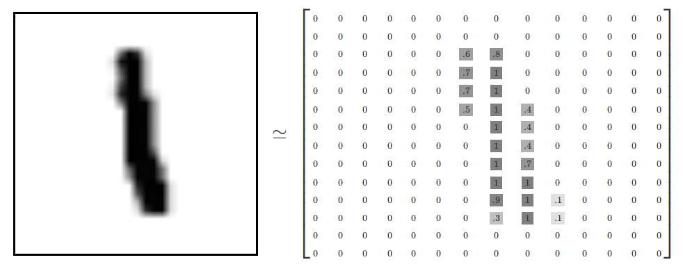
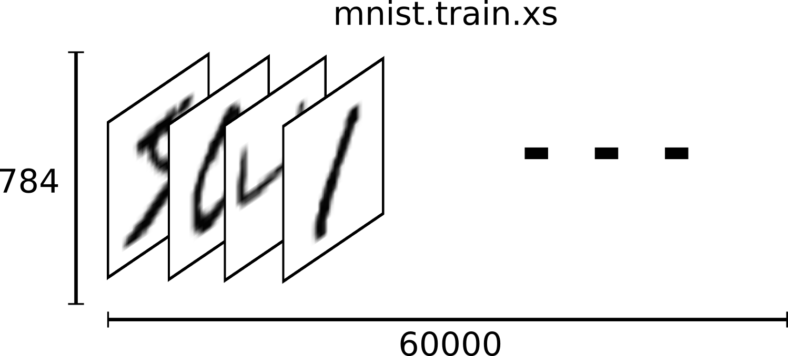
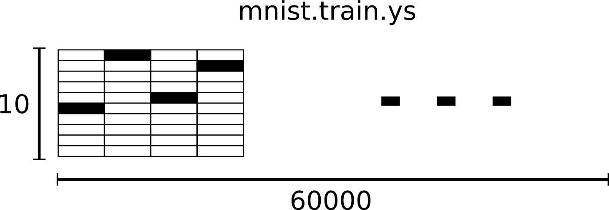
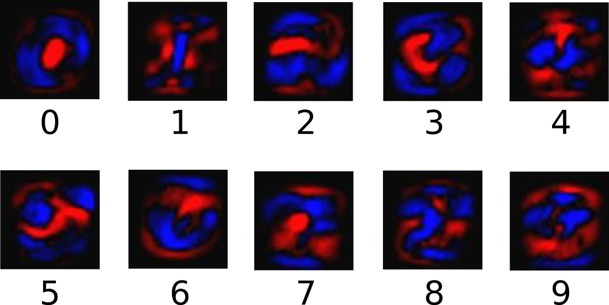
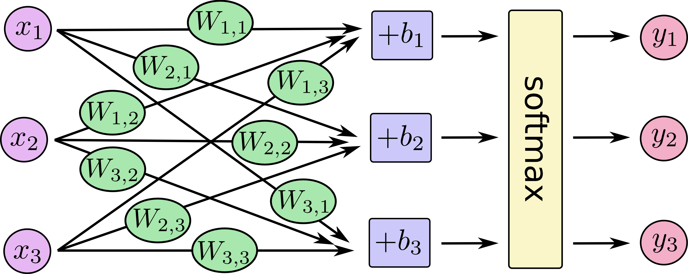
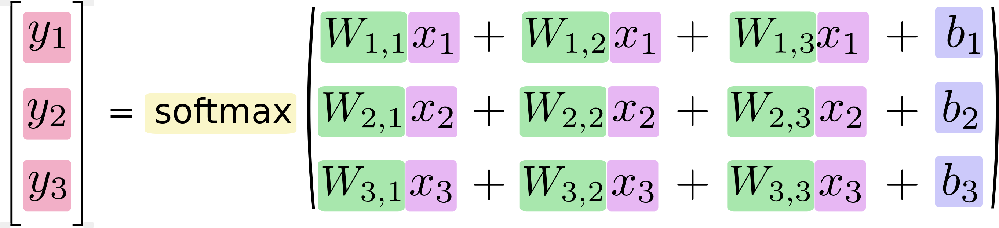
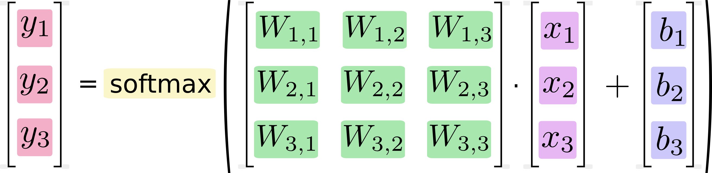

# MNIST For ML Beginners <a class="md-anchor" id="AUTOGENERATED-mnist-for-ml-beginners"></a>

*This tutorial is intended for readers who are new to both machine learning and
TensorFlow. If you already
know what MNIST is, and what softmax (multinomial logistic) regression is,
you might prefer this [faster paced tutorial](../../../tutorials/mnist/pros/index.md).*

When one learns how to program, there's a tradition that the first thing you do
is print "Hello World." Just like programming has Hello World, machine learning
has MNIST.

MNIST is a simple computer vision dataset. It consists of images of handwritten
digits like these:

<div style="width:40%; margin:auto; margin-bottom:10px; margin-top:20px;">

</div>

It also includes labels for each image, telling us which digit it is. For
example, the labels for the above images are 5, 0, 4, and 1.

In this tutorial, we're going to train a model to look at images and predict
what digits they are. Our goal isn't to train a really elaborate model that
achieves state-of-the-art performance -- although we'll give you code to do that
later! -- but rather to dip a toe into using TensorFlow. As such, we're going
to start with a very simple model, called a Softmax Regression.

The actual code for this tutorial is very short, and all the interesting
stuff happens in just three lines. However, it is very
important to understand the ideas behind it: both how TensorFlow works and the
core machine learning concepts. Because of this, we are going to very carefully
work through the code.

## The MNIST Data <a class="md-anchor" id="AUTOGENERATED-the-mnist-data"></a>

The MNIST data is hosted on
[Yann LeCun's website](http://yann.lecun.com/exdb/mnist/).  For your
convenience, we've included some python code to download and install the data
automatically. You can either download
[the code](https://tensorflow.googlesource.com/tensorflow/+/master/tensorflow/g3doc/tutorials/mnist/input_data.py)
and import it as below, or simply copy and paste it in.

```python
import input_data
mnist = input_data.read_data_sets("MNIST_data/", one_hot=True)
```

The downloaded data is split into two parts, 60,000 data points of training
data (`mnist.train`) and 10,000 points of test data (`mnist.test`).  This
split is very important: it's essential in machine learning that we
have separate data which we don't learn from so that we can make sure
that what we've learned actually generalizes!

As mentioned earlier, every MNIST data point has two parts: an image of a
handwritten digit and a corresponding label. We will call the images "xs" and
the labels "ys". Both the training set and test set contain xs and ys, for
example the training images are `mnist.train.images` and the train labels are
`mnist.train.labels`.

Each image is 28 pixels by 28 pixels. We can interpret this as a big array of
numbers:

<div style="width:50%; margin:auto; margin-bottom:10px; margin-top:20px;">

</div>

We can flatten this array into a vector of 28x28 = 784 numbers. It doesn't
matter how we flatten the array, as long as we're consistent between images.
From this perspective, the MNIST images are just a bunch of points in a
784-dimensional vector space, with a
[very rich structure](http://colah.github.io/posts/2014-10-Visualizing-MNIST/)
(warning: computationally intensive visualizations).

Flattening the data throws away information about the 2D structure of the image.
Isn't that bad? Well, the best computer vision methods do exploit this
structure, and we will in later tutorials. But the simple method we will be
using here, a softmax regression, won't.

The result is that `mnist.train.images` is a tensor (an n-dimensional array) with a
shape of `[60000, 784]`. The first dimension indexes the images and the second
dimension indexes the pixels in each image. Each entry in the tensor is the
pixel intensity between 0 and 1, for a particular pixel in a particular image.

<div style="width:40%; margin:auto; margin-bottom:10px; margin-top:20px;">

</div>

The corresponding labels in MNIST are numbers between 0 and 9, describing
which digit a given image is of.
For the purposes of this tutorial, we're going to want our labels
as "one-hot vectors". A one-hot vector is a vector which is 0 in most
dimensions, and 1 in a single dimension. In this case, the \\(n\\)th digit will be
represented as a vector which is 1 in the \\(n\\)th dimensions. For example, 3
would be \\([0,0,0,1,0,0,0,0,0,0]\\).
Consequently, `mnist.train.labels` is a
`[60000, 10]` array of floats.

<div style="width:40%; margin:auto; margin-bottom:10px; margin-top:20px;">

</div>

We're now ready to actually make our model!

## Softmax Regressions <a class="md-anchor" id="AUTOGENERATED-softmax-regressions"></a>

We know that every image in MNIST is a digit, whether it's a zero or a nine. We
want to be able to look at an image and give probabilities for it being each
digit. For example, our model might look at a picture of a nine and be 80% sure
it's a nine, but give a 5% chance to it being an eight (because of the top loop)
and a bit of probability to all the others because it isn't sure.

This is a classic case where a softmax regression is a natural, simple model.
If you want to assign probabilities to an object being one of several different
things, softmax is the thing to do. Even later on, when we train more
sophisticated models, the final step will be a layer of softmax.

A softmax regression has two steps: first we add up the evidence of our input
being in certain classes, and then we convert that evidence into probabilities.

To tally up the evidence that a given image is in a particular class, we do a
weighted sum of the pixel intensities. The weight is negative if that pixel
having a high intensity is evidence against the image being in that class,
and positive if it is evidence in favor.

The following diagram shows the weights one model learned for each of these
classes. Red represents negative weights, while blue represents positive
weights.

<div style="width:40%; margin:auto; margin-bottom:10px; margin-top:20px;">

</div>

We also add some extra evidence called a bias. Basically, we want to be able
to say that some things are more likely independent of the input. The result is
that the evidence for a class \\(i\\) given an input \\(x\\) is:

$$\text{evidence}_i = \sum_j W_{i,~ j} x_j + b_i$$

where \\(W_i\\) is the weights and \\(b_i\\) is the bias for class \\(i\\),
and \\(j\\) is an index for summing over the pixels in our input image \\(x\\).
We then convert the evidence tallies into our predicted probabilities
\\(y\\) using the "softmax" function:

$$y = \text{softmax}(\text{evidence})$$

Here softmax is serving as an "activation" or "link" function, shaping
the output of our linear function into the form we want -- in this case, a
probability distribution over 10 cases.
You can think of it as converting tallies
of evidence into probabilities of our input being in each class.
It's defined as:

$$\text{softmax}(x) = \text{normalize}(\exp(x))$$

If you expand that equation out, you get:

$$\text{softmax}(x)_i = \frac{\exp(x_i)}{\sum_j \exp(x_j)}$$

But it's often more helpful to think of softmax the first way:
exponentiating its inputs and then normalizing them.
The exponentiation means that one more unit of evidence increases the weight
given to any hypothesis multiplicatively.
And conversely, having one less unit of evidence means that a
hypothesis gets a fraction of its earlier weight. No hypothesis ever has zero
or negative weight. Softmax then normalizes these weights, so that they add up
to one, forming a valid probability distribution. (To get more intuition about
the softmax function, check out the
[section](http://neuralnetworksanddeeplearning.com/chap3.html#softmax)
on it in Michael Nieslen's book, complete with an interactive visualization.)


You can picture our softmax regression as looking something like the following,
although with a lot more \\(x\\)s. For each output, we compute a weighted sum of
the \\(x\\)s, add a bias, and then apply softmax.

<div style="width:55%; margin:auto; margin-bottom:10px; margin-top:20px;">

</div>

If we write that out as equations, we get:

<div style="width:52%; margin-left:25%; margin-bottom:10px; margin-top:20px;">

</div>

We can "vectorize" this procedure, turning it into a matrix multiplication
and vector addition. This is helpful for computational efficiency. (It's also
a useful way to think.)

<div style="width:50%; margin:auto; margin-bottom:10px; margin-top:20px;">

</div>

More compactly, we can just write:

$$y = \text{softmax}(Wx + b)$$


## Implementing the Regression <a class="md-anchor" id="AUTOGENERATED-implementing-the-regression"></a>


To do efficient numerical computing in Python, we typically use libraries like
NumPy that do expensive operations such as matrix multiplication outside Python,
using highly efficient code implemented in another language.
Unfortunately, there can still be a lot of overhead from switching back to
Python every operation. This overhead is especially bad if you want to run
computations on GPUs or in a distributed manner, where there can be a high cost
to transferring data.

TensorFlow also does its heavy lifting outside python,
but it takes things a step further to avoid this overhead.
Instead of running a single expensive operation independently
from Python, TensorFlow lets us describe a graph of interacting operations that
run entirely outside Python. (Approaches like this can be seen in a few
machine learning libraries.)

To use TensorFlow, we need to import it.

```python
import tensorflow as tf
```

We describe these interacting operations by manipulating symbolic variables.
Let's create one:

```python
x = tf.placeholder("float", [None, 784])
```

`x` isn't a specific value. It's a `placeholder`, a value that we'll input when
we ask TensorFlow to run a computation. We want to be able to input any number
of MNIST images, each flattened into a 784-dimensional vector. We represent
this as a 2d tensor of floating point numbers, with a shape `[None, 784]`.
(Here `None` means that a dimension can be of any length.)

We also need the weights and biases for our model. We could imagine treating
these like additional inputs, but TensorFlow has an even better way to handle
it: `Variable`.
A `Variable` is a modifiable tensor that lives in TensorFlow's graph of
interacting
operations. It can be used and even modified by the computation. For machine
learning applications, one generally has the model parameters be `Variable`s.

```python
W = tf.Variable(tf.zeros([784,10]))
b = tf.Variable(tf.zeros([10]))
```

We create these `Variable`s by giving `tf.Variable` the initial value of the
`Variable`: in this case, we initialize both `W` and `b` as tensors full of
zeros. Since we are going to learn `W` and `b`, it doesn't matter very much
what they initially are.

Notice that `W` has a shape of [784, 10] because we want to multiply the
784-dimensional image vectors by it to produce 10-dimensional vectors of
evidence for the difference classes. `b` has a shape of [10] so we can add it
to the output.

We can now implement our model. It only takes one line!

```python
y = tf.nn.softmax(tf.matmul(x,W) + b)
```

First, we multiply `x` by `W` with the expression `tf.matmul(x,W)`. This is
flipped from when we multiplied them in our equation, where we had \\(Wx\\), as a
small trick
to deal with `x` being a 2D tensor with multiple inputs. We then add `b`, and
finally apply `tf.nn.softmax`.

That's it. It only took us one line to define our model, after a couple short
lines of setup. That isn't because TensorFlow is designed to make a softmax
regression particularly easy: it's just a very flexible way to describe many
kinds of numerical computations, from machine learning models to physics
simulations. And once defined, our model can be run on different devices:
your computer's CPU, GPUs, and even phones!


## Training <a class="md-anchor" id="AUTOGENERATED-training"></a>

In order to train our model, we need to define what it means for the  model to
be good. Well, actually, in machine learning we typically define what it means
for a model to be bad, called the cost or loss, and then try to minimize how bad
it is. But the two are equivalent.

One very common, very nice cost function is "cross-entropy." Surprisingly,
cross-entropy arises from thinking about information compressing codes in
information theory but it winds up being an important idea in lots of areas,
from gambling to machine learning. It's defined:

$$H_{y'}(y) = -\sum_i y'_i \log(y_i)$$

Where \\(y\\) is our predicted probability distribution, and \\(y'\\) is the true
distribution (the one-hot vector we'll input).  In some rough sense, the
cross-entropy is measuring how inefficient our predictions are for describing
the truth. Going into more detail about cross-entropy is beyond the scope of
this tutorial, but it's well worth
[understanding](http://colah.github.io/posts/2015-09-Visual-Information/).

To implement cross-entropy we need to first add a new placeholder to input
the correct answers:

```python
y_ = tf.placeholder("float", [None,10])
```

Then we can implement the cross-entropy, \\(-\sum y'\log(y)\\):

```python
cross_entropy = -tf.reduce_sum(y_*tf.log(y))
```

First, `tf.log` computes the logarithm of each element of `y`. Next, we multiply
each element of `y_` with the corresponding element of `tf.log(y)`. Finally,
`tf.reduce_sum` adds all the elements of the tensor. (Note that this isn't
just the cross-entropy of the truth with a single prediction, but the sum of the
cross-entropies for all 100 images we looked at. How well we are doing on 100
data points is a much better description of how good our model is than a single
data point.)

Now that we know what we want our model to do, it's very easy to have TensorFlow
train it to do so.
Because TensorFlow knows the entire graph of your computations, it
can automatically use the [backpropagation
algorithm](http://colah.github.io/posts/2015-08-Backprop/)
to efficiently determine how your variables affect the cost you ask it minimize.
Then it can apply your choice of optimization algorithm to modify the variables
and reduce the cost.

```python
train_step = tf.train.GradientDescentOptimizer(0.01).minimize(cross_entropy)
```

In this case, we ask TensorFlow to minimize `cross_entropy` using the gradient
descent algorithm with a learning rate of 0.01. Gradient descent is a simple
procedure, where TensorFlow simply shifts each variable a little bit in the
direction that reduces the cost. But TensorFlow also provides
[many other optimization algorithms]
(../../../api_docs/python/train.md#optimizers): using one is as simple as
tweaking one line.

What TensorFlow actually does here, behind the scenes, is it adds new operations
to your graph which
implement backpropagation and gradient descent. Then it gives you back a
single operation which, when run, will do a step of gradient descent training,
slightly tweaking your variables to reduce the cost.

Now we have our model set up to train. One last thing before we launch it,
we have to add an operation to initialize the variables we created:

```python
init = tf.initialize_all_variables()
```

We can now launch the model in a `Session`, and run the operation that
initializes the variables:

```python
sess = tf.Session()
sess.run(init)
```

Let's train -- we'll run the training step 1000 times!

```python
for i in range(1000):
  batch_xs, batch_ys = mnist.train.next_batch(100)
  sess.run(train_step, feed_dict={x: batch_xs, y_: batch_ys})
```

Each step of the loop, we get a "batch" of one hundred random data points from
our training set. We run `train_step` feeding in the batches data to replace
the `placeholder`s.

Using small batches of random data is called stochastic training -- in
this case, stochastic gradient descent. Ideally, we'd like to use all our data
for every step of training because that would give us a better sense of what
we should be doing, but that's expensive. So, instead, we use a different subset
every time. Doing this is cheap and has much of the same benefit.


## Evaluating Our Model <a class="md-anchor" id="AUTOGENERATED-evaluating-our-model"></a>

How well does our model do?

Well, first let's figure out where we predicted the correct label. `tf.argmax`
is an extremely useful function which gives you the index of the highest entry
in a tensor along some axis. For example, `tf.argmax(y,1)` is the label our
model thinks is most likely for each input, while `tf.argmax(y_,1)` is the
correct label. We can use `tf.equal` to check if our prediction matches the
truth.

```python
correct_prediction = tf.equal(tf.argmax(y,1), tf.argmax(y_,1))
```

That gives us a list of booleans. To determine what fraction are correct, we
cast to floating point numbers and then take the mean. For example,
`[True, False, True, True]` would become `[1,0,1,1]` which would become `0.75`.

```python
accuracy = tf.reduce_mean(tf.cast(correct_prediction, "float"))
```

Finally, we ask for our accuracy on our test data.

```python
print sess.run(accuracy, feed_dict={x: mnist.test.images, y_: mnist.test.labels})
```

This should be about 91%.

Is that good? Well, not really. In fact, it's pretty bad. This is because we're
using a very simple model. With some small changes, we can get to
97%. The best models can get to over 99.7% accuracy! (For more information, have
a look at this
[list of results](http://rodrigob.github.io/are_we_there_yet/build/classification_datasets_results.html).)

What matters is that we learned from this model. Still, if you're feeling a bit
down about these results, check out [the next tutorial](../../../tutorials/mnist/pros/index.md) where we
do a lot better, and learn how to build more sophisticated models using
TensorFlow!
