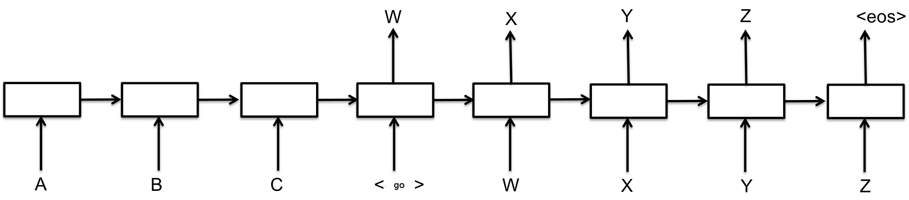
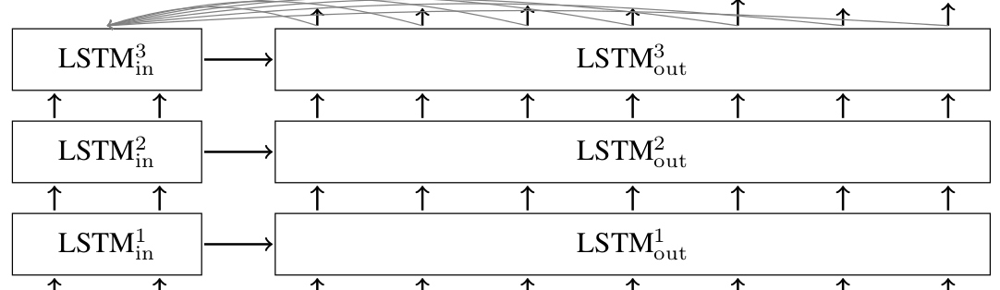

# Sequence-to-Sequence Models <a class="md-anchor" id="AUTOGENERATED-sequence-to-sequence-models"></a>

Recurrent neural networks can learn to model language, as already discussed
in the [RNN Tutorial](../../tutorials/recurrent/index.md)
(if you did not read it, please go through it before proceeding with this one).
This raises an interesting question: could we condition the generated words on
some input and generate a meaningful response? For example, could we train
a neural network to translate from English to French? It turns out that
the answer is *yes*.

This tutorial will show you how to build and train such a system end-to-end.
You can start by running this binary.

```
bazel run -c opt <...>/models/rnn/translate:translate
  --data_dir [your_data_directory]
```

It will download English-to-French translation data from the
[WMT'15 Website](http://www.statmt.org/wmt15/translation-task.html)
prepare it for training and train. It takes  about 20GB of disk space,
and a while to download and prepare (see [later](#run_it) for details),
so you can start and leave it running while reading this tutorial.

This tutorial references the following files from `models/rnn`.

File | What's in it?
--- | ---
`seq2seq.py` | Library for building sequence-to-sequence models.
`translate/seq2seq_model.py` | Neural translation sequence-to-sequence model.
`translate/data_utils.py` | Helper functions for preparing translation data.
`translate/translate.py` | Binary that trains and runs the translation model.


## Sequence-to-Sequence Basics <a class="md-anchor" id="AUTOGENERATED-sequence-to-sequence-basics"></a>

A basic sequence-to-sequence model, as introduced in
[Cho et al., 2014](http://arxiv.org/pdf/1406.1078v3.pdf),
consists of two recurrent neural networks (RNNs): an *encoder* that
processes the input and a *decoder* that generates the output.
This basic architecture is depicted below.

<div style="width:80%; margin:auto; margin-bottom:10px; margin-top:20px;">

</div>

Each box in the picture above represents a cell of the RNN, most commonly
a GRU cell or an LSTM cell (see the [RNN Tutorial](../../tutorials/recurrent/index.md)
for an explanation of those). Encoder and decoder can share weights or,
as is more common, use a different set of parameters. Mutli-layer cells
have been successfully used in sequence-to-sequence models too, e.g. for
translation [Sutskever et al., 2014](http://arxiv.org/abs/1409.3215).

In the basic model depicted above, every input has to be encoded into
a fixed-size state vector, as that is the only thing passed to the decoder.
To allow the decoder more direct access to the input, an *attention* mechanism
was introduced in [Bahdanu et al., 2014](http://arxiv.org/abs/1409.0473).
We will not go into the details of the attention mechanism (see the paper),
suffice it to say that it allows the decoder to peek into the input at every
decoding step. A multi-layer sequence-to-sequence network with LSTM cells and
attention mechanism in the decoder looks like this.

<div style="width:80%; margin:auto; margin-bottom:10px; margin-top:20px;">

</div>

## TensorFlow seq2seq Library <a class="md-anchor" id="AUTOGENERATED-tensorflow-seq2seq-library"></a>

As you can see above, there are many different sequence-to-sequence
models. Each of these models can use different RNN cells, but all
of them accept encoder inputs and decoder inputs. This motivates
the interfaces in the TensorFlow seq2seq library (`models/rnn/seq2seq.py`).
The basic RNN encoder-decoder sequence-to-sequence model works as follows.

```python
outputs, states = basic_rnn_seq2seq(encoder_inputs, decoder_inputs, cell)
```

In the above call, `encoder_inputs` are a list of tensors representing inputs
to the encoder, i.e., corresponding to the letters *A, B, C* in the first
picture above. Similarly, `decoder_inputs` are tensors representing inputs
to the decoder, *GO, W, X, Y, Z* on the first picture.

The `cell` argument is an instance of the `models.rnn.rnn_cell.RNNCell` class
that determines which cell will be used inside the model. You can use
an existing cell, such as `GRUCell` or `LSTMCell`, or you can write your own.
Moreover, `rnn_cell` provides wrappers to construct multi-layer cells,
add dropout to cell inputs or outputs, or to do other transformations,
see the [RNN Tutorial](../../tutorials/recurrent/index.md) for examples.

The call to `basic_rnn_seq2seq` returns two arguments: `outputs` and `states`.
Both of them are lists of tensors of the same length as `decoder_inputs`.
Naturally, `outputs` correspond to the outputs of the decoder in each time-step,
in the first picture above that would be *W, X, Y, Z, EOS*. The returned
`states` represent the internal state of the decoder at every time-step.

In many applications of sequence-to-sequence models, the output of the decoder
at time t is fed back and becomes the input of the decoder at time t+1. At test
time, when decoding a sequence, this is how the sequence is constructed.
During training, on the other hand, it is common to provide the correct input
to the decoder at every time-step, even if the decoder made a mistake before.
Functions in `seq2seq.py` support both modes using the `feed_previous` argument.
For example, let's analyze the following use of an embedding RNN model.

```python
outputs, states = embedding_rnn_seq2seq(
    encoder_inputs, decoder_inputs, cell,
    num_encoder_symbols, num_decoder_symbols,
    output_projection=None, feed_previous=False)
```

In the `embedding_rnn_seq2seq` model, all inputs (both `encoder_inputs` and
`decoder_inputs`) are integer-tensors that represent discrete values.
They will be embedded into a dense representation (see the
[Vectors Representations Tutorial](../../tutorials/word2vec/index.md) for more details
on embeddings), but to construct these embeddings we need to specify
the maximum number of discrete symbols that will appear: `num_encoder_symbols`
on the encoder side, and `num_decoder_symbols` on the decoder side.

In the above invocation, we set `feed_previous` to False. This means that the
decoder will use `decoder_inputs` tensors as provided. If we set `feed_previous`
to True, the decoder would only use the first element of `decoder_inputs`.
All other tensors from this list would be ignored, and instead the previous
output of the encoder would be used. This is used for decoding translations
in our translation model, but it can also be used during training, to make
the model more robust to its own mistakes, similar
to [Bengio et al., 2015](http://arxiv.org/pdf/1506.03099v2.pdf).

One more important argument used above is `output_projection`. If not specified,
the outputs of the embedding model will be tensors of shape batch-size by
`num_decoder_symbols` as they represent the logits for each generated symbol.
When training models with large output vocabularies, i.e., when
`num_decoder_symbols` is large, it is not practical to store these large
tensors. Instead, it is better to return smaller output tensors, which will
later be projected onto a large output tensor using `output_projection`.
This allows to use our seq2seq models with a sampled softmax loss, as described
in [Jean et. al., 2015](http://arxiv.org/pdf/1412.2007v2.pdf).

In addition to `basic_rnn_seq2seq` and `embedding_rnn_seq2seq` there are a few
more sequence-to-sequence models in `seq2seq.py`, take a look there. They all
have similar interfaces, so we will not describe them in detail. We will use
`embedding_attention_seq2seq` for our translation model below.

## Neural Translation Model <a class="md-anchor" id="AUTOGENERATED-neural-translation-model"></a>

While the core of the sequence-to-sequence model is constructed by
the functions in `models/rnn/seq2seq.py`, there are still a few tricks
that are worth mentioning that are used in our translation model in
`models/rnn/translate/seq2seq_model.py`.

### Sampled softmax and output projection <a class="md-anchor" id="AUTOGENERATED-sampled-softmax-and-output-projection"></a>

For one, as already mentioned above, we want to use sampled softmax to
handle large output vocabulary. To decode from it, we need to keep track
of the output projection. Both the sampled softmax loss and the output
projections are constructed by the following code in `seq2seq_model.py`.

```python
  if num_samples > 0 and num_samples < self.target_vocab_size:
    w = tf.get_variable("proj_w", [size, self.target_vocab_size])
    w_t = tf.transpose(w)
    b = tf.get_variable("proj_b", [self.target_vocab_size])
    output_projection = (w, b)

    def sampled_loss(inputs, labels):
      labels = tf.reshape(labels, [-1, 1])
      return tf.nn.sampled_softmax_loss(w_t, b, inputs, labels, num_samples,
                                        self.target_vocab_size)
```

First, note that we only construct a sampled softmax if the number of samples
(512 by default) is smaller that the target vocabulary size. For vocabularies
smaller than 512 it might be a better idea to just use a standard softmax loss.

Then, as you can see, we construct an output projection. It is a pair,
consisting of a weight matrix and a bias vector. If used, the rnn cell
will return vectors of shape batch-size by `size`, rather than batch-size
by `target_vocab_size`. To recover logits, we need to multiply by the weight
matrix and add the biases, as is done in lines 124-126 in `seq2seq_model.py`.

```python
if output_projection is not None:
  self.outputs[b] = [tf.matmul(output, output_projection[0]) +
                     output_projection[1] for ...]
```

### Bucketing and padding <a class="md-anchor" id="AUTOGENERATED-bucketing-and-padding"></a>

In addition to sampled softmax, our translation model also makes use
of *bucketing*, which is a method to efficiently handle sentences of
different lengths. Let us first clarify the problem. When translating
English to French, we will have English sentences of different lengths L1
on input, and French sentences of different lengths L2 on output. Since
the English sentence is passed as `encoder_inputs`, and the French sentence
comes as `decoder_inputs` (prefixed by a GO symbol), we should in principle
create a seq2seq model for every pair (L1, L2+1) of lengths of an English
and French sentence. This would result in an enormous graph consisting of
many very similar subgraphs. On the other hand, we could just pad every
sentence with a special PAD symbol. Then we'd need only one seq2seq model,
for the padded lengths. But on shorter sentence our model would be inefficient,
encoding and decoding many PAD symbols that are useless.

As a compromise between contructing a graph for every pair of lengths and
padding to a single length, we use a number of *buckets* and pad each sentence
to the length of the bucket above it. In `translate.py` we use the following
default buckets.

```python
buckets = [(5, 10), (10, 15), (20, 25), (40, 50)]
```

This means that if the input is an English sentence with 3 tokens,
and the corresponding output is a French sentence with 6 tokens,
then they will be put in the first bucket and padded to length 5 for
encoder inputs, and length 10 for decoder inputs. If we have an English
sentence with 8 tokens and the corresponding French sentence has 18 tokens,
then they will not fit into the (10, 15) bucket, and so the (20, 25) bucket
will be used, i.e. the English sentence will be padded to 20, and the French
one to 25.

Remember that when constructing decoder inputs we prepend the special `GO`
symbol to the input data. This is done in the `get_batch()` function in
`seq2seq_model.py`, which also reverses the input English sentence.
Reversing the inputs was shown to improve results for the neural translation
model in [Sutskever et al., 2014](http://arxiv.org/abs/1409.3215).
To put it all together, imagine we have the sentence "I go.", tokenized
as `["I", "go", "."]` as input and the sentence "Je vais." as output,
tokenized `["Je", "vais", "."]`. It will be put in the (5, 10) bucket,
with encoder inputs representing `[PAD PAD "." "go" "I"]` and decoder
inputs `[GO "Je" "vais" "." EOS PAD PAD PAD PAD PAD]`.


## Let's Run It <a class="md-anchor" id="run_it"></a>

To train the model described above, we need to a large English-French corpus.
We will use the *10^9-French-English corpus* from the
[WMT'15 Website](http://www.statmt.org/wmt15/translation-task.html)
for training, and the 2013 news test from the same site as development set.
Both data-sets will be downloaded to `data_dir` and training will start,
saving checkpoints in `train_dir`, when this command is run.

```
bazel run -c opt <...>/models/rnn/translate:translate
  --data_dir [your_data_directory] --train_dir [checkpoints_directory]
  --en_vocab_size=40000 --fr_vocab_size=40000
```

It takes  about 18GB of disk space and several hours to prepare the training
corpus. It is unpacked, vocabulary files are created in `data_dir`, and then
the corpus is tokenized and converted to integer ids. Note the parameters
that determine vocabulary sizes. In the example above, all words outside
the 40K most common ones will be converted to an `UNK` token representing
unknown words. So if you change vocabulary size, the binary will re-map
the corpus to token-ids again.

After the data is prepared, training starts. Default parameters in `translate`
are set to quite large values. Large models trained over a long time give good
results, but it might take too long or use too much memory for your GPU.
You can request to train a smaller model as in the following example.

```
bazel run -c opt <...>/models/rnn/translate:translate
  --data_dir [your_data_directory] --train_dir [checkpoints_directory]
  --size=256 --num_layers=2 --steps_per_checkpoint=50
```

The above command will train a model with 2 layers (the default is 3),
each layer with 256 units (default is 1024), and will save a checkpoint
every 50 steps (the default is 200). You can play with these parameters
to find out how large a model can be to fit into the memory of your GPU.

During training, every `steps_per_checkpoint` steps the binary will print
out statistics from recent steps. With the default parameters (3 layers
of size 1024), first messages look like this.

```
global step 200 learning rate 0.5000 step-time 1.39 perplexity 1720.62
  eval: bucket 0 perplexity 184.97
  eval: bucket 1 perplexity 248.81
  eval: bucket 2 perplexity 341.64
  eval: bucket 3 perplexity 469.04
global step 400 learning rate 0.5000 step-time 1.38 perplexity 379.89
  eval: bucket 0 perplexity 151.32
  eval: bucket 1 perplexity 190.36
  eval: bucket 2 perplexity 227.46
  eval: bucket 3 perplexity 238.66
```

You can see that each step takes just under 1.4 seconds, the perplexity
on the training set and the perplexities on the development set
for each bucket. After about 30K steps, we see perplexities on short
sentences (bucket 0 and 1) going into single digits.
Since the training corpus contains ~22M sentences, one epoch (going through
the training data once) takes about 340K steps with batch-size of 64. At this
point the model can be used for translating English sentences to French
using the `--decode` option.

```
bazel run -c opt <...>/models/rnn/translate:translate --decode
  --data_dir [your_data_directory] --train_dir [checkpoints_directory]

Reading model parameters from /tmp/translate.ckpt-340000
>  Who is the president of the United States?
 Qui est le président des États-Unis ?
```

## What Next? <a class="md-anchor" id="AUTOGENERATED-what-next-"></a>

The example above shows how you can build your own English-to-French
translator, end-to-end. Run it and see how the model performs for yourself.
While it has reasonable quality, the default parameters will not give you
the best translation model. Here are a few things you can improve.

First of all, we use a very primitive tokenizer, the `basic_tokenizer` function
in `data_utils`. A better tokenizer can be found on the
[WMT'15 Website](http://www.statmt.org/wmt15/translation-task.html).
Using that tokenizer, and a larger vocabulary, should improve your translations.

Also, the default parameters of the translation model are not tuned.
You can try changing the learning rate, decay, or initializing the weights
of your model in a different way. You can also change the default
`GradientDescentOptimizer` in `seq2seq_model.py` to a more advanced one, such
as `AdagradOptimizer`. Try these things and see how they improve your results!

Finally, the model presented above can be used for any sequence-to-sequence
task, not only for translation. Even if you want to transform a sequence to
a tree, for example to generate a parsing tree, the same model as above can
give state-of-the-art results, as demonstrated in
[Vinyals & Kaiser et al., 2015](http://arxiv.org/abs/1412.7449).
So you can not only build your own translator, you can also build a parser,
a chat-bot, or any program that comes to your mind. Experiment!
