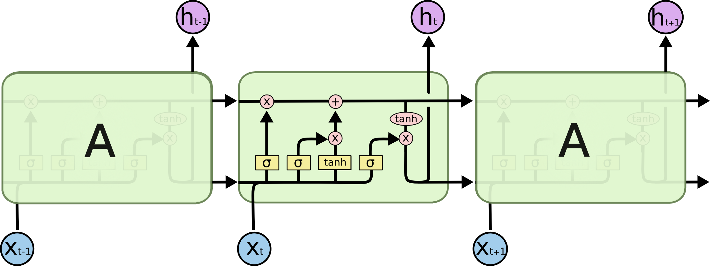
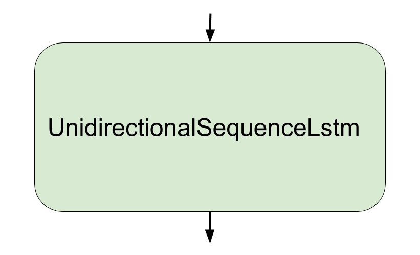
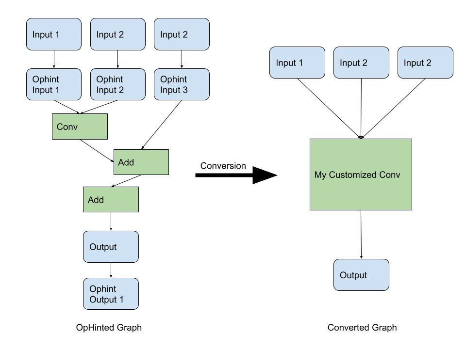
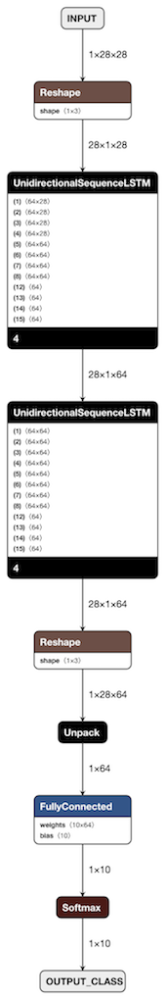

# TensorFlow Lite LSTM ops API

TensorFlow Lite LSTM ops help developers deploy LSTM models to TensorFlow Lite.
This is currently an experimental API, it's likely to change in future.

## Introduction

LSTM ops in TensorFlow Lite realm are expressed as "fused ops" (e.g.,
UnidirectionalSequenceRNN, BidirectionalSequenceLSTM, etc.). However, in
TensorFlow, LSTM ops are expressed as a "cell" (e.g., `tf.nn.rnn_cell.LSTMCell`,
`tf.nn.rnn_cell.BasicRNNCell`, etc., and they all contain multiple TensorFlow
ops) and a "rnn" ( e.g., `tf.nn.static_rnn`,
`tf.nn.bidirectional_dynamic_rnn`).

The ops breakdown in TensorFlow gives us flexibility while the "fused op" in
TensorFlow Lite gives us performance boost.

See the difference between TensorFlow LSTM and TensorFlow Lite LSTM.

##### TensorFlow LSTM op ("cell")



##### TensorFlow Lite LSTM op ("fused ops")



The TensorFlow LSTM figure is credited to this
[blog](https://colah.github.io/posts/2015-08-Understanding-LSTMs/).

## How to use

To use TensorFlow Lite LSTM ops is actually pretty simple.

### 1) Training & Evaluation.

First step is replacing `tf.nn.rnn_cell.LSTMCell` with
`tf.lite.experimental.nn.TFLiteLSTMCell` in training phase, and replacing
`tf.nn.rnn.dynamic_rnn` with `tf.lite.experimental.nn.dynamic_rnn`, if you are
using dynamic_rnn. Note you don't need to change if you're using static_rnn.

Both `tf.lite.experimental.nn.TFLiteLSTMCell` &
`tf.lite.experimental.nn.dynamic_rnn` are just normal `tf.nn.rnn_cell.LSTMCell`
and `tf.nn.rnn.dynamic_rnn` with OpHinted nodes in it to help the graph
transformation.

Then you can train and export the model as usual.

### 2) Export for TensorFlow Lite inference as usual.

When you want to convert to TensorFlow Lite model, you can simply get the
session, then convert to TensorFlow Lite model.

Then you can convert the model to TensorFlow Lite model as usual.


```python
converter = tf.lite.TFLiteConverter.from_session(sess, [INPUTS], [OUTPUTS])
converter.post_training_quantize = True  # If post training quantize is desired.
tflite_model = converter.convert()  # You got a tflite model!
```

#### Simple example diff for using original TF code VS. TensorFlow Lite code:

```python
@@ -56,7 +56,7 @@ class MnistLstmModel(object):
     for _ in range(self.num_lstm_layer):
       lstm_layers.append(
           # Note here, we use `tf.lite.experimental.nn.TFLiteLSTMCell`.
-          tf.nn.rnn_cell.LSTMCell(
+          tf.lite.experimental.nn.TFLiteLSTMCell(
               self.num_lstm_units, forget_bias=0))
     # Weights and biases for output softmax layer.
     out_weights = tf.Variable(tf.random.normal([self.units, self.num_class]))
@@ -67,7 +67,7 @@ class MnistLstmModel(object):
     lstm_cells = tf.nn.rnn_cell.MultiRNNCell(lstm_layers)
     # Note here, we use `tf.lite.experimental.nn.dynamic_rnn` and `time_major`
     # is set to True.
-    outputs, _ = tf.nn.dynamic_rnn(
+    outputs, _ = tf.lite.experimental.nn.dynamic_rnn(
         lstm_cells, lstm_inputs, dtype='float32', time_major=True)
```

## Why introduce another set of LSTM APIs?

Bridging TensorFlow LSTM and TensorFlow Lite is not easy, and the use of
`dynamic_rnn` adds additional complexity (as the while loop is introduced).
With the help of
[OpHint](https://github.com/tensorflow/tensorflow/blob/master/tensorflow/lite/python/op_hint.py)
(also see the next section), we create special wrappers around `rnn_cell` and
`rnn` to help us identify the inputs and outputs of the LSTM ops, and these
ops are converted to a single fused LSTM op when converting TensorFlow models
to TensorFlow Lite format.

### What's OpHint

`OpHint` is essentially `Identity` op that is inserted after input tensors and
output tensors to "hint" the customized op boundary, see the following figure.

##### Ophinted Customized Graph

Let's say we have a "customized conv" op which is a normal conv2d op with a bias
add op followed by an activation op (graph on the letf), we use `OpHint` to
track down all the inputs and output, during the graph transformation phase
(done by `tf.lite.experimental.convert_op_hints_to_stubs`), the conv2d op, bias
add op and the activation op will become a "my customized conv" op (see the
graph on the right), and all the "OpHinted" tensors will become the
inputs/outputs of the "my customized conv" op.




## Simple Tutorial

The following tutorial uses MNIST dataset to build a simple two-layer LSTM model
and convert to quantized TensorFlow Lite model.

Note since we will be using dynamic_rnn, we need to turn on `control_flow_v2`.

### 0. Turn on `control_flow_v2`.

```python
# Note this needs to happen before import tensorflow.
import os
os.environ['TF_ENABLE_CONTROL_FLOW_V2'] = '1'
```

### 1. Build the model.

```python
class MnistLstmModel(object):
  """Build a simple LSTM based MNIST model.

  Attributes:
    time_steps: The maximum length of the time_steps, but since we're just using
      the 'width' dimension as time_steps, it's actually a fixed number.
    input_size: The LSTM layer input size.
    num_lstm_layer: Number of LSTM layers for the stacked LSTM cell case.
    num_lstm_units: Number of units in the LSTM cell.
    units: The units for the last layer.
    num_class: Number of classes to predict.
  """

  def __init__(self, time_steps, input_size, num_lstm_layer, num_lstm_units,
               units, num_class):
    self.time_steps = time_steps
    self.input_size = input_size
    self.num_lstm_layer = num_lstm_layer
    self.num_lstm_units = num_lstm_units
    self.units = units
    self.num_class = num_class

  def build_model(self):
    """Build the model using the given configs.

    Returns:
      x: The input placeholder tensor.
      logits: The logits of the output.
      output_class: The prediction.
    """
    x = tf.placeholder(
        'float32', [None, self.time_steps, self.input_size], name='INPUT')
    lstm_layers = []
    for _ in range(self.num_lstm_layer):
      lstm_layers.append(
          # Important:
          #
          # Note here, we use `tf.lite.experimental.nn.TFLiteLSTMCell`
          # (OpHinted LSTMCell).
          tf.lite.experimental.nn.TFLiteLSTMCell(
              self.num_lstm_units, forget_bias=0))
    # Weights and biases for output softmax layer.
    out_weights = tf.Variable(tf.random.normal([self.units, self.num_class]))
    out_bias = tf.Variable(tf.zeros([self.num_class]))

    # Transpose input x to make it time major.
    lstm_inputs = tf.transpose(x, perm=[1, 0, 2])
    lstm_cells = tf.keras.layers.StackedRNNCells(lstm_layers)
    # Important:
    #
    # Note here, we use `tf.lite.experimental.nn.dynamic_rnn` and `time_major`
    # is set to True.
    outputs, _ = tf.lite.experimental.nn.dynamic_rnn(
        lstm_cells, lstm_inputs, dtype='float32', time_major=True)

    # Transpose the outputs back to [batch, time, output]
    outputs = tf.transpose(outputs, perm=[1, 0, 2])
    outputs = tf.unstack(outputs, axis=1)
    logits = tf.matmul(outputs[-1], out_weights) + out_bias
    output_class = tf.nn.softmax(logits, name='OUTPUT_CLASS')

    return x, logits, output_class
```

### 2. Let's define the train & eval function.

```python
def train(model,
          model_dir,
          batch_size=20,
          learning_rate=0.001,
          train_steps=2000,
          eval_steps=500,
          save_every_n_steps=1000):
  """Train & save the MNIST recognition model."""
  # Train & test dataset.
  (x_train, y_train), (x_test, y_test) = tf.keras.datasets.mnist.load_data()
  train_dataset = tf.data.Dataset.from_tensor_slices((x_train, y_train))
  train_iterator = train_dataset.shuffle(
      buffer_size=1000).batch(batch_size).repeat().make_one_shot_iterator()
  x, logits, output_class = model.build_model()
  test_dataset = tf.data.Dataset.from_tensor_slices((x_test, y_test))
  test_iterator = test_dataset.batch(
      batch_size).repeat().make_one_shot_iterator()
  # input label placeholder
  y = tf.placeholder(tf.int32, [
      None,
  ])
  one_hot_labels = tf.one_hot(y, depth=model.num_class)
  # Loss function
  loss = tf.reduce_mean(
      tf.nn.softmax_cross_entropy_with_logits(
          logits=logits, labels=one_hot_labels))
  correct = tf.nn.in_top_k(output_class, y, 1)
  accuracy = tf.reduce_mean(tf.cast(correct, tf.float32))
  # Optimization
  opt = tf.train.AdamOptimizer(learning_rate=learning_rate).minimize(loss)

  # Initialize variables
  init = tf.global_variables_initializer()
  saver = tf.train.Saver()
  batch_x, batch_y = train_iterator.get_next()
  batch_test_x, batch_test_y = test_iterator.get_next()
  with tf.Session() as sess:
    sess.run([init])
    for i in range(train_steps):
      batch_x_value, batch_y_value = sess.run([batch_x, batch_y])
      _, loss_value = sess.run([opt, loss],
                               feed_dict={
                                   x: batch_x_value,
                                   y: batch_y_value
                               })
      if i % 100 == 0:
        tf.logging.info('Training step %d, loss is %f' % (i, loss_value))
      if i > 0 and i % save_every_n_steps == 0:
        accuracy_sum = 0.0
        for _ in range(eval_steps):
          test_x_value, test_y_value = sess.run([batch_test_x, batch_test_y])
          accuracy_value = sess.run(
              accuracy, feed_dict={
                  x: test_x_value,
                  y: test_y_value
              })
          accuracy_sum += accuracy_value
        tf.logging.info('Training step %d, accuracy is %f' %
                        (i, accuracy_sum / (eval_steps * 1.0)))
        saver.save(sess, model_dir)
```

### 3. Let's define the export to TensorFlow Lite model function.

```python
def export(model, model_dir, tflite_model_file,
           use_post_training_quantize=True):
  """Export trained model to tflite model."""
  tf.reset_default_graph()
  x, _, output_class = model.build_model()
  saver = tf.train.Saver()
  sess = tf.Session()
  saver.restore(sess, model_dir)
  # Convert to Tflite model.
  converter = tf.lite.TFLiteConverter.from_session(sess, [x], [output_class])
  converter.post_training_quantize = use_post_training_quantize
  tflite = converter.convert()
  with open(tflite_model_file, 'w') as f:
    f.write(tflite)
```

### 4. Hook everything together.

```python
def train_and_export(parsed_flags):
  """Train the MNIST LSTM model and export to TfLite."""
  model = MnistLstmModel(
      time_steps=28,
      input_size=28,
      num_lstm_layer=2,
      num_lstm_units=64,
      units=64,
      num_class=10)
  tf.logging.info('Starts training...')
  train(model, parsed_flags.model_dir)
  tf.logging.info('Finished training, starts exporting to tflite to %s ...' %
                  parsed_flags.tflite_model_file)
  export(model, parsed_flags.model_dir, parsed_flags.tflite_model_file,
         parsed_flags.use_post_training_quantize)
  tf.logging.info(
      'Finished exporting, model is %s' % parsed_flags.tflite_model_file)


def run_main(_):
  """Main in the TfLite LSTM tutorial."""
  parser = argparse.ArgumentParser(
      description=('Train a MNIST recognition model then export to TfLite.'))
  parser.add_argument(
      '--model_dir',
      type=str,
      help='Directory where the models will store.',
      required=True)
  parser.add_argument(
      '--tflite_model_file',
      type=str,
      help='Full filepath to the exported tflite model file.',
      required=True)
  parser.add_argument(
      '--use_post_training_quantize',
      action='store_true',
      default=True,
      help='Whether or not to use post_training_quantize.')
  parsed_flags, _ = parser.parse_known_args()
  train_and_export(parsed_flags)


def main():
  app.run(main=run_main, argv=sys.argv[:1])


if __name__ == '__main__':
  main()

```

### 5. Visualize the exported TensorFlow Lite model.

Let's go to where the TensorFlow Lite model is exported and use
[Netron](https://github.com/lutzroeder/netron) to visualize the graph.

See below.

##### Exported TensorFlow Lite Model.



## Caveat

*   Currently, `tf.lite.experimental.nn.dynamic_rnn` &
    `tf.lite.experimental.nn.bidirectional_dynamic_rnn` only supports
    `control_flow_v2`, you can this on by setting the environment variable
    `TF_ENABLE_CONTROL_FLOW_V2=1`, see in the tutorial.
*   Currently, `sequence_length` is not supported, prefer to set it to None.
*   `num_unit_shards` & `num_proj_shards` in LSTMCell are not supported as
    well.
*   Currently, `final_state` is not supported.
*   Currently, `tf.lite.experimental.nn.dynamic_rnn` &
    `tf.lite.experimental.nn.bidirectional_dynamic_rnn` only takes
    `time_major=True`.
*   The behavior of `tf.lite.experimental.nn.bidirectional_dynamic_rnn` is a
    wrapper around `tf.nn.bidirectional_dynamic_rnn`, not
    `tf.contrib.rnn.stack_bidirectional_dynamic_rnn`.
