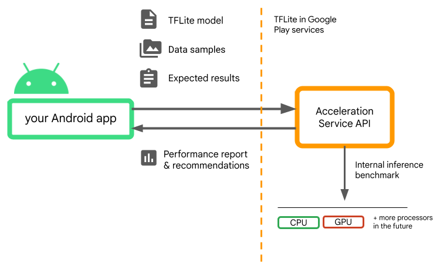

# Acceleration Service for Android (Beta)

Beta: Acceleration Service for Android is currently in Beta.
Please review the [Caveats](#caveats) and the [Terms and Privacy]
(#terms_privacy) sections of this page for more details.

The use of specialized processors such as GPUs, NPUs or DSPs for hardware
acceleration can dramatically improve inference performance (up to 10x faster
inference in some cases) and the user experience of your ML-enabled Android
application. However, given the variety of hardware and drivers your users might
have, picking the optimal hardware acceleration configuration for each user's
device can be challenging. Moreover, enabling the wrong configuration on a
device can create poor user experience due to high latency or, in some rare
cases, runtime errors or accuracy issues caused by hardware incompatibilities.

Acceleration Service for Android is an API that helps you pick the
optimal hardware acceleration configuration for a given user device and your
`.tflite` model, while minimizing the risk of runtime error or accuracy issues.

Acceleration Service evaluates different acceleration configurations on user
devices by running internal inference benchmarks with your TensorFlow Lite
model. These test runs typically complete in a few seconds, depending on your
model. You can run the benchmarks once on every user device before inference
time, cache the result and use it during inference. These benchmarks are run
out-of-process; which minimizes the risk of crashes to your app.

Provide your model, data samples and expected results ("golden" inputs and
outputs) and Acceleration Service will run an internal TFLite inference
benchmark to provide you with hardware recommendations.



Acceleration Service is part of Android's custom ML stack and works with
[TensorFlow Lite in Google Play services](https://www.tensorflow.org/lite/android/play_services).

## Add the dependencies to your project

Add the following dependencies to your application's build.gradle file:

```
implementation  "com.google.android.gms:play-services-tflite-
acceleration-service:16.0.0-beta01"
```

The Acceleration Service API works with [TensorFlow Lite in Google Play
Services](https://www.tensorflow.org/lite/android/play_services). If you
aren't using the TensorFlow Lite runtime provided via Play Services yet, you
will need to update your [dependencies](https://www.tensorflow.org/lite/android/play_services#1_add_project_dependencies_2).

## How to use the Acceleration Service API

To use Acceleration Service, start by creating the acceleration configuration
you want to evaluate for you model (e.g GPU with OpenGL). Then create a
validation configuration with your model, some sample data and the expected
model output. Finally call `validateConfig()` in passing both your
acceleration configuration and validation configuration.


### Create acceleration configurations

Acceleration configurations are representations of the hardware configurations
which are translated into delegates during the execution time.
The Acceleration Service will then use these configurations internally
to perform test inferences.

At the moment the acceleration service enables you to evaluate GPU
configurations (converted to GPU delegate during the execution time)
with the
[GpuAccelerationConfig](https://developers.google.com/android/reference/com/google/android/reference/com/google/android/gms/ads/mediation/package-summary))
and CPU inference (with
[CpuAccelerationConfig](https://developers.google.com/android/reference/com/google/android/gms/tflite/acceleration/CpuAccelerationConfig).
We are working on supporting more delegates to access other hardware in the
future.

#### GPU acceleration configuration

Create a GPU acceleration configuration as follow:

```
AccelerationConfig accelerationConfig = new GpuAccelerationConfig.Builder()
  .setEnableQuantizedInference(false)
  .build();
```

You must specify whether or not your model is using quantization with
[`setEnableQuantizedInference()`](https://developers.google.com/android/reference/com/google/android/gms/tflite/acceleration/GpuAccelerationConfig.Builder#public-gpuaccelerationconfig.builder-setenablequantizedinference-boolean-value).

#### CPU acceleration configuration

Create the CPU acceleration as follow:

```
AccelerationConfig accelerationConfig = new CpuAccelerationConfig.Builder()
  .setNumThreads(2)
  .build();
```

Use the
[`setNumThreads()`](https://developers.google.com/android/reference/com/google/android/gms/tflite/acceleration/CpuAccelerationConfig.Builder#setNumThreads\(int\))
method to define the number of threads you want to use to evaluate CPU
inference.

### Create validation configurations

Validation configurations enable you to define how you want the Acceleration
Service to evaluate inferences. You will use them to pass:

-   input samples,
-   expected outputs,
-   accuracy validation logic.

Make sure to provide input samples for which you expect a good performance of
your model (also known as “golden” samples).

Create a
[`ValidationConfig`](https://developers.google.com/android/reference/com/google/android/gms/tflite/acceleration/ValidationConfig)
with
[`CustomValidationConfig.Builder`](https://developers.google.com/android/reference/com/google/android/gms/tflite/acceleration/CustomValidationConfig.Builder)
as follow:

```
ValidationConfig validationConfig = new CustomValidationConfig.Builder()
   .setBatchSize(5)
   .setGoldenInputs(inputs)
   .setGoldenOutputs(outputBuffer)
   .setAccuracyValidator(new MyCustomAccuracyValidator())
   .build();
```

Specify the number of the golden samples with
[`setBatchSize()`](https://developers.google.com/android/reference/com/google/android/gms/tflite/acceleration/CustomValidationConfig.Builder#setBatchSize\(int\)).
Pass the inputs of your golden samples using
[`setGoldenInputs()`](https://developers.google.com/android/reference/com/google/android/gms/tflite/acceleration/CustomValidationConfig.Builder#public-customvalidationconfig.builder-setgoldeninputs-object...-value).
Provide the expected output for the input passed with
[`setGoldenOutputs()`](https://developers.google.com/android/reference/com/google/android/gms/tflite/acceleration/CustomValidationConfig.Builder#public-customvalidationconfig.builder-setgoldenoutputs-bytebuffer...-value).

You can define a maximum inference time with [`setInferenceTimeoutMillis()`](
https://developers.google.com/android/reference/com/google/android/gms/tflite/acceleration/CustomValidationConfig.Builder#public-customvalidationconfig.builder-setinferencetimeoutmillis-long-value)
(5000 ms by default). If the inference takes longer than the time you defined,
the configuration will be rejected.

Optionally, you can also create a custom [`AccuracyValidator`](https://developers.google.com/android/reference/com/google/android/gms/tflite/acceleration/CustomValidationConfig.AccuracyValidator)
as follow:

```
class MyCustomAccuracyValidator implements AccuracyValidator {
   boolean validate(
      BenchmarkResult benchmarkResult,
      ByteBuffer[] goldenOutput) {
        for (int i = 0; i < benchmarkResult.actualOutput().size(); i++) {
            if (!goldenOutputs[i]
               .equals(benchmarkResult.actualOutput().get(i).getValue())) {
               return false;
            }
         }
         return true;

   }
}
```

Make sure to define a validation logic that works for your use case.

Note that if the validation data is already embedded in your model, you can use
[`EmbeddedValidationConfig`](https://developers.google.com/android/reference/com/google/android/gms/tflite/acceleration/EmbeddedValidationConfig).

##### Generate validation outputs

Golden outputs are optional and as long as you provide golden inputs, the
Acceleration Service can internally generate the golden outputs. You can also
define the acceleration configuration used to generate these golden outputs by
calling [`setGoldenConfig()`](https://developers.google.com/android/reference/com/google/android/gms/tflite/acceleration/CustomValidationConfigBuilder#public-customvalidationconfig.builder-setgoldenconfig-accelerationconfig-value):

```
ValidationConfig validationConfig = new CustomValidationConfig.Builder()
   .setBatchSize(5)
   .setGoldenInputs(inputs)
   .setGoldenConfig(customCpuAccelerationConfig)
   [...]
   .build();
```

### Validate Acceleration configuration

Once you have created an acceleration configuration and a validation config you
can evaluate them for your model.

Make sure that the TensorFlow Lite with Play Services runtime is properly
initialized and that the GPU delegate is available for the device by running:

```
TfLiteGpu.isGpuDelegateAvailable(context)
   .onSuccessTask(gpuAvailable -> TfLite.initialize(context,
      TfLiteInitializationOptions.builder()
        .setEnableGpuDelegateSupport(gpuAvailable)
        .build()
      )
   );
```

Instantiate the [`AccelerationService`](https://developers.google.com/android/reference/com/google/android/gms/tflite/acceleration/AccelerationService)
by calling [`AccelerationService.create()`](https://developers.google.com/android/reference/com/google/android/gms/tflite/accelerationAccelerationService#public-static-accelerationservice-create-context-context).

You can then validate your acceleration configuration for your model by calling
[`validateConfig()`](https://developers.google.com/android/reference/com/google/android/gms/tflite/acceleration/AccelerationService#public-taskvalidatedaccelerationconfigresult-validateconfig-model-model,-accelerationconfig-accelerationconfig,-validationconfig-validationconfig):

```
InterpreterApi interpreter;
InterpreterOptions interpreterOptions = InterpreterApi.Options();
AccelerationService.create(context)
   .validateConfig(model, accelerationConfig, validationConfig)
   .addOnSuccessListener(validatedConfig -> {
      if (validatedConfig.isValid() && validatedConfig.benchmarkResult().hasPassedAccuracyTest()) {
         interpreterOptions.setAccelerationConfig(validatedConfig);
         interpreter = InterpreterApi.create(model, interpreterOptions);
});
```

You can also validate multiple configurations by calling
[`validateConfigs()`](https://developers.google.com/android/reference/com/google/android/gms/tflite/acceleration/AccelerationService#validateConfig\(com.google.android.gms.tflite.acceleration.Model,%20com.google.android.gms.tflite.acceleration.AccelerationConfig,%20com.google.android.gms.tflite.acceleration.ValidationConfig\))
and passing an `Iterable<AccelerationConfig>` object as a parameter.

`validateConfig()`will return a
`Task<`[`ValidatedAccelerationConfigResult`](https://developers.google.com/android/reference/com/google/android/gms/tflite/acceleration/ValidatedAccelerationConfigResult)`>`
from the Google Play services
[Task Api](https://developers.google.com/android/guides/tasks) which enables
asynchronous tasks. \
To get the result from the validation call, add an
[`addOnSuccessListener()`](https://developers.google.com/android/reference/com/google/android/gms/tasks/OnSuccessListener)
callback.

#### Use validated configuration in your interpreter

After checking if the `ValidatedAccelerationConfigResult` returned in the
callback is valid, you can set the validated config as an acceleration config
for your interpreter calling `interpreterOptions.setAccelerationConfig()`.

#### Configuration caching

The optimal acceleration configuration for your model is unlikely to change on
the device. So once you receive a satisfying acceleration configuration, you
should store it on the device and let your application retrieve it and use it to
create your `InterpreterOptions` during the following sessions instead of
running another validation. The `serialize()` and `deserialize()` methods in
`ValidatedAccelerationConfigResult` make the storage and retrieval process
easier.

## Limitations

The Acceleration Service has the current following limitations:

-   Only CPU and GPU acceleration configurations are supported at the moment,
-   It only supports TensorFlow Lite in Google Play services and you cannot
    use it if you are using the bundled version of TensorFlow Lite,
-   It doesn't support the TensorFlow Lite [Task
    Library](https://www.tensorflow.org/lite/inference_with_metadata/task_library/overview)
    as you can't directly initialize
    [`BaseOptions`](https://www.tensorflow.org/lite/api_docs/java/org/tensorflow/lite/task/core/BaseOptions.Builder)
    with the `ValidatedAccelerationConfigResult` object.
-   Acceleration Service SDK only supports API level 22 and above.

## Caveats {:#caveats}

Please review the following caveats carefully, especially if you are planning
to use this SDK in production:

-   Before exiting Beta and releasing the stable version for the
    Acceleration Service API, we will publish a new SDK which may have some
    differences from the current Beta one. In order to continue using the
    Acceleration Service, you will need to migrate to this new SDK and push an
    update to your app in a timely manner. Not doing so may cause breakages as
    the Beta SDK may no longer be compatible with Google Play services after
    some time.

-   There is no guarantee that a specific feature within the Acceleration
    Service API or the API as a whole will ever become generally available. It
    may remain in Beta indefinitely, be shut down, or be combined with other
    features into packages designed for specific developer audiences. Some
    features with the Acceleration Service API or the entire API itself may
    eventually become generally available, but there is no fixed schedule for
    this.

## Terms and privacy {:#terms_privacy}

#### Terms of Service

Use of the Acceleration Service APIs is subject to the [Google APIs Terms of
Service](https://developers.google.com/terms/).\
Additionally, the Acceleration Service APIs is currently in beta
and, as such, by using it you acknowledge the potential issues outlined in the
Caveats section above and acknowledge that the Acceleration Service may not
always perform as specified.

#### Privacy

When you use the Acceleration Service APIs, processing of the input data (e.g.
images, video, text) fully happens on-device, and **the Acceleration Service
does not send that data to Google servers**. As a result, you can use our APIs
for processing input data that should not leave the device.\
The Acceleration Service APIs may contact Google servers from time to time in
order to receive things like bug fixes, updated models and hardware accelerator
compatibility information. The Acceleration Service APIs also send metrics about
the performance and utilization of the APIs in your app to Google. Google uses
this metrics data to measure performance, debug, maintain and improve the APIs,
and detect misuse or abuse, as further described in our [Privacy
Policy](https://policies.google.com/privacy).\
**You are responsible for informing users of your app about Google's processing
of the Acceleration Service metrics data as required by applicable law.**\
Data we collect includes the following:

-   Device information (such as manufacturer, model, OS version and build) and
    available ML hardware accelerators (GPU and DSP). Used for diagnostics and
    usage analytics.
-   App information (package name / bundle id, app version). Used for
    diagnostics and usage analytics.
-   API configuration (such as image format and resolution). Used for
    diagnostics and usage analytics.
-   Event type (such as initialize, download model, update, run, detection).
    Used for diagnostics and usage analytics.
-   Error codes. Used for diagnostics.
-   Performance metrics. Used for diagnostics.
-   Per-installation identifiers that do not uniquely identify a user or
    physical device. Used for operation of remote configuration and usage
    analytics.
-   Network request sender IP addresses. Used for remote configuration
    diagnostics. Collected IP addresses are retained temporarily.

## Support and feedback

You can provide feedback and get support through the TensorFlow Issue Tracker.
Please report issues and support requests using the
[issue template](https://github.com/tensorflow/tensorflow/issues/new?title=TensorFlow+Lite+in+Play+Services+issue&template=tflite-in-play-services.md)
for TensorFlow Lite in Google Play services.