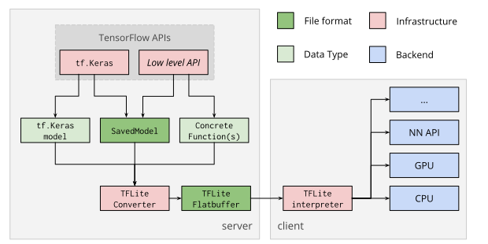

# TensorFlow Lite converter

The TensorFlow Lite converter takes a TensorFlow model and generates a
TensorFlow Lite [`FlatBuffer`](https://google.github.io/flatbuffers/) file
(`.tflite`). The converter supports
[SavedModel directories](https://www.tensorflow.org/guide/saved_model),
[`tf.keras` models](https://www.tensorflow.org/guide/keras/overview), and
[concrete functions](https://tensorflow.org/guide/concrete_function).

Note: This page contains documentation on the converter API for TensorFlow 2.0.
The API for TensorFlow 1.X is available
[here](https://github.com/tensorflow/tensorflow/blob/master/tensorflow/lite/g3doc/r1/convert/index.md).

## Device deployment

The TensorFlow Lite `FlatBuffer` file is then deployed to a client device (e.g.
mobile, embedded) and run locally using the TensorFlow Lite interpreter. This
conversion process is shown in the diagram below:

## Converting models

The TensorFlow Lite converter should be used from the
[Python API](python_api.md). Using the Python API makes it easier to convert
models as part of a model development pipeline and helps mitigate
[compatibility](../guide/ops_compatibility.md) issues early on. Alternatively,
the [command line tool](cmdline.md) supports basic models.
