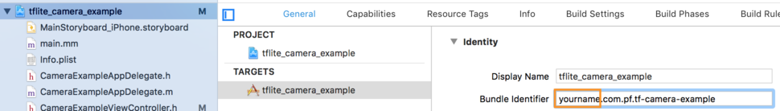
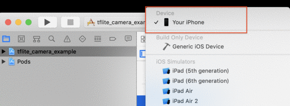
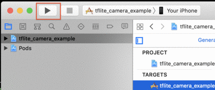

# iOS Demo App

This tutorial provides a simple iOS mobile application to classify images using
the iOS device camera. In this tutorial, you will download the demo application
from the Tensorflow repository, build it on your computer, and install it on
your iOS Device. You will also learn how to customize the application to suit
your requirements.

## Prerequisites

*   You must have [Xcode](https://developer.apple.com/xcode/) installed and have
    a valid Apple Developer ID, and have an iOS device set up and linked to your
    developer account with all of the appropriate certificates. For these
    instructions, we assume that you have already been able to build and deploy
    an app to an iOS device with your current developer environment.

*   The demo app requires a camera and must be executed on a real iOS device.
    You can build it and run with the iPhone Simulator but it won't have any
    camera information to classify.

*   You don't need to build the entire TensorFlow library to run the demo, but
    you will need to clone the TensorFlow repository if you haven't already:

        git clone https://github.com/tensorflow/tensorflow
        cd tensorflow

*   You'll also need the Xcode command-line tools:

        xcode-select --install

    If this is a new install, you will need to run the Xcode application once to
    agree to the license before continuing.

*   Install CocoaPods if you don't have it:

        sudo gem install cocoapods

### Step 1. Clone the TensorFlow source code

First, we clone the GitHub repository on the computer in a folder to get the
demo application.

```
git clone https://github.com/tensorflow/tensorflow
```

### Step 2. Download required dependencies

Execute the shell script to download the model files used by the demo app (this
is done from inside the cloned directory):

```
    tensorflow/lite/examples/ios/download_models.sh
```

Run the following command to install TensorFlow Lite pod:

```
    cd tensorflow/lite/examples/ios/camera
    pod install
```

If you have installed this pod before and that command doesn't work, try

```
    pod repo update
```

### Step 3. Build the XCode project

Open the `tflite_camera_example.xcworkspace` project file generated in the last
step:

```
    open tflite_camera_example.xcworkspace
```

Under `Project navigator -> tflite_camera_example -> Targets ->
tflite_camera_example -> General` change the bundle identifier by pre-pending
your name:



Plug in your iOS device. Note the app must be executed with a real device with
camera. Select the iOS device from the drop-down menu.



Click the "Run" button to build and run the app



Note that as mentioned earlier, you must already have a device set up and linked
to your Apple Developer account in order to deploy the app on a device.

You'll have to grant permissions for the app to use the device's camera. Point
the camera at various objects and enjoy seeing how the model classifies things!

## Understanding iOS App Code

### Get camera input

The main logic of this app is in the Objective C++ source file
`tensorflow/lite/examples/ios/camera/CameraExampleViewController.mm`.

The `setupAVCapture` method constructs a `AVCaptureSession` and set itself as a
delegate. The `captureOutput:didOutputSampleBuffer:fromConnection:` method is
called for every captured frame. It calls `runModelOnFrame` to run the model for
every frame.

### Create an interpreter

To create the interpreter, we need to load the model file. The following code
will load a model and create an interpreter.

```
model = tflite::FlatBufferModel::BuildFromFile([graph_path UTF8String]);
```

Behind the scenes, the model is loaded as a memory-mapped file. It offers faster
load times and reduce the dirty pages in memory.

Construct a `BuiltinOpResolver` to use the TensorFliw Lite buildin ops. Then,
create the interpreter object using `InterpreterBuilder` that takes the model
file as argument as shown below.

```
tflite::ops::builtin::BuiltinOpResolver resolver;
tflite::InterpreterBuilder(*model, resolver)(&interpreter);
```

### Obtain the input buffer

By default, the app uses quantized model since it's smaller and faster. The
buffer is a raw pointer to an array of 8 bit unsigned integers (`uint8_t`). The
following code obtains the input buffer from the interpreter:

```
// Get the index of first input tensor.
int input_tensor_index = interpreter->inputs()[0];
// Get the pointer to the input buffer.
uint8_t* buffer = interpreter->typed_tensor<uint8_t>(input_tensor_index);
```

Throughout this document, it's assumed a quantized model is used.

### Pre-process of bitmap image

The MobileNet model we're using takes 224x224x3 inputs, where the dimensions are
width, height, and colors (RGB). The images returned from `AVCaptureSession` is
bigger, and has 4 color channels (RGBA).

Many image classification models (like MobileNet) take fixe-sized inputs. It's
required to scale or crop the image before feeding it into the model, and change
the channels from RGBA to RGB.

The code to pre-process the images is in `ProcessInputWithQuantizedModel`
function in
`tensorflow/lite/examples/ios/camera/CameraExampleViewController.mm`. It's a
simple implementation for nearest neighbor color sampling, and it only copies
the first 3 bytes for each pixel.

```
void ProcessInputWithQuantizedModel(
    uint8_t* input, uint8_t* output, int image_width, int image_height, int image_channels) {
  for (int y = 0; y < wanted_input_height; ++y) {
    uint8_t* out_row = output + (y * wanted_input_width * wanted_input_channels);
    for (int x = 0; x < wanted_input_width; ++x) {
      const int in_x = (y * image_width) / wanted_input_width;
      const int in_y = (x * image_height) / wanted_input_height;
      uint8_t* in_pixel = input + (in_y * image_width * image_channels) + (in_x * image_channels);
      uint8_t* out_pixel = out_row + (x * wanted_input_channels);
      for (int c = 0; c < wanted_input_channels; ++c) {
        out_pixel[c] = in_pixel[c];
      }
    }
  }
}
```

Note the code is preprocessing and preparing the model input from the camera
data. Therefore the first parameter `input` should be the camera buffer. The
second parameter `output` should be the buffer of model input.

### Run inference and obtain output buffer

After preprocessing and filling the data into the input buffer of the
interpreter, it's really easy to run the interpreter:

```
if (interpreter->Invoke() != kTfLiteOk) {
  NSLog("Failed to invoke!");
}
```

The result is stored in the output tensor buffer of the interpreter. The
following code obtains the pointer to the buffer:

```
// Get the index of first output tensor.
const int output_tensor_index = interpreter->outputs()[0];
// Get the pointer to the output buffer.
uint8_t* buffer = interpreter->typed_tensor<uint8_t>(output_tensor_index);
```

### Post-process values

The output buffer contains an array of `uint8_t`, and the value range is 0-255.
We need to convert the value to float to get the probabilities with value range
0.0-1.0. The formula of the quantization value mapping is:

    float_value = (quantized_value - zero_point) * scale

The following code converts quantized values back to float values, using the
quantizaiton parameters in tensors:

```
uint8_t* quantized_output = interpreter->typed_output_tensor<uint8_t>(0);
int32_t zero_point = input_tensor->params.zero_point;
float scale = input_tensor->params.scale;
float output[output_size];
for (int i = 0; i < output_size; ++i) {
  output[i] = (quantized_output[i] - zero_point) * scale;
}
```

Finally, we find the best set of classifications by storing them in a priority
queue based on their confidence scores. See the `GetTopN` function in
`tensorflow/lite/examples/ios/camera/CameraExampleViewController.mm`.
