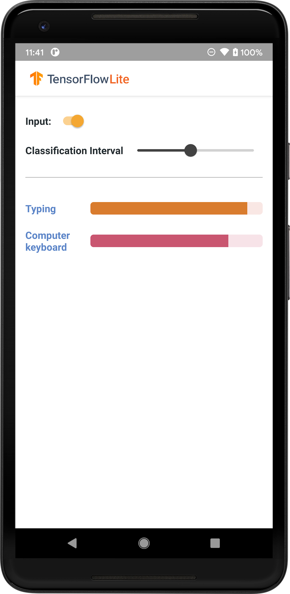

# Audio classification

The task of identifying what an audio represents is called _audio
classification_. An audio classification model is trained to recognize various
audio events. For example, you may train a model to recognize events
representing three different events: clapping, finger snapping, and typing.
TensorFlow Lite provides optimized pre-trained models that you can deploy in
your mobile applications. Learn more about audio classification using TensorFlow
[here](https://www.tensorflow.org/tutorials/audio/simple_audio).

The following image shows the output of the audio classification model on
Android.

Note: (1) To integrate an existing model, try
[TensorFlow Lite Task Library](https://www.tensorflow.org/lite/inference_with_metadata/task_library/audio_classifier).
(2) To customize a model, try
[TensorFlow Lite Model Maker](https://www.tensorflow.org/lite/tutorials/model_maker_audio_classification).

## Get started

If you are new to TensorFlow Lite and are working with Android, we recommend
exploring the following example applications that can help you get started.

You can leverage the out-of-box API from
[TensorFlow Lite Task Library](../../inference_with_metadata/task_library/audio_classifier)
to integrate audio classification models in just a few lines of code. You can
also build your own custom inference pipeline using the
[TensorFlow Lite Support Library](../../inference_with_metadata/lite_support).

The Android example below demonstrates the implementation using the
[TFLite Task Library](https://github.com/tensorflow/examples/tree/master/lite/examples/sound_classification/android)

<a class="button button-primary" href="https://github.com/tensorflow/examples/tree/master/lite/examples/sound_classification/android">View
Android example</a>

<a class="button button-primary" href="https://github.com/tensorflow/examples/tree/master/lite/examples/sound_classification/ios">View
iOS example</a>

If you are using a platform other than Android/iOS, or if you are already
familiar with the
[TensorFlow Lite APIs](https://www.tensorflow.org/api_docs/python/tf/lite),
download the starter model and supporting files (if applicable).

<a class="button button-primary" href="https://tfhub.dev/google/lite-model/yamnet/classification/tflite/1?lite-format=tflite">Download
starter model from TensorFlow Hub</a>

## Model description

YAMNet is an audio event classifier that takes audio waveform as input and makes
independent predictions for each of 521 audio events from the
[AudioSet](https://g.co/audioset) ontology. The model uses the MobileNet v1
architecture and was trained using the AudioSet corpus. This model was
originally released in the TensorFlow Model Garden, where is the model source
code, the original model checkpoint, and more detailed documentation.

### How it works

There are two versions of the YAMNet model converted to TFLite:

*   [YAMNet](https://tfhub.dev/google/yamnet/1) Is the original audio
    classification model, with dynamic input size, suitable for Transfer
    Learning, Web and Mobile deployment. It also has a more complex output.

*   [YAMNet/classification](https://tfhub.dev/google/lite-model/yamnet/classification/tflite/1)
    is a quantized version with a simpler fixed length frame input (15600
    samples) and return a single vector of scores for 521 audio event classes.

### Inputs

The model accepts a 1-D `float32` Tensor or NumPy array of length 15600
containing a 0.975 second waveform represented as mono 16 kHz samples in the
range `[-1.0, +1.0]`.

### Outputs

The model returns a 2-D `float32` Tensor of shape (1, 521) containing the
predicted scores for each of the 521 classes in the AudioSet ontology that are
supported by YAMNet. The column index (0-520) of the scores tensor is mapped to
the corresponding AudioSet class name using the YAMNet Class Map, which is
available as an associated file `yamnet_label_list.txt` packed into the model
file. See below for usage.

### Suitable uses

YAMNet can be used

*   as a stand-alone audio event classifier that provides a reasonable baseline
    across a wide variety of audio events.
*   as a high-level feature extractor: the 1024-D embedding output of YAMNet can
    be used as the input features of another model which can then be trained on
    a small amount of data for a particular task. This allows quickly creating
    specialized audio classifiers without requiring a lot of labeled data and
    without having to train a large model end-to-end.
*   as a warm start: the YAMNet model parameters can be used to initialize part
    of a larger model which allows faster fine-tuning and model exploration.

### Limitations

*   YAMNet's classifier outputs have not been calibrated across classes, so you
    cannot directly treat the outputs as probabilities. For any given task, you
    will very likely need to perform a calibration with task-specific data which
    lets you assign proper per-class score thresholds and scaling.
*   YAMNet has been trained on millions of YouTube videos and although these are
    very diverse, there can still be a domain mismatch between the average
    YouTube video and the audio inputs expected for any given task. You should
    expect to do some amount of fine-tuning and calibration to make YAMNet
    usable in any system that you build.

## Model customization

The pre-trained models provided are trained to detect 521 different audio
classes. For a full list of classes, see the labels file in the
<a href="https://github.com/tensorflow/models/blob/master/research/audioset/yamnet/yamnet_class_map.csv">model
repository</a>.

You can use a technique known as transfer learning to re-train a model to
recognize classes not in the original set. For example, you could re-train the
model to detect multiple bird songs. To do this, you will need a set of training
audios for each of the new labels you wish to train. The recommended way is to
use
[TensorFlow Lite Model Maker](https://www.tensorflow.org/lite/tutorials/model_maker_audio_classification)
library which simplifies the process of training a TensorFlow Lite model using
custom dataset, in a few lines of codes. It uses transfer learning to reduce the
amount of required training data and time. You can also learn from
[Transfer learning for audio recognition](https://www.tensorflow.org/tutorials/audio/transfer_learning_audio)
as an example of transfer learning.

## Further reading and resources

Use the following resources to learn more about concepts related to audio
classification:

*   [Audio classification using TensorFlow](https://www.tensorflow.org/tutorials/audio/simple_audio)
*   [Transfer learning for audio recognition](https://www.tensorflow.org/tutorials/audio/transfer_learning_audio)
*   [Audio data augmentation](https://www.tensorflow.org/io/tutorials/audio)
