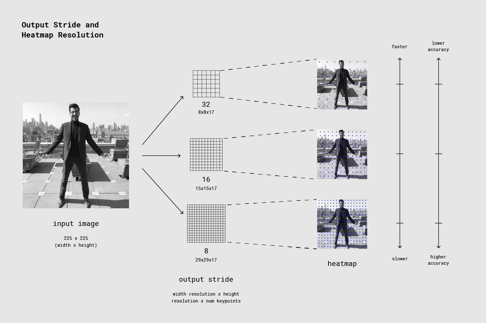

# Pose estimation

Pose estimation is the task of using an ML model to estimate the pose of a
person from an image or a video by estimating the spatial locations of key body
joints (keypoints).

## Get started

If you are new to TensorFlow Lite and are working with Android or iOS, explore
the following example applications that can help you get started.

<a class="button button-primary" href="https://github.com/tensorflow/examples/tree/master/lite/examples/posenet/android">
Android example</a>
<a class="button button-primary" href="https://github.com/tensorflow/examples/tree/master/lite/examples/posenet/ios">
iOS example</a>

If you are familiar with the
[TensorFlow Lite APIs](https://www.tensorflow.org/api_docs/python/tf/lite),
download the starter PoseNet model and supporting files.

<a class="button button-primary" href="https://storage.googleapis.com/download.tensorflow.org/models/tflite/posenet_mobilenet_v1_100_257x257_multi_kpt_stripped.tflite">
Download starter model</a>

If you want to try pose estimation on a web browser, check out the
<a href="https://github.com/tensorflow/tfjs-models/tree/master/posenet">
TensorFlow JS GitHub repository</a>.

## Model description

### How it works

Pose estimation refers to computer vision techniques that detect human figures
in images and videos, so that one could determine, for example, where someone’s
elbow shows up in an image. It is important to be aware of the fact that pose
estimation merely estimates where key body joints are and does not recognize who
is in an image or video.

The PoseNet model takes a processed camera image as the input and outputs
information about keypoints. The keypoints detected are indexed by a part ID,
with a confidence score between 0.0 and 1.0. The confidence score indicates the
probability that a keypoint exists in that position.

The various body joints detected by the PoseNet model are tabulated below:

<table style="width: 30%;">
  <thead>
    <tr>
      <th>Id</th>
      <th>Part</th>
    </tr>
  </thead>
  <tbody>
    <tr>
      <td>0</td>
      <td>nose</td>
    </tr>
    <tr>
      <td>1</td>
      <td>leftEye</td>
    </tr>
    <tr>
      <td>2</td>
      <td>rightEye</td>
    </tr>
    <tr>
      <td>3</td>
      <td>leftEar</td>
    </tr>
    <tr>
      <td>4</td>
      <td>rightEar</td>
    </tr>
    <tr>
      <td>5</td>
      <td>leftShoulder</td>
    </tr>
    <tr>
      <td>6</td>
      <td>rightShoulder</td>
    </tr>
    <tr>
      <td>7</td>
      <td>leftElbow</td>
    </tr>
    <tr>
      <td>8</td>
      <td>rightElbow</td>
    </tr>
    <tr>
      <td>9</td>
      <td>leftWrist</td>
    </tr>
    <tr>
      <td>10</td>
      <td>rightWrist</td>
    </tr>
    <tr>
      <td>11</td>
      <td>leftHip</td>
    </tr>
    <tr>
      <td>12</td>
      <td>rightHip</td>
    </tr>
    <tr>
      <td>13</td>
      <td>leftKnee</td>
    </tr>
    <tr>
      <td>14</td>
      <td>rightKnee</td>
    </tr>
    <tr>
      <td>15</td>
      <td>leftAnkle</td>
    </tr>
    <tr>
      <td>16</td>
      <td>rightAnkle</td>
    </tr>
  </tbody>
</table>

An example output is shown below:

## Performance benchmarks

Performance varies based on your device and output stride (heatmaps and offset
vectors). The PoseNet model is image size invariant, which means it can predict
pose positions in the same scale as the original image regardless of whether the
image is downscaled. This means that you configure the model to have a higher
accuracy at the expense of performance.

The output stride determines how much the output is scaled down relative to the
input image size. It affects the size of the layers and the model outputs.

The higher the output stride, the smaller the resolution of layers in the
network and the outputs, and correspondingly their accuracy. In this
implementation, the output stride can have values of 8, 16, or 32. In other
words, an output stride of 32 will result in the fastest performance but lowest
accuracy, while 8 will result in the highest accuracy but slowest performance.
The recommended starting value is 16.

The following image shows how the output stride determines how much the output
is scaled down relative to the input image size. A higher output stride is
faster but results in lower accuracy.

Performance benchmark numbers are generated with the tool
[described here](https://www.tensorflow.org/lite/performance/benchmarks).

<table>
  <thead>
    <tr>
      <th>Model Name</th>
      <th>Model size </th>
      <th>Device </th>
      <th>GPU</th>
      <th>CPU</th>
    </tr>
  </thead>
  <tr>
    <td rowspan = 3>
      <a href="https://storage.googleapis.com/download.tensorflow.org/models/tflite/posenet_mobilenet_v1_100_257x257_multi_kpt_stripped.tflite">Posenet</a>
    </td>
    <td rowspan = 3>
      12.7 Mb
    </td>
    <td>Pixel 3 (Android 10) </td>
    <td>12ms</td>
    <td>31ms*</td>
  </tr>
   <tr>
     <td>Pixel 4 (Android 10) </td>
    <td>12ms</td>
    <td>19ms*</td>
  </tr>
   <tr>
     <td>iPhone XS (iOS 12.4.1) </td>
     <td>4.8ms</td>
    <td>22ms** </td>
  </tr>
</table>

\* 4 threads used.

\*\* 2 threads used on iPhone for the best performance result.

## Further reading and resources

*   Check out this
    [blog post](https://medium.com/tensorflow/track-human-poses-in-real-time-on-android-with-tensorflow-lite-e66d0f3e6f9e)
    to learn more about pose estimation using TensorFlow Lite.
*   Check out this
    [blog post](https://medium.com/tensorflow/real-time-human-pose-estimation-in-the-browser-with-tensorflow-js-7dd0bc881cd5)
    to learn more about pose estimation using TensorFlow JS.
*   Read the PoseNet paper [here](https://arxiv.org/abs/1803.08225)

Also, check out these use cases of pose estimation.

<ul>
  <li><a href="https://vimeo.com/128375543">‘PomPom Mirror’</a></li>
  <li><a href="https://youtu.be/I5__9hq-yas">Amazing Art Installation Turns You Into A Bird | Chris Milk "The Treachery of Sanctuary"</a></li>
  <li><a href="https://vimeo.com/34824490">Puppet Parade - Interactive Kinect Puppets</a></li>
  <li><a href="https://vimeo.com/2892576">Messa di Voce (Performance), Excerpts</a></li>
  <li><a href="https://www.instagram.com/p/BbkKLiegrTR/">Augmented reality</a></li>
  <li><a href="https://www.instagram.com/p/Bg1EgOihgyh/">Interactive animation</a></li>
  <li><a href="https://www.runnersneed.com/expert-advice/gear-guides/gait-analysis.html">Gait analysis</a></li>
</ul>
