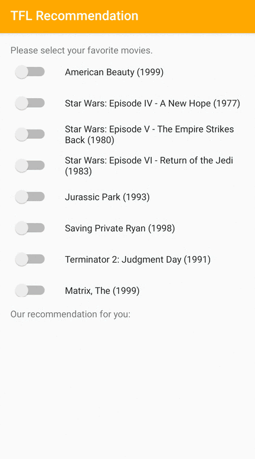

# Recommendation

<table class="tfo-notebook-buttons" align="left">
  <td>
    <a target="_blank" href="https://www.tensorflow.org/lite/examples/recommendation/overview">View on TensorFlow.org</a>
  </td>
  <td>
    
  </td>
  <td>
    <a target="_blank" href="https://github.com/tensorflow/examples/blob/master/lite/examples/recommendation/ml/ondevice_recommendation.ipynb">View source on GitHub</a>
  </td>
</table>

Personalized recommendations are widely used for a variety of use cases on
mobile devices, such as media content retrieval, shopping product suggestion,
and next app recommendation. If you are interested in providing personalized
recommendations in your application while respecting user privacy, we recommend
exploring the following example and toolkit.

Note: To customize a model, try
[TensorFlow Lite Model Maker](https://www.tensorflow.org/lite/guide/model_maker).

## Get started

We provide a TensorFlow Lite sample application that demonstrates how to
recommend relevant items to users on Android.

<a class="button button-primary" href="https://github.com/tensorflow/examples/tree/master/lite/examples/recommendation/android">Android
example</a>

If you are using a platform other than Android, or you are already familiar with
the TensorFlow Lite APIs, you can download our starter recommendation model.

<a class="button button-primary" href="https://storage.googleapis.com/download.tensorflow.org/models/tflite/recommendation/20200720/recommendation.tar.gz">Download
starter model</a>

We also provide training script in Github to train your own model in a
configurable way.

<a class="button button-primary" href="https://github.com/tensorflow/examples/tree/master/lite/examples/recommendation/ml">Training
code</a>

## Understand the model architecture

We leverage a dual-encoder model architecture, with context-encoder to encode
sequential user history and label-encoder to encode predicted recommendation
candidate. Similarity between context and label encodings is used to represent
the likelihood that the predicted candidate meets the user's needs.

Three different sequential user history encoding techniques are provided with
this code base:

*   Bag-of-words encoder (BOW): averaging user activities' embeddings without
    considering context order.
*   Convolutional neural network encoder (CNN): applying multiple layers of
    convolutional neural networks to generate context encoding.
*   Recurrent neural network encoder (RNN): applying recurrent neural network to
    encode context sequence.

To model each user activity, we could use the ID of the activity item (ID-based)
, or multiple features of the item (feature-based), or a combination of both.
The feature-based model utilizing multiple features to collectively encode
users’ behavior. With this code base, you could create either ID-based or
feature-based models in a configurable way.

After training, a TensorFlow Lite model will be exported which can directly
provide top-K predictions among the recommendation candidates.

## Use your training data

In addition to the trained model, we provide an open-sourced
[toolkit in GitHub](https://github.com/tensorflow/examples/tree/master/lite/examples/recommendation/ml)
to train models with your own data. You can follow this tutorial to learn how to
use the toolkit and deploy trained models in your own mobile applications.

Please follow this
[tutorial](https://github.com/tensorflow/examples/tree/master/lite/examples/recommendation/ml/ondevice_recommendation.ipynb)
to apply the same technique used here to train a recommendation model using your
own datasets.

## Examples

As examples, we trained recommendation models with both ID-based and
feature-based approaches. The ID-based model takes only the movie IDs as input,
and the feature-based model takes both movie IDs and movie genre IDs as inputs.
Please find the following inputs and outputs examples.

Inputs

*   Context movie IDs:

    *   The Lion King (ID: 362)
    *   Toy Story (ID: 1)
    *   (and more)

*   Context movie genre IDs:

    *   Animation (ID: 15)
    *   Children's (ID: 9)
    *   Musical (ID: 13)
    *   Animation (ID: 15)
    *   Children's (ID: 9)
    *   Comedy (ID: 2)
    *   (and more)

Outputs:

*   Recommended movie IDs:
    *   Toy Story 2 (ID: 3114)
    *   (and more)

Note: The pretrained model is built based on
[MovieLens](https://grouplens.org/datasets/movielens/1m/) dataset for research
purpose.

## Performance benchmarks

Performance benchmark numbers are generated with the tool
[described here](https://www.tensorflow.org/lite/performance/benchmarks).

<table>
  <thead>
    <tr>
      <th>Model Name</th>
      <th>Model Size </th>
      <th>Device </th>
      <th>CPU</th>
    </tr>
  </thead>
  <tbody>
    <tr>
      <tr>
        <td rowspan = 3>
          <a href="https://storage.googleapis.com/download.tensorflow.org/models/tflite/recommendation/20200720/model.tar.gz">recommendation (movie ID as input)</a>
        </td>
        <td rowspan = 3>
          0.52 Mb
        </td>
        <td>Pixel 3</td>
        <td>0.09ms*</td>
      </tr>
       <tr>
         <td>Pixel 4 </td>
        <td>0.05ms*</td>
      </tr>
    </tr>
    <tr>
      <tr>
        <td rowspan = 3>
          <a href="https://storage.googleapis.com/download.tensorflow.org/models/tflite/recommendation/20210317/recommendation_cnn_i10i32o100.tflite">recommendation (movie ID and movie genre as inputs)</a>
        </td>
        <td rowspan = 3>
          1.3 Mb
        </td>
        <td>Pixel 3</td>
        <td>0.13ms*</td>
      </tr>
       <tr>
         <td>Pixel 4 </td>
        <td>0.06ms*</td>
      </tr>
    </tr>
  </tbody>
</table>

\* 4 threads used.

## Use your training data

In addition to the trained model, we provide an open-sourced
[toolkit in GitHub](https://github.com/tensorflow/examples/tree/master/lite/examples/recommendation/ml)
to train models with your own data. You can follow this tutorial to learn how to
use the toolkit and deploy trained models in your own mobile applications.

Please follow this
[tutorial](https://github.com/tensorflow/examples/tree/master/lite/examples/recommendation/ml/ondevice_recommendation.ipynb)
to apply the same technique used here to train a recommendation model using your
own datasets.

## Tips for model customization with your data

The pretrained model integrated in this demo application is trained with
[MovieLens](https://grouplens.org/datasets/movielens/1m/) dataset, you may want
to modify model configuration based on your own data, such as vocab size,
embedding dims and input context length. Here are a few tips:

*   Input context length: The best input context length varies with datasets. We
    suggest selecting input context length based on how much label events are
    correlated with long-term interests vs short-term context.

*   Encoder type selection: we suggest selecting encoder type based on input
    context length. Bag-of-words encoder works well for short input context
    length (e.g. <10), CNN and RNN encoders bring in more summarization ability
    for long input context length.

*   Using underlying features to represent items or user activities could
    improve model performance, better accommodate fresh items, possibly down
    scale embedding spaces hence reduce memory consumption and more on-device
    friendly.
