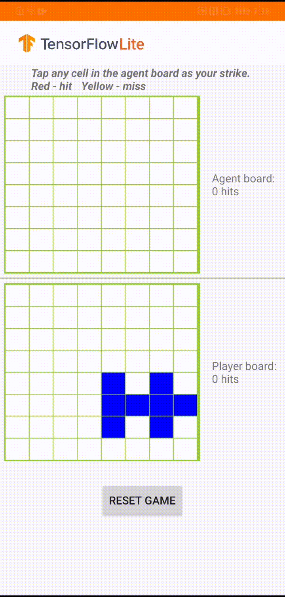

# Reinforcement Learning

Play a board game against an agent, which is trained using reinforcement
learning and deployed with TensorFlow Lite.

## Get started

If you are new to TensorFlow Lite and are working with Android, we recommend
exploring the following example application that can help you get started.

<a class="button button-primary" href="https://github.com/tensorflow/examples/tree/master/lite/examples/reinforcement_learning/android">Android
example</a>

If you are using a platform other than Android, or you are already familiar with
the [TensorFlow Lite APIs](https://www.tensorflow.org/api_docs/python/tf/lite),
you can download our trained model.

<a class="button button-primary" href="https://github.com/tensorflow/examples/blob/master/lite/examples/reinforcement_learning/android/app/src/main/assets/planestrike_tf.tflite">Download
model</a>

## How it works

The model is built for a game agent to play a small board game called 'Plane
Strike'. For a quick introduction of this game and its rules, please refer to
this
[README](https://github.com/tensorflow/examples/tree/master/lite/examples/reinforcement_learning/android).

Underneath the app's UI, we have built an agent that plays against the human
player. The agent is a 3-layer MLP that takes the board state as input and
outputs the predicted score for each of the 64 possible board cells. The model
is trained using policy gradient (REINFORCE) and you can find the training code
[here](https://github.com/tensorflow/examples/blob/master/lite/examples/reinforcement_learning/ml).
After training the agent, we convert the model into TFLite and deploy it in the
Android app.

During the actual game play in the Android app, when it's the agent's turn to
take action, the agent looks at the human player's board state (the board at the
bottom), which contains information about previous successful and unsuccessful
strikes (hits and misses), and uses the trained model to predict where to strike
next, so that it can finish the game before the human player does.

## Performance benchmarks

Performance benchmark numbers are generated with the tool described
[here](https://www.tensorflow.org/lite/performance/benchmarks).

<table>
  <thead>
    <tr>
      <th>Model Name</th>
      <th>Model size </th>
      <th>Device </th>
      <th>CPU</th>
    </tr>
  </thead>
  <tr>
    <td rowspan = 2>
      <a href="https://github.com/tensorflow/examples/blob/master/lite/examples/reinforcement_learning/android/app/src/main/assets/planestrike.tflite">Policy Gradient</a>
    </td>
    <td rowspan = 2>
      84 Kb
    </td>
    <td>Pixel 3 (Android 10) </td>
    <td>0.01ms*</td>
  </tr>
   <tr>
     <td>Pixel 4 (Android 10) </td>
    <td>0.01ms*</td>
  </tr>
</table>

\* 1 threads used.

## Inputs

The model accepts a 3-D `float32` Tensor of (1, 8, 8) as the board state.

## Outputs

The model returns a 2-D `float32` Tensor of shape (1,64) as the predicted scores
for each of the 64 possible strike positions.

## Train your own model

You could train your own model for a larger/smaller board by change the
`BOARD_SIZE` parameter in the
[training code](https://github.com/tensorflow/examples/blob/master/lite/examples/reinforcement_learning/ml).
