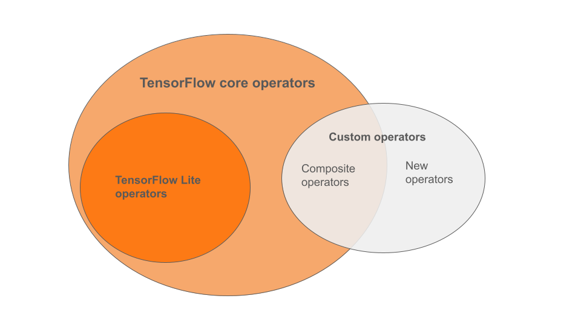

# TensorFlow Lite and TensorFlow operator compatibility

The machine learning (ML) operators you use in your model can impact the
process of converting a
TensorFlow model to TensorFlow Lite format. The TensorFlow Lite converter
supports a limited number of TensorFlow operations used in common
inference models, which means that not every model is directly convertible.
The converter tool allows you to include additional operators, but converting
a model this way also requires you to modify the TensorFlow Lite runtime
environment you use to execute your model, which can limit your ability
use standard runtime deployment options, such as
[Google Play services](../android/play_services).

The TensorFlow Lite Converter is designed to analyze model
structure and apply optimizations in order to make it compatible with the
directly supported operators. For example, depending on the ML operators in
your model, the converter may
[elide or fuse](../models/convert/operation_fusion) those
operators in order to map them to their TensorFlow Lite counterparts.

Even for supported operations, specific usage patterns are sometimes expected,
for performance reasons. The best way to understand how to build a TensorFlow
model that can be used with
TensorFlow Lite is to carefully consider how operations are converted and
optimized, along with the limitations imposed by this process.

## Supported operators

TensorFlow Lite built-in operators are a subset of the operators
that are part of the TensorFlow core library. Your TensorFlow model may
also include custom operators in the form of composite operators
or new operators defined by you. The diagram below shows the relationships
between these operators.

From this range of ML model operators, there are 3 types of
models supported by the conversion process:

1. Models with only TensorFlow Lite built-in operator. (**Recommended**)
1. Models with the built-in operators and select TensorFlow
   core operators.
1. Models with the built-in operators, TensorFlow core operators and/or
   custom operators.

If your model only contains operations that are natively supported by
TensorFlow Lite, you do not need any additional flags to convert it. This
is the recommended path because this type of model will convert smoothly
and is simpler to optimize and run using the default TensorFlow Lite runtime.
You also have more deployment options for your model such as
[Google Play services](../android/play_services).
You can get started with the
[TensorFlow Lite converter guide](../models/convert/convert_models). See
the [TensorFlow Lite Ops page](https://www.tensorflow.org/mlir/tfl_ops) for a
list of built-in operators.

If you need to include select TensorFlow operations from the core library,
you must specify that at conversion and ensure your runtime includes those
operations. See the [Select TensorFlow operators](ops_select.md) topic for
detailed steps.

Whenever possible, avoid the last option of including custom operators in your
converted model. [Custom operators](https://www.tensorflow.org/guide/create_op)
are either operators created by combining
multiple primitive TensorFlow core operators or defining a completely new one.
When custom operators are converted, they can increase the size of the overall
model by incurring dependencies outside of the built-in TensorFlow Lite library.
Custom ops, if not specifically created for mobile or device deployment,
can result in worse performance when deployed to
resource constrained devices compared to a server environment.
Finally, just like including select TensorFlow core operators, custom operators
requires you to
[modify the model runtime environment](ops_custom#create_and_register_the_operator)
which limits you from taking advantage of standard runtime services such as
the [Google Play services](../android/play_services).

## Supported types

Most TensorFlow Lite operations target both floating-point (`float32`) and
quantized (`uint8`, `int8`) inference, but many ops do not yet for other types
like `tf.float16` and strings.

Apart from using different version of the operations, the other difference
between floating-point and quantized models is the way they are converted.
Quantized conversion requires dynamic range information for tensors. This
requires "fake-quantization" during model training, getting range information
via a calibration data set, or doing "on-the-fly" range estimation. See
[quantization](../performance/model_optimization.md) for more details.

## Straight-forward conversions, constant-folding and fusing

A number of TensorFlow operations can be processed by TensorFlow Lite even
though they have no direct equivalent. This is the case for operations that can
be simply removed from the graph (`tf.identity`), replaced by tensors
(`tf.placeholder`), or fused into more complex operations (`tf.nn.bias_add`).
Even some supported operations may sometimes be removed through one of these
processes.

Here is a non-exhaustive list of TensorFlow operations that are usually removed
from the graph:

*   `tf.add`
*   `tf.debugging.check_numerics`
*   `tf.constant`
*   `tf.div`
*   `tf.divide`
*   `tf.fake_quant_with_min_max_args`
*   `tf.fake_quant_with_min_max_vars`
*   `tf.identity`
*   `tf.maximum`
*   `tf.minimum`
*   `tf.multiply`
*   `tf.no_op`
*   `tf.placeholder`
*   `tf.placeholder_with_default`
*   `tf.realdiv`
*   `tf.reduce_max`
*   `tf.reduce_min`
*   `tf.reduce_sum`
*   `tf.rsqrt`
*   `tf.shape`
*   `tf.sqrt`
*   `tf.square`
*   `tf.subtract`
*   `tf.tile`
*   `tf.nn.batch_norm_with_global_normalization`
*   `tf.nn.bias_add`
*   `tf.nn.fused_batch_norm`
*   `tf.nn.relu`
*   `tf.nn.relu6`

Note: Many of those operations don't have TensorFlow Lite equivalents, and the
corresponding model will not be convertible if they can't be elided or fused.

## Experimental Operations
The following TensorFlow Lite operations are present, but not ready for custom
models:

*   `CALL`
*   `CONCAT_EMBEDDINGS`
*   `CUSTOM`
*   `EMBEDDING_LOOKUP_SPARSE`
*   `HASHTABLE_LOOKUP`
*   `LSH_PROJECTION`
*   `SKIP_GRAM`
*   `SVDF`
