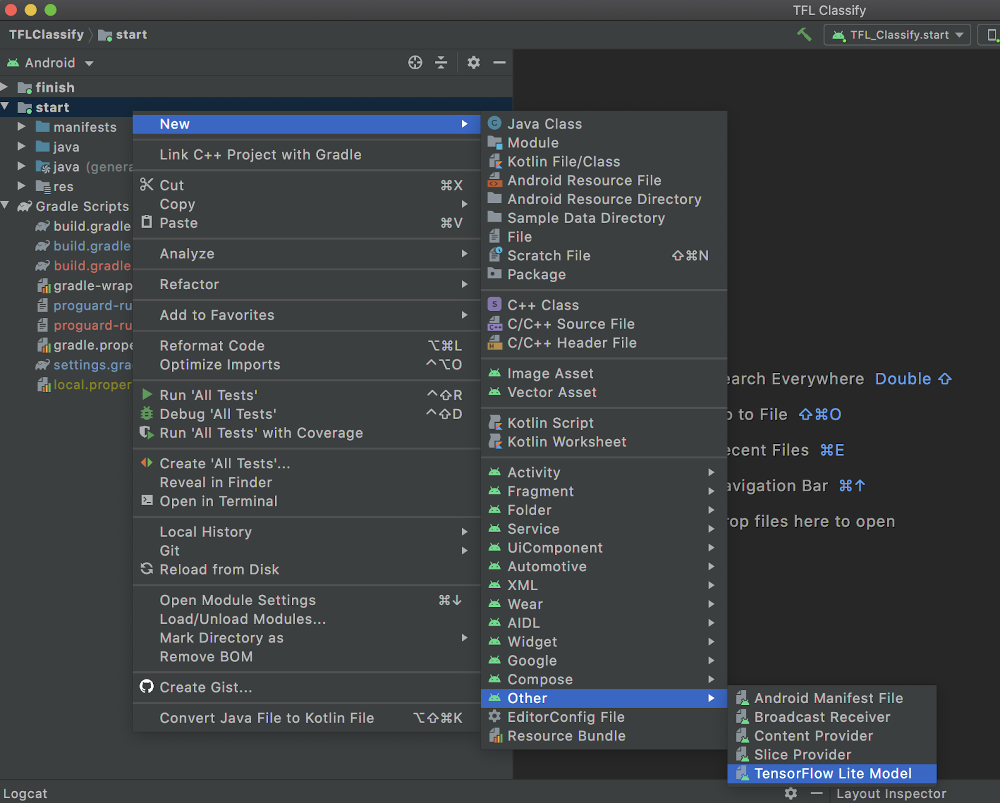
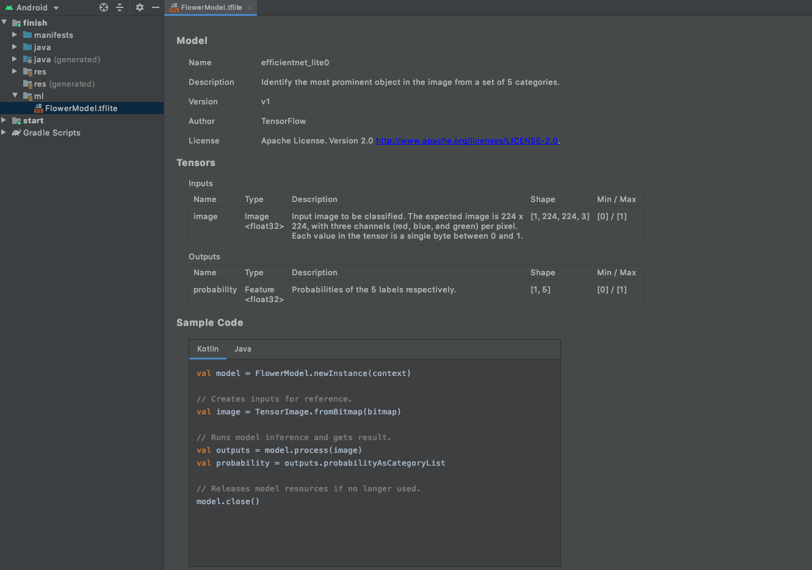

# Generate model interfaces using metadata

Using [TensorFlow Lite Metadata](../models/convert/metadata), developers can generate
wrapper code to enable integration on Android. For most developers, the
graphical interface of [Android Studio ML Model Binding](#mlbinding) is the
easiest to use. If you require more customisation or are using command line
tooling, the [TensorFlow Lite Codegen](#codegen) is also available.

## Use Android Studio ML Model Binding {:#mlbinding}

For TensorFlow Lite models enhanced with [metadata](../models/convert/metadata.md),
developers can use Android Studio ML Model Binding to automatically configure
settings for the project and generate wrapper classes based on the model
metadata. The wrapper code removes the need to interact directly with
`ByteBuffer`. Instead, developers can interact with the TensorFlow Lite model
with typed objects such as `Bitmap` and `Rect`.

Note: Required [Android Studio 4.1](https://developer.android.com/studio) or
above

### Import a TensorFlow Lite model in Android Studio

1.  Right-click on the module you would like to use the TFLite model or click on
    `File`, then `New` > `Other` > `TensorFlow Lite Model`
    

1.  Select the location of your TFLite file. Note that the tooling will
    configure the module's dependency on your behalf with ML Model binding and
    all dependencies automatically inserted into your Android module's
    `build.gradle` file.

    Optional: Select the second checkbox for importing TensorFlow GPU if you
    want to use GPU acceleration.
    

1.  Click `Finish`.

1.  The following screen will appear after the import is successful. To start
    using the model, select Kotlin or Java, copy and paste the code under the
    `Sample Code` section. You can get back to this screen by double clicking
    the TFLite model under the `ml` directory in Android Studio.
    

### Accelerating model inference {:#acceleration}

ML Model Binding provides a way for developers to accelerate their code through
the use of delegates and the number of threads.

Note: The TensorFlow Lite Interpreter must be created on the same thread as when
is run. Otherwise, TfLiteGpuDelegate Invoke: GpuDelegate must run on the same
thread where it was initialized. may occur.

Step 1. Check the module `build.gradle` file that it contains the following
dependency:

```java
    dependencies {
        ...
        // TFLite GPU delegate 2.3.0 or above is required.
        implementation 'org.tensorflow:tensorflow-lite-gpu:2.3.0'
    }
```

Step 2. Detect if GPU running on the device is compatible with TensorFlow GPU
delegate, if not run the model using multiple CPU threads:

<div>
    <devsite-selector>
    <section>
      <h3>Kotlin</h3>
      <p><pre class="prettyprint lang-kotlin">
    import org.tensorflow.lite.gpu.CompatibilityList
    import org.tensorflow.lite.gpu.GpuDelegate

    val compatList = CompatibilityList()

    val options = if(compatList.isDelegateSupportedOnThisDevice) {
        // if the device has a supported GPU, add the GPU delegate
        Model.Options.Builder().setDevice(Model.Device.GPU).build()
    } else {
        // if the GPU is not supported, run on 4 threads
        Model.Options.Builder().setNumThreads(4).build()
    }

    // Initialize the model as usual feeding in the options object
    val myModel = MyModel.newInstance(context, options)

    // Run inference per sample code
      </pre></p>
    </section>
    <section>
      <h3>Java</h3>
      <p><pre class="prettyprint lang-java">
    import org.tensorflow.lite.support.model.Model
    import org.tensorflow.lite.gpu.CompatibilityList;
    import org.tensorflow.lite.gpu.GpuDelegate;

    // Initialize interpreter with GPU delegate
    Model.Options options;
    CompatibilityList compatList = CompatibilityList();

    if(compatList.isDelegateSupportedOnThisDevice()){
        // if the device has a supported GPU, add the GPU delegate
        options = Model.Options.Builder().setDevice(Model.Device.GPU).build();
    } else {
        // if the GPU is not supported, run on 4 threads
        options = Model.Options.Builder().setNumThreads(4).build();
    }

    MyModel myModel = new MyModel.newInstance(context, options);

    // Run inference per sample code
      </pre></p>
    </section>
    </devsite-selector>
</div>

## Generate model interfaces with TensorFlow Lite code generator {:#codegen}

Note: TensorFlow Lite wrapper code generator currently only supports Android.

For TensorFlow Lite model enhanced with [metadata](../models/convert/metadata.md),
developers can use the TensorFlow Lite Android wrapper code generator to create
platform specific wrapper code. The wrapper code removes the need to interact
directly with `ByteBuffer`. Instead, developers can interact with the TensorFlow
Lite model with typed objects such as `Bitmap` and `Rect`.

The usefulness of the code generator depend on the completeness of the
TensorFlow Lite model's metadata entry. Refer to the `<Codegen usage>` section
under relevant fields in
[metadata_schema.fbs](https://github.com/tensorflow/tflite-support/blob/master/tensorflow_lite_support/metadata/metadata_schema.fbs),
to see how the codegen tool parses each field.

### Generate wrapper Code

You will need to install the following tooling in your terminal:

```sh
pip install tflite-support
```

Once completed, the code generator can be used using the following syntax:

```sh
tflite_codegen --model=./model_with_metadata/mobilenet_v1_0.75_160_quantized.tflite \
    --package_name=org.tensorflow.lite.classify \
    --model_class_name=MyClassifierModel \
    --destination=./classify_wrapper
```

The resulting code will be located in the destination directory. If you are
using [Google Colab](https://colab.research.google.com/) or other remote
environment, it maybe easier to zip up the result in a zip archive and download
it to your Android Studio project:

```python
# Zip up the generated code
!zip -r classify_wrapper.zip classify_wrapper/

# Download the archive
from google.colab import files
files.download('classify_wrapper.zip')
```

### Using the generated code

#### Step 1: Import the generated code

Unzip the generated code if necessary into a directory structure. The root of
the generated code is assumed to be `SRC_ROOT`.

Open the Android Studio project where you would like to use the TensorFlow lite
model and import the generated module by: And File -> New -> Import Module ->
select `SRC_ROOT`

Using the above example, the directory and the module imported would be called
`classify_wrapper`.

#### Step 2: Update the app's `build.gradle` file

In the app module that will be consuming the generated library module:

Under the android section, add the following:

```build
aaptOptions {
   noCompress "tflite"
}
```

Note: starting from version 4.1 of the Android Gradle plugin, .tflite will be
added to the noCompress list by default and the aaptOptions above is not needed
anymore.

Under the dependencies section, add the following:

```build
implementation project(":classify_wrapper")
```

#### Step 3: Using the model

```java
// 1. Initialize the model
MyClassifierModel myImageClassifier = null;

try {
    myImageClassifier = new MyClassifierModel(this);
} catch (IOException io){
    // Error reading the model
}

if(null != myImageClassifier) {

    // 2. Set the input with a Bitmap called inputBitmap
    MyClassifierModel.Inputs inputs = myImageClassifier.createInputs();
    inputs.loadImage(inputBitmap));

    // 3. Run the model
    MyClassifierModel.Outputs outputs = myImageClassifier.run(inputs);

    // 4. Retrieve the result
    Map<String, Float> labeledProbability = outputs.getProbability();
}
```

### Accelerating model inference

The generated code provides a way for developers to accelerate their code
through the use of [delegates](../performance/delegates.md) and the number of
threads. These can be set when initializing the model object as it takes three
parameters:

*   **`Context`**: Context from the Android Activity or Service
*   (Optional) **`Device`**: TFLite acceleration delegate for example
    GPUDelegate or NNAPIDelegate
*   (Optional) **`numThreads`**: Number of threads used to run the model -
    default is one.

For example, to use a NNAPI delegate and up to three threads, you can initialize
the model like this:

```java
try {
    myImageClassifier = new MyClassifierModel(this, Model.Device.NNAPI, 3);
} catch (IOException io){
    // Error reading the model
}
```

### Troubleshooting

If you get a 'java.io.FileNotFoundException: This file can not be opened as a
file descriptor; it is probably compressed' error, insert the following lines
under the android section of the app module that will uses the library module:

```build
aaptOptions {
   noCompress "tflite"
}
```

Note: starting from version 4.1 of the Android Gradle plugin, .tflite will be
added to the noCompress list by default and the aaptOptions above is not needed
anymore.
