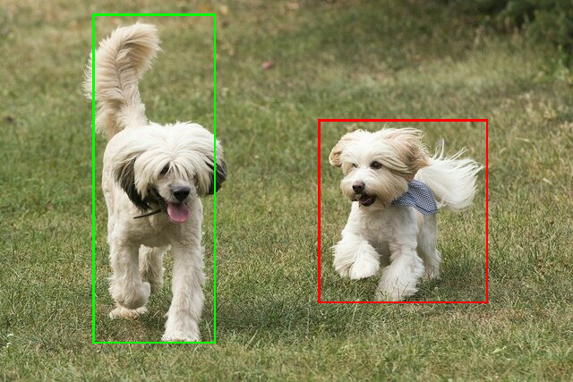

# Integrate object detectors

Object detectors can identify which of a known set of objects might be present
and provide information about their positions within the given image or a video
stream. An object detector is trained to detect the presence and location of
multiple classes of objects. For example, a model might be trained with images
that contain various pieces of fruit, along with a *label* that specifies the
class of fruit they represent (e.g. an apple, a banana, or a strawberry), and
data specifying where each object appears in the image. See the
[introduction of object detection](../../examples/object_detection/overview)
for more information about object detectors.

Use the Task Library `ObjectDetector` API to deploy your custom object detectors
or pretrained ones into your mobile apps.

## Key features of the ObjectDetector API

*   Input image processing, including rotation, resizing, and color space
    conversion.

*   Label map locale.

*   Score threshold to filter results.

*   Top-k detection results.

*   Label allowlist and denylist.

## Supported object detector models

The following models are guaranteed to be compatible with the `ObjectDetector`
API.

*   The
    [pretrained object detection models on TensorFlow Hub](https://tfhub.dev/tensorflow/collections/lite/task-library/object-detector/1).

*   Models created by
    [AutoML Vision Edge Object Detection](https://cloud.google.com/vision/automl/object-detection/docs).

*   Models created by
    [TensorFlow Lite Model Maker for object detector](https://www.tensorflow.org/lite/guide/model_maker).

*   Custom models that meet the
    [model compatibility requirements](#model-compatibility-requirements).

## Run inference in Java

See the
[Object Detection reference app](https://github.com/tensorflow/examples/tree/master/lite/examples/object_detection/android/)
for an example of how to use `ObjectDetector` in an Android app.

### Step 1: Import Gradle dependency and other settings

Copy the `.tflite` model file to the assets directory of the Android module
where the model will be run. Specify that the file should not be compressed, and
add the TensorFlow Lite library to the module’s `build.gradle` file:

```java
android {
    // Other settings

    // Specify tflite file should not be compressed for the app apk
    aaptOptions {
        noCompress "tflite"
    }
}

dependencies {
    // Other dependencies

    // Import the Task Vision Library dependency (NNAPI is included)
    implementation 'org.tensorflow:tensorflow-lite-task-vision:0.4.0'
    // Import the GPU delegate plugin Library for GPU inference
    implementation 'org.tensorflow:tensorflow-lite-gpu-delegate-plugin:0.4.0'
}
```

Note: starting from version 4.1 of the Android Gradle plugin, .tflite will be
added to the noCompress list by default and the aaptOptions above is not needed
anymore.

### Step 2: Using the model

```java
// Initialization
ObjectDetectorOptions options =
    ObjectDetectorOptions.builder()
        .setBaseOptions(BaseOptions.builder().useGpu().build())
        .setMaxResults(1)
        .build();
ObjectDetector objectDetector =
    ObjectDetector.createFromFileAndOptions(
        context, modelFile, options);

// Run inference
List<Detection> results = objectDetector.detect(image);
```

See the
[source code and javadoc](https://github.com/tensorflow/tflite-support/blob/master/tensorflow_lite_support/java/src/java/org/tensorflow/lite/task/vision/detector/ObjectDetector.java)
for more options to configure `ObjectDetector`.

## Run inference in iOS

### Step 1: Install the dependencies

The Task Library supports installation using CocoaPods. Make sure that CocoaPods
is installed on your system. Please see the
[CocoaPods installation guide](https://guides.cocoapods.org/using/getting-started.html#getting-started)
for instructions.

Please see the
[CocoaPods guide](https://guides.cocoapods.org/using/using-cocoapods.html) for
details on adding pods to an Xcode project.

Add the `TensorFlowLiteTaskVision` pod in the Podfile.

```
target 'MyAppWithTaskAPI' do
  use_frameworks!
  pod 'TensorFlowLiteTaskVision'
end
```

Make sure that the `.tflite` model you will be using for inference is present in
your app bundle.

### Step 2: Using the model

#### Swift

```swift
// Imports
import TensorFlowLiteTaskVision

// Initialization
guard let modelPath = Bundle.main.path(forResource: "ssd_mobilenet_v1",
                                            ofType: "tflite") else { return }

let options = ObjectDetectorOptions(modelPath: modelPath)

// Configure any additional options:
// options.classificationOptions.maxResults = 3

let detector = try ObjectDetector.objectDetector(options: options)

// Convert the input image to MLImage.
// There are other sources for MLImage. For more details, please see:
// https://developers.google.com/ml-kit/reference/ios/mlimage/api/reference/Classes/GMLImage
guard let image = UIImage (named: "cats_and_dogs.jpg"), let mlImage = MLImage(image: image) else { return }

// Run inference
let detectionResult = try detector.detect(gmlImage: mlImage)
```

#### Objective C

```objc
// Imports
#import <TensorFlowLiteTaskVision/TFLTaskVision.h>

// Initialization
NSString *modelPath = [[NSBundle mainBundle] pathForResource:@"ssd_mobilenet_v1" ofType:@"tflite"];

TFLObjectDetectorOptions *options = [[TFLObjectDetectorOptions alloc] initWithModelPath:modelPath];

// Configure any additional options:
// options.classificationOptions.maxResults = 3;

TFLObjectDetector *detector = [TFLObjectDetector objectDetectorWithOptions:options
                                                                     error:nil];

// Convert the input image to MLImage.
UIImage *image = [UIImage imageNamed:@"dogs.jpg"];

// There are other sources for GMLImage. For more details, please see:
// https://developers.google.com/ml-kit/reference/ios/mlimage/api/reference/Classes/GMLImage
GMLImage *gmlImage = [[GMLImage alloc] initWithImage:image];

// Run inference
TFLDetectionResult *detectionResult = [detector detectWithGMLImage:gmlImage error:nil];
```

See the
[source code](https://github.com/tensorflow/tflite-support/blob/master/tensorflow_lite_support/ios/task/vision/sources/TFLObjectDetector.h)
for more options to configure `TFLObjectDetector`.

## Run inference in Python

### Step 1: Install the pip package

```
pip install tflite-support
```

### Step 2: Using the model

```python
# Imports
from tflite_support.task import vision
from tflite_support.task import core
from tflite_support.task import processor

# Initialization
base_options = core.BaseOptions(file_name=model_path)
detection_options = processor.DetectionOptions(max_results=2)
options = vision.ObjectDetectorOptions(base_options=base_options, detection_options=detection_options)
detector = vision.ObjectDetector.create_from_options(options)

# Alternatively, you can create an object detector in the following manner:
# detector = vision.ObjectDetector.create_from_file(model_path)

# Run inference
image = vision.TensorImage.create_from_file(image_path)
detection_result = detector.detect(image)
```

See the
[source code](https://github.com/tensorflow/tflite-support/blob/master/tensorflow_lite_support/python/task/vision/object_detector.py)
for more options to configure `ObjectDetector`.

## Run inference in C++

```c++
// Initialization
ObjectDetectorOptions options;
options.mutable_base_options()->mutable_model_file()->set_file_name(model_file);
std::unique_ptr<ObjectDetector> object_detector = ObjectDetector::CreateFromOptions(options).value();

// Run inference
const DetectionResult result = object_detector->Detect(*frame_buffer).value();
```

See the
[source code](https://github.com/tensorflow/tflite-support/blob/master/tensorflow_lite_support/cc/task/vision/object_detector.h)
for more options to configure `ObjectDetector`.

## Example results

Here is an example of the detection results of
[ssd mobilenet v1](https://tfhub.dev/tensorflow/lite-model/ssd_mobilenet_v1/1/metadata/1)
from TensorFlow Hub.


```
Results:
 Detection #0 (red):
  Box: (x: 355, y: 133, w: 190, h: 206)
  Top-1 class:
   index       : 17
   score       : 0.73828
   class name  : dog
 Detection #1 (green):
  Box: (x: 103, y: 15, w: 138, h: 369)
  Top-1 class:
   index       : 17
   score       : 0.73047
   class name  : dog
```

Render the bounding boxes onto the input image:



Try out the simple
[CLI demo tool for ObjectDetector](https://github.com/tensorflow/tflite-support/tree/master/tensorflow_lite_support/examples/task/vision/desktop#object-detector)
with your own model and test data.

## Model compatibility requirements

The `ObjectDetector` API expects a TFLite model with mandatory
[TFLite Model Metadata](../../models/convert/metadata). See examples of creating
metadata for object detectors using the
[TensorFlow Lite Metadata Writer API](../../models/convert/metadata_writer_tutorial.ipynb#object_detectors).

The compatible object detector models should meet the following requirements:

*   Input image tensor: (kTfLiteUInt8/kTfLiteFloat32)

    -   image input of size `[batch x height x width x channels]`.
    -   batch inference is not supported (`batch` is required to be 1).
    -   only RGB inputs are supported (`channels` is required to be 3).
    -   if type is kTfLiteFloat32, NormalizationOptions are required to be
        attached to the metadata for input normalization.

*   Output tensors must be the 4 outputs of a `DetectionPostProcess` op, i.e:

    -   Locations tensor (kTfLiteFloat32)
        -   tensor of size `[1 x num_results x 4]`, the inner array representing
            bounding boxes in the form [top, left, right, bottom].
        -   BoundingBoxProperties are required to be attached to the metadata
            and must specify `type=BOUNDARIES` and `coordinate_type=RATIO.
    -   Classes tensor (kTfLiteFloat32)

        -   tensor of size `[1 x num_results]`, each value representing the
            integer index of a class.
        -   optional (but recommended) label map(s) can be attached as
            AssociatedFile-s with type TENSOR_VALUE_LABELS, containing one label
            per line. See the
            [example label file](https://github.com/tensorflow/tflite-support/blob/master/tensorflow_lite_support/metadata/python/tests/testdata/object_detector/labelmap.txt).
            The first such AssociatedFile (if any) is used to fill the
            `class_name` field of the results. The `display_name` field is
            filled from the AssociatedFile (if any) whose locale matches the
            `display_names_locale` field of the `ObjectDetectorOptions` used at
            creation time ("en" by default, i.e. English). If none of these are
            available, only the `index` field of the results will be filled.

    -   Scores tensor (kTfLiteFloat32)

        -   tensor of size `[1 x num_results]`, each value representing the
            score of the detected object.

    -   Number of detection tensor (kTfLiteFloat32)

        -   integer num_results as a tensor of size `[1]`.
