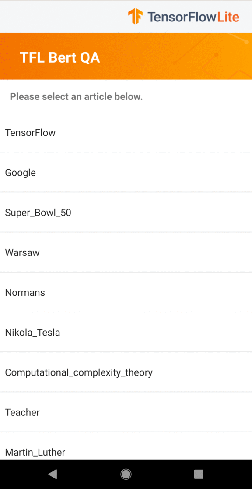

# Question and answer

Use a pre-trained model to answer questions based on the content of a given
passage.

## Get started

If you are new to TensorFlow Lite and are working with Android, we recommend
exploring the following example applications that can help you get started.

<a class="button button-primary" href="https://github.com/tensorflow/examples/tree/master/lite/examples/bert_qa/android">Android
example</a>

If you are using a platform other than Android, or you are already familiar with
the [TensorFlow Lite APIs](https://www.tensorflow.org/api_docs/python/tf/lite),
you can download our starter question and answer model.

<a class="button button-primary" href="https://storage.googleapis.com/download.tensorflow.org/models/tflite/bert_qa/mobilebert_qa_vocab.zip">Download
starter model and vocab</a>

## How it works

The model can be used to build a system that can answer users’ questions in
natural language. It was created using a pre-trained BERT model fine-tuned on
SQuAD 1.1 dataset.

[BERT](https://github.com/google-research/bert), or Bidirectional Encoder
Representations from Transformers, is a method of pre-training language
representations which obtains state-of-the-art results on a wide array of
Natural Language Processing tasks.

This app uses a compressed version of BERT, MobileBERT, that runs 4x faster and
has 4x smaller model size.

[SQuAD](https://rajpurkar.github.io/SQuAD-explorer/), or Stanford Question
Answering Dataset, is a reading comprehension dataset consisting of articles
from Wikipedia and a set of question-answer pairs for each article.

The model takes a passage and a question as input, then returns a segment of the
passage that most likely answers the question. It requires semi-complex
pre-processing including tokenization and post-processing steps that are
described in the BERT [paper](https://arxiv.org/abs/1810.04805) and implemented
in the sample app.

## Performance benchmarks

Performance benchmark numbers are generated with the tool
[described here](https://www.tensorflow.org/lite/performance/benchmarks).

<table>
  <thead>
    <tr>
      <th>Model Name</th>
      <th>Model size </th>
      <th>Device </th>
      <th>CPU</th>
    </tr>
  </thead>
  <tr>
    <td rowspan = 3>
      <a href="https://storage.googleapis.com/download.tensorflow.org/models/tflite/bert_qa/mobilebert_qa_vocab.zip">Mobile Bert</a>
    </td>
    <td rowspan = 3>
      100.5 Mb
    </td>
    <td>Pixel 3 (Android 10) </td>
    <td>123ms*</td>
  </tr>
   <tr>
     <td>Pixel 4 (Android 10) </td>
    <td>74ms*</td>
  </tr>
   <tr>
     <td>iPhone XS (iOS 12.4.1) </td>
    <td>257ms** </td>
  </tr>
</table>

\* 4 threads used.

\*\* 2 threads used on iPhone for the best performance result.

## Example output

### Passage (Input)

> Google LLC is an American multinational technology company that specializes in
> Internet-related services and products, which include online advertising
> technologies, search engine, cloud computing, software, and hardware. It is
> considered one of the Big Four technology companies, alongside Amazon, Apple,
> and Facebook.
>
> Google was founded in September 1998 by Larry Page and Sergey Brin while they
> were Ph.D. students at Stanford University in California. Together they own
> about 14 percent of its shares and control 56 percent of the stockholder
> voting power through supervoting stock. They incorporated Google as a
> California privately held company on September 4, 1998, in California. Google
> was then reincorporated in Delaware on October 22, 2002. An initial public
> offering (IPO) took place on August 19, 2004, and Google moved to its
> headquarters in Mountain View, California, nicknamed the Googleplex. In August
> 2015, Google announced plans to reorganize its various interests as a
> conglomerate called Alphabet Inc. Google is Alphabet's leading subsidiary and
> will continue to be the umbrella company for Alphabet's Internet interests.
> Sundar Pichai was appointed CEO of Google, replacing Larry Page who became the
> CEO of Alphabet.

### Question (Input)

> Who is the CEO of Google?

### Answer (Output)

> Sundar Pichai

## Read more about BERT

*   Academic paper: [BERT: Pre-training of Deep Bidirectional Transformers for
    Language Understanding](https://arxiv.org/abs/1810.04805)
*   [Open-source implementation of BERT](https://github.com/google-research/bert)
