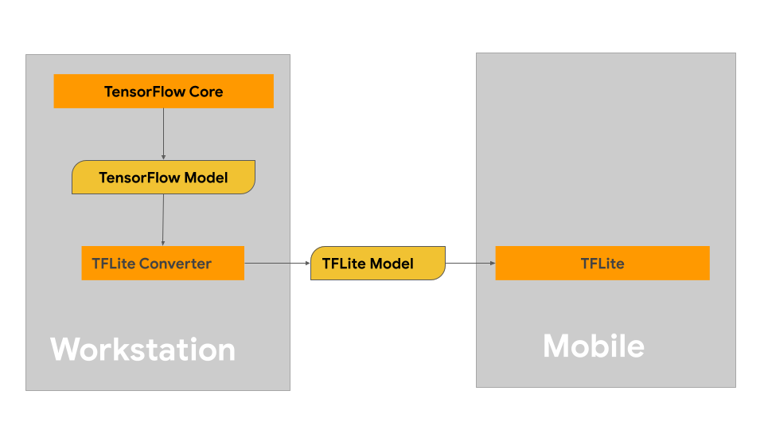

# Build TensorFlow Lite models

This page provides guidance for building
your TensorFlow models with the intention of converting to the TensorFlow
Lite model format. The machine learning (ML) models you use with TensorFlow
Lite are originally
built and trained using TensorFlow core libraries and tools. Once you've built
a model with TensorFlow core, you can convert it to a smaller, more
efficient ML model format called a TensorFlow Lite model.

* If you have a model to convert already, see the
    [Convert models overview](../convert/)
    page for guidance on converting your model.

* If you want to modify an existing model instead of starting from scratch,
  see the [Modify models overview](../modify/model_maker) for guidance.

## Building your model

If you are building a custom model for your specific use case,
you should start with developing and training a TensorFlow model or extending
an existing one.

### Model design constraints

Before you start your model development process, you should be aware of the
constraints for TensorFlow Lite models and build your model with these
constraints in mind:

* **Limited compute capabilities** - Compared to fully equipped servers with
  multiple CPUs, high memory capacity, and specialized processors such as GPUs
  and TPUs, mobile and edge devices are much more limited. While they are
  growing in compute power and specialized hardware compatibility, the models
  and data you can effectively process with them are still comparably limited.
* **Size of models** - The overall complexity of a model, including data
  pre-processing logic and the number of layers in the model, increases the
  in-memory size of a model. A large model may run unacceptably slow or simply
  may not fit in the available memory of a mobile or edge device.
* **Size of data** - The size of input data that can be effectively processed
  with a machine learning model is limited on a mobile or edge device. Models
  that use large data libraries such as language libraries, image libraries, or
  video clip libraries may not fit on these devices, and may require
  off-device storage and access solutions.
* **Supported TensorFlow operations** - TensorFlow Lite runtime environments
  support a subset of machine learning model operations compared to
  regular TensorFlow models. As you develop a model for use with TensorFlow
  Lite, you should track the compatibility of your model against the
  capabilities of TensorFlow Lite runtime environments.

For more information building effective, compatible, high performance models
for TensorFlow Lite, see
[Performance best practices](../../performance/best_practices).

### Model development

To build a TensorFlow Lite model, you first need to build a model using the
TensorFlow core libraries. TensorFlow core libraries are the lower-level
libraries that provide APIs to build, train and deploy ML models.

TensorFlow provides two paths for doing this. You can develop
your own custom model code or you can start with a model implementation
available in the TensorFlow
[Model Garden](https://www.tensorflow.org/tfmodels).

#### Model Garden

The TensorFlow Model Garden provides implementations of many state-of-the-art
machine learning (ML) models for vision and natural language processing (NLP).
You'll also find workflow tools to let you quickly configure and run those
models on standard datasets. The machine learning models in the
Model Garden include full code so you can
test, train, or re-train them using your own datasets.

Whether you are looking to benchmark performance for a
well-known model, verify the results of recently released research, or extend
existing models, the Model Garden can help you drive your ML goals.

#### Custom models

If your use case is outside of those supported by the models in Model Garden,
you can use a high level library like
[Keras](https://www.tensorflow.org/guide/keras/sequential_model) to
develop your custom training code. To learn the fundamentals of TensorFlow, see
the [TensorFlow guide](https://www.tensorflow.org/guide/basics). To get started
with examples, see the
[TensorFlow tutorials overview](https://www.tensorflow.org/tutorials) which
contain pointers to beginning to expert level tutorials.

### Model evaluation

Once you've developed your model, you should evaluate its performance and test
it on end-user devices.
TensorFlow provides a few ways to do this.

* [TensorBoard](https://www.tensorflow.org/tensorboard/tensorboard_profiling_keras)
  is a tool for providing the measurements and visualizations needed during
  the machine learning workflow. It enables tracking experiment metrics like
  loss and accuracy, visualizing the model graph, projecting embeddings to a
  lower dimensional space, and much more.
* [Benchmarking tools](https://www.tensorflow.org/lite/performance/measurement)
  are available for each supported platform such as the Android benchmark app
  and the iOS benchmark app. Use these tools to measure and calculate statistics
  for important performance metrics.

### Model optimization

With the [constraints](#model_constraints) on resources specific to
TensorFlow Lite models, model optimization can help to ensure your
model performance well and uses less compute resources. Machine learning model
performance is usually a balance between size and speed of inference vs
accuracy. TensorFlow Lite currently supports optimization via quantization,
pruning and clustering. See the
[model optimization] (https://www.tensorflow.org/lite/performance/model_optimization)
topic for more details on these techniques. TensorFlow also provides a
[Model optimization toolkit](https://www.tensorflow.org/model_optimization/guide)
which provides an API that implements these techniques.

## Next steps

* To start building your custom model, see the
  [quick start for beginners](https://www.tensorflow.org/tutorials/quickstart/beginner)
  tutorial in TensorFlow core documentation.
* To convert your custom TensorFlow model, see the
  [Convert models overview](../convert).
* See the
  [operator compatibility](../../guide/ops_compatibility) guide to determine
  if your model is compatible with TensorFlow Lite or if you'll need to take
  additional steps to make it compatible.
* See the
  [performance best practices guide](https://www.tensorflow.org/lite/performance/best_practices)
  for guidance on making your TensorFlow Lite models efficient and performant.
* See the [performance metrics guide](../../performance/measurement) to learn
  how to measure the performance of your model using benchmarking tools.

