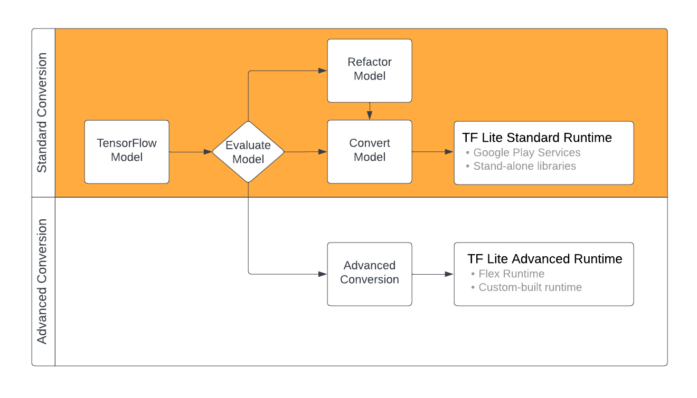

# Model conversion overview

The machine learning (ML) models you use with TensorFlow Lite are originally
built and trained using TensorFlow core libraries and tools. Once you've built
a model with TensorFlow core, you can convert it to a smaller, more
efficient ML model format called a TensorFlow Lite model.
This section provides guidance for converting
your TensorFlow models to the TensorFlow Lite model format.

Note: If you don't have a model to convert yet, see the
          [Models overview](../)
          page for guidance on choosing or building models.

## Conversion workflow

Converting TensorFlow models to TensorFlow Lite format can take a few paths
depending on the content of your ML model. As the first step of that process,
you should evaluate your model to determine if it can be directly converted.
This evaluation determines if the content of the model is supported by the
standard TensorFlow Lite runtime environments based on the TensorFlow operations
it uses. If your model uses operations outside of the supported set, you have
the option to refactor your model or use advanced conversion techniques.

The diagram below shows the high level steps in converting a model.

**Figure 1.** TensorFlow Lite conversion workflow.

The following sections outline the process of evaluating and converting models
for use with TensorFlow Lite.

### Input model formats

You can use the converter with the following input model formats:

*   [SavedModel](https://www.tensorflow.org/guide/saved_model)
    (***recommended***): A TensorFlow model saved as a set of files on disk.
*   [Keras model](https://www.tensorflow.org/guide/keras/overview):
    A model created using the high level Keras API.
*   [Keras H5 format](https://www.tensorflow.org/guide/keras/save_and_serialize#keras_h5_format):
    A light-weight alternative to SavedModel format supported by Keras API.
*   [Models built from concrete functions](https://www.tensorflow.org/guide/intro_to_graphs):
    A model created using the low level TensorFlow API.

You can save both the Keras and concrete function models as a SavedModel
and convert using the recommeded path.

Note: To avoid errors during inference, include signatures when exporting to the
      SavedModel format.
      The TensorFlow converter supports converting TensorFlow model's
      input/output specifications to TensorFlow Lite models. See the topic
      on [adding signatures](https://tensorflow.org/lite/guide/signatures).

If you have a Jax model, you can use the `TFLiteConverter.experimental_from_jax`
API to convert it to the TensorFlow Lite format. Note that this API is subject
to change while in experimental mode.

### Conversion evaluation

Evaluating your model is an important step before attempting to convert it.
When evaluating,
you want to determine if the contents of your model is compatible with the
TensorFlow Lite format. You should also determine if your model is a good fit
for use on mobile and edge devices in terms of the size of data the model uses,
its hardware processing requirements, and the model's overall size and
complexity.

For many models, the converter should work out of the box. However,
TensorFlow Lite builtin operator library supports a subset of
TensorFlow core operators, which means some models may need additional
steps before converting to TensorFlow Lite.
Additionally some operations that are supported by TensorFlow Lite have
restricted usage requirements for performance reasons. See the
[operator compatibility](../../guide/ops_compatibility) guide
to determine if your model needs to be refactored for conversion.

Key Point: Most models can be directly converted to TensorFlow Lite format. Some
  models may require refactoring or use of advanced conversion techniques to
  make them compatible.

### Model conversion

The TensorFlow Lite converter takes a TensorFlow model and generates a
TensorFlow Lite model (an optimized
[FlatBuffer](https://google.github.io/flatbuffers/) format identified by the
`.tflite` file extension). You can load
a SavedModel or directly convert a model you create in code.

The converter takes 3 main flags (or options) that customize the conversion
for your model:

1. [Compatibility flags](../../guide/ops_compatibility) allow you to specify
   whether the conversion should allow custom operators.
1. [Optimization flags](../../performance/model_optimization) allow you to
   specify the type of optimization to apply
   during conversion. The most commonly used optimization technique is
   [post-training quanitization]().
1. [Metadata flags](metadata) allow you to add metadata to the converted model
   which makes it easier to create platform specific wrapper code when deploying
   models on devices.

You can convert your model using the [Python API](convert_models#python_api) or
the [Command line](convert_models#cmdline) tool. See the
[Convert TF model](convert_models) guide for step by step
instructions on running the converter on your model.

Typically you would convert your model for the standard TensorFlow Lite
[runtime environment](../../android#runtime) or the
[Google Play services runtime environment](../../android/play_services)
for TensorFlow Lite (Beta). Some advanced use cases require
customization of model runtime environment, which require additional steps in
the conversion proceess. See the
[advanced runtime environment](../../android#adv_runtime) section of the Android
overview for more guidance.

## Advanced conversion

If you run into [errors](convert_models#conversion_errors)
while running the converter on your model, it's most likely that you have an
operator compatibility issue. Not all TensorFlow operations are
supported by TensorFlow
Lite. You can work around these issues by refactoring your model, or by using
advanced conversion options that allow you to create a modified TensorFlow Lite
format model and a custom runtime environment for that model.

* See the [Model compatibility overview](../../guide/ops_compatibility)
  for more information on TensorFlow and TensorFlow Lite model compatibility
  considerations.
* Topics under the Model compatibility overview cover advanced techniques for
  refactoring your model, such as the [Select operators](../../guide/ops_select)
  guide.
* For full list of operations and limitations see
  [TensorFlow Lite Ops page](https://www.tensorflow.org/mlir/tfl_ops).

## Next steps

* See the [convert TF models](convert_models) guide to quickly get started on
  converting your model.
* See the [optimization overview](../../performance/model_optimization) for
  guidance on how to optimize your converted model using techniques like
  [post-training quanitization](../../performance/post_training_quantization).
* See the [Adding metadata overview](metadata) to learn how to add metadata to
  your models. Metadata provides other uses a description of your model as well
  as information that can be leveraged by code generators.

