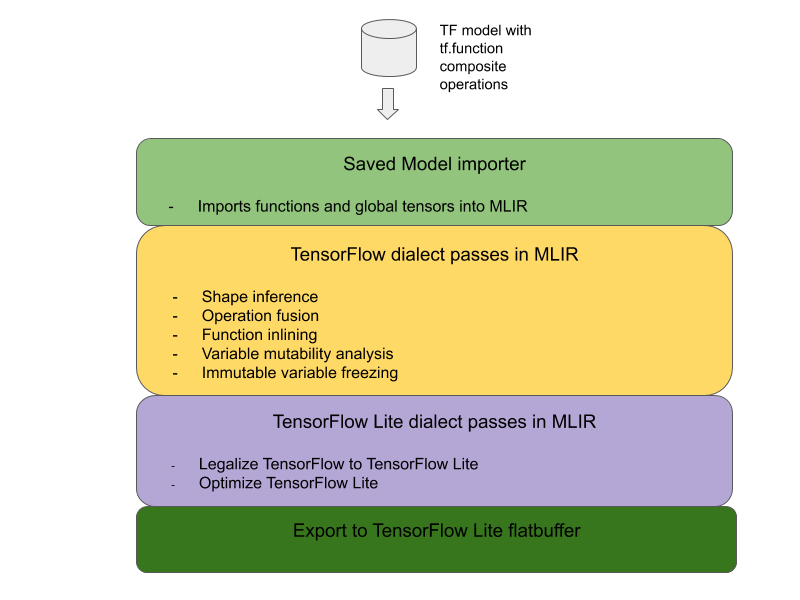

# TensorFlow operation fusion

## Overview

This page describes the design and steps needed to convert composite operations
in TensorFlow to fused operations in TensorFlow Lite. This infrastructure is
general purpose and supports conversion of any composite operation in TensorFlow
to a corresponding fused operation in TensorFlow Lite.

An example use of this infrastructure is TensorFlow RNN operation fusion to
TensorFlow Lite, as detailed
[here](https://www.tensorflow.org/lite/models/convert/rnn).

### What are fused operations


TensorFlow operations can either be primitive ops e.g.
[tf.add](https://www.tensorflow.org/api_docs/python/tf/math/add) or they can be
composed from other primitive operations e.g.
[tf.einsum](https://www.tensorflow.org/api_docs/python/tf/einsum). A primitive
operation shows up as a single node in the TensorFlow graph while.a composite
operation is a collection of nodes in the TensorFlow graph. Executing a
composite operation is equivalent to executing each of its constituent primitive
operations.

A fused operation corresponds to a single operation that subsumes all the
computation performed by each primitive operation within the corresponding
composite operation.

### Benefits of fused operations

Fused operations exist to maximize the performance of their underlying kernel
implementations, by optimizing the overall computation and reducing memory
footprint. This is very valuable, especially for low-latency inference workloads
and resource constrained mobile platforms.

Fused operations also provide a higher level interface to define complex
transformations like quantization, which would otherwise be infeasible or very
hard to do at a more granular level.

TensorFlow Lite has many instances of fused operations for the reasons
articulated above. These fused operations typically correspond to composite
operations in the source TensorFlow program. Examples of composite operations in
TensorFlow that are implemented as a single fused operation in TensorFlow Lite
include various RNN operations like Unidirectional and Bidirectional sequence
LSTM, convolution (conv2d, bias add, relu), fully connected (matmul, bias add,
relu) and more. In TensorFlow Lite, LSTM quantization is currently only
implemented in the fused LSTM operations.

### Challenges with fused operations

Converting composite operations from TensorFlow to fused operations in
TensorFlow Lite is a hard problem. This is because:

1.  Composite operations are represented in the TensorFlow graph as a set of
    primitive operations without a well defined boundary. It can be very
    challenging to identify (e.g. via pattern matching) the sub-graph
    corresponding to such a composite operation.

1.  There may be more than one TensorFlow implementation targeting a fused
    TensorFlow Lite operation. For example, there are many LSTM implementations
    in TensorFlow (Keras, Babelfish/lingvo etc) and each of these is composed of
    different primitive operations but they all could still be converted to the
    same fused LSTM operation in TensorFlow Lite.

As such, conversion of fused operations has proven quite challenging.

## Converting from composite to fused operation

The overall architecture for converting TensorFlow composite operations to
TensorFlow Lite fused operations is below:



### Wrap the composite operation in a `tf.function`

In the TensorFlow model source code, identify and abstract out the composite
operation into a `tf.function` with the
[experimental\_implements](https://github.com/tensorflow/tensorflow/blob/c11d5d8881fd927165eeb09fd524a80ebaf009f2/tensorflow/python/eager/def_function.py#L470)
function annotation. See an example of [embedding lookup](#composing_ops). The
function defines the interface and its arguments should be used to implement the
conversion logic.

### Write conversion code

The conversion code is written per the interface of the function with the
`implements` annotation. See an example fusion for
[embedding lookup](#fusion_code). Conceptually, the conversion code replaces the
composite implementation of this interface with the fused one.

In the prepare-composite-functions pass, plugin in your
[conversion code](https://github.com/tensorflow/tensorflow/blob/c11d5d8881fd927165eeb09fd524a80ebaf009f2/tensorflow/compiler/mlir/lite/transforms/prepare_composite_functions_tf.cc#L115).

In more advanced usages, it is possible to implement complex transformations of
the composite operation's operands in order to derive the operands of the fused
operation. See
[Keras LSTM](https://github.com/tensorflow/tensorflow/blob/1099faa8d6a941ef44d09ed8c372ff0ffda94112/tensorflow/compiler/mlir/lite/utils/lstm_utils.cc#L627).
conversion code as an example.

### Convert to TensorFlow Lite

Use the
[TFLiteConverter.from_saved_model](https://www.tensorflow.org/api_docs/python/tf/lite/TFLiteConverter#from_saved_model)
API to convert to TensorFlow Lite.

## Under the hood

<a id="under_the_hood"></a>

We now describe high level details of the overall design in converting to fused
operations in TensorFlow Lite.

### Composing operations in TensorFlow

<a id="composing_ops"></a>

The use of `tf.function` with the
[experimental\_implements](https://github.com/tensorflow/tensorflow/blob/c11d5d8881fd927165eeb09fd524a80ebaf009f2/tensorflow/python/eager/def_function.py#L470)
function attribute allows users to explicitly compose new operations using
TensorFlow primitive operations and specify the interface that the resultant
composite operation implements. This is very useful as it provides:

1.  A well-defined boundary for the composite operation in the underlying
    TensorFlow graph.
1.  Explicitly specify the interface that this operation implements. The
    arguments of the `tf.function` correspond to the arguments of this
    interface.

As an example, let’s consider a composite operation defined to implement
embedding lookup. This maps to a fused operation in TensorFlow Lite.

```python
  @tf.function(
        experimental_implements="embedding_lookup")
    def EmbFprop(embs, ids_vec):
      """Embedding forward prop.

      Effectively, it computes:
        num = size of ids_vec
        rets = zeros([num, embedding dim])
        for i in range(num):
          rets[i, :] = embs[ids_vec[i], :]
        return rets

      Args:
        embs: The embedding matrix.
        ids_vec: A vector of int32 embedding ids.

      Returns:
        The result of embedding lookups. A matrix of shape
        [num ids in ids_vec, embedding dims].
      """
      num = tf.shape(ids_vec)[0]
      rets = inplace_ops.empty([num] + emb_shape_suf, py_utils.FPropDtype(p))

      def EmbFpropLoop(i, embs, ids_vec, rets):
        # row_id = ids_vec[i]
        row_id = tf.gather(ids_vec, i)
        # row = embs[row_id]
        row = tf.reshape(tf.gather(embs, row_id), [1] + emb_shape_suf)
        # rets[i] = row
        rets = inplace_ops.alias_inplace_update(rets, [i], row)
        return embs, ids_vec, rets

      _, _, rets = functional_ops.For(
          start=0,
          limit=num,
          delta=1,
          inputs=[embs, ids_vec, rets],
          body=EmbFpropLoop,
          rewrite_with_while=compiled)
      if len(weight_shape) > 2:
        rets = tf.reshape(rets, [num, symbolic.ToStatic(p.embedding_dim)])
      return rets
```

By making models use composite operations via `tf.function` as illustrated
above, it becomes possible to build a general infrastructure to **identify and
convert** such operations to fused TensorFlow Lite operations.

### Extending the TensorFlow Lite converter

The TensorFlow Lite converter that was released earlier this year only supported
importing TensorFlow models as a graph with all variables replaced with their
corresponding constant values. This does not work for operation fusion since
such graphs have all functions inlined so that the variables can be turned into
constants.

In order to leverage the `tf.function` with the `experimental_implements`
feature during the conversion process, the functions need to be preserved until
later in the conversion process.

As such, we implemented a new workflow of importing and converting TensorFlow
models in the converter to support the composite operation fusion use case.
Specifically, the new features added are:

1.  Importing TensorFlow
    [saved models into MLIR](https://github.com/tensorflow/tensorflow/blob/1099faa8d6a941ef44d09ed8c372ff0ffda94112/tensorflow/compiler/mlir/tensorflow/translate/import_model.cc#L3748)
1.  [fuse composite operations](https://github.com/tensorflow/tensorflow/blob/1099faa8d6a941ef44d09ed8c372ff0ffda94112/tensorflow/compiler/mlir/lite/transforms/prepare_composite_functions_tf.cc#L103)
1.  [variable mutability analysis](https://github.com/tensorflow/tensorflow/blob/1099faa8d6a941ef44d09ed8c372ff0ffda94112/tensorflow/compiler/mlir/tensorflow/transforms/optimize_global_tensors.cc#L43)
1.  [freeze all read-only variables](https://github.com/tensorflow/tensorflow/blob/1099faa8d6a941ef44d09ed8c372ff0ffda94112/tensorflow/compiler/mlir/tensorflow/transforms/freeze_global_tensors.cc#L44)

This allows us to perform operation fusion using the functions representing the
composite operations prior to function inlining and variable freezing.

### Implementing operation fusion

Let’s look at the operation fusion pass in more detail. This pass does the
following:

1.  Loop through all functions in the MLIR module.
1.  If a function has the tf.\_implements attribute, based on the attribute
    value, calls the appropriate operation fusion utility.
1.  The operation fusion utility operates on the function’s operands and
    attributes (which serve as the interface for the conversion) and replaces
    the body of the function with an equivalent function body containing the
    fused operation.
1.  In many cases, the replaced body will contain operations other than the
    fused operation. These correspond to some static transforms on the
    function’s operands in order to obtain the operands of the fused operation.
    Since these computations can all be constant folded away, they would not be
    present in the exported flatbuffer where only the fused operation would
    exist.

Here is code snippet from the pass showing the main workflow:

```
void PrepareCompositeFunctionsPass::ConvertTFImplements(FuncOp func,
                                                        StringAttr attr) {
  if (attr.getValue() == "embedding_lookup") {
    func.eraseBody();
    func.addEntryBlock();
    // Convert the composite embedding_lookup function body to a
    // TFLite fused embedding_lookup op.
    ConvertEmbeddedLookupFunc convert_embedded_lookup(func);
    if (failed(convert_embedded_lookup.VerifySignature())) {
      return signalPassFailure();
    }
    convert_embedded_lookup.RewriteFunc();
  } else if (attr.getValue() == mlir::TFL::kKerasLstm) {
     func.eraseBody();
     func.addEntryBlock();
     OpBuilder builder(func.getBody());
     if (failed(ConvertKerasLSTMLayer(func, &builder))) {
       return signalPassFailure();
     }
  } else if (.....) /* Other fusions can plug in here */
}
```

Here is code snippet showing mapping this composite operation to a fused
operation in TensorFlow Lite leveraging the function as a conversion interface.

<a id="fusion_code"></a>

```C++
void RewriteFunc() {
    Value lookup = func_.getArgument(1);
    Value value = func_.getArgument(0);
    auto output_type = func_.getType().getResult(0);

    OpBuilder builder(func_.getBody());
    auto op = builder.create<mlir::TFL::EmbeddingLookupOp>(
        func_.getLoc(), output_type, lookup, value);

    builder.create<mlir::ReturnOp>(func_.getLoc(), op.getResult());
  }
```
