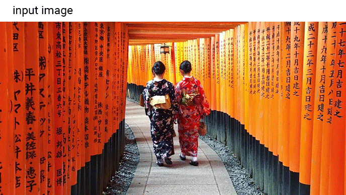

# Segmentation

Image segmentation is the process of partitioning a digital image into multiple
segments (sets of pixels, also known as image objects). The goal of segmentation
is to simplify and/or change the representation of an image into something that
is more meaningful and easier to analyze.

The following image shows the output of the image segmentation model on Android.
The model will create a mask over the target objects with high accuracy.

## Get started

If you are new to TensorFlow Lite and are working with Android or iOS, it is
recommended you explore the following example applications that can help you get
started.

You can leverage the out-of-box API from
[TensorFlow Lite Task Library](../../inference_with_metadata/task_library/image_segmenter)
to integrate image segmentation models within just a few lines of code. You can
also integrate the model using the
[TensorFlow Lite Interpreter Java API](../../guide/inference#load_and_run_a_model_in_java).

The Android example below demonstrates the implementation for both methods as
[lib_task_api](https://github.com/tensorflow/examples/tree/master/lite/examples/image_segmentation/android/lib_task_api)
and
[lib_interpreter](https://github.com/tensorflow/examples/tree/master/lite/examples/image_segmentation/android/lib_interpreter),
respectively.

<a class="button button-primary" href="https://github.com/tensorflow/examples/tree/master/lite/examples/image_segmentation/android">View
Android example</a>

<a class="button button-primary" href="https://github.com/tensorflow/examples/tree/master/lite/examples/image_segmentation/ios">View
iOS example</a>

If you are using a platform other than Android or iOS, or you are already
familiar with the
<a href="https://www.tensorflow.org/api_docs/python/tf/lite">TensorFlow Lite
APIs</a>, you can download our starter image segmentation model.

<a class="button button-primary" href="https://tfhub.dev/tensorflow/lite-model/deeplabv3/1/metadata/2?lite-format=tflite">Download
starter model</a>

## Model description

_DeepLab_ is a state-of-art deep learning model for semantic image segmentation,
where the goal is to assign semantic labels (e.g. person, dog, cat) to every
pixel in the input image.

### How it works

Semantic image segmentation predicts whether each pixel of an image is
associated with a certain class. This is in contrast to
<a href="../object_detection/overview.md">object detection</a>, which detects
objects in rectangular regions, and
<a href="../image_classification/overview.md">image classification</a>, which
classifies the overall image.

The current implementation includes the following features:
<ol>
  <li>DeepLabv1: We use atrous convolution to explicitly control the resolution at which feature responses are computed within Deep Convolutional Neural Networks.</li>
  <li>DeepLabv2: We use atrous spatial pyramid pooling (ASPP) to robustly segment objects at multiple scales with filters at multiple sampling rates and effective fields-of-views.</li>
  <li>DeepLabv3: We augment the ASPP module with image-level feature [5, 6] to capture longer range information. We also include batch normalization [7] parameters to facilitate the training. In particular, we applying atrous convolution to extract output features at different output strides during training and evaluation, which efficiently enables training BN at output stride = 16 and attains a high performance at output stride = 8 during evaluation.</li>
  <li>DeepLabv3+: We extend DeepLabv3 to include a simple yet effective decoder module to refine the segmentation results especially along object boundaries. Furthermore, in this encoder-decoder structure one can arbitrarily control the resolution of extracted encoder features by atrous convolution to trade-off precision and runtime.</li>
</ol>

## Performance benchmarks

Performance benchmark numbers are generated with the tool
[described here](https://www.tensorflow.org/lite/performance/benchmarks).

<table>
  <thead>
    <tr>
      <th>Model Name</th>
      <th>Model size </th>
      <th>Device </th>
      <th>GPU</th>
      <th>CPU</th>
    </tr>
  </thead>
  <tr>
    <td rowspan = 3>
      <a href="https://tfhub.dev/tensorflow/lite-model/deeplabv3/1/metadata/2?lite-format=tflite">Deeplab v3</a>
    </td>
    <td rowspan = 3>
      2.7 Mb
    </td>
    <td>Pixel 3 (Android 10) </td>
    <td>16ms</td>
    <td>37ms*</td>
  </tr>
   <tr>
     <td>Pixel 4 (Android 10) </td>
    <td>20ms</td>
    <td>23ms*</td>
  </tr>
   <tr>
     <td>iPhone XS (iOS 12.4.1) </td>
     <td>16ms</td>
    <td>25ms** </td>
  </tr>
</table>

\* 4 threads used.

\*\* 2 threads used on iPhone for the best performance result.

## Further reading and resources

<ul>
  <li><a href="https://ai.googleblog.com/2018/03/semantic-image-segmentation-with.html">Semantic Image Segmentation with DeepLab in TensorFlow</a></li>
  <li><a href="https://medium.com/tensorflow/tensorflow-lite-now-faster-with-mobile-gpus-developer-preview-e15797e6dee7">TensorFlow Lite Now Faster with Mobile GPUs (Developer Preview)</a></li>
  <li><a href="https://github.com/tensorflow/models/tree/master/research/deeplab">DeepLab: Deep Labelling for Semantic Image Segmentation</a></li>
</ul>
