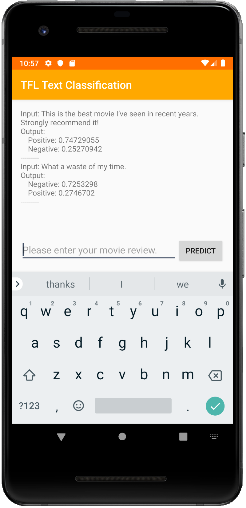

# Text Classification

Use a pre-trained model to category a paragraph into predefined groups.

## Get started

If you are new to TensorFlow Lite and are working with Android, we recommend
exploring the following example applications that can help you get started.

<a class="button button-primary" href="https://github.com/tensorflow/examples/tree/master/lite/examples/text_classification/android">Android
example</a>

If you are using a platform other than Android, or you are already familiar with
the TensorFlow Lite APIs, you can download our starter text classification
model.

<a class="button button-primary" href="https://storage.googleapis.com/download.tensorflow.org/models/tflite/text_classification/text_classification.tflite">Download
starter model</a>

## How it works

Text classification categorizes a paragraph into predefined groups based on its
content.

This pretrained model predicts if a paragraph's sentiment is positive or
negative. It was trained on
[Large Movie Review Dataset v1.0](http://ai.stanford.edu/~amaas/data/sentiment/)
from Mass et al, which consists of IMDB movie reviews labeled as either positive
or negative.

Here are the steps to classify a paragraph with the model:

1.  Tokenize the paragraph and convert it to a list of word ids using a
    predefined vocabulary.
1.  Feed the list to the TensorFlow Lite model.
1.  Get the probability of the paragraph being positive or negative from the
    model outputs.

### Note

*   Only English is supported.
*   This model was trained on movie reviews dataset so you may experience
    reduced accuracy when classifying text of other domains.

## Example output

| Text                                       | Negative (0) | Positive (1) |
| ------------------------------------------ | ------------ | ------------ |
| This is the best movie I’ve seen in recent | 25.3%        | 74.7%        |
: years. Strongly recommend it!              :              :              :
| What a waste of my time.                   | 72.5%        | 27.5%        |

## Use your training dataset

Follow this
[tutorial](https://github.com/tensorflow/examples/tree/master/tensorflow_examples/lite/model_customization/demo/text_classification.ipynb)
to apply the same technique used here to train a text classification model using
your own datasets. With the right dataset, you can create a model for use cases
such as document categorization or toxic comments detection.

## Read more about text classification

*   [Word embeddings and tutorial to train this model](https://www.tensorflow.org/tutorials/text/word_embeddings)
