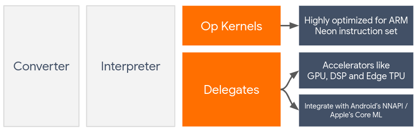

# TensorFlow Lite Delegates

## Introduction

**Delegates** enable hardware acceleration of TensorFlow Lite models by
leveraging on-device accelerators such as the GPU and
[Digital Signal Processor (DSP)](https://en.wikipedia.org/wiki/Digital_signal_processor).

By default, TensorFlow Lite utilizes CPU kernels that are optimized for the
[ARM Neon](https://developer.arm.com/documentation/dht0002/a/Introducing-NEON/NEON-architecture-overview/NEON-instructions)
instruction set. However, the CPU is a multi-purpose processor that isn't
necessarily optimized for the heavy arithmetic typically found in Machine
Learning models (for example, the matrix math involved in convolution and dense
layers).

On the other hand, most modern mobile phones contain chips that are better at
handling these heavy operations. Utilizing them for neural network operations
provides huge benefits in terms of latency and power efficiency. For example,
GPUs can provide upto a
[5x speedup](https://blog.tensorflow.org/2020/08/faster-mobile-gpu-inference-with-opencl.html)
in latency, while the
[Qualcomm® Hexagon DSP](https://developer.qualcomm.com/software/hexagon-dsp-sdk/dsp-processor)
has shown to reduce power consumption upto 75% in our experiments.

Each of these accelerators have associated APIs that enable custom computations,
such as [OpenCL](https://www.khronos.org/opencl/) or
[OpenGL ES](https://www.khronos.org/opengles/) for mobile GPU and the
[Qualcomm® Hexagon SDK](https://developer.qualcomm.com/software/hexagon-dsp-sdk)
for DSP. Typically, you would have to write a lot of custom code to run a neural
network through these interfaces. Things get even more complicated when you
consider that each accelerator has its pros & cons and cannot execute every
operation in a neural network. TensorFlow Lite's Delegate API solves this
problem by acting as a bridge between the TFLite runtime and these lower-level
APIs.



## Choosing a Delegate

TensorFlow Lite supports multiple delegates, each of which is optimized for
certain platform(s) and particular types of models. Usually, there will be
multiple delegates applicable to your use-case, depending on two major criteria:
the *Platform* (Android or iOS?) you target, and the *Model-type*
(floating-point or quantized?) that you are trying to accelerate.

### Delegates by Platform

#### Cross-platform (Android & iOS)

*   **GPU delegate** - The GPU delegate can be used on both Android and iOS. It
    is optimized to run 32-bit and 16-bit float based models where a GPU is
    available. It also supports 8-bit quantized models and provides GPU
    performance on par with their float versions. For details on the GPU
    delegate, see [TensorFlow Lite on GPU](gpu_advanced.md). For step-by-step
    tutorials on using the GPU delegate with Android and iOS, see
    [TensorFlow Lite GPU Delegate Tutorial](gpu.md).

#### Android

*   **NNAPI delegate for newer Android devices** - The NNAPI delegate can be
    used to accelerate models on Android devices with GPU, DSP and / or NPU
    available. It is available in Android 8.1 (API 27+) or higher. For an
    overview of the NNAPI delegate, step-by-step instructions and best
    practices, see [TensorFlow Lite NNAPI delegate](nnapi.md).
*   **Hexagon delegate for older Android devices** - The Hexagon delegate can be
    used to accelerate models on Android devices with Qualcomm Hexagon DSP. It
    can be used on devices running older versions of Android that do not support
    NNAPI. See [TensorFlow Lite Hexagon delegate](hexagon_delegate.md) for more
    detail.

#### iOS

*   **Core ML delegate for newer iPhones and iPads** - For newer iPhones and
    iPads where Neural Engine is available, you can use Core ML delegate to
    accelerate inference for 32-bit or 16-bit floating-point models. Neural
    Engine is available Apple mobile devices with A12 SoC or higher. For an
    overview of the Core ML delegate and step-by-step instructions, see
    [TensorFlow Lite Core ML delegate](coreml_delegate.md).

### Delegates by model type

Each accelerator is designed with a certain bit-width of data in mind. If you
provide a floating-point model to a delegate that only supports 8-bit quantized
operations (such as the [Hexagon delegate](hexagon_delegate.md)), it will reject
all its operations and the model will run entirely on the CPU. To avoid such
surprises, the table below provides an overview of delegate support based on
model type:

**Model Type**                                                                                          | **GPU** | **NNAPI** | **Hexagon** | **CoreML**
------------------------------------------------------------------------------------------------------- | ------- | --------- | ----------- | ----------
Floating-point (32 bit)                                                                                 | Yes     | Yes       | No          | Yes
[Post-training float16 quantization](post_training_float16_quant.ipynb)                                 | Yes     | No        | No          | Yes
[Post-training dynamic range quantization](post_training_quant.ipynb)                                   | Yes     | Yes       | No          | No
[Post-training integer quantization](post_training_integer_quant.ipynb)                                 | Yes     | Yes       | Yes         | No
[Quantization-aware training](http://www.tensorflow.org/model_optimization/guide/quantization/training) | Yes     | Yes       | Yes         | No

### Validating performance

The information in this section acts as a rough guideline for shortlisting the
delegates that could improve your application. However, it is important to note
that each delegate has a pre-defined set of operations it supports, and may
perform differently depending on the model and device; for example, the
[NNAPI delegate](nnapi.md) may choose to use Google's Edge-TPU on a Pixel phone
while utilizing a DSP on another device. Therefore, it is usually recommended
that you perform some benchmarking to gauge how useful a delegate is for your
needs. This also helps justify the binary size increase associated with
attaching a delegate to the TensorFlow Lite runtime.

TensorFlow Lite has extensive performance and accuracy-evaluation tooling that
can empower developers to be confident in using delegates in their application.
These tools are discussed in the next section.

## Tools for Evaluation

### Latency & memory footprint

TensorFlow Lite’s
[benchmark tool](https://www.tensorflow.org/lite/performance/measurement) can be
used with suitable parameters to estimate model performance, including average
inference latency, initialization overhead, memory footprint, etc. This tool
supports multiple flags to figure out the best delegate configuration for your
model. For instance, `--gpu_backend=gl` can be specified with `--use_gpu` to
measure GPU execution with OpenGL. The complete list of supported delegate
parameters is defined in the
[detailed documentation](https://github.com/tensorflow/tensorflow/blob/master/tensorflow/lite/tools/delegates/README.md#tflite-delegate-registrar).

Here’s an example run for a quantized model with GPU via `adb`:

```
adb shell /data/local/tmp/benchmark_model \
  --graph=/data/local/tmp/mobilenet_v1_224_quant.tflite \
  --use_gpu=true
```

You can download pre-built version of this tool for Android, 64-bit ARM
architecture
[here](https://storage.googleapis.com/tensorflow-nightly-public/prod/tensorflow/release/lite/tools/nightly/latest/android_aarch64_benchmark_model.apk)
([more details](https://github.com/tensorflow/tensorflow/tree/master/tensorflow/lite/tools/benchmark/android)).

### Accuracy & correctness

Delegates usually perform computations at a different precision than their CPU
counterparts. As a result, there is an (usually minor) accuracy tradeoff
associated with utilizing a delegate for hardware acceleration. Note that this
isn't *always* true; for example, since the GPU uses floating-point precision to
run quantized models, there might be a slight precision improvement (for e.g.,
<1% Top-5 improvement in ILSVRC image classification).

TensorFlow Lite has two types of tooling to measure how accurately a delegate
behaves for a given model: *Task-Based* and *Task-Agnostic*. All the tools
described in this section support the
[advanced delegation parameters](https://github.com/tensorflow/tensorflow/blob/master/tensorflow/lite/tools/delegates/README.md#tflite-delegate-registrar)
used by the benchmarking tool from the previous section. Note that the
sub-sections below focus on *delegate evaluation* (Does the delegate perform the
same as the CPU?) rather than model evaluation (Is the model itself good for the
task?).

#### Task-Based Evaluation

TensorFlow Lite has tools to evaluate correctness on two image-based tasks:

*   [ILSVRC 2012](http://image-net.org/challenges/LSVRC/2012/) (Image
    Classification) with
    [top-K accuracy](https://en.wikipedia.org/wiki/Evaluation_measures_\(information_retrieval\)#Precision_at_K)

*   [COCO Object Detection (w/ bounding boxes)](https://cocodataset.org/#detection-2020)
    with
    [mean Average Precision (mAP)](https://en.wikipedia.org/wiki/Evaluation_measures_\(information_retrieval\)#Mean_average_precision)

Prebuilt binaries of these tools (Android, 64-bit ARM architecture), along with
documentation can be found here:

*   [ImageNet Image Classification](https://storage.googleapis.com/tensorflow-nightly-public/prod/tensorflow/release/lite/tools/nightly/latest/android_aarch64_eval_imagenet_image_classification)
    ([More details](https://github.com/tensorflow/tensorflow/tree/master/tensorflow/lite/tools/evaluation/tasks/imagenet_image_classification))
*   [COCO Object Detection](https://storage.googleapis.com/tensorflow-nightly-public/prod/tensorflow/release/lite/tools/nightly/latest/android_aarch64_eval_coco_object_detection)
    ([More details](https://github.com/tensorflow/tensorflow/tree/master/tensorflow/lite/tools/evaluation/tasks/coco_object_detection))

The example below demonstrates
[image classification evaluation](https://github.com/tensorflow/tensorflow/tree/master/tensorflow/lite/tools/evaluation/tasks/imagenet_image_classification)
with NNAPI utilizing Google's Edge-TPU on a Pixel 4:

```
adb shell /data/local/tmp/run_eval \
  --model_file=/data/local/tmp/mobilenet_quant_v1_224.tflite \
  --ground_truth_images_path=/data/local/tmp/ilsvrc_images \
  --ground_truth_labels=/data/local/tmp/ilsvrc_validation_labels.txt \
  --model_output_labels=/data/local/tmp/model_output_labels.txt \
  --output_file_path=/data/local/tmp/accuracy_output.txt \
  --num_images=0 # Run on all images. \
  --use_nnapi=true \
  --nnapi_accelerator_name=google-edgetpu
```

The expected output is a list of Top-K metrics from 1 to 10:

```
Top-1 Accuracy: 0.733333
Top-2 Accuracy: 0.826667
Top-3 Accuracy: 0.856667
Top-4 Accuracy: 0.87
Top-5 Accuracy: 0.89
Top-6 Accuracy: 0.903333
Top-7 Accuracy: 0.906667
Top-8 Accuracy: 0.913333
Top-9 Accuracy: 0.92
Top-10 Accuracy: 0.923333
```

#### Task-Agnostic Evaluation

For tasks where there isn't an established on-device evaluation tool, or if you
are experimenting with custom models, TensorFlow Lite has the
[Inference Diff](https://github.com/tensorflow/tensorflow/tree/master/tensorflow/lite/tools/evaluation/tasks/inference_diff)
tool. (Android, 64-bit ARM binary architecture binary
[here](https://storage.googleapis.com/tensorflow-nightly-public/prod/tensorflow/release/lite/tools/nightly/latest/android_aarch64_eval_inference_diff))

Inference Diff compares TensorFlow Lite execution (in terms of latency &
output-value deviation) in two settings:

*   Single-threaded CPU Inference
*   User-defined Inference - defined by
    [these parameters](https://github.com/tensorflow/tensorflow/blob/master/tensorflow/lite/tools/delegates/README.md#tflite-delegate-registrar)

To do so, the tool generates random Gaussian data and passes it through two
TFLite Interpreters - one running single-threaded CPU kernels, and the other
parameterized by the user's arguments.

It measures the latency of both, as well as the absolute difference between the
output tensors from each Interpreter, on a per-element basis.

For a model with a single output tensor, the output might look like this:

```
Num evaluation runs: 50
Reference run latency: avg=84364.2(us), std_dev=12525(us)
Test run latency: avg=7281.64(us), std_dev=2089(us)
OutputDiff[0]: avg_error=1.96277e-05, std_dev=6.95767e-06
```

What this means is that for the output tensor at index `0`, the elements from
the CPU output different from the delegate output by an average of `1.96e-05`.

Note that interpreting these numbers requires deeper knowledge of the model, and
what each output tensor signifies. If its a simple regression that determines
some sort of score or embedding, the difference should be low (otherwise it's an
error with the delegate). However, outputs like the 'detection class' one from
SSD models is a little harder to interpret. For example, it might show a
difference using this tool, but that may not mean something really wrong with
the delegate: consider two (fake) classes: "TV (ID: 10)", "Monitor (ID:20)" - If
a delegate is slightly off the golden truth and shows monitor instead of TV, the
output diff for this tensor might be something as high as 20-10 = 10.
