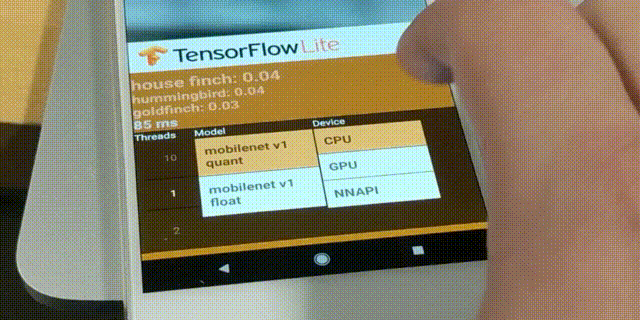
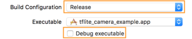
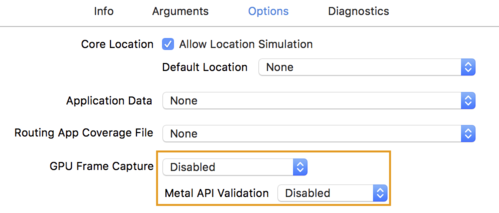
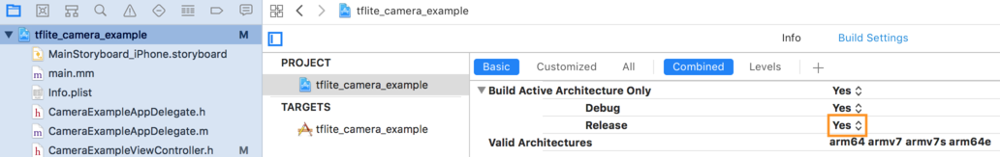

# TensorFlow Lite GPU delegate

[TensorFlow Lite](https://www.tensorflow.org/lite) supports several hardware
accelerators. This document describes how to preview the experimental GPU backend using the
TensorFlow Lite delegate APIs on Android and iOS.

GPUs are designed to have high throughput for massively parallelizable
workloads. Thus, they are well-suited for deep neural nets, which consist of a
huge number of operators, each working on some input tensor(s) that can be
easily divided into smaller workloads and carried out in parallel, typically
resulting in lower latency. In the best scenario, inference on the GPU may now
run fast enough for previously not available real-time applications.

Unlike CPUs, GPUs compute with 16-bit or 32-bit floating point numbers and do
not require quantization for optimal performance.

Another benefit with GPU inference is its power efficiency. GPUs carry out the
computations in a very efficient and optimized manner, so that they consume less
power and generate less heat than when the same task is run on CPUs.

## Demo App Tutorials

The easiest way to try out the experimental GPU delegate is to follow the below tutorials, which go through building our classification demo applications with GPU support. The GPU code is only binary for now; it will be open-sourced soon. Once you understand how to get our demos working, you can try this out on your own custom models.

### Android (with Android Studio)

For a step-by-step tutorial, watch the
[Experimental GPU Delegate for Android](https://youtu.be/Xkhgre8r5G0) video.

Note: This requires OpenGL ES 3.1 or higher.

#### Step 1. Clone the TensorFlow source code and open it in Android Studio

```
git clone https://github.com/tensorflow/tensorflow
```

#### Step 2. Edit `app/build.gradle` to use the nightly GPU AAR

Add the `tensorflow-lite-gpu` package alongside the existing `tensorflow-lite`
package in the existing `dependencies` block.

```
dependencies {
    ...
    implementation 'org.tensorflow:tensorflow-lite:0.0.0-nightly'
    implementation 'org.tensorflow:tensorflow-lite-gpu:0.0.0-nightly'
}
```

#### Step 3. Build and run

Run → Run ‘app’.  When you run the application you will see a button for
enabling the GPU. Change from quantized to a float model and then click GPU to
run on the GPU.



### iOS (with XCode)

For a step-by-step tutorial, watch the
[Experimental GPU Delegate for iOS](https://youtu.be/a5H4Zwjp49c) video.

Note: This requires XCode v10.1 or later.

#### Step 1. Get the demo source code and make sure it compiles.

Follow our iOS Demo App [tutorial](https://www.tensorflow.org/lite/demo_ios).
This will get you to a point where the unmodified iOS camera demo is working
on your phone.


#### Step 2. Modify the Podfile to use the TensorFlow Lite GPU CocoaPod

We have built a binary CocoaPod that includes the GPU delegate. To switch the
project to use it, modify the
`tensorflow/tensorflow/lite/examples/ios/camera/Podfile` file to use
the `TensorFlowLiteGpuExperimental` pod instead of `TensorFlowLite`.

```
target 'YourProjectName'
  # pod 'TensorFlowLite', '1.12.0'
  pod 'TensorFlowLiteGpuExperimental'
```

#### Step 3. Enable the GPU Delegate

To enable the code that will use the GPU delegate, you will need to change
`TFLITE_USE_GPU_DELEGATE` from 0 to 1 in `CameraExampleViewController.h`.

```c
#define TFLITE_USE_GPU_DELEGATE 1
```

#### Step 4. Build and run the demo app

After following the previous step, you should be able to run the app.


#### Step 5. Release mode.

While in Step 4 you ran in debug mode, to get better performance, you should
change to a release build with the appropriate optimal Metal settings. In
particular, To edit these settings go to the `Product > Scheme > Edit
Scheme...`. Select `Run`. On the `Info` tab, change `Build Configuration`, from
`Debug` to `Release`, uncheck `Debug executable`.



Then
click the `Options` tab and change `GPU Frame Capture` to `Disabled` and
`Metal API Validation` to `Disabled`.



Lastly make sure Release only builds on 64-bit architecture. Under `Project
navigator -> tflite_camera_example -> PROJECT -> tflite_camera_example -> Build
Settings` set `Build Active Architecture Only > Release` to Yes.



## Trying the GPU Delegate on your own model

### Android

Look at the demo to see how to add the delegate. In your application, add the
AAR as above, import `org.tensorflow.lite.gpu.GpuDelegate` module, and use
the`addDelegate` function to register the GPU delegate to the interpreter:

```java
import org.tensorflow.lite.Interpreter;
import org.tensorflow.lite.gpu.GpuDelegate;

// Initialize interpreter with GPU delegate
GpuDelegate delegate = new GpuDelegate();
Interpreter.Options options = (new Interpreter.Options()).addDelegate(delegate);
Interpreter interpreter = new Interpreter(model, options);

// Run inference
while (true) {
  writeToInput(input);
  interpreter.run(input, output);
  readFromOutput(output);
}

// Clean up
delegate.close();
```

### iOS

In your application code, include the GPU delegate header and call the
`Interpreter::ModifyGraphWithDelegate` function to register the GPU delegate to
the interpreter:

```cpp
#import "tensorflow/lite/delegates/gpu/metal_delegate.h"

// Initialize interpreter with GPU delegate
std::unique_ptr<Interpreter> interpreter;
InterpreterBuilder(*model, resolver)(&interpreter);
auto* delegate = NewGpuDelegate(nullptr);  // default config
if (interpreter->ModifyGraphWithDelegate(delegate) != kTfLiteOk) return false;

// Run inference
while (true) {
  WriteToInputTensor(interpreter->typed_input_tensor<float>(0));
  if (interpreter->Invoke() != kTfLiteOk) return false;
  ReadFromOutputTensor(interpreter->typed_output_tensor<float>(0));
}

// Clean up
interpreter = nullptr;
DeleteGpuDelegate(delegate);
```

## Supported Models and Ops

With the release of the GPU delegate, we included a handful of models that can
be run on the backend:

* [MobileNet v1 (224x224) image classification](https://ai.googleblog.com/2017/06/mobilenets-open-source-models-for.html) [[download]](https://storage.googleapis.com/download.tensorflow.org/models/tflite/gpu/mobilenet_v1_1.0_224.tflite)
<br /><i>(image classification model designed for mobile and embedded based vision applications)</i>
* [DeepLab segmentation (257x257)](https://ai.googleblog.com/2018/03/semantic-image-segmentation-with.html) [[download]](https://storage.googleapis.com/download.tensorflow.org/models/tflite/gpu/deeplabv3_257_mv_gpu.tflite)
<br /><i>(image segmentation model that assigns semantic labels (e.g., dog, cat, car) to every pixel in the input image)</i>
* [MobileNet SSD object detection](https://ai.googleblog.com/2018/07/accelerated-training-and-inference-with.html) [[download]](https://storage.googleapis.com/download.tensorflow.org/models/tflite/gpu/mobile_ssd_v2_float_coco.tflite)
<br /><i>(image classification model that detects multiple objects with bounding boxes)</i>
* [PoseNet for pose estimation](https://github.com/tensorflow/tfjs-models/tree/master/posenet) [[download]](https://storage.googleapis.com/download.tensorflow.org/models/tflite/gpu/multi_person_mobilenet_v1_075_float.tflite)
<br /><i>(vision model that estimates the poses of a person(s) in image or video)</i>

To see a full list of supported ops, please see the [advanced documentation](gpu_advanced.md).

## Non-supported models and ops

If some of the ops are not supported by the GPU delegate, the framework will
only run a part of the graph on the GPU and the remaining part on the CPU.  Due
to the high cost of CPU/GPU synchronization, a split execution mode like this
will often result in a performance slower than when the whole network is run on
the CPU alone.  In this case, the user will get a warning like:

```
WARNING: op code #42 cannot be handled by this delegate.
```

We did not provide a callback for this failure, as this is not a true run-time
failure, but something that the developer can observe while trying to get the
network to run on the delegate.

## Tips for optimization

Some operations that are trivial on the CPU may have a high cost for the GPU.
One class of such operation is various forms of reshape operations, including
`BATCH_TO_SPACE`, `SPACE_TO_BATCH`, `SPACE_TO_DEPTH`, and so forth. If those ops
are inserted into the network just for the network architect's logical thinking,
it is worth removing them for performance.

On GPU, tensor data is sliced into 4-channels. Thus, a computation on a tensor
of shape `[B,H,W,5]` will perform about the same on a tensor of shape
`[B,H,W,8]` but significantly worse than `[B,H,W,4]`.

In that sense, if the camera hardware supports image frames in RGBA, feeding
that 4-channel input is significantly faster as a memory copy (from 3-channel
RGB to 4-channel RGBX) can be avoided.

For best performance, do not hesitate to retrain your classifier with a mobile-
optimized network architecture. That is a significant part of optimization for
on-device inference.
