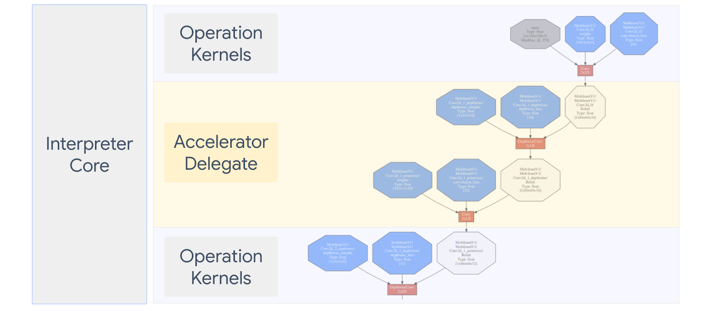
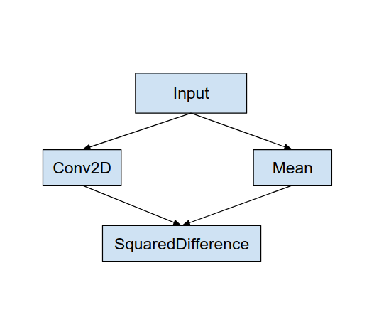
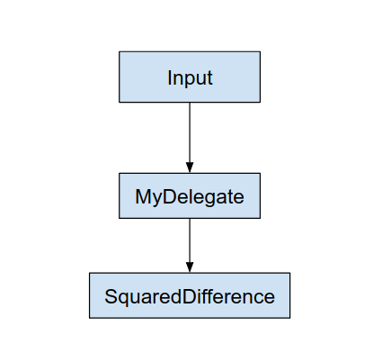

# Implementing a Custom Delegate

<aside class="warning">
  <p><b>Warning:</b> The
  <a href="https://www.tensorflow.org/lite/android/delegates/nnapi">
  NNAPI</a> and <a href="https://www.tensorflow.org/lite/android/delegates/hexagon">
  Hexagon</a> delegates are deprecated and no longer supported by TensorFlow
  Lite. For more information, see the
  <a href="https://developer.android.com/ndk/guides/neuralnetworks/migration-guide">
  NNAPI Migration Guide</a> and
  <a href="https://www.tensorflow.org/lite/performance/delegates">TF Lite
  delegates documentation</a>.</p>
</aside>

[TOC]

## What is a TensorFlow Lite Delegate?

A TensorFlow Lite
[Delegate](https://www.tensorflow.org/lite/performance/delegates) allows you to
run your models (part or whole) on another executor. This mechanism can leverage
a variety of on-device accelerators such as the GPU or Edge TPU (Tensor
Processing Unit) for inference. This provides developers a flexible and
decoupled method from the default TFLite to speed up inference.

Diagram below summarizes the delegates, more details in the below sections.



## When should I create a Custom delegate?

TensorFlow Lite has a wide variety of delegates for target accelerators such as
GPU, DSP, EdgeTPU and frameworks like Android NNAPI.

Creating your own delegate is useful in the following scenarios:

*   You want to integrate a new ML inference engine not supported by any
    existing delegate.
*   You have a custom hardware accelerator that improves runtime for known
    scenarios.
*   You are developing CPU optimizations (such as operator fusing) that can
    speed up certain models.

## How do delegates work?

Consider a simple model graph such as the following, and a delegate “MyDelegate”
that has a faster implementation for Conv2D and Mean operations.



After applying this “MyDelegate”, the original TensorFlow Lite graph will be
updated like the following:



The graph above is obtained as TensorFlow Lite splits the original graph
following two rules:

*   Specific operations that could be handled by the delegate are put into a
    partition while still satisfying the original computing workflow
    dependencies among operations.
*   Each to-be-delegated partition only has input and output nodes that are not
    handled by the delegate.

Each partition that is handled by a delegate is replaced by a delegate node (can
also be called as a delegate kernel) in the original graph that evaluates the
partition on its invoke call.

Depending on the model, the final graph can end up with one or more nodes, the
latter meaning that some ops are not supported by the delegate. In general, you
don’t want to have multiple partitions handled by the delegate, because each
time you switch from delegate to the main graph, there is an overhead for
passing the results from the delegated subgraph to the main graph that results
due to memory copies (for example, GPU to CPU). Such overhead might offset
performance gains especially when there are a large amount of memory copies.

## Implementing your own Custom delegate

The preferred method to add a delegate is using
[SimpleDelegate API](https://github.com/tensorflow/tensorflow/blob/master/tensorflow/lite/delegates/utils/simple_delegate.h).

To create a new delegate, you need to implement 2 interfaces and provide your
own implementation for the interface methods.

### 1 - `SimpleDelegateInterface`

This class represents the capabilities of the delegate, which operations are
supported, and a factory class for creating a kernel which encapsulates the
delegated graph. For more details, see the interface defined in this
[C++ header file](https://github.com/tensorflow/tensorflow/blob/8a643858ce174b8bd1b4bb8fa4bfaa62f7e8c45f/tensorflow/lite/delegates/utils/simple_delegate.h#L71).
The comments in the code explain each API in detail.

### 2 - `SimpleDelegateKernelInterface`

This class encapsulates the logic for initializing / preparing / and running the
delegated partition.

It has: (See
[definition](https://github.com/tensorflow/tensorflow/blob/8a643858ce174b8bd1b4bb8fa4bfaa62f7e8c45f/tensorflow/lite/delegates/utils/simple_delegate.h#L43))

*   Init(...): which will be called once to do any one-time initialization.
*   Prepare(...): called for each different instance of this node - this happens
    if you have multiple delegated partitions. Usually you want to do memory
    allocations here, since this will be called everytime tensors are resized.
*   Invoke(...): which will be called for inference.

### Example

In this example, you will create a very simple delegate that can support only 2
types of operations (ADD) and (SUB) with float32 tensors only.

```
// MyDelegate implements the interface of SimpleDelegateInterface.
// This holds the Delegate capabilities.
class MyDelegate : public SimpleDelegateInterface {
 public:
  bool IsNodeSupportedByDelegate(const TfLiteRegistration* registration,
                                 const TfLiteNode* node,
                                 TfLiteContext* context) const override {
    // Only supports Add and Sub ops.
    if (kTfLiteBuiltinAdd != registration->builtin_code &&
        kTfLiteBuiltinSub != registration->builtin_code)
      return false;
    // This delegate only supports float32 types.
    for (int i = 0; i < node->inputs->size; ++i) {
      auto& tensor = context->tensors[node->inputs->data[i]];
      if (tensor.type != kTfLiteFloat32) return false;
    }
    return true;
  }

  TfLiteStatus Initialize(TfLiteContext* context) override { return kTfLiteOk; }

  const char* Name() const override {
    static constexpr char kName[] = "MyDelegate";
    return kName;
  }

  std::unique_ptr<SimpleDelegateKernelInterface> CreateDelegateKernelInterface()
      override {
    return std::make_unique<MyDelegateKernel>();
  }
};
```

Next, create your own delegate kernel by inheriting from the
`SimpleDelegateKernelInterface`

```
// My delegate kernel.
class MyDelegateKernel : public SimpleDelegateKernelInterface {
 public:
  TfLiteStatus Init(TfLiteContext* context,
                    const TfLiteDelegateParams* params) override {
    // Save index to all nodes which are part of this delegate.
    inputs_.resize(params->nodes_to_replace->size);
    outputs_.resize(params->nodes_to_replace->size);
    builtin_code_.resize(params->nodes_to_replace->size);
    for (int i = 0; i < params->nodes_to_replace->size; ++i) {
      const int node_index = params->nodes_to_replace->data[i];
      // Get this node information.
      TfLiteNode* delegated_node = nullptr;
      TfLiteRegistration* delegated_node_registration = nullptr;
      TF_LITE_ENSURE_EQ(
          context,
          context->GetNodeAndRegistration(context, node_index, &delegated_node,
                                          &delegated_node_registration),
          kTfLiteOk);
      inputs_[i].push_back(delegated_node->inputs->data[0]);
      inputs_[i].push_back(delegated_node->inputs->data[1]);
      outputs_[i].push_back(delegated_node->outputs->data[0]);
      builtin_code_[i] = delegated_node_registration->builtin_code;
    }
    return kTfLiteOk;
  }

  TfLiteStatus Prepare(TfLiteContext* context, TfLiteNode* node) override {
    return kTfLiteOk;
  }

  TfLiteStatus Eval(TfLiteContext* context, TfLiteNode* node) override {
    // Evaluate the delegated graph.
    // Here we loop over all the delegated nodes.
    // We know that all the nodes are either ADD or SUB operations and the
    // number of nodes equals ''inputs_.size()'' and inputs[i] is a list of
    // tensor indices for inputs to node ''i'', while outputs_[i] is the list of
    // outputs for node
    // ''i''. Note, that it is intentional we have simple implementation as this
    // is for demonstration.

    for (int i = 0; i < inputs_.size(); ++i) {
      // Get the node input tensors.
      // Add/Sub operation accepts 2 inputs.
      auto& input_tensor_1 = context->tensors[inputs_[i][0]];
      auto& input_tensor_2 = context->tensors[inputs_[i][1]];
      auto& output_tensor = context->tensors[outputs_[i][0]];
      TF_LITE_ENSURE_EQ(
          context,
          ComputeResult(context, builtin_code_[i], &input_tensor_1,
                        &input_tensor_2, &output_tensor),
          kTfLiteOk);
    }
    return kTfLiteOk;
  }

 private:
  // Computes the result of addition of 'input_tensor_1' and 'input_tensor_2'
  // and store the result in 'output_tensor'.
  TfLiteStatus ComputeResult(TfLiteContext* context, int builtin_code,
                             const TfLiteTensor* input_tensor_1,
                             const TfLiteTensor* input_tensor_2,
                             TfLiteTensor* output_tensor) {
    if (NumElements(input_tensor_1) != NumElements(input_tensor_2) ||
        NumElements(input_tensor_1) != NumElements(output_tensor)) {
      return kTfLiteDelegateError;
    }
    // This code assumes no activation, and no broadcasting needed (both inputs
    // have the same size).
    auto* input_1 = GetTensorData<float>(input_tensor_1);
    auto* input_2 = GetTensorData<float>(input_tensor_2);
    auto* output = GetTensorData<float>(output_tensor);
    for (int i = 0; i < NumElements(input_tensor_1); ++i) {
      if (builtin_code == kTfLiteBuiltinAdd)
        output[i] = input_1[i] + input_2[i];
      else
        output[i] = input_1[i] - input_2[i];
    }
    return kTfLiteOk;
  }

  // Holds the indices of the input/output tensors.
  // inputs_[i] is list of all input tensors to node at index 'i'.
  // outputs_[i] is list of all output tensors to node at index 'i'.
  std::vector<std::vector<int>> inputs_, outputs_;
  // Holds the builtin code of the ops.
  // builtin_code_[i] is the type of node at index 'i'
  std::vector<int> builtin_code_;
};


```

## Benchmark and evaluate the new delegate

TFLite has a set of tools that you can quickly test against a TFLite model.

*   [Model Benchmark Tool](https://github.com/tensorflow/tensorflow/tree/f9ef3a8a0b64ad6393785f3259e9a24af09c84ad/tensorflow/lite/tools/benchmark):
    The tool takes a TFLite model, generates random inputs, and then repeatedly
    runs the model for a specified number of runs. It prints aggregated latency
    statistics at the end.
*   [Inference Diff Tool](https://github.com/tensorflow/tensorflow/tree/f9ef3a8a0b64ad6393785f3259e9a24af09c84ad/tensorflow/lite/tools/evaluation/tasks/inference_diff):
    For a given model, the tool generates random Gaussian data and passes it
    through two different TFLite interpreters, one running single threaded CPU
    kernel and the other using a user-defined spec. It measures the absolute
    difference between the output tensors from each interpreter, on a
    per-element basis. This tool can also be helpful for debugging accuracy
    issues.
*   There are also task specific evaluation tools, for image classification and
    object detection. These tools can be found
    [here](https://www.tensorflow.org/lite/performance/delegates#tools_for_evaluation)

In addition, TFLite has a large set of kernel and op unit tests that could be
reused to test the new delegate with more coverage and to ensure the regular
TFLite execution path is not broken.

To achieve reusing TFLite tests and tooling for the new delegate, you can use
either of the following two options:

*   Utilize the
    [delegate registrar](https://github.com/tensorflow/tensorflow/tree/master/tensorflow/lite/tools/delegates)
    mechanism.
*   Utilize the
    [external delegate](https://github.com/tensorflow/tensorflow/tree/master/tensorflow/lite/delegates/external)
    mechanism.

### Choosing the best approach

Both approaches require a few changes as detailed below. However, the first
approach links the delegate statically and requires rebuilding the testing,
benchmarking and evaluation tools. In contrast, the second one makes the
delegate as a shared library and requires you to expose the create/delete
methods from the shared library.

As a result, the external-delegate mechanism will work with TFLite’s
[pre-built Tensorflow Lite tooling binaries](#download-links-for-nightly-pre-built-tflite-tooling-binaries).
But it is less explicit and it might be more complicated to set up in automated
integration tests. Use the delegate registrar approach for better clarity.

### Option 1: Leverage delegate registrar

The
[delegate registrar](https://github.com/tensorflow/tensorflow/tree/master/tensorflow/lite/tools/delegates)
keeps a list of delegate providers, each of which provides an easy way to create
TFLite delegates based on command-line flags, and are hence, convenient for
tooling. To plug in the new delegate to all the Tensorflow Lite tools mentioned
above, you first create a new delegate provider like this
[one](https://github.com/tensorflow/tensorflow/blob/master/tensorflow/lite/tools/delegates/hexagon_delegate_provider.cc),
and then makes only a few changes to the BUILD rules. A full example of this
integration process is shown below (and code can be found
[here](https://github.com/tensorflow/tensorflow/tree/master/tensorflow/lite/delegates/utils/dummy_delegate)).

Assuming you have a delegate that implements the SimpleDelegate APIs, and the
extern "C" APIs of creating/deleting this 'dummy' delegate as shown below:

```
// Returns default options for DummyDelegate.
DummyDelegateOptions TfLiteDummyDelegateOptionsDefault();

// Creates a new delegate instance that need to be destroyed with
// `TfLiteDummyDelegateDelete` when delegate is no longer used by TFLite.
// When `options` is set to `nullptr`, the above default values are used:
TfLiteDelegate* TfLiteDummyDelegateCreate(const DummyDelegateOptions* options);

// Destroys a delegate created with `TfLiteDummyDelegateCreate` call.
void TfLiteDummyDelegateDelete(TfLiteDelegate* delegate);
```

To integrate the “DummyDelegate” with Benchmark Tool and Inference Tool, define
a DelegateProvider like below:

```
class DummyDelegateProvider : public DelegateProvider {
 public:
  DummyDelegateProvider() {
    default_params_.AddParam("use_dummy_delegate",
                             ToolParam::Create<bool>(false));
  }

  std::vector<Flag> CreateFlags(ToolParams* params) const final;

  void LogParams(const ToolParams& params) const final;

  TfLiteDelegatePtr CreateTfLiteDelegate(const ToolParams& params) const final;

  std::string GetName() const final { return "DummyDelegate"; }
};
REGISTER_DELEGATE_PROVIDER(DummyDelegateProvider);

std::vector<Flag> DummyDelegateProvider::CreateFlags(ToolParams* params) const {
  std::vector<Flag> flags = {CreateFlag<bool>("use_dummy_delegate", params,
                                              "use the dummy delegate.")};
  return flags;
}

void DummyDelegateProvider::LogParams(const ToolParams& params) const {
  TFLITE_LOG(INFO) << "Use dummy test delegate : ["
                   << params.Get<bool>("use_dummy_delegate") << "]";
}

TfLiteDelegatePtr DummyDelegateProvider::CreateTfLiteDelegate(
    const ToolParams& params) const {
  if (params.Get<bool>("use_dummy_delegate")) {
    auto default_options = TfLiteDummyDelegateOptionsDefault();
    return TfLiteDummyDelegateCreateUnique(&default_options);
  }
  return TfLiteDelegatePtr(nullptr, [](TfLiteDelegate*) {});
}

```

The BUILD rule definitions are important as you need to make sure that the
library is always linked and not dropped by optimizer.

```
#### The following are for using the dummy test delegate in TFLite tooling ####
cc_library(
    name = "dummy_delegate_provider",
    srcs = ["dummy_delegate_provider.cc"],
    copts = tflite_copts(),
    deps = [
        ":dummy_delegate",
        "//tensorflow/lite/tools/delegates:delegate_provider_hdr",
    ],
    alwayslink = 1, # This is required so the optimizer doesn't optimize the library away.
)
```

Now add these two wrapper rules in your BUILD file to create a version of
Benchmark Tool and Inference Tool, and other evaluation tools, that could run
with your own delegate.

```
cc_binary(
    name = "benchmark_model_plus_dummy_delegate",
    copts = tflite_copts(),
    linkopts = task_linkopts(),
    deps = [
        ":dummy_delegate_provider",
        "//tensorflow/lite/tools/benchmark:benchmark_model_main",
    ],
)

cc_binary(
    name = "inference_diff_plus_dummy_delegate",
    copts = tflite_copts(),
    linkopts = task_linkopts(),
    deps = [
        ":dummy_delegate_provider",
        "//tensorflow/lite/tools/evaluation/tasks:task_executor_main",
        "//tensorflow/lite/tools/evaluation/tasks/inference_diff:run_eval_lib",
    ],
)

cc_binary(
    name = "imagenet_classification_eval_plus_dummy_delegate",
    copts = tflite_copts(),
    linkopts = task_linkopts(),
    deps = [
        ":dummy_delegate_provider",
        "//tensorflow/lite/tools/evaluation/tasks:task_executor_main",
        "//tensorflow/lite/tools/evaluation/tasks/imagenet_image_classification:run_eval_lib",
    ],
)

cc_binary(
    name = "coco_object_detection_eval_plus_dummy_delegate",
    copts = tflite_copts(),
    linkopts = task_linkopts(),
    deps = [
        ":dummy_delegate_provider",
        "//tensorflow/lite/tools/evaluation/tasks:task_executor_main",
        "//tensorflow/lite/tools/evaluation/tasks/coco_object_detection:run_eval_lib",
    ],
)
```

You can also plug in this delegate provider to TFLite kernel tests as described
[here](https://github.com/tensorflow/tensorflow/blob/master/tensorflow/lite/delegates/utils/dummy_delegate/README.md#kernel-tests).

### Option 2: Leverage external delegate

In this alternative, you first create an external delegate adaptor the
[external\_delegate\_adaptor.cc](https://github.com/tensorflow/tensorflow/blob/master/tensorflow/lite/delegates/utils/dummy_delegate/external_delegate_adaptor.cc)
as shown below. Note, this approach is slightly less preferred as compared to
Option 1 as has been [aforementioned](#comparison-between-the-two-options).

```
TfLiteDelegate* CreateDummyDelegateFromOptions(char** options_keys,
                                               char** options_values,
                                               size_t num_options) {
  DummyDelegateOptions options = TfLiteDummyDelegateOptionsDefault();

  // Parse key-values options to DummyDelegateOptions.
  // You can achieve this by mimicking them as command-line flags.
  std::unique_ptr<const char*> argv =
      std::unique_ptr<const char*>(new const char*[num_options + 1]);
  constexpr char kDummyDelegateParsing[] = "dummy_delegate_parsing";
  argv.get()[0] = kDummyDelegateParsing;

  std::vector<std::string> option_args;
  option_args.reserve(num_options);
  for (int i = 0; i < num_options; ++i) {
    option_args.emplace_back("--");
    option_args.rbegin()->append(options_keys[i]);
    option_args.rbegin()->push_back('=');
    option_args.rbegin()->append(options_values[i]);
    argv.get()[i + 1] = option_args.rbegin()->c_str();
  }

  // Define command-line flags.
  // ...
  std::vector<tflite::Flag> flag_list = {
      tflite::Flag::CreateFlag(...),
      ...,
      tflite::Flag::CreateFlag(...),
  };

  int argc = num_options + 1;
  if (!tflite::Flags::Parse(&argc, argv.get(), flag_list)) {
    return nullptr;
  }

  return TfLiteDummyDelegateCreate(&options);
}

#ifdef __cplusplus
extern "C" {
#endif  // __cplusplus

// Defines two symbols that need to be exported to use the TFLite external
// delegate. See tensorflow/lite/delegates/external for details.
TFL_CAPI_EXPORT TfLiteDelegate* tflite_plugin_create_delegate(
    char** options_keys, char** options_values, size_t num_options,
    void (*report_error)(const char*)) {
  return tflite::tools::CreateDummyDelegateFromOptions(
      options_keys, options_values, num_options);
}

TFL_CAPI_EXPORT void tflite_plugin_destroy_delegate(TfLiteDelegate* delegate) {
  TfLiteDummyDelegateDelete(delegate);
}

#ifdef __cplusplus
}
#endif  // __cplusplus
```

Now create the corresponding BUILD target to build a dynamic library as shown
below:

```
cc_binary(
    name = "dummy_external_delegate.so",
    srcs = [
        "external_delegate_adaptor.cc",
    ],
    linkshared = 1,
    linkstatic = 1,
    deps = [
        ":dummy_delegate",
        "//tensorflow/lite/c:common",
        "//tensorflow/lite/tools:command_line_flags",
        "//tensorflow/lite/tools:logging",
    ],
)
```

After this external delegate .so file is created, you can build binaries or use
pre-built ones to run with the new delegate as long as the binary is linked with
the
[external\_delegate\_provider](https://github.com/tensorflow/tensorflow/blob/8c6f2d55762f3fc94f98fdd8b3c5d59ee1276dba/tensorflow/lite/tools/delegates/BUILD#L145-L159)
library which supports command-line flags as described
[here](https://github.com/tensorflow/tensorflow/tree/master/tensorflow/lite/tools/delegates#external-delegate-provider).
Note: this external delegate provider has already been linked to existing
testing and tooling binaries.

Refer to descriptions
[here](https://github.com/tensorflow/tensorflow/blob/master/tensorflow/lite/delegates/utils/dummy_delegate/README.md#option-2-utilize-tensorflow-lite-external-delegate)
for an illustration of how to benchmark the dummy delegate via this
external-delegate approach. You can use similar commands for the testing and
evaluation tools mentioned earlier.

It is worth noting the _external delegate_ is the corresponding C++
implementation of the _delegate_ in Tensorflow Lite Python binding as shown
[here](https://github.com/tensorflow/tensorflow/blob/7145fc0e49be01ef6943f4df386ce38567e37797/tensorflow/lite/python/interpreter.py#L42).
Therefore, the dynamic external delegate adaptor library created here could be
directly used with Tensorflow Lite Python APIs.

## Resources

### Download links for nightly pre-built TFLite tooling binaries

<table>
  <tr>
   <td>OS
   </td>
   <td>ARCH
   </td>
   <td>BINARY_NAME
   </td>
  </tr>
  <tr>
   <td rowspan="3" >Linux
   </td>
   <td>x86_64
   </td>
   <td><ul>

<li><a href="https://storage.googleapis.com/tensorflow-nightly-public/prod/tensorflow/release/lite/tools/nightly/latest/linux_x86-64_benchmark_model">benchmark_model</a>
<li><a href="https://storage.googleapis.com/tensorflow-nightly-public/prod/tensorflow/release/lite/tools/nightly/latest/linux_x86-64_eval_inference_diff">inference_diff</a>
<li><a href="https://storage.googleapis.com/tensorflow-nightly-public/prod/tensorflow/release/lite/tools/nightly/latest/linux_x86-64_eval_imagenet_image_classification">imagenet_image_classification_eval</a>
<li><a href="https://storage.googleapis.com/tensorflow-nightly-public/prod/tensorflow/release/lite/tools/nightly/latest/linux_x86-64_eval_coco_object_detection">coco_object_detection_eval</a></li></ul>

   </td>
  </tr>
  <tr>
   <td>arm
   </td>
   <td><ul>

<li><a href="https://storage.googleapis.com/tensorflow-nightly-public/prod/tensorflow/release/lite/tools/nightly/latest/linux_arm_benchmark_model">benchmark_model</a>
<li><a href="https://storage.googleapis.com/tensorflow-nightly-public/prod/tensorflow/release/lite/tools/nightly/latest/linux_arm_eval_inference_diff">inference_diff</a>
<li><a href="https://storage.googleapis.com/tensorflow-nightly-public/prod/tensorflow/release/lite/tools/nightly/latest/linux_arm_eval_imagenet_image_classification">imagenet_image_classification_eval</a>
<li><a href="https://storage.googleapis.com/tensorflow-nightly-public/prod/tensorflow/release/lite/tools/nightly/latest/linux_arm_eval_coco_object_detection">coco_object_detection_eval</a></li></ul>

   </td>
  </tr>
  <tr>
   <td>aarch64
   </td>
   <td><ul>

<li><a href="https://storage.googleapis.com/tensorflow-nightly-public/prod/tensorflow/release/lite/tools/nightly/latest/linux_aarch64_benchmark_model">benchmark_model</a>
<li><a href="https://storage.googleapis.com/tensorflow-nightly-public/prod/tensorflow/release/lite/tools/nightly/latest/linux_aarch64_eval_inference_diff">inference_diff</a>
<li><a href="https://storage.googleapis.com/tensorflow-nightly-public/prod/tensorflow/release/lite/tools/nightly/latest/linux_aarch64_eval_imagenet_image_classification">imagenet_image_classification_eval</a>
<li><a href="https://storage.googleapis.com/tensorflow-nightly-public/prod/tensorflow/release/lite/tools/nightly/latest/linux_aarch64_eval_coco_object_detection">coco_object_detection_eval</a></li></ul>

   </td>
  </tr>
  <tr>
   <td rowspan="2" >Android
   </td>
   <td>arm
   </td>
   <td><ul>

<li><a href="http://storage.googleapis.com/tensorflow-nightly-public/prod/tensorflow/release/lite/tools/nightly/latest/android_arm_benchmark_model">benchmark_model</a>
<li><strong><a href="https://storage.googleapis.com/tensorflow-nightly-public/prod/tensorflow/release/lite/tools/nightly/latest/android_arm_benchmark_model.apk">benchmark_model.apk</a></strong>
<li><a href="https://storage.googleapis.com/tensorflow-nightly-public/prod/tensorflow/release/lite/tools/nightly/latest/android_arm_eval_inference_diff">inference_diff</a>
<li><a href="https://storage.googleapis.com/tensorflow-nightly-public/prod/tensorflow/release/lite/tools/nightly/latest/android_arm_eval_imagenet_image_classification">imagenet_image_classification_eval</a>
<li><a href="https://storage.googleapis.com/tensorflow-nightly-public/prod/tensorflow/release/lite/tools/nightly/latest/android_arm_eval_coco_object_detection">coco_object_detection_eval</a></li></ul>

   </td>
  </tr>
  <tr>
   <td>aarch64
   </td>
   <td><ul>

<li><a href="http://storage.googleapis.com/tensorflow-nightly-public/prod/tensorflow/release/lite/tools/nightly/latest/android_aarch64_benchmark_model">benchmark_model</a>
<li><strong><a href="https://storage.googleapis.com/tensorflow-nightly-public/prod/tensorflow/release/lite/tools/nightly/latest/android_aarch64_benchmark_model.apk">benchmark_model.apk</a></strong>
<li><a href="https://storage.googleapis.com/tensorflow-nightly-public/prod/tensorflow/release/lite/tools/nightly/latest/android_aarch64_eval_inference_diff">inference_diff</a>
<li><a href="https://storage.googleapis.com/tensorflow-nightly-public/prod/tensorflow/release/lite/tools/nightly/latest/android_aarch64_eval_imagenet_image_classification">imagenet_image_classification_eval</a>
<li><a href="https://storage.googleapis.com/tensorflow-nightly-public/prod/tensorflow/release/lite/tools/nightly/latest/android_aarch64_eval_coco_object_detection">coco_object_detection_eval</a></li></ul>

   </td>
  </tr>
</table>
