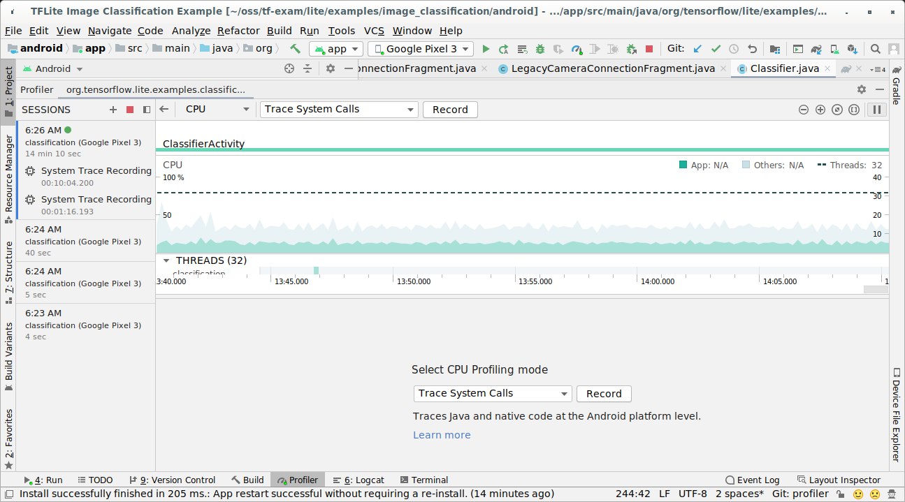
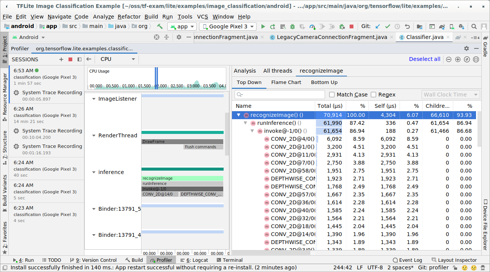
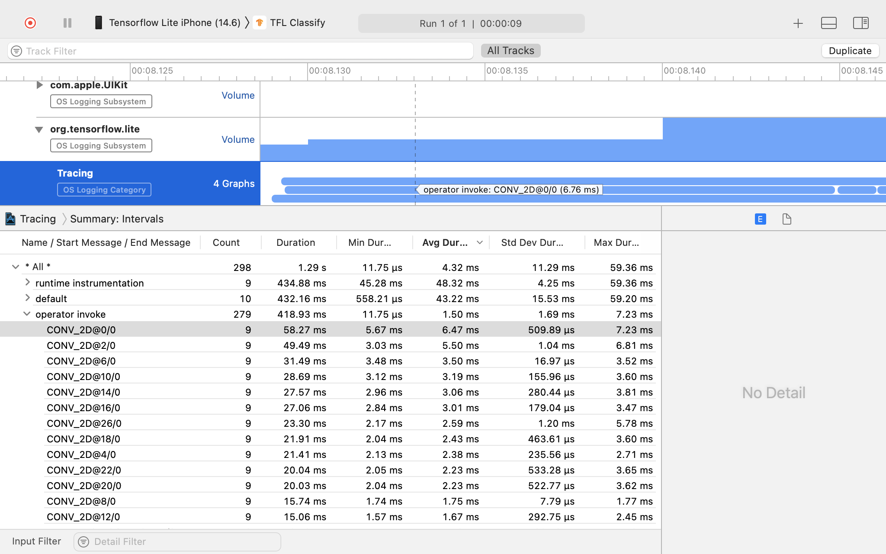

# Performance measurement

## Benchmark tools

TensorFlow Lite benchmark tools currently measure and calculate statistics for
the following important performance metrics:

*   Initialization time
*   Inference time of warmup state
*   Inference time of steady state
*   Memory usage during initialization time
*   Overall memory usage

The benchmark tools are available as benchmark apps for Android and iOS and as
native command-line binaries, and they all share the same core performance
measurement logic. Note that the available options and output formats are
slightly different due to the differences in runtime environment.

### Android benchmark app

There are two options of using the benchmark tool with Android. One is a
[native benchmark binary](#native-benchmark-binary) and another is an Android
benchmark app, a better gauge of how the model would perform in the app. Either
way, the numbers from the benchmark tool will still differ slightly from when
running inference with the model in the actual app.

This Android benchmark app has no UI. Install and run it by using the `adb`
command and retrieve results by using the `adb logcat` command.

#### Download or build the app

Download the nightly pre-built Android benchmark apps using the links below:

*   [android_aarch64](https://storage.googleapis.com/tensorflow-nightly-public/prod/tensorflow/release/lite/tools/nightly/latest/android_aarch64_benchmark_model.apk)
*   [android_arm](https://storage.googleapis.com/tensorflow-nightly-public/prod/tensorflow/release/lite/tools/nightly/latest/android_arm_benchmark_model.apk)

As for Android benchmark apps that support [TF ops](https://www.tensorflow.org/lite/guide/ops_select)
via [Flex delegate](https://github.com/tensorflow/tensorflow/tree/master/tensorflow/lite/delegates/flex),
use the links below:

*   [android_aarch64](https://storage.googleapis.com/tensorflow-nightly-public/prod/tensorflow/release/lite/tools/nightly/latest/android_aarch64_benchmark_model_plus_flex.apk)
*   [android_arm](https://storage.googleapis.com/tensorflow-nightly-public/prod/tensorflow/release/lite/tools/nightly/latest/android_arm_benchmark_model_plus_flex.apk)


You can also build the app from source by following these
[instructions](https://github.com/tensorflow/tensorflow/tree/master/tensorflow/lite/tools/benchmark/android).

Note: It is required to build the app from the source if you want to run the
Android benchmark apk on x86 CPU or Hexagon delegate or if your model contains
[select TF operators](../guide/ops_select) or
[custom operators](../guide/ops_custom).

#### Prepare benchmark

Before running the benchmark app, install the app and push the model file to the
device as follows:

```shell
adb install -r -d -g android_aarch64_benchmark_model.apk
adb push your_model.tflite /data/local/tmp
```

#### Run benchmark

```shell
adb shell am start -S \
  -n org.tensorflow.lite.benchmark/.BenchmarkModelActivity \
  --es args '"--graph=/data/local/tmp/your_model.tflite \
              --num_threads=4"'
```

`graph` is a required parameter.

*   `graph`: `string` \
    The path to the TFLite model file.

You can specify more optional parameters for running the benchmark.

*   `num_threads`: `int` (default=1) \
    The number of threads to use for running TFLite interpreter.
*   `use_gpu`: `bool` (default=false) \
    Use [GPU delegate](gpu).
*   `use_nnapi`: `bool` (default=false) \
    Use [NNAPI delegate](nnapi).
*   `use_xnnpack`: `bool` (default=`false`) \
    Use
    [XNNPACK delegate](https://github.com/tensorflow/tensorflow/tree/master/tensorflow/lite/delegates/xnnpack).
*   `use_hexagon`: `bool` (default=`false`) \
    Use [Hexagon delegate](hexagon_delegate).

Depending on the device you are using, some of these options may not be
available or have no effect. Refer to
[parameters](https://github.com/tensorflow/tensorflow/tree/master/tensorflow/lite/tools/benchmark#parameters)
for more performance parameters that you could run with the benchmark app.

View the results using the `logcat` command:

```shell
adb logcat | grep "Inference timings"
```

The benchmark results are reported as:

```
... tflite  : Inference timings in us: Init: 5685, First inference: 18535, Warmup (avg): 14462.3, Inference (avg): 14575.2
```

### Native benchmark binary

Benchmark tool is also provided as a native binary `benchmark_model`. You can
execute this tool from a shell command line on Linux, Mac, embedded devices and
Android devices.

#### Download or build the binary

Download the nightly pre-built native command-line binaries by following the
links below:

*   [linux_x86-64](https://storage.googleapis.com/tensorflow-nightly-public/prod/tensorflow/release/lite/tools/nightly/latest/linux_x86-64_benchmark_model)
*   [linux_aarch64](https://storage.googleapis.com/tensorflow-nightly-public/prod/tensorflow/release/lite/tools/nightly/latest/linux_aarch64_benchmark_model)
*   [linux_arm](https://storage.googleapis.com/tensorflow-nightly-public/prod/tensorflow/release/lite/tools/nightly/latest/linux_arm_benchmark_model)
*   [android_aarch64](https://storage.googleapis.com/tensorflow-nightly-public/prod/tensorflow/release/lite/tools/nightly/latest/android_aarch64_benchmark_model)
*   [android_arm](https://storage.googleapis.com/tensorflow-nightly-public/prod/tensorflow/release/lite/tools/nightly/latest/android_arm_benchmark_model)

As for nightly pre-built binaries that support [TF ops](https://www.tensorflow.org/lite/guide/ops_select)
via [Flex delegate](https://github.com/tensorflow/tensorflow/tree/master/tensorflow/lite/delegates/flex),
use the links below:

*   [linux_x86-64](https://storage.googleapis.com/tensorflow-nightly-public/prod/tensorflow/release/lite/tools/nightly/latest/linux_x86-64_benchmark_model_plus_flex)
*   [linux_aarch64](https://storage.googleapis.com/tensorflow-nightly-public/prod/tensorflow/release/lite/tools/nightly/latest/linux_aarch64_benchmark_model_plus_flex)
*   [linux_arm](https://storage.googleapis.com/tensorflow-nightly-public/prod/tensorflow/release/lite/tools/nightly/latest/linux_arm_benchmark_model_plus_flex)
*   [android_aarch64](https://storage.googleapis.com/tensorflow-nightly-public/prod/tensorflow/release/lite/tools/nightly/latest/android_aarch64_benchmark_model_plus_flex)
*   [android_arm](https://storage.googleapis.com/tensorflow-nightly-public/prod/tensorflow/release/lite/tools/nightly/latest/android_arm_benchmark_model_plus_flex)

To benchmark with [TensorFlow Lite Hexagon delegate](https://www.tensorflow.org/lite/android/delegates/hexagon),
we have also pre-built the required `libhexagon_interface.so` files (see [here](https://github.com/tensorflow/tensorflow/blob/master/tensorflow/lite/delegates/hexagon/README.md)
for details about this file). After downloading the file of the corresponding
platform from the links below, please rename the file to `libhexagon_interface.so`.

*   [android_aarch64](https://storage.googleapis.com/tensorflow-nightly-public/prod/tensorflow/release/lite/tools/nightly/latest/android_aarch64_libhexagon_interface.so)
*   [android_arm](https://storage.googleapis.com/tensorflow-nightly-public/prod/tensorflow/release/lite/tools/nightly/latest/android_arm_libhexagon_interface.so)

You can also build the native benchmark binary from
[source](https://github.com/tensorflow/tensorflow/tree/master/tensorflow/lite/tools/benchmark)
on your computer.

```shell
bazel build -c opt //tensorflow/lite/tools/benchmark:benchmark_model
```

To build with Android NDK toolchain, you need to set up the build environment
first by following this
[guide](../android/lite_build#set_up_build_environment_without_docker), or use
the docker image as described in this
[guide](../android/lite_build#set_up_build_environment_using_docker).

```shell
bazel build -c opt --config=android_arm64 \
  //tensorflow/lite/tools/benchmark:benchmark_model
```

Note: It is a valid approach to push and execute binaries directly on an Android
device for benchmarking, but it can result in subtle (but observable)
differences in performance relative to execution within an actual Android app.
In particular, Android's scheduler tailors behavior based on thread and process
priorities, which differ between a foreground Activity/Application and a regular
background binary executed via `adb shell ...`. This tailored behavior is most
evident when enabling multi-threaded CPU execution with TensorFlow Lite.
Therefore, the Android benchmark app is preferred for performance measurement.

#### Run benchmark

To run benchmarks on your computer, execute the binary from the shell.

```shell
path/to/downloaded_or_built/benchmark_model \
  --graph=your_model.tflite \
  --num_threads=4
```

You can use the same set of
[parameters](https://github.com/tensorflow/tensorflow/tree/master/tensorflow/lite/tools/benchmark#parameters)
as mentioned above with the native command-line binary.

#### Profiling model ops

The benchmark model binary also allows you to profile model ops and get the
execution times of each operator. To do this, pass the flag
`--enable_op_profiling=true` to `benchmark_model` during invocation. Details are
explained
[here](https://github.com/tensorflow/tensorflow/tree/master/tensorflow/lite/tools/benchmark#profiling-model-operators).

### Native benchmark binary for multiple performance options in a single run

A convenient and simple C++ binary is also provided to
[benchmark multiple performance options](https://github.com/tensorflow/tensorflow/tree/master/tensorflow/lite/tools/benchmark#benchmark-multiple-performance-options-in-a-single-run)
in a single run. This binary is built based on the aforementioned benchmark tool
that could only benchmark a single performance option at a time. They share the
same build/install/run process, but the BUILD target name of this binary is
`benchmark_model_performance_options` and it takes some additional parameters.
An important parameter for this binary is:

`perf_options_list`: `string` (default='all') \
A comma-separated list of TFLite performance options to benchmark.

You can get nightly pre-built binaries for this tool as listed below:

*   [linux_x86-64](https://storage.googleapis.com/tensorflow-nightly-public/prod/tensorflow/release/lite/tools/nightly/latest/linux_x86-64_benchmark_model_performance_options)
*   [linux_aarch64](https://storage.googleapis.com/tensorflow-nightly-public/prod/tensorflow/release/lite/tools/nightly/latest/linux_aarch64_benchmark_model_performance_options)
*   [linux_arm](https://storage.googleapis.com/tensorflow-nightly-public/prod/tensorflow/release/lite/tools/nightly/latest/linux_arm_benchmark_model_performance_options)
*   [android_aarch64](https://storage.googleapis.com/tensorflow-nightly-public/prod/tensorflow/release/lite/tools/nightly/latest/android_aarch64_benchmark_model_performance_options)
*   [android_arm](https://storage.googleapis.com/tensorflow-nightly-public/prod/tensorflow/release/lite/tools/nightly/latest/android_arm_benchmark_model_performance_options)

### iOS benchmark app

To run benchmarks on iOS device, you need to build the app from
[source](https://github.com/tensorflow/tensorflow/tree/master/tensorflow/lite/tools/benchmark/ios).
Put the TensorFlow Lite model file in the
[benchmark_data](https://github.com/tensorflow/tensorflow/tree/master/tensorflow/lite/tools/benchmark/ios/TFLiteBenchmark/TFLiteBenchmark/benchmark_data)
directory of the source tree and modify the `benchmark_params.json` file. Those
files are packaged into the app and the app reads data from the directory. Visit
the
[iOS benchmark app](https://github.com/tensorflow/tensorflow/tree/master/tensorflow/lite/tools/benchmark/ios)
for detailed instructions.

## Performance benchmarks for well known models

This section lists TensorFlow Lite performance benchmarks when running well
known models on some Android and iOS devices.

### Android performance benchmarks

These performance benchmark numbers were generated with the
[native benchmark binary](https://github.com/tensorflow/tensorflow/tree/master/tensorflow/lite/tools/benchmark).

For Android benchmarks, the CPU affinity is set to use big cores on the device
to reduce variance (see
[details](https://github.com/tensorflow/tensorflow/tree/master/tensorflow/lite/tools/benchmark#reducing-variance-between-runs-on-android)).

It assumes that models were downloaded and unzipped to the
`/data/local/tmp/tflite_models` directory. The benchmark binary is built using
[these instructions](https://github.com/tensorflow/tensorflow/tree/master/tensorflow/lite/tools/benchmark#on-android)
and assumed to be in the `/data/local/tmp` directory.

To run the benchmark:

```sh
adb shell /data/local/tmp/benchmark_model \
  --num_threads=4 \
  --graph=/data/local/tmp/tflite_models/${GRAPH} \
  --warmup_runs=1 \
  --num_runs=50
```

To run with nnapi delegate, set `--use_nnapi=true`. To run with GPU delegate,
set `--use_gpu=true`.

The performance values below are measured on Android 10.

<table>
  <thead>
    <tr>
      <th>Model Name</th>
      <th>Device </th>
      <th>CPU, 4 threads</th>
      <th>GPU</th>
      <th>NNAPI</th>
    </tr>
  </thead>
  <tr>
    <td rowspan = 2>
      <a href="https://storage.googleapis.com/download.tensorflow.org/models/mobilenet_v1_2018_08_02/mobilenet_v1_1.0_224.tgz">Mobilenet_1.0_224(float)</a>
    </td>
    <td>Pixel 3 </td>
    <td>23.9 ms</td>
    <td>6.45 ms</td>
    <td>13.8 ms</td>
  </tr>
   <tr>
     <td>Pixel 4 </td>
    <td>14.0 ms</td>
    <td>9.0 ms</td>
    <td>14.8 ms</td>
  </tr>
  <tr>
    <td rowspan = 2>
      <a href="https://storage.googleapis.com/download.tensorflow.org/models/mobilenet_v1_2018_08_02/mobilenet_v1_1.0_224_quant.tgz">Mobilenet_1.0_224 (quant)</a>
    </td>
    <td>Pixel 3 </td>
    <td>13.4 ms</td>
    <td>--- </td>
    <td>6.0 ms</td>
  </tr>
   <tr>
     <td>Pixel 4 </td>
    <td>5.0 ms</td>
    <td>--- </td>
    <td>3.2 ms</td>
  </tr>
  <tr>
    <td rowspan = 2>
      <a href="https://storage.googleapis.com/download.tensorflow.org/models/tflite/model_zoo/upload_20180427/nasnet_mobile_2018_04_27.tgz">NASNet mobile</a>
    </td>
    <td>Pixel 3 </td>
    <td>56 ms</td>
    <td>--- </td>
    <td>102 ms</td>
  </tr>
   <tr>
     <td>Pixel 4 </td>
    <td>34.5 ms</td>
    <td>--- </td>
    <td>99.0 ms</td>
  </tr>
  <tr>
    <td rowspan = 2>
      <a href="https://storage.googleapis.com/download.tensorflow.org/models/tflite/model_zoo/upload_20180427/squeezenet_2018_04_27.tgz">SqueezeNet</a>
    </td>
    <td>Pixel 3 </td>
    <td>35.8 ms</td>
    <td>9.5 ms </td>
    <td>18.5 ms</td>
  </tr>
   <tr>
     <td>Pixel 4 </td>
    <td>23.9 ms</td>
    <td>11.1 ms</td>
    <td>19.0 ms</td>
  </tr>
  <tr>
    <td rowspan = 2>
      <a href="https://storage.googleapis.com/download.tensorflow.org/models/tflite/model_zoo/upload_20180427/inception_resnet_v2_2018_04_27.tgz">Inception_ResNet_V2</a>
    </td>
    <td>Pixel 3 </td>
    <td>422 ms</td>
    <td>99.8 ms </td>
    <td>201 ms</td>
  </tr>
   <tr>
     <td>Pixel 4 </td>
    <td>272.6 ms</td>
    <td>87.2 ms</td>
    <td>171.1 ms</td>
  </tr>
  <tr>
    <td rowspan = 2>
      <a href="https://storage.googleapis.com/download.tensorflow.org/models/tflite/model_zoo/upload_20180427/inception_v4_2018_04_27.tgz">Inception_V4</a>
    </td>
    <td>Pixel 3 </td>
    <td>486 ms</td>
    <td>93 ms </td>
    <td>292 ms</td>
  </tr>
   <tr>
     <td>Pixel 4 </td>
    <td>324.1 ms</td>
    <td>97.6 ms</td>
    <td>186.9 ms</td>
  </tr>

 </table>

### iOS performance benchmarks

These performance benchmark numbers were generated with the
[iOS benchmark app](https://github.com/tensorflow/tensorflow/tree/master/tensorflow/lite/tools/benchmark/ios).

To run iOS benchmarks, the benchmark app was modified to include the appropriate
model and `benchmark_params.json` was modified to set `num_threads` to 2. To use
the GPU delegate, `"use_gpu" : "1"` and `"gpu_wait_type" : "aggressive"` options
were also added to `benchmark_params.json`.

<table>
  <thead>
    <tr>
      <th>Model Name</th>
      <th>Device </th>
      <th>CPU, 2 threads</th>
      <th>GPU</th>
    </tr>
  </thead>
  <tr>
    <td>
      <a href="https://storage.googleapis.com/download.tensorflow.org/models/mobilenet_v1_2018_08_02/mobilenet_v1_1.0_224.tgz">Mobilenet_1.0_224(float)</a>
    </td>
    <td>iPhone XS </td>
    <td>14.8 ms</td>
    <td>3.4 ms</td>
  </tr>
  <tr>
    <td>
      <a href="https://storage.googleapis.com/download.tensorflow.org/models/mobilenet_v1_2018_08_02/mobilenet_v1_1.0_224_quant.tgz)">Mobilenet_1.0_224 (quant)</a>
    </td>
    <td>iPhone XS </td>
    <td>11 ms</td>
    <td>---</td>
  </tr>
  <tr>
    <td>
      <a href="https://storage.googleapis.com/download.tensorflow.org/models/tflite/model_zoo/upload_20180427/nasnet_mobile_2018_04_27.tgz">NASNet mobile</a>
    </td>
    <td>iPhone XS </td>
    <td>30.4 ms</td>
    <td>---</td>
  </tr>
  <tr>
    <td>
      <a href="https://storage.googleapis.com/download.tensorflow.org/models/tflite/model_zoo/upload_20180427/squeezenet_2018_04_27.tgz">SqueezeNet</a>
    </td>
    <td>iPhone XS </td>
    <td>21.1 ms</td>
    <td>15.5 ms</td>
  </tr>
  <tr>
    <td>
      <a href="https://storage.googleapis.com/download.tensorflow.org/models/tflite/model_zoo/upload_20180427/inception_resnet_v2_2018_04_27.tgz">Inception_ResNet_V2</a>
    </td>
    <td>iPhone XS </td>
    <td>261.1 ms</td>
    <td>45.7 ms</td>
  </tr>
  <tr>
    <td>
      <a href="https://storage.googleapis.com/download.tensorflow.org/models/tflite/model_zoo/upload_20180427/inception_v4_2018_04_27.tgz">Inception_V4</a>
    </td>
    <td>iPhone XS </td>
    <td>309 ms</td>
    <td>54.4 ms</td>
  </tr>
 </table>

## Trace TensorFlow Lite internals

### Trace TensorFlow Lite internals in Android

Note: This feature is available from Tensorflow Lite v2.4.

Internal events from the TensorFlow Lite interpreter of an Android app can be
captured by
[Android tracing tools](https://developer.android.com/topic/performance/tracing).
They are the same events with Android
[Trace](https://developer.android.com/reference/android/os/Trace) API, so the
captured events from Java/Kotlin code are seen together with TensorFlow Lite
internal events.

Some examples of events are:

*   Operator invocation
*   Graph modification by delegate
*   Tensor allocation

Among different options for capturing traces, this guide covers the Android
Studio CPU Profiler and the System Tracing app. Refer to
[Perfetto command-line tool](https://developer.android.com/studio/command-line/perfetto)
or
[Systrace command-line tool](https://developer.android.com/topic/performance/tracing/command-line)
for other options.

#### Adding trace events in Java code

This is a code snippet from the
[Image Classification](https://github.com/tensorflow/examples/tree/master/lite/examples/image_classification/android)
example app. TensorFlow Lite interpreter runs in the
`recognizeImage/runInference` section. This step is optional but it is useful to
help notice where the inference call is made.

```java
  Trace.beginSection("recognizeImage");
  ...
  // Runs the inference call.
  Trace.beginSection("runInference");
  tflite.run(inputImageBuffer.getBuffer(), outputProbabilityBuffer.getBuffer().rewind());
  Trace.endSection();
  ...
  Trace.endSection();

```

#### Enable TensorFlow Lite tracing

To enable TensorFlow Lite tracing, set the Android system property
`debug.tflite.trace` to 1 before starting the Android app.

```shell
adb shell setprop debug.tflite.trace 1
```

If this property has been set when TensorFlow Lite interpreter is initialized,
key events (e.g., operator invocation) from the interpreter will be traced.

After you captured all the traces, disable tracing by setting the property value
to 0.

```shell
adb shell setprop debug.tflite.trace 0
```

#### Android Studio CPU Profiler

Capture traces with the
[Android Studio CPU Profiler](https://developer.android.com/studio/profile/cpu-profiler)
by following the steps below:

1.  Select **Run > Profile 'app'** from the top menus.

2.  Click anywhere in CPU timeline when the Profiler window appears.

3.  Select 'Trace System Calls' among CPU Profiling modes.

    

4.  Press 'Record' button.

5.  Press 'Stop' button.

6.  Investigate the trace result.

    

In this example, you can see the hierarchy of events in a thread and statistics
for each operator time and also see the data flow of the whole app among
threads.

#### System Tracing app

Capture traces without Android Studio by following the steps detailed in
[System Tracing app](https://developer.android.com/topic/performance/tracing/on-device).

In this example, the same TFLite events were captured and saved to the Perfetto
or Systrace format depending on the version of Android device. The captured
trace files can be opened in the [Perfetto UI](https://ui.perfetto.dev/#!/).


### Trace TensorFlow Lite internals in iOS

Note: This feature is available from Tensorflow Lite v2.5.

Internal events from the TensorFlow Lite interpreter of an iOS app can be
captured by
[Instruments](https://developer.apple.com/library/archive/documentation/ToolsLanguages/Conceptual/Xcode_Overview/MeasuringPerformance.html#//apple_ref/doc/uid/TP40010215-CH60-SW1)
tool included with Xcode. They are the iOS
[signpost](https://developer.apple.com/documentation/os/logging/recording_performance_data)
events, so the captured events from Swift/Objective-C code are seen together
with TensorFlow Lite internal events.

Some examples of events are:

*   Operator invocation
*   Graph modification by delegate
*   Tensor allocation

#### Enable TensorFlow Lite tracing

Set the environment variable `debug.tflite.trace` by following the steps below:

1.  Select **Product > Scheme > Edit Scheme...** from the top menus of Xcode.

2.  Click 'Profile' in the left pane.

3.  Deselect 'Use the Run action's arguments and environment variables'
    checkbox.

4.  Add `debug.tflite.trace` under 'Environment Variables' section.

    

If you want to exclude TensorFlow Lite events when profiling the iOS app,
disable tracing by removing the environment variable.

#### XCode Instruments

Capture traces by following the steps below:

1.  Select **Product > Profile** from the top menus of Xcode.

2.  Click **Logging** among profiling templates when Instruments tool launches.

3.  Press 'Start' button.

4.  Press 'Stop' button.

5.  Click 'os_signpost' to expand OS Logging subsystem items.

6.  Click 'org.tensorflow.lite' OS Logging subsystem.

7.  Investigate the trace result.

    

In this example, you can see the hierarchy of events and statistics for each
operator time.

### Using the tracing data

The tracing data allows you to identify performance bottlenecks.

Here are some examples of insights that you can get from the profiler and
potential solutions to improve performance:

*   If the number of available CPU cores is smaller than the number of inference
    threads, then the CPU scheduling overhead can lead to subpar performance.
    You can reschedule other CPU intensive tasks in your application to avoid
    overlapping with your model inference or tweak the number of interpreter
    threads.
*   If the operators are not fully delegated, then some parts of the model graph
    are executed on the CPU rather than the expected hardware accelerator. You
    can substitute the unsupported operators with similar supported operators.
