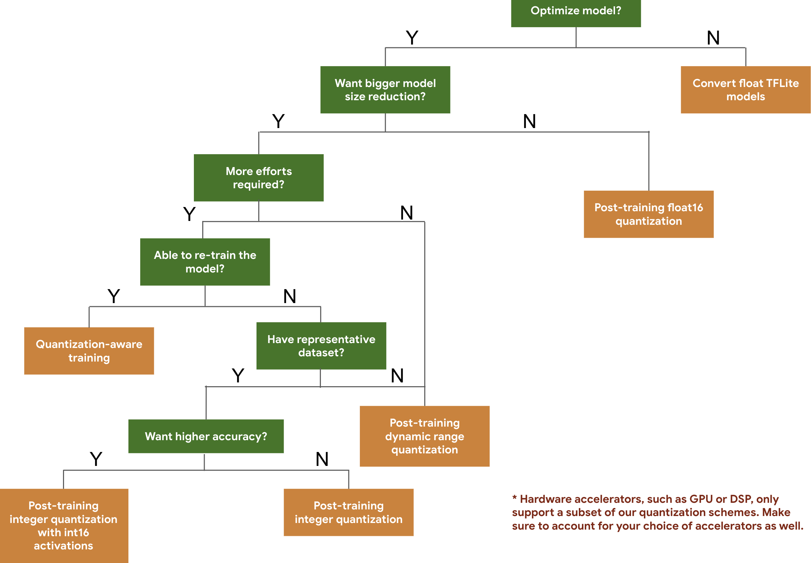

# Model optimization

Edge devices often have limited memory or computational power. Various
optimizations can be applied to models so that they can be run within these
constraints. In addition, some optimizations allow the use of specialized
hardware for accelerated inference.

TensorFlow Lite and the
[TensorFlow Model Optimization Toolkit](https://www.tensorflow.org/model_optimization)
provide tools to minimize the complexity of optimizing inference.

It's recommended that you consider model optimization during your application
development process. This document outlines some best practices for optimizing
TensorFlow models for deployment to edge hardware.

## Why models should be optimized

There are several main ways model optimization can help with application
development.

### Size reduction

Some forms of optimization can be used to reduce the size of a model. Smaller
models have the following benefits:

-   **Smaller storage size:** Smaller models occupy less storage space on your
    users' devices. For example, an Android app using a smaller model will take
    up less storage space on a user's mobile device.
-   **Smaller download size:** Smaller models require less time and bandwidth to
    download to users' devices.
-   **Less memory usage:** Smaller models use less RAM when they are run, which
    frees up memory for other parts of your application to use, and can
    translate to better performance and stability.

Quantization can reduce the size of a model in all of these cases, potentially
at the expense of some accuracy. Pruning and clustering can reduce the size of a
model for download by making it more easily compressible.

### Latency reduction

*Latency* is the amount of time it takes to run a single inference with a given
model. Some forms of optimization can reduce the amount of computation required
to run inference using a model, resulting in lower latency. Latency can also
have an impact on power consumption.

Currently, quantization can be used to reduce latency by simplifying the
calculations that occur during inference, potentially at the expense of some
accuracy.

### Accelerator compatibility

Some hardware accelerators, such as the
[Edge TPU](https://cloud.google.com/edge-tpu/), can run inference extremely fast
with models that have been correctly optimized.

Generally, these types of devices require models to be quantized in a specific
way. See each hardware accelerator's documentation to learn more about their
requirements.

## Trade-offs

Optimizations can potentially result in changes in model accuracy, which must be
considered during the application development process.

The accuracy changes depend on the individual model being optimized, and are
difficult to predict ahead of time. Generally, models that are optimized for
size or latency will lose a small amount of accuracy. Depending on your
application, this may or may not impact your users' experience. In rare cases,
certain models may gain some accuracy as a result of the optimization process.

## Types of optimization

TensorFlow Lite currently supports optimization via quantization, pruning and
clustering.

These are part of the
[TensorFlow Model Optimization Toolkit](https://www.tensorflow.org/model_optimization),
which provides resources for model optimization techniques that are compatible
with TensorFlow Lite.

### Quantization

[Quantization](https://www.tensorflow.org/model_optimization/guide/quantization/post_training)
works by reducing the precision of the numbers used to represent a model's
parameters, which by default are 32-bit floating point numbers. This results in
a smaller model size and faster computation.

The following types of quantization are available in TensorFlow Lite:

Technique                                                                                               | Data requirements                | Size reduction | Accuracy                    | Supported hardware
------------------------------------------------------------------------------------------------------- | -------------------------------- | -------------- | --------------------------- | ------------------
[Post-training float16 quantization](post_training_float16_quant.ipynb)                                 | No data                          | Up to 50%      | Insignificant accuracy loss | CPU, GPU
[Post-training dynamic range quantization](post_training_quant.ipynb)                                   | No data                          | Up to 75%      | Smallest accuracy loss               | CPU, GPU (Android)
[Post-training integer quantization](post_training_integer_quant.ipynb)                                 | Unlabelled representative sample | Up to 75%      | Small accuracy loss       | CPU, GPU (Android), EdgeTPU, Hexagon DSP
[Quantization-aware training](http://www.tensorflow.org/model_optimization/guide/quantization/training) | Labelled training data           | Up to 75%      | Smallest accuracy loss      | CPU, GPU (Android), EdgeTPU, Hexagon DSP

The following decision tree helps you select the quantization schemes you might
want to use for your model, simply based on the expected model size and
accuracy.

Below are the latency and accuracy results for post-training quantization and
quantization-aware training on a few models. All latency numbers are measured on
Pixel 2 devices using a single big core CPU. As the toolkit improves, so will
the numbers here:

<figure>
  <table>
    <tr>
      <th>Model</th>
      <th>Top-1 Accuracy (Original) </th>
      <th>Top-1 Accuracy (Post Training Quantized) </th>
      <th>Top-1 Accuracy (Quantization Aware Training) </th>
      <th>Latency (Original) (ms) </th>
      <th>Latency (Post Training Quantized) (ms) </th>
      <th>Latency (Quantization Aware Training) (ms) </th>
      <th> Size (Original) (MB)</th>
      <th> Size (Optimized) (MB)</th>
    </tr> <tr><td>Mobilenet-v1-1-224</td><td>0.709</td><td>0.657</td><td>0.70</td>
      <td>124</td><td>112</td><td>64</td><td>16.9</td><td>4.3</td></tr>
    <tr><td>Mobilenet-v2-1-224</td><td>0.719</td><td>0.637</td><td>0.709</td>
      <td>89</td><td>98</td><td>54</td><td>14</td><td>3.6</td></tr>
   <tr><td>Inception_v3</td><td>0.78</td><td>0.772</td><td>0.775</td>
      <td>1130</td><td>845</td><td>543</td><td>95.7</td><td>23.9</td></tr>
   <tr><td>Resnet_v2_101</td><td>0.770</td><td>0.768</td><td>N/A</td>
      <td>3973</td><td>2868</td><td>N/A</td><td>178.3</td><td>44.9</td></tr>
 </table>
  <figcaption>
    <b>Table 1</b> Benefits of model quantization for select CNN models
  </figcaption>
</figure>

### Full integer quantization with int16 activations and int8 weights

[Quantization with int16 activations](https://www.tensorflow.org/model_optimization/guide/quantization/post_training)
is a full integer quantization scheme with activations in int16 and weights in
int8. This mode can improve accuracy of the quantized model in comparison to the
full integer quantization scheme with both activations and weights in int8
keeping a similar model size. It is recommended when activations are sensitive
to the quantization.

<i>NOTE:</i> Currently only non-optimized reference kernel implementations are
available in TFLite for this quantization scheme, so by default the performance
will be slow compared to int8 kernels. Full advantages of this mode can
currently be accessed via specialised hardware, or custom software.

Below are the accuracy results for some models that benefit from this mode.
<figure>
  <table>
    <tr>
      <th>Model</th>
      <th>Accuracy metric type </th>
      <th>Accuracy (float32 activations) </th>
      <th>Accuracy (int8 activations) </th>
      <th>Accuracy (int16 activations) </th>
    </tr> <tr><td>Wav2letter</td><td>WER</td><td>6.7%</td><td>7.7%</td>
      <td>7.2%</td></tr>
    <tr><td>DeepSpeech 0.5.1 (unrolled)</td><td>CER</td><td>6.13%</td><td>43.67%</td>
      <td>6.52%</td></tr>
    <tr><td>YoloV3</td><td>mAP(IOU=0.5)</td><td>0.577</td><td>0.563</td>
      <td>0.574</td></tr>
    <tr><td>MobileNetV1</td><td>Top-1 Accuracy</td><td>0.7062</td><td>0.694</td>
      <td>0.6936</td></tr>
    <tr><td>MobileNetV2</td><td>Top-1 Accuracy</td><td>0.718</td><td>0.7126</td>
      <td>0.7137</td></tr>
    <tr><td>MobileBert</td><td>F1(Exact match)</td><td>88.81(81.23)</td><td>2.08(0)</td>
      <td>88.73(81.15)</td></tr>
 </table>
  <figcaption>
    <b>Table 2</b> Benefits of model quantization with int16 activations
  </figcaption>
</figure>

### Pruning

[Pruning](https://www.tensorflow.org/model_optimization/guide/pruning) works by
removing parameters within a model that have only a minor impact on its
predictions. Pruned models are the same size on disk, and have the same runtime
latency, but can be compressed more effectively. This makes pruning a useful
technique for reducing model download size.

In the future, TensorFlow Lite will provide latency reduction for pruned models.

### Clustering

[Clustering](https://www.tensorflow.org/model_optimization/guide/clustering)
works by grouping the weights of each layer in a model into a predefined number
of clusters, then sharing the centroid values for the weights belonging to each
individual cluster. This reduces the number of unique weight values in a model,
thus reducing its complexity.

As a result, clustered models can be compressed more effectively, providing
deployment benefits similar to pruning.

## Development workflow

As a starting point, check if the models in
[hosted models](../guide/hosted_models.md) can work for your application. If
not, we recommend that users start with the
[post-training quantization tool](post_training_quantization.md) since this is
broadly applicable and does not require training data.

For cases where the accuracy and latency targets are not met, or hardware
accelerator support is important,
[quantization-aware training](https://www.tensorflow.org/model_optimization/guide/quantization/training){:.external}
is the better option. See additional optimization techniques under the
[TensorFlow Model Optimization Toolkit](https://www.tensorflow.org/model_optimization).

If you want to further reduce your model size, you can try [pruning](#pruning)
and/or [clustering](#clustering) prior to quantizing your models.
